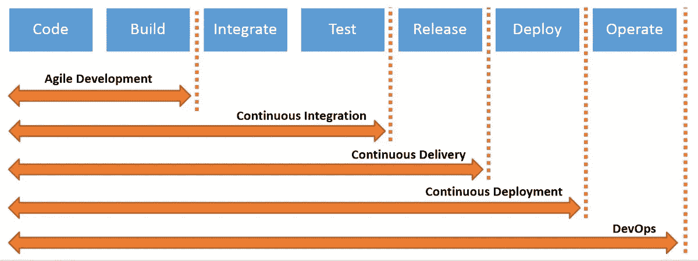
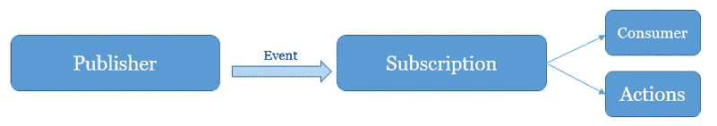

# 为 iOS 应用程序使用 Azure CI/CD 的全面指南

> 原文：<https://levelup.gitconnected.com/a-comprehensive-guide-to-use-azure-ci-cd-for-ios-apps-61d50ab9d077>

## 了解如何使用 Azure pipeline 构建和部署 iOS 应用

一个大型的 iOS 团队是如何协同工作来制作一个大型复杂的 app 的？多个开发人员如何在同一个代码库上协同工作？而不覆盖和破坏彼此的代码，以及开发人员如何添加他/她的代码而不意外破坏应用程序中的某些功能。

## 在与团队合作之前，必须考虑以下几点:

> **问题**:多个开发人员如何在同一个项目上合作？
> 
> **回答**:源码控制。
> 
> **问题**:开发人员如何确保他/她的代码不会破坏项目？
> 
> **回答**:单元测试。
> 
> **问题:**多个开发人员如何遵循相同的编码风格并保持一致的编码风格？
> 
> **回答:**使用**棉绒工具。**
> 
> **问题:**谁负责上传构建？

## 此外，在上传任何构建之前，必须考虑以下几点:

1.  获取最新的代码并合并更改。
2.  下载依赖项并确保它们都是最新的。
3.  运行所有单元测试，并确保所有测试都通过。
4.  运行 lint 工具并修复任何不符合样式指南的代码。
5.  下载 p12 证书。
6.  下载并匹配预置描述文件。
7.  构建、清理、归档。
8.  发送 IPA 文件并附上发行说明。

团队中谁负责运行这些工具并进行下去？

幸运的是，我们不需要有人来做这件事，这就是所谓的 CI/CD。

在深入探讨之前，让我先介绍几个常用术语:

软件开发方法，包括持续开发、持续测试、持续部署，以及贯穿整个开发生命周期的持续监控。

**持续集成(CI)** :编译、验证、代码审查、单元测试、集成测试

**连续交付(CD)** :将构建应用程序部署到测试服务器，并执行 UAT。

**持续部署(CD)** :将测试过的应用部署到生产服务器进行发布。

在我将项目上传到 azure Source Controller 并启用 pipeline 之后，我将向您展示如何实践我们谈到的所有内容。

# CI 触发器

指定要运行管道时的事件。默认情况下，YAML 管道在默认分支(通常是主分支)上配置有 CI 触发器。您可以为特定分支或拉请求验证设置触发器。对于拉请求验证触发器，只需用 pr:替换 trigger: step，如下面的两个示例所示。

在这里，我将触发以发布开始的任何分支

# 托管代理

要使用 Azure Pipelines 构建代码或部署软件，您至少需要一个代理。随着您添加更多的代码和人员，您最终会需要更多。

这里我要用一个自托管的 [macOS 代理](https://docs.microsoft.com/en-us/azure/devops/pipelines/agents/v2-osx?view=azure-devops)不需要任何定制，可以用 Linux 代理，Windows 代理，Docker 代理。

# 安装证书和预置描述文件

要签署您的应用程序，您需要安装我们已经作为[安全文件](https://docs.microsoft.com/en-us/azure/devops/pipelines/library/secure-files?view=azure-devops)导入 Azure dashboard 的证书和配置文件

然后，在您进行了签名之后，您应该通过在 pod 文件的末尾添加以下代码来从代码签名中排除 pod 文件，以防您的项目中有任何依赖项:

在运行之前，如果您有任何依赖项，请确保在进入构建阶段之前下载。

# 椰子任务

该任务可选地运行`pod repo update`，然后运行`pod install`。

# 营造环境

你可以使用 Azure Pipelines 通过 Xcode 构建你的应用，而不需要建立任何你自己的基础设施。Xcode 预装在 Azure Pipelines 中微软托管的 macOS 代理上。您可以使用 macOS 代理来运行您的构建。

下面是 YAML 的代码片段，分析应用程序和打包

# 复制文件任务

使用此任务，通过匹配模式将文件从源文件夹复制到目标文件夹。

# 发布生成项目任务

在构建管道中使用此任务将构建工件发布到 Azure 管道、TFS 或文件共享。

现在 IPA 文件附加到工件文件上，并准备好发布，您可以使用分发工具，如:

1.  TestFlight 软件
2.  应用商店
3.  应用中心
4.  构造
5.  霍克亚普

还有更多…

我将使用 AppCenter 发布 IPA 文件。

# 应用中心分发任务

App Center Distribute 是开发人员快速向最终用户设备发布构建版本的工具。Distribute 支持 Android、iOS、macOS、UWP、WPF 和 WinForms 应用程序，允许您在一个地方管理跨多个平台的应用程序分发。凭借完整的[安装门户体验](https://docs.microsoft.com/en-us/appcenter/distribution/testers/)，Distribute 不仅是 beta 版 app tester 分发的强大解决方案，也是通过公共应用商店分发的便捷替代方案。借助我们的[应用中心构建](https://docs.microsoft.com/en-us/appcenter/build/)和[公共应用商店集成](https://docs.microsoft.com/en-us/appcenter/distribution/stores/)，进一步自动化您的分发工作流程。成功构建完成后，自动将您的应用发布提交到 TestFlight、Apple App Store、Google Play。

使用此任务通过应用中心向测试人员和用户分发应用版本。

所以要知道 IPA 文件已经被 App Center 成功发布了，所有的测试人员都收到了你已经输入的发布通知。

# 与服务挂钩集成

当 Azure DevOps 项目中发生事件时，服务挂钩允许您在其他服务上运行任务。例如，当一个工作项被创建时，在 Trello 中创建一个卡片，或者当一个构建失败时，向您团队的移动设备发送一个推送通知。当项目中发生事件时，您还可以在自定义应用程序和服务中使用服务挂钩，作为更有效的方式来驱动活动。

# 什么是服务挂钩？

服务挂钩发布者定义了一组*事件*。订阅监听*事件*，并根据事件定义要采取的行动。订阅也面向消费者，消费者是在事件发生时可以运行自己的操作的外部服务。

我将与微软团队合作，了解关于如何设置服务挂钩的更多细节

就是这样！现在，让我们把注意力集中在代码上📈 💻让 CI/CD 做所有事情🚀。

如果您对本教程有任何问题或意见，请随时联系我: [Linkedin](https://www.linkedin.com/in/ahmadalsofi/) ， [Twitter](https://twitter.com/ahmadalsofii) ，邮箱:alsofiahmad@yahoo.com。

*感谢阅读！😀*

# 参考

*   [技术文档、API 和代码示例](https://docs.microsoft.com/en-us/)
*   [在 Azure Pipelines 上构建 iOS 应用](https://ariya.io/2019/02/building-ios-apps-on-azure-pipelines)
*   [微软团队整合|获取 WebHook URL | MIDAS 客房预订系统](https://mid.as/microsoft-teams/teams-webhook-url)
*   [Office 365 群组和微软团队发布消息— Visual Studio Marketplace](https://marketplace.visualstudio.com/items?itemName=YodLabs.O365PostMessage)