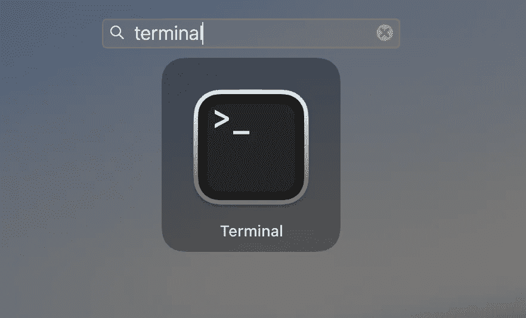
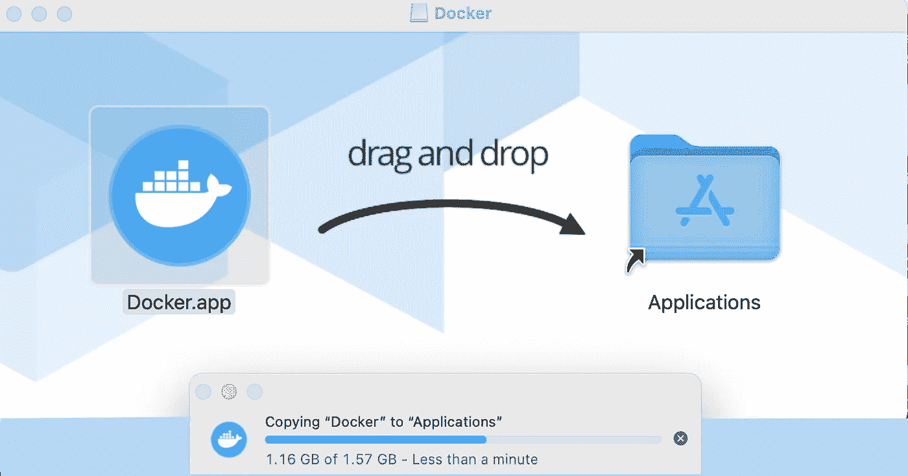
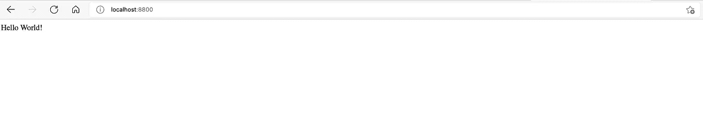

# 一个容器化的 NodeJS+Express“Hello World”应用程序

> 原文：<https://levelup.gitconnected.com/a-containerized-nodejs-express-hello-world-application-28d286556890>


货船上的集装箱

这篇文章有一个非常简单的目的:帮助任何刚开始使用 NodeJS 和 Docker 的人。我们将构建一个简单的 API 服务器，并将其容器化以便快速部署。

# 先决条件

## NodeJS

很明显，NodeJS 将是这个项目的先决条件之一。根据您将要开发的操作系统，有不同的安装方法可供使用。官方下载网站位于:[***【https://nodejs.org/en/download】***](https://nodejs.org/en/download)***。***

***在 Windows 上*** 在 Windows 上安装是一个简单的过程。从下载 Windows Installer 开始(。msi)从官方下载网址:[***https://nodejs.org/en/download***](https://nodejs.org/en/download)。如果您的系统是 64 位的，您将需要 64 位版本，并且您将希望从 ***LTS*** 选项卡下载，而不是从 ***当前*** 选项卡下载。*代表*长期稳定，这基本上意味着它是一个非常稳定的版本，将在未来相当长的一段时间内得到支持。 ***当前的*** 往往不太稳定，变化很快——然而，如果你正在寻找最新的特性和功能，那么 ***当前的*** 正适合你。**

**然后，启动 ***。msi*** ，接受许可协议(前提是你同意并想继续！)，并为所有其他提示选择默认值(包括 ***自定义设置*** 页面上的选项)，除非您有理由将其安装到默认目录以外的目录(***C:\ Program Files \ nodejs***)。完成安装，您就可以开始了！**

> ****抬头！**
> 如果英语不是您的母语，只需将下载路径中的‘en’替换为西班牙语的`***es***`，`***de***`为德语，`***ru***`为俄语，依此类推。**

*****在 Mac 上*** 在 macOS 上安装也一样简单。我更喜欢通过家酿安装。
1。打开一个终端(可以在 ***Launchpad 下找到)*****

****

**2.更新 Home brew**

```
****brew update****
```

**3.安装节点**

```
****brew install node****
```

**4.验证 NodeJS 的安装**

```
****node -v****
```

**5.验证 NPM 的安装(NodeJS 包管理器——我们将详细讨论这一点)。**

```
****npm -v****
```

**全部完成！现在，您已经在 mac 上安装了一个工作节点。**

**Linux 上的当然，Linux 的安装过程并不容易，但如果不这样，那会有什么乐趣呢！我们将在 Ubuntu 上使用这个过程，但是在其他 Linux 发行版上也是类似的。首先，我们必须选择要安装的版本。看一看[](https://nodejs.org/en/download)**我们看到，在撰写本文时，最新的主要 LTS(长期稳定)版本是 14.17.1。****

> *****注意**
> 你可以在这里找到其他发行版的列表和附加安装说明:[https://github . com/node source/distributions/blob/master/readme . MD](https://github.com/nodesource/distributions/blob/master/README.md)***

1.  ***更新本地 apt 报告***

```
*****curl -fsSL** [**https://deb.nodesource.com/setup_14.x**](https://deb.nodesource.com/setup_14.x) **| sudo -E bash -*****
```

***2.用 apt-get 安装 NodeJS***

```
*****sudo apt-get install -y nodejs*****
```

***3.以帮助确保将来附加组件的构建不会出现问题***

```
*****sudo apt-get install -y build-essential*****
```

***4.验证 NodeJS 的安装***

```
*****node -v*****
```

***5.验证 NPM 的安装(NodeJS 包管理器——我们将详细讨论这一点)。***

```
*****npm -v*****
```

***全部完成！现在，您已经在 Linux 上安装了一个工作节点。***

## ***码头工人***

***我们需要 Docker，这样我们就可以马上测试我们的容器化应用程序，在 macOS 或 Windows 上最简单的方法就是安装 Docker Desktop。如果你在 Linux 上，安装将(当然)通过 Docker 的 CLI 安装。***

> *****注**Docker 桌面包括 Docker App、开发者工具、Kubernetes 以及与生产 Docker 引擎的版本同步。Docker Desktop 允许您利用经过认证的图像和模板以及您选择的语言和工具。开发工作流利用 Docker Hub 将您的开发环境扩展到一个安全的存储库，以实现快速自动构建、持续集成和安全协作。***

***你可以得到。dmg 或者。用于 Mac 和 Windows 的 Docker 桌面的 exe 安装程序***

******在 Windows 上***
在 Windows 上，安装就像运行。exe(你知道的，ol '双击？).***

*****在 Mac 上***
在 macOS 上，安装就像运行。dmg，然后常见的拖放到应用程序。**

****

> ****注意**
> 在 macOS 上，您可能需要从您的 **Launchpad** 启动 **Docker** 以允许它在您能够使用 Docker 命令之前初始化。**

*****在 Linux 上***
所以——在 Linux 上，安装并不那么容易，但也差不多了！同样，我们将在 Ubuntu 上执行这个安装，就像我们在上面对 NodeJS 所做的一样——但是同样，在其他 Linux 平台上的安装也是类似的。**

****步骤 1 —建立存储库****

**1.确保没有现有安装。
`**sudo apt-get remove docker docker-engine docker.io containerd runc**`**

**2.刷新 APT 存储库。
`**sudo apt-get update**`**

**3.安装支持应用程序。**

```
****sudo apt-get install apt-transport-https ca-certificates curl gnupg    lsb-release****
```

**4.添加码头工人的 GPG 键**

```
****curl -fsSL https://download.docker.com/linux/ubuntu/gpg | sudo gpg --dearmor -o /usr/share/keyrings/docker-archive-keyring.gpg****
```

**5.建立稳定的 Docker 存储库**

```
****echo \
  "deb [arch=amd64 signed-by=/usr/share/keyrings/docker-archive-keyring.gpg] https://download.docker.com/linux/ubuntu \
  $(lsb_release -cs) stable" | sudo tee /etc/apt/sources.list.d/docker.list > /dev/null****
```

****步骤 2 —安装 Docker 引擎****

1.  **更新 APT 存储库。
    `**sudo apt-get update**`**
2.  **安装 ***码头*** 和 ***集装箱*** *。*这将安装*最新* *稳定*版本 ***Docker*** *。*
    **

**3.通过下载并运行样本容器，验证 ***Docker*** 引擎是否正常工作。
`**sudo docker run hello-world**`**

**这应该会在您的 shell 中生成一条如下所示的消息:**

```
****Unable to find image 'hello-world:latest' locally****latest: Pulling from library/hello-world****b8dfde127a29: Pull complete****Digest: sha256:9f6ad537c5132bcce57f7a0a20e317228d382c3cd61edae14650eec68b2b345c****Status: Downloaded newer image for hello-world:latest****Hello from Docker!****This message shows that your installation appears to be working correctly.****
```

> ****Linux 上的 Docker 引擎**
> 其他 Linux 发行版的安装说明可以在这里找到:[https://docs.docker.com/engine/install/](https://docs.docker.com/engine/install/)**

**全部完成！您已经成功安装并配置了 Docker！**

# **该项目**

## **创建项目**

**看，先决条件阶段没那么糟糕！现在我们开始构建实际的应用程序。为此，我们希望进入一个 shell(Windows 上的命令提示符或 PowerShell，macOS 上的终端，或者 bash/zsh/等)。Linux 上的 shell)。**

1.  **导航到您希望项目驻留的位置。我喜欢在我的主目录下创建一个名为 code 的目录，然后将项目存储在这个目录下。**

> ****抬头！**
> 路径越复杂，以后用起来越费时，越麻烦。软件工程的黄金法则之一是**吻**法:**保持简单，笨蛋**。这意味着`***~/code***`或`***C:\code***`是完全可以接受的路径，可以在未来为你节省时间和麻烦。**

**2.为您的项目创建目录**

```
****mkdir test-project****
```

**3.导航到项目目录**

```
****cd test-project****
```

**4.设置支持文件(**)。gitignore** 和**许可**。**

```
****npx license mit > LICENSE****npx gitignore node****
```

> ****抬头！**
> 麻省理工是一个许可证类型(我也听说那是一个相当体面的学校… (-:)，但是你可以自由地为你的项目使用你喜欢的任何一个。另一种可能是合适选项的类型是 WTFPL。无论如何，您可以在以下网址找到关于其他许可软件许可证的信息:[https://en . Wikipedia . org/wiki/Category:Permissive _ software _ licenses](https://en.wikipedia.org/wiki/Category:Permissive_software_licenses)**
> 
> ****注意**
> 虽然深入探讨远远超出了本文的范围，但是您应该知道 npx 是 npm cli 的一部分，它允许您从本地或远程 npm 存储库运行命令。关于 npx 的文件可在此处获得:[https://docs.npmjs.org/cli/v7/commands/npx](https://docs.npmjs.com/cli/v7/commands/npx)**

**5.初始化项目**

```
****npm init -y****
```

## **安装软件包**

**现在我们已经创建了我们的项目，我们可以添加我们需要的任何 npm 包。目前，我们只需要快递。要将它添加到我们的项目中，我们只需发出以下命令:**

```
****npm install express --save****
```

> ****注意**
> 我们命令的`***--save***`部分告诉 npm 将它作为一个依赖项写在我们的 package.json 文件中。这允许我们的项目在另一个系统上“重建”,无论是 docker 容器还是物理服务器。**

## **编写代码**

**看起来我们差不多准备好写一些代码了！但是首先，我们需要一些文件来放入代码。**

> ****比较你的作品**
> 我已经在 **GitHub** 创建了一个包含这个项目的资源库。可以在这里查看:[**https://github . com/johnathanesanders/basic-nodejs-express-docker**](https://github.com/johnathanesanders/basic-nodejs-express-docker)**

1.  **在项目目录的根目录下创建一个名为 ***index.js*** 的文件。这可以通过 shell 中的`**touch index.js**` 轻松完成。这个文件将保存我们所有的代码。**

> ****注意**
> 在这样一个简单的项目中，一个单独的 **index.js** 就足够了——在一个更复杂的项目中，你会希望将你的代码分成更多的文件和目录。**

**2.在项目目录的根目录下创建一个名为***environment . js***的文件。`**touch environment.js**` 这将用于应用程序运行时的选项。但是在为生产而构建时，会被接下来提到的***environment . prod . js***的内容复制过来。**

**3.在项目目录的根目录下创建一个名为***environment . prod . js***的文件。`**touch environment.prod.js**` 这将在我们通过 Azure DevOps 部署我们的应用程序时使用，并且需要在构建时注入变量。**

**现在，让我们打开 ***index.js*** 文件并开始编码。我更喜欢使用 VS 代码，但是任何文本编辑器都可以(为了保持我的老伙计技能符合标准，我有时只使用 **vi，**VI，我可以说我自己也快接近老伙计的年龄了)。添加以下几行:**

*****index.js*****

```
****const { Environment } = require('./environment.js');
const express = require('express');****const server = express();****server.get('/', (request, response) => {
    response.send('Hello World!');
});****server.listen(Environment.port || 3000, () => {
    console.log(`Server UP!`)
});****
```

**让我们来谈谈我们在这里做什么。**

*   **首先，我们在第 1 行和第 2 行有两个 require 语句。第一个在我们的 environment.js 文件中导入一个名为“Environment”的常量，接下来我们将向该文件添加内容。第二个导入我们之前通过 npm 安装的 Express 库。**
*   **接下来，我们用`**express()**`调用初始化我们的服务器。**
*   **之后，我们向我们的服务器添加一条路由。我们说，在第 6 行，当服务器上的`**GET**`请求指向我们的根目录`**/**` 时，我们将接受这些请求，并用一串 *Hello World 来响应这些请求！。***
*   **最后一步是启动我们的服务器。我们必须为它提供一个监听端口，默认为 Environment.port(我们希望从前面的第 1 行导入),然后在没有提供自定义值的情况下提供一个替代端口(这就是`**|| 3000**`的用途)。一旦服务器成功启动，第 11 行的`**console.log()**`将输出到服务器的控制台(而不是调用客户机)。**

**现在我们的 ***index.js*** 文件已经完成，让我们打开我们的 ***environment.js*** 文件来添加我们的端口定制。**

*****environment . js*****

```
****const Environment = {
    port: '8800'
};****module.exports = { Environment };****
```

**这个很简单，我们只是导出一个名为 Environment 的对象，它带有一个端口节点，该节点被设置为我们希望服务器监听的端口号。对于传统的 HTTP 服务器，您需要监听端口 80 和/或 443。**

**下一个文件是 environment.prod.js，有点不同。在这个文件中，我们希望只有真正的环境变量，我们可以在构建或运行时设置。这样，我们可以随意将它们注入我们的容器。**

****environment . prod . js****

```
****export const Environment = {
    port: process.env.HTTP_LISTEN_PORT
};****module.exports = { Environment };****
```

**这里唯一的区别就是我们把 ***8800*** 改成了***process . env . http _ LISTEN _ PORT*****

## **设置 package.json**

**代码已经写好了，我们真的很快就能让它运行了。但是，我们想在 package.json 文件中添加一些脚本，以便基于环境运行。**

*****package.json*****

```
****{
    "name": "test-project",
    "version": "1.0.0",
    "description": "",
    "main": "index.js",
    "scripts": {
        "env:prod": "cp -r ./environment.prod.js ./environment.js",
        "start": "node ./index.js",
        "start:prod": "npm run env:prod && node ./index.js",
        "test": "echo \"Error: no test specified\" && exit 1"
    },
    "keywords": [],
    "author": "",
    "license": "MIT",
    "dependencies": {
        "express": "^4.17.1"
  }
}****
```

**好的，如果你选择了不同的许可证，或者给它起了别的名字，这可能和你的 package.json 不同。对于本文的这一部分，重要的是在第 7-9 行。这些是将为我们执行的脚本，我们可以根据我们的环境运行它们。还记得我们说过以后会在 environment.js 上复制 environment.prod.js 吗？**

*****第 7 行*** *运行脚本，将 environment.prod.js 文件复制到 environment.js***

```
****"env:prod": "cp -r ./environment.prod.js ./environment.js"****
```

*****第 8 行***
*在本地环境中运行启动应用程序的脚本***

```
****"start": "node ./index.js"****
```

*****第 9 行***
*在生产环境中运行以启动应用程序的脚本。这将执行上面的 env:prod 脚本，然后启动应用程序。***

```
****"start:prod": "npm run env:prod && node ./index.js"****
```

## **测试**

**剩下唯一要做的就是测试！我们可以通过在应用程序根目录下的 shell 中运行`**npm start**`来启动我们的应用程序。**

**如果一切顺利，你应该可以将浏览器指向`http://localhost:8800`并得到一条“Hello World！”。如果您更改了端口号，您将使用该端口号而不是 8800。如果您尝试了该端口号，但没有得到响应，请尝试端口 3000，看看它是否默认为我们指示的那样，如果有问题或它未设置。**

> ****抬头！**
> 您可以测试生产运行脚本，但是首先备份您的 **environment.js** 文件，因为它将被***environment . prod . js***文件永久覆盖！完成后，您需要将原始数据复制回***environment . js***。要测试生产脚本，只需运行:
> `***npm run start:prod***`**

# **用集装箱装**

## **Dockerfile 文件**

**我们的应用程序已经编写好了，可以工作了。所以我们准备用集装箱装运。这就是我们将要使用 Docker 的地方，我们所需要的只是项目根目录下的一个简单的 Docker 文件。**

**我们需要用`**touch Dockerfile**` 创建 Dockerfile，或者只在你的 GUI 中创建它(VS 代码有人吗？).然后，我们需要添加一些条目…**

*****Dockerfile*****

```
****FROM node:alpine****WORKDIR /usr/app****RUN apk update && apk add libstdc++ && apk add build-base && apk add python3 && apk add bash****COPY . .****RUN npm install****COPY . .****CMD ["npm", "run", "start:prod"]****
```

**好吧，让我们来看看这个文件。**

*****Line 1*** *我们告诉 Docker 使用哪个基础镜像，所以我们从一个预建了 NodeJS 支持的操作系统(这里是 Alpine Linux——一个极其轻量级的 Linux 发行版)开始。* **

*****第 3 行*** *我们设置我们的工作目录(我们将从那里运行命令，就像您本地机器上 shell 提示符中的工作目录一样)。* `**WORKDIR /usr/app**`**

*****第 5 行*** *通过 APK 包管理器安装依赖项(不要把这个和我们之前在 Ubuntu 上用的 APT 包管理器混淆了！).
注意* `**apk add bash**` *只有当你想用 shell 提示符连接到容器时才需要(比如为了调试)。***

```
****RUN apk update && apk add libstdc++ && apk add build-base && apk add python3 && apk add bash****
```

*****第 7 行***
*从工作目录复制文件。*
`**COPY . .**`**

*****第 9 行***
*安装我们在 package.json 的依赖项中列出的 NPM 包。* `**RUN npm install**`**

*****第 11 行***
*现在我们已经完成了 npm 的安装，再次从工作目录中复制文件。*
`**COPY . .**`**

*****第 13 行***
*在容器启动时运行该命令。请注意，这与我们之前在生产模式下测试应用程序时运行的命令相同——但它是以逗号分隔的数组格式。* `**CMD ["npm", "run", "start:prod"]**`**

## **建立形象**

**下一步是使用 **Dockerfile** 构建我们的映像。
`**docker build --no-cache --tag test-img:v1 .**`**

**这个命令中发生了什么？
`**docker build**`告诉 ***Docker*** 根据 Dockerfile 的内容构建图像。
`**--no-cache**`指示 ***Docker*** 不要使用其缓存，而是从头构建。尽管这需要更长的时间，但我更喜欢这种方法，以防止陈旧文件的任何潜在灾难。
`**--tag test-img:v1**`标记图像。当您运行`**docker image ls -a**`来列出可用图像时，您会看到*存储库*列下的`**test-img**`，以及*标签*列下的`**v1**`。**

## **运行容器**

**我们的形象只是一个形象，直到它被使用，在这一点上，它成为一个容器。**

```
****docker run -d -p 8800:8800 --name testcontainer --env HTTP_LISTEN_PORT=8800 test-img:v1****
```

***这个命令中发生了什么？*
`**docker run**`告诉 ***Docker*** 从图像中初始化并运行容器。
`**-d**`(用于 *detach* )指示 ***Docker*** 在后台运行容器(这样就不会捆绑你的 shell)。
`**-p 8800:8800**`将容器的端口暴露给宿主。如果不这样做，那么您将无法通过网络访问您的容器。
`**--name testcontainer**`将容器的名称设置为***test container***。没有这个， ***Docker*** 会给它分配一个随机的名字，更难找到！。
`**--env HTTP_LISTEN_PORT=8800**`将我们的环境变量 *HTTP_LISTEN_PORT* 设置为值 *8800* 。这允许我们在上面的**环境. prod.js** 文件中使用的*process . env . http _ LISTEN _ PORT*填充我们的自定义值。
`**test-img:v1**`最后我们告诉 ***Docker*** 要拉哪个图像运行。对于这篇文章，我们可能应该拉我们上面建立的那个！请注意，我们确实给了它存储库和标记名称。**

> ****注意**
> 由于我们的应用程序正在监听端口 8800，我们通过`***-p 8800:8800***`将其映射到同一个端口。但是，如果您想将应用程序的端口 8800 映射到主机的端口 7080(作为一个例子)，那么命令应该是`***-p 7080:8800***`。**

**如果这个命令成功，您应该得到一个随机字符串，比如:`**a056f52b3cdf9346601b46a3d1b9ec323a1ce04c0c97fd1908419acf625e16ee**`**

## **测试容器**

**现在，剩下要做的就是测试它！**

**打开你的浏览器到 http://localhost:8800 ，你应该得到一个简单的“Hello World！”。**

****

**浏览器中的 Hello World**

## **清理**

**既然我们已经成功地测试了，让我们清理一下。**

**1.停止运行容器。
`**docker kill testcontainer**`**

**2.移除容器。
`**docker rm testcontainer**`**

**3.从本地 ***Docker*** 库中删除镜像。
`**docker image rm test-img:v1**`**

# **搞定了。**

**希望本文已经帮助您开始使用 NodeJS 和容器化它的基础知识。一旦你准备好了，一定要看看更高级的主题，如:
[使用 Azure Kubernetes 服务(AKS)和 DevOps 管道运行](/up-and-running-with-azure-kubernetes-service-aks-and-devops-pipelines-2208c24378ff)**