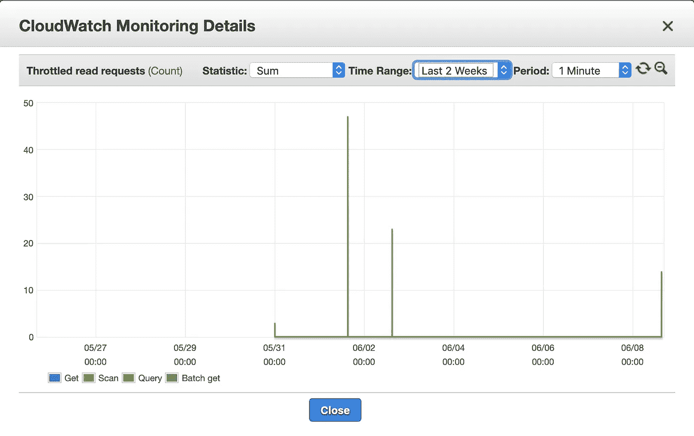
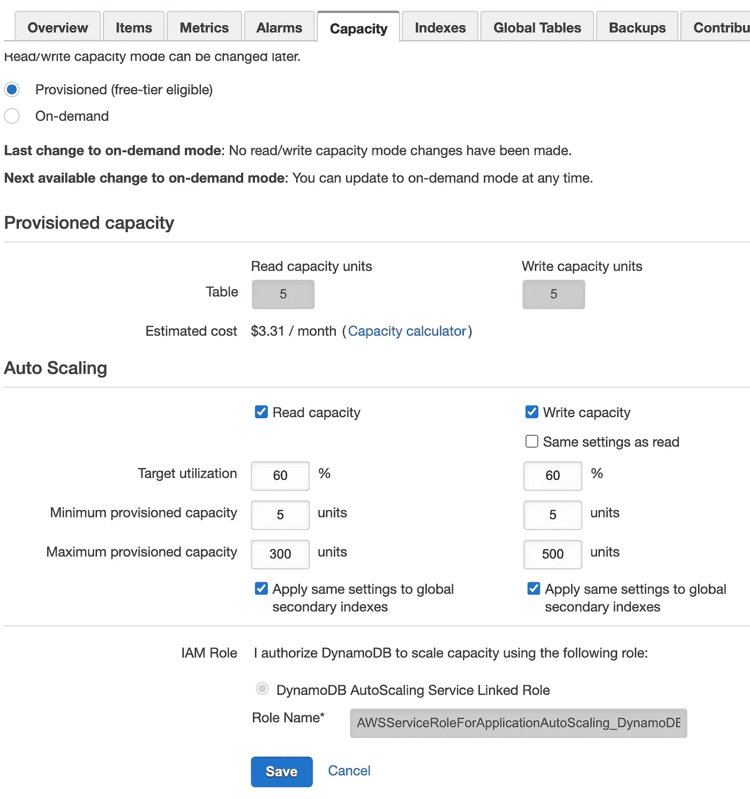

# 一本处理 Amazon DynamoDB 节流问题的食谱

> 原文：<https://levelup.gitconnected.com/a-cookbook-to-deal-with-throttling-issues-in-amazon-dynamodb-f953c4ea4785>

> 根据 Amazon DynamoDB 文档，它是一个完全托管的 NoSQL 数据库服务，提供快速和可预测的性能以及无缝的可伸缩性。DynamoDB 让我们能够减轻操作和扩展分布式数据库的管理负担，因此我们不必担心硬件供应、设置和配置、复制、软件修补或集群扩展。

DynamoDB 还提供静态加密，这消除了保护敏感数据的操作负担和复杂性。

来源:https://foxutech.com/how-to-create-a-dynamodb-table-on-aws/

在 DynamoDB 表中，根据每个条目的分区键，条目被存储在许多*分区*中。每个分区都有一份表的调配的 **RCU** (读容量单位)和 **WCU** (写容量单位)。

当发出请求时，它会被路由到正确的数据分区，该分区的容量用于确定请求是被允许，还是将被*抑制*(拒绝)。应用程序应该预期并处理一定量的节流。

***过度节流是由*** 引起的:

> **热分区:**节流是由表中的几个分区引起的，这些分区接收的请求比平均分区多
> 
> **容量不足:**节流是由于表本身没有足够的容量来处理许多分区上的请求。

***写节流的影响*** —我们最终可能会错过可能导致下游系统级联故障的事件。

***读取限制的影响*** —如果先前处理的记录无法检索，我们可能会结束处理双重/重复事件。

Amazon DynamoDB 是一项 NoSQL 云数据库服务，旨在为大规模运行的应用程序和服务提供低延迟和高吞吐量性能。示例用例包括:

*   *大型多人在线游戏*
*   *虚拟和增强现实*
*   *电子商务中的结账和订单处理*
*   *实时股票定价和交易*

当我们在全球范围内运行这样的系统时，我们偶尔会遇到延迟高峰。这些峰值可能是由于短暂的网络中断、服务器端和网络端问题或者客户端过载和速度慢而导致的重试造成的。

> DynamoDB 旨在确保我们调配的容量每秒可用。如果我们为一个表提供每秒 10 次 1kB 的读取，那么 DynamoDB 将为我们提供足够的容量来处理这个吞吐率。此外，DynamoDB 有时允许我们在短时间内实现有限的突发，超过我们提供的吞吐量。这是为了吸收客户工作负载的自然变化。这种突发不能保证，也不总是可用的(可用突发的性质可能会随着时间的推移而改变)。正如最佳实践文档中当前所述，为了获得最佳性能，我们应该有一个均匀分布的工作负载，该负载不超过我们调配的容量，并在关键空间上均匀分布负载。

可以从 AWS 控制台调整调配的容量和自动扩展的容量，以根据应用程序的需求微调性能。

不管根本原因是什么，与 DynamoDB 服务交互的应用程序应该调整为遵循**重试策略**，这有助于避免延迟高峰。

根据所使用的 AWS SDK，底层 HTTP 客户端行为可以从默认设置重新配置，以帮助确保 HTTP 上的低级客户端-服务器通信满足应用程序的延迟要求。

但是在这篇博客中，我将讨论 AWS Java SDK 为我们提供的对 HTTP 客户端行为和重试策略的控制。

下面是我为构建延迟感知型 DynamoDB 应用程序客户端而创建的更具体的配置。我用 Java 从头构建了一个异步 DynamoDB 客户端，并展示了如何使用 AWS SDK 中的`ClientConfiguration`实现来定义特定于应用程序的延迟需求。

在本例中，我创建了一个异步 DynamoDB 客户端，它可以对服务端点进行多次连续的 DynamoDB API 调用，而无需在发出下一个 API 调用之前等待响应返回。因为我希望我们的 DynamoDB 应用程序对延迟敏感，所以异步客户端应用程序是一个不错的选择。它可以准备和处理越来越多的从不同模块或微服务到后端的 API 调用，从而分离各个执行过程。

首先，我用函数`createDynamoDBClient()`和`createDynamoDBClientConfiguration()`创建了一个名为`DynamoDBConfig`的 Java 类。

`createDynamoDBClient()`函数返回一个异步 DynamoDB 客户端对象，该对象使用来自`ClientConfiguration`对象的低级 HTTP 客户端配置，这些配置由`createDynamoDBClientConfiguration()`私有 API 操作返回。正如我们在下面的代码示例中看到的，在`ClientConfiguration`对象创建期间设置了五个 HTTP 客户端配置参数:

> ***connection time out***:connection time out 是客户端等待 SDK 中底层 HTTP 客户端与 DynamoDB 端点建立 TCP 连接的最长时间。该连接是客户端和服务器之间的端到端双向通信链接，它被用来和重用来进行 API 调用和接收响应。
> 
> ***ClientExecutionTimeout***:ClientExecutionTimeout 是执行端到端操作和接收所需响应所花费的最大允许总时间，包括可能发生的任何重试。本质上，这是 DynamoDB 操作的 SLA 完成所有 HTTP 请求的时间框架，包括重试。
> 
> **request time out**:request time out 是客户端执行一个 HTTP 请求所花费的时间。`RequestTimeout`是从发出 DynamoDB API 调用(比如`PutItem`或`GetItem`)的时刻开始测量的，直到收到来自服务的响应。从逻辑上讲，这个超时值应该小于`ClientExecutionTimeout`。与`ClientExecutionTimeout`一样，该设置默认禁用。
> 
> ***socket time out:***socket time out 定义了 HTTP 客户端等待从已经建立的 TCP 连接读取数据的最长时间。这是 HTTP POST 结束和收到请求的整个响应之间的时间，包括服务和网络往返时间。
> 
> ***DynamoDB 默认重试策略*** :用于 DynamoDB 的 AWS Java SDK 中可用的默认重试策略是为底层 HTTP 客户端定义客户端重试策略的良好起点。对于任何 5XX 服务器端异常(如“HTTP 状态代码-500 内部服务器错误”或“HTTP 状态代码-503 服务不可用”)，默认策略开始时最多重试 10 次，预定义的基本延迟为 25 毫秒；对于任何 4XX 客户端异常(如“HTTP 状态代码 400-provisionedthroughputexceededexexception”)，则为 500 毫秒。`PredefinedBackoffStrategies`包括在这些重试中使用的两种回退策略。对于非节流的 5XX 请求，选择`FullJitterBackoffStrategy`并使用 25 毫秒的基本延迟，最大延迟为 20 秒。对于节流的 4XX 请求，使用`EqualJitterBackoffStrategy`。它从 500 毫秒的基本延迟开始，最长可以达到 20 秒，以 500 毫秒、1，000 毫秒、2，000 毫秒等指数级增长，直到达到 20，000 毫秒。

我已经通过配置文件(即我的 spring-boot 应用程序中的 application.properties)将其作为输入，并使用@Value 注释将它们的值注入到相应的变量中，从而为上述参数赋值。

DynamoDB 客户端配置所需的配置变量的分配

创建 DynamoDBClient 的源代码

*   ***DynamoDB Mapper***:如果我们在应用程序中使用 dynamo db Mapper 类，它会在内部使用我之前提到的默认`ClientConfiguration`选项启动客户端。此外，这个类还使用自己的重试机制`DefaultBatchWriteRetryStrategy`，用于来自`BatchWriteItem` API 调用的未处理项目。它包括一秒钟的最小延迟和三秒钟的最大延迟，以及指数退避策略。因此，使用带有默认设置的`DynamoDBMapper`类会给你的请求增加意想不到的额外延迟。换句话说，为了保持最大限度的控制，您应该考虑尽可能首先使用低级别的 DynamoDB API 操作，然后调整 SDK 级别的设置来定义应用程序在生产中的行为。

使用默认配置创建 DynamoDBMapper 的源代码

我们还可以覆盖 DefaultDynamoDBMapperConfig，它可以在调用 DynamoDBMapper 方法时作为参数与一起传递。

带有定制重试策略的 DynamoDBMapperConfig

最后，如果默认策略不能解决我们的用例，那么在创建`ClientConfiguration`时，通过用`RetryPolicy` ( `PredefinedRetryPolicies.NO_RETRY_POLICY`)指定默认重试选项，用`NO_RETRY_POLICY`禁用它。我们也可以通过扩展*v2 compatiblebackoffstrategyadapter*类来实现我们自己的重试逻辑。

目前就这些。回头见。:-)

# 参考资料:

 [## DynamoDB 油门请求是什么时候？

### 感谢贡献一个堆栈溢出的答案！请务必回答问题。提供详细信息并分享…

stackoverflow.com](https://stackoverflow.com/questions/16980678/when-does-dynamodb-throttle-request)  [## 为延迟敏感的 Amazon DynamoDB 应用程序调整 AWS Java SDK HTTP 请求设置| Amazon…

### Amazon DynamoDB 是一项 NoSQL 云数据库服务，旨在提供低延迟和高吞吐量…

aws.amazon.com](https://aws.amazon.com/blogs/database/tuning-aws-java-sdk-http-request-settings-for-latency-aware-amazon-dynamodb-applications/)