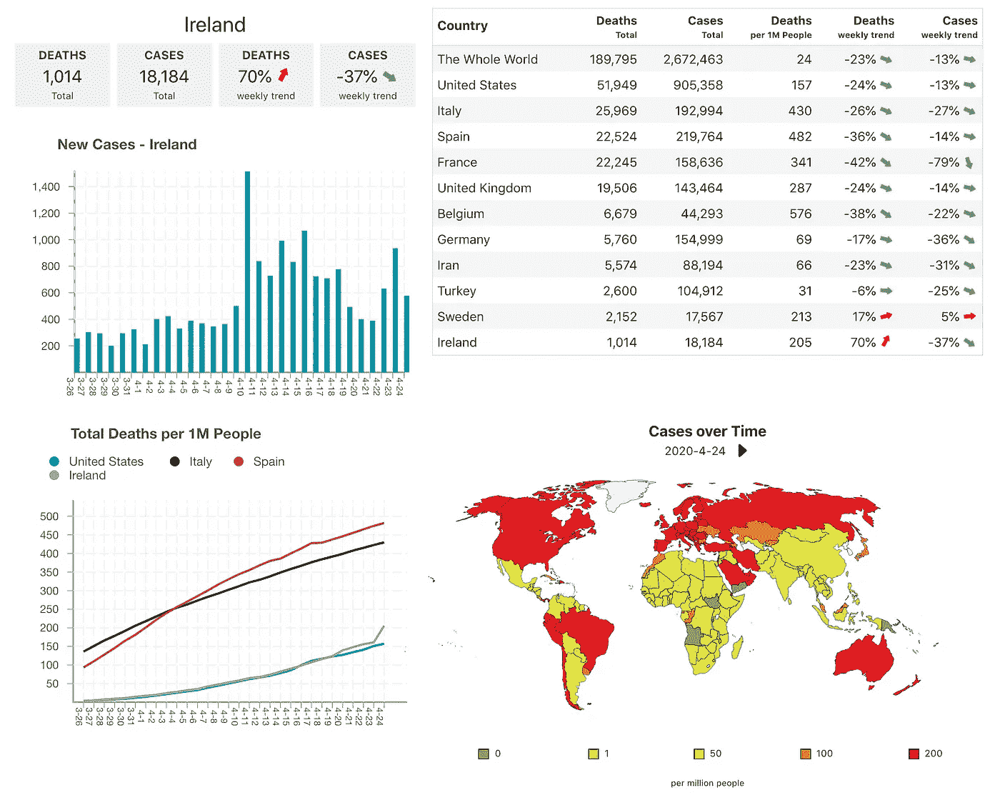

# 一辆新冠肺炎仪表盘在反应

> 原文：<https://levelup.gitconnected.com/a-covid-19-dashboard-in-react-766cc5217a84>



**完全可配置的带动画的仪表盘**

软件开发每年都变得越来越容易。我们站在巨人的肩膀上。不仅仅是脸书、谷歌和亚马逊，还有许多小公司和个人创造了“酷”和有用的拼图。简而言之，构建软件又变得有趣了，因为你可以利用之前的东西，只关注手头的问题。

在新冠肺炎疫情期间，有了额外的时间，我开始编写一个仪表板，让我可以定制一切，从城市和国家到呈现的数据类型，甚至是布局。我痴迷于疫情数据，并希望有一个工具能够轻松地创建图表和图形，以分享或说明要点。我从未见过如此灵活的仪表板，所以这是我创建自己的仪表板的借口:

https://www.cdash19.com

它是[开源的](https://github.com/selsamman/JHU-COVID-Dashboard)，由亚马逊 S3 托管，使用他们的 Cloudfront CDN 发布。每天都有一个 Lambda 作业运行，从 github 上的 Johns Hopkins 大学 [repo 中提取新数据。这个应用程序只有 500MB(传输大小),包括世界上所有国家的数据和美国的县级数据。最初的版本在几周内就已经完成并运行了。](https://github.com/CSSEGISandData/COVID-19)

我是一名退休的科技企业家，也是[天堂生活](https://havenlife.com/home)的联合创始人。我从穿孔卡片和汇编语言开始。对我来说，最有趣的事情是创建和分发应用程序的过程。我惊讶地发现它比预期的要顺利得多。它让我在困难时期保持理智。

## react——我的新宠网络平台

React 是我用来构建单页面 web 应用程序的效率最高的平台之一。奇怪的是，我是通过编写一个 react-native 应用程序接触到它的，这个应用程序的主要吸引力在于拥有一个苹果和安卓的单一来源。在这个过程中，我开始爱上 React 本身简洁明了的结构，但我从未用它编写过 web 应用程序。

react for web 远比 react-native 成熟。它有一个非常深厚的现成组件和库生态系统，可以满足您的任何需求。我选择了 [react-bootstrap](https://react-bootstrap.github.io/) 作为布局，选择了非常丰富的[胜利图表](https://formidable.com/open-source/victory/)作为图形，同时选择了大量其他库来满足特定需求。

尽管 React 的组件结构很棒，但管理状态可能是一件痛苦的事情，而且很容易花费太多时间。有太多的方法可以做到这一点，并且都涉及到大量非生产性的锅炉板代码。这是我用今年早些时候介绍的 redux-capi 状态管理库编写的第一个 web 应用程序。这使得管理状态不再是问题。稍后会详细介绍。

## 创建-反应-应用

React 是一个复杂的堆栈，当你考虑打包一个 transpiled 应用程序和用你心血来潮随便导入的所有库打包它所涉及的一切时。 [**create-react-app**](https://github.com/facebook/create-react-app) 消除了这种复杂性，并提供了一个可供部署的紧凑包。

你付出的代价是它是现成的，所以配置相当有限。我没有遇到需要定制配置的案例。然而，如果你不能胜任，那么“弹出”会给你一个普通的 React 应用程序。

需要 node [Node JS](https://nodejs.org/en/) (8.10 以上)和 [npm](https://www.npmjs.com/) (5 以上)。之后，您可以使用[纱线](https://yarnpkg.com/)或 npm 进行包装管理。使用以下命令创建您的网站并在浏览器中启动它进行测试:

```
npx create-react-app website
cd website
yarn start
```

## 无服务器

部署应用程序有很多选择。事实上，几乎太多，决定可以令人望而生畏。在过去，我总是在云中建立一个服务器来开始，后来随着需求的增长，我后悔了。有时候，在开始之前知道你会在哪里结束会有所帮助。

因为这个站点是静态的(没有服务器组件),所以最简单、最健壮和可伸缩的方法就是不使用服务器。亚马逊是合乎逻辑的选择，因为我有一个账户，并且对它比较熟悉。微软 Azure 和 Heroku 也是选项。

亚马逊网络服务(AWS)有一个陡峭的学习曲线，不适合胆小的人。进入[无服务器](https://serverless.com/)部署平台，消除部署应用和服务的所有困难。在几分钟内，您可以将一个静态站点部署到 S3(云存储)，并通过他们的 CloudFront (CDN)进行分发。如果您需要一个 API，或者在我的情况下需要一个定期运行的数据获取脚本，Lambda (Javascript on demand)很容易满足您的需求，并且同样易于部署到无服务器环境中。

您可以通过以下方式全局安装它:

```
npm install -g serverless
```

现在向刚刚创建的 react 项目添加一个 serverless.yml 文件。

```
**component**: website
**name**: myapp
**stage**: dev

**inputs**:
  **src**:
    **src**: ./src
    **hook**: npm run build
    **dist**: ./build
```

为了将应用程序部署到 AWS，您需要注册 AWS 并获取您的凭据。在准备好之前，您可以跳过以下几个步骤:

在服务下的 AWS 中，找到 IAM 控制面板。点击**用户**，然后**添加用户**创建新用户。给它起个名字(比如**网站部署**)并检查**编程访问，**当你点击**下一步，s** 选择**直接附加现有策略**并检查**管理员访问**。点击**下一步**两次，在标签屏幕上点击**创建**。再次点击“下一步”跳过标签屏幕，然后点击“创建”。假设您的计算机是安全的，并且您对在其上保存重要凭证感到满意，请将**访问密钥 ID** 和**秘密访问密钥**复制并粘贴到**中。刚刚创建的**部署**目录中的 env** 文件:

```
AWS_ACCESS_KEY_ID=***access key id you just copied*** AWS_SECRET_ACCESS_KEY=***secret access key you just copied***
```

**一定要补充。env 到你的。gitignore 文件！**

完成您的秘密解码器环后，您现在可以使用一个命令部署到 AWS:

```
serverless deploy
```

旋转一会儿后，你会看到:

```
serverless ⚡ framework
Action: "deploy" - Stage: "dev" - App: "myapp" - Instance: "myapp"
**bucket: **   website-xxxxx
**bucketUrl:** [http://website-xxxxx.s3-website.us-east-1.amazonaws.com](http://website-jalrrb.s3-website.us-east-1.amazonaws.com)
**url: **      [https://xxxxx.cloudfront.net](https://d1ys16qyo55heg.cloudfront.net)
75s › myapp › Success
```

就是这样。等待一分钟左右，让它传播，并转到网址，看看你的网站部署。想给它一个域名，用亚马逊免费 SSL 证书？只需在 AWS Route 53 上注册它，将其添加到 YML 文件中，然后再进行一次部署。

```
**inputs**:
  **src**:
    **src**: ./src
    **hook**: npm run build
    **dist**: ./build
  **domain**: mydomain.com
```

现在，您在世界一流的基础架构上拥有了一个自定义域。最棒的是成本很低。很长一段时间内，免费层可能什么都没有。然而，我已经过了那个阶段，我估计主机服务将花费大约 5 美元/百万次访问。

## React 中的状态管理

从现在开始，我的假设是您至少已经涉足 React。如果没有，并且你有基本的 HTML 和 Javascript ES 6 技能，React 并不难学。

由于 React 引入了功能组件，过去占据屏幕空间的许多样板代码都消失了。现在你有了一个漂亮整洁的无类组件，像这样的组件可以让你选择你想在图表中包含的数据属性:

```
**export default** ({id, dataPoints, max, scale}) => { **const** {widget, addPropToWidget, deletePropFromWidget} =
        ***widgetsAPI***({**id**: id}); **const** onChange = prop => widget.**props**.includes(prop) 
        ? deletePropFromWidget(prop) : addPropToWidget(prop); **const** isDisabled = prop => 
        widget.**props**.**length** >= max && !widget.**props**.includes(prop); **return** (  // What is rendered for each widget
        <**Form**>
            <**Form.Row**>
                {***Object***.getOwnPropertyNames(dataPoints).map(prop=> (
                    <**Form.Group as=**{Col} **key=**{prop}>
                        <**Form.Check
                            style=**{{**fontSize**: 11 * scale}}
                            **onChange=**{()=>onChange(prop)}
                            **label=**{dataPoints[prop]}
                            **disabled=**{isDisabled(prop)}
                            **checked=**{widget.**props**.includes(prop)}
                        />
                    </**Form.Group**>
                ))}
            </**Form.Row**>
        </**Form**>
    )
};
```

向该组件传递小部件(图形或图表)的 **id** ，该小部件将在其属性中呈现一些其他配置细节。它使用 **widgetAPI** 从 redux store 获得它需要的一切，widgetAPI 是一个用 redux-capi 构建的 API。组件和 redux 之间的 API 接口。

状态管理有其他选择，比如 MobX 和 GraphQL，但是 redux 仍然是处理 React 的不变性需求的标准。redux-capi 只是让 redux 更容易处理。它可以自动创建常见的 redux 元素——动作、选择器和 thunks。

这里提供了 **widget** (一个选择器 in)以及 **addPropToWidget** 和 **deletePropFromWidget** (自调度动作)。组件逻辑就是表示。在这种情况下，只需将可以包含在小部件中的数据属性映射到屏幕上的复选框中。当您选中或取消选中该框时，它们会被添加到 redux 中的 widget **props** 数组中，或者从其中删除，这两个动作都是自调度的。

那么你必须为每个动作写的那些丑陋的缩减器在哪里呢？没有了。使用 redux-capi，您可以创建一个声明性的描述，描述动作如何影响您的状态形状，redux-capi 会为您进行简化。

状态形状如下所示:

```
widgets: [
   {id: 1, props["deaths", "cases"]}
   {id: 2, props["cases"]}
]
```

这些声明在 redux-capi 中称为 **addPropToWidget** 和**deletepropfromwidg**的“修订”,描述了如何导航到正确的 **widget** 数组元素，以及在**deletepropfromwidg**的情况下如何导航到右边的 **props** 数组元素**。**

```
addPropToWidget: (prop) => ({
    **widgets**: {
        where: (state, item, ix, {id}) => item.**id** === id,
        **select**: {
            **props**: {
                append: () => prop
            }
        }
    }
}),deletePropFromWidget: (prop) => ({
    **widgets**: {
        where: (state, item, ix, {id}) => item.**id** === id,
        **select**: {
            **props**: {
                where: (state, item) => item === prop,
                **delete**: **true** }
        }
    }
}),
```

最高级别的函数是您的操作的模板，您可以声明操作将需要的参数。它返回一个状态如何变化的“模式”,该模式将被传递给 redux-capi 中的主缩减器。

在这种情况下，状态中的 **widgets** 属性将受到影响，更具体地说是实例**，其中**id 与上下文中的 **id** 相匹配。语境？什么背景？每次您在组件中使用 **widgetsAPI** 时，您都为该组件的实例建立了一个上下文。屏幕上有许多小部件，每个小部件都可以连接到不同的小部件实例。然而，每个组件实例只连接到一个小部件，当调用 **widgetsAPI** 时，它将 id 传递给上下文

```
**const** {widget, addPropToWidget, deletePropFromWidget} =
          ***widgetsAPI***({**id**: id});
```

上下文也用在小部件选择器中，其定义如下:

```
widget: [
    (select, {widgets, id}) => select(widgets, id),
    (widgets, id) => widgets.find(w => (w.**id** === id))
],
```

选择器具有内置的记忆功能，因此除非底层值发生变化，否则不会重新计算。这里，选择器依赖于小部件的集合(由另一个选择器调用**小部件**和 **id** 定义)(在上下文中)。如果任何一个发生变化，第二个函数将被调用来重新计算值，并作为参数传入这些属性。

还有一些 thunk 与 redux thunks 没有太大的不同，只是它们可以访问特定于实例的数据的上下文，如 id 以及该 API 中的所有其他 thunk 和选择器。随着 API 的增长，它可以很容易地被组合和拆分成更小的部分，因为它几乎没有外部依赖性，并从上下文中获得它所需要的大部分内容。

## 动画世界地图

有没有去过一个技术会议，会上一个枯燥的主题，比如闭包优化，演讲者使用了一个很酷的 CSS 动画，所有的问题都是关于动画而不是闭包的？如果我不谈世界地图动画，那我就失职了。

简单地图公司的人有一张 SVG 世界地图，他们慷慨地免费授权。然而，React 不能很好地处理复杂的 SVG，因为我们知道 JSX 并不完全是 HTML。好消息是，在最新版本中，他们实现了一种将 SVG 作为组件导入的方法。

```
**import** {ReactComponent **as** World} **from "./world.svg"**;
```

不幸的是，create-react-app 被配置为不接受 world.svg 使用的名称空间标签。在 https://jakearchibald.github.io/svgomg/[用这个漂亮的工具运行之后，所有的名称空间标签都被移除了，SVG 也得到了优化。](https://jakearchibald.github.io/svgomg/)

现在我们需要通过 CSS 独立设置每个国家的颜色。SVG 为每个县使用一个唯一的 data-id，因此编辑 SVG 源代码并进行搜索/替换以将 data-id=更改为 id=是一件很简单的事情。现在可以应用 CSS 规则了。

当然，CSS 是静态的，我们希望根据特定国家的数据来改变颜色，并随着时间的推移来制作动画。样式组件包非常适合这种情况。它允许你从一个字符串中获取一个组件并对其应用样式。

```
**import** *styled*, {*keyframes*, *css*} **from 'styled-components'**
```

然后，您需要计算将具有动画的样式字符串:

```
**function** getStyledWorldAnimated (cols, countries, dataPoint, mode) { **const** styles = countries
          .filter(c => c && c.**type** === **'country'**)
          .map( data => { **const** range = data[dataPoint];
        **const** last = data[dataPoint][range.**length** - 1] || 0;
        **const** fade = range.map((m, i) => m > 0 && 
              (i === 0 || range[i - 1] !== m) 
              ? **`**${i * (i)/range.**length**}**% \{fill:** ${colors[m]}**\};`** : **""**)
        **const** animation = *keyframes***`**${fade}**`**;
        **return** (*css***`#**${data.**code**} **\{fill:** ${colors[last]}**;
           animation:** ${animation} **1** ${animationTime}**s forwards\};`**) });

    **return** (*styled*(World)**`**${getSizeStyle(cols, mode)}${styles} **`**);
};
```

动画的核心是将样式规则映射到每个日期的基于百分比的[关键帧](https://developer.mozilla.org/en-US/docs/Web/CSS/@keyframes)的代码:

```
**const** fade = range.map((m, i) => m > 0 && 
              (i === 0 || range[i - 1] !== m) 
              ? **`**${i * (i)/range.**length**}**% \{fill:** ${colors[m]}**\};`** : **""**)
**const** animation = *keyframes***`**${fade}**`**;
```

代码贯穿值的范围，优化那些不改变值的值，并产生类似“6.2% {fill: #447766}”的关键帧。关键帧被传递给**关键帧**辅助对象，您就有了一个动画。然后，这个动画通过 **css** 助手运行，为每个国家生成一个动画规则。

```
**return** (*css***`#**${data.**code**} **\{fill:** ${colors[last]}**;
           animation:** ${animation} **1** ${animationTime}**s forwards\};`**)
```

最后，将每个国家的所有 css 动画收集到一个数组中，然后将它们和从 SVG 导入的**世界**组件一起传递给**style**。您最终得到一个将被绑定到动画规则的组件。在后台，它会在运行时动态添加所有的 CSS 样式，并且只将一个类附加到您的组件上。

```
**return** (*styled*(World)**`
      width: 100%;
      height: auto;** ${styles} **`**);
```

请注意，使用宽度 100%的 SVGs 将无法在 IE11 中正确缩放(尽管它确实适用于 Edge)。胜利图表也不会。人生苦短。

## 结论

建立一个简单的单页应用程序比以前容易多了。大规模应用程序在选择平台时有许多其他考虑因素，在真正大量的情况下，无服务器解决方案可能实际上成本更高，但对于小型非关键任务网站，您现在可以使用 **create-react-app** 和**无服务器**等工具获得巨大的回报。快乐计算！