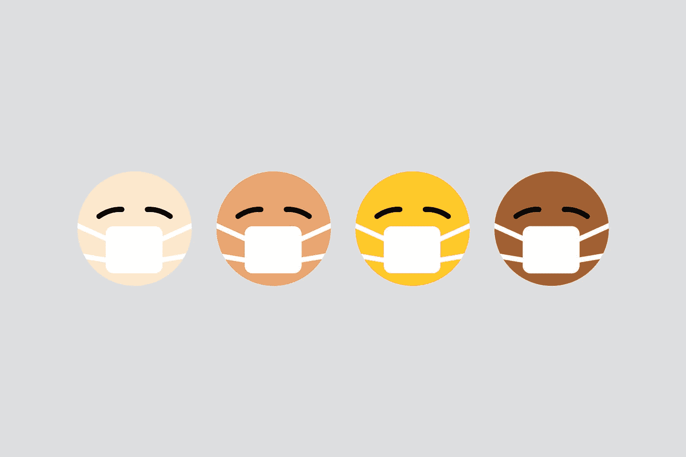
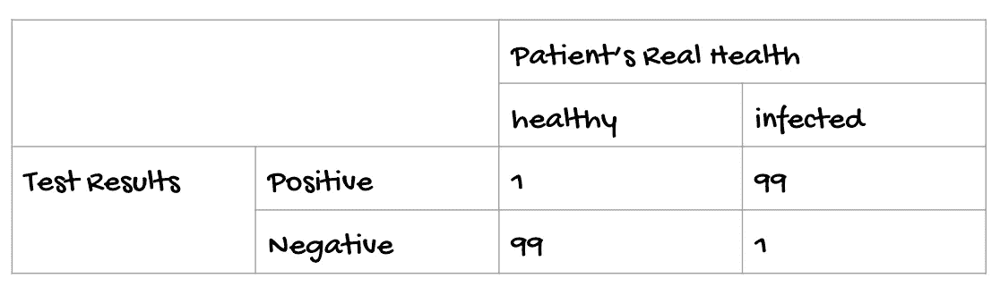
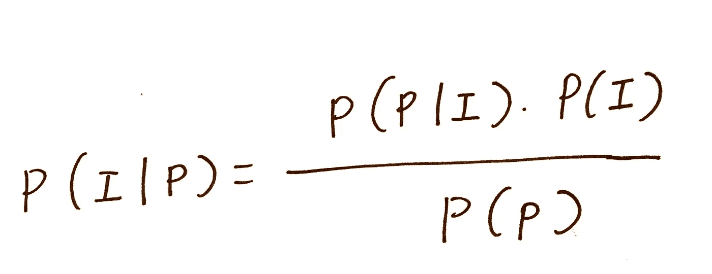
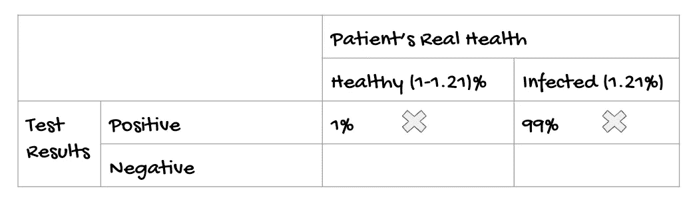
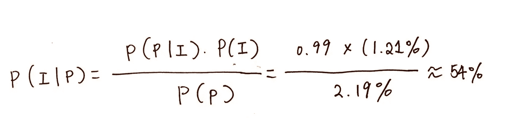
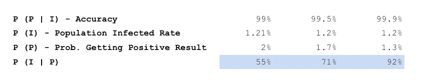
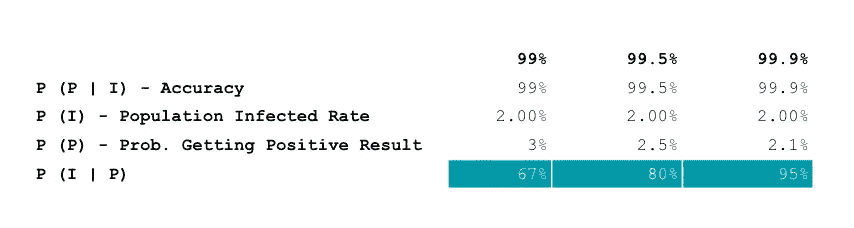
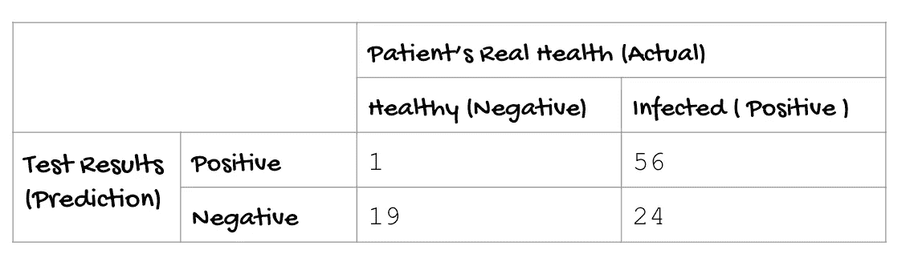
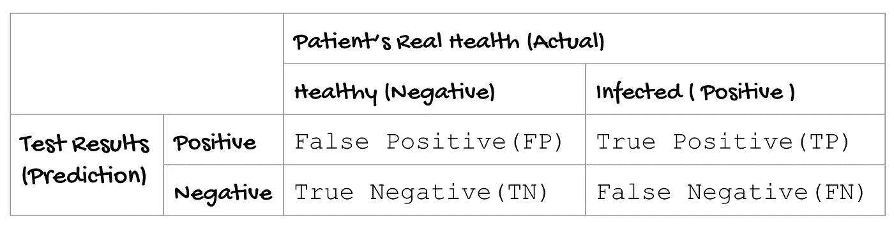
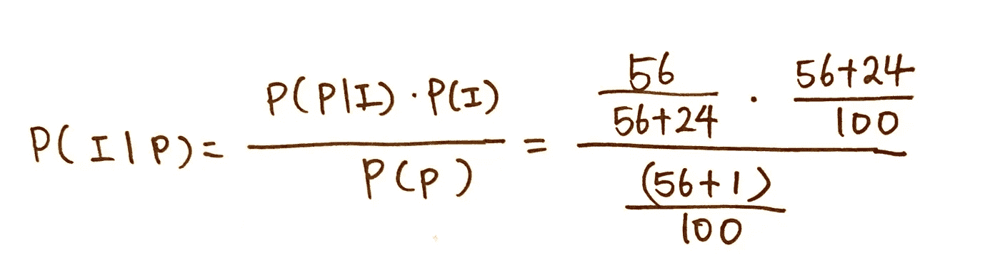

# 为什么敏感度比准确度更好？(贝叶斯概率解释)

> 原文：<https://levelup.gitconnected.com/a-covid-test-with-99-accuracy-is-almost-like-flipping-a-coin-bayesian-probability-explanation-7cd945899088>

约 1.21%的人口已被确认患有冠状病毒([来源:Worldmeters](https://www.worldometers.info/) )。

埃隆·马斯克在推特上发布了 2 个阴性和 2 个阳性的结果，并怀疑他是否感染了冠状病毒。为了解决这个难题，我想问问他关于他的诊所对病人声称的测试的准确率和灵敏度。

如果你理解贝叶斯概率模型，你可能会知道 99%的测试准确率并不能告诉我们这些测试在捕捉被感染的病人方面有多有效。敏感性和特异性是比准确性更好的评估测试成功的指标。

剧透警告:

如果一个人在诊所进行了准确率为 99%的检测，并得到了阳性结果，那么这个人实际被感染的概率只有 54%。一枚公平的硬币有 50%的机会得到一条尾巴或一个头。

在 [Unsplash](https://unsplash.com?utm_source=medium&utm_medium=referral) 上[视觉效果](https://unsplash.com/@visuals?utm_source=medium&utm_medium=referral)拍摄的照片

# 准确率 99%的测试意味着什么？

假设我们不知道敏感度。下表展示了测试结果和患者真实情况之间的交叉。让我们假设有 200 人参加试验，其中 100 人得到阳性结果。99%的准确性意味着 100 个患者中有 99 个实际上被感染，而 1 个人被错误分类。

表示获得阳性结果并试图计算出被病毒感染的几率的情况的公式可以总结如下。我们的目标是得到 P(I| P)的数字。

*   P( I| P):给定一个阳性结果，病人被感染的概率是多少？
*   假定一个病人已经被感染了，测试显示阳性结果的概率是多少？来自诊所的营销信息声称检测阳性结果患者的准确率为 99%。
*   P(I):已知阳性结果的人口百分比。确诊病例占总人口的百分比为 1.21%。
*   P(P):从报告中得到阳性结果的概率，不管这个人是健康的还是被感染的。

我们需要计算的只是 P(P)！

我们需要明白一个人有两种情况可以得到积极的结果。下表中带有“X”标记。

*   一个健康的人会得到积极的结果
*   受感染的病人也是阳性结果

因此，P(P)= 1% *(1–1.21%)+99% * 1.21% * = ~ 2.19%

总结我们上面所有的计算，概率看起来会像下面的公式。

# 比较不同的准确率

现在，让我们比较一下在不同准确率的测试中出现阳性结果时被感染的概率。如果患者以 99.9%的准确率从诊所进行检测，得到阳性结果，那么患者实际被感染的几率高达 92.5%！这个结果比只有 99%准确度的测试相对好 67%。

有些人可能会说，被感染人口的百分比可能远高于 1.21%，因为它在 2020 年 1 月至 2020 年 3 月期间没有得到广泛测试。让我们把目前被感染的人口比例修改为 2%。测试准确率从 92%提高到 95%，达到 99.9%。

# 当前拭子检验的发展

根据[英国国家健康研究所](https://arc-w.nihr.ac.uk/news/coronavirus-how-accurate-are-coronavirus-tests/) (NIHR)的数据，拭子测试显示出 70%的敏感性和 95%的特异性。总体准确率在 75%左右。

> 为什么这种准确率 75%的设计其实比准确率 99%的测试更好？

在医学试验期间的测试开发中，covid 拭子测试成功实现了相当高的准确率、可接受的灵敏度和高特异性。在患者被给予阳性结果的情况下，最可能的是患者实际上被冠状病毒感染。

*   准确度= (56+19)/100 = 75%
*   灵敏度= 56/ (56+24) = 70%
*   特异性= 19/(1+19) = 95%

如果我们扩展敏感性和特异性的概念，我们还可以发现

*   灵敏度= TP/(TP+FN)
*   特异性= TN/(TN+FP)
*   精度= TP/(TP+FP)

当医学研究中心进行测试开发时，他们包括了更大比例的 covid 患者(多达 80%的志愿者实际上是 covid-10 阳性患者)。这将 P(I)修改为 80%,而不是 1.21%,这在本博客开头的假设中提到过。

如果我们重新计算一下，**一个拭子检测呈阳性的患者有 98%的几率患有冠状病毒。**

很多航空公司发现阴性拭子测试不再足以保证暴露于冠状病毒的低风险，你能找出原因吗？

结果显示，如果拭子测试结果为阴性，乘客仍有 55%的机会感染冠状病毒。

# 吸取的教训？

下一次当我走进诊所时，我会跳过准确率，要求提供关于他们测试的敏感性和特异性的数据。在临床试验中，我们看到研究人员将这 3 个指标从最重要到最不重要排列为灵敏度、精确度、特异性和准确性。

**敏感度是评估识别病毒携带者测试成功与否的最重要指标。**

新冠肺炎病患者错误地得到阴性测试的代价比将一个没有新冠肺炎的健康人错误分类要大得多。

除非我们将逻辑应用到现实生活中，否则从教科书中学习贝叶斯概率似乎很无聊。如果我们能够发现所有营销活动背后的真相，我们将更加谨慎地选择服务，以提供最佳效果并更有效地防止疾病传播。