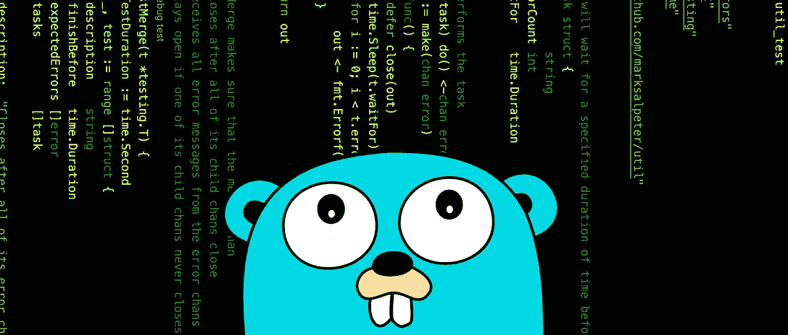

# 围棋并发与并行速成班

> 原文：<https://levelup.gitconnected.com/a-crash-course-on-concurrency-parallelism-in-go-8ea935c9b0f8>

## Go 例程、等待组、互斥锁、通道等等！



作为 2021 年最受欢迎的编程语言之一，Go 正在继续上升。它的一个主要卖点是其简化的并发和并行方法。使用 Go 例程、通道和等待组之类的工具，可以让你以最小的复杂度创建速度极快的应用程序。

本文旨在强调在 Go 中编写并发程序的一些最重要和最基本的组件。将有大量的代码片段和例子，但我鼓励你在评论中留下问题，如果需要的话，我会尽快回复你！

> 万一你需要复习一下，**并发**就是**同时处理**多件事情的过程。**并行**就是**同时做**多件事的过程。我喜欢把并发想象成带着许多任务物品去杂货店买鸡蛋、面粉、巧克力片等等。我可以以任何顺序获得这些项目，但是一些调度将允许我的并发性更快。并行性更进了一步——就好像我把我的朋友带到商店，他们帮我同时买到清单上的所有商品。

# 围棋套路

如果您还不熟悉，线程是并行执行并发任务的一种常见方式。一个线程有自己的执行堆栈，需要固定数量的堆栈空间，通常大小为 1MB。从代码中调用线程时，线程实际上是由宿主操作系统管理的。

**Go 例程就像一个超级轻量级线程**——它们开始时只有 2KB 大小，如果需要可以自动扩展。它们也有自己的执行堆栈，但它们由 go 运行时管理，因此 Go 例程将被调度给计算机 CPU 核心上的实际线程。

让我们看一个简单的例子。下面的程序运行 10 个任务，每个任务的执行时间为四分之一秒。

```
Executing task 1
Executing task 2
Executing task 3
Executing task 4
Executing task 5
Executing task 6
Executing task 7
Executing task 8
Executing task 9
Executing task 10
Total execution time: 2.5s
```

现在让我们使用`go`关键字与`main()`线程并行运行`executeTask()`。如果您运行这个程序，您可能会惊讶地发现没有任务完成。

```
Total execution time: 0s
```

这是因为 **Go 程序在后台运行。**一旦主线程启动了对`executeTask()`的所有 10 个调用，它就退出`for`循环并打印总执行时间——Go 例程没有时间运行！我们可以通过调用`time.Sleep()`来解决这个问题，这样 Go 例程就有时间执行了。另外，请注意，在运行中调用 Go 例程时，不能保证**的执行顺序。**

```
Executing task 5
Executing task 2
Executing task 7
Executing task 8
Executing task 3
Executing task 10
Executing task 9
Executing task 4
Executing task 6
Executing task 1
Total execution time: 300ms
```

好了，现在我们所有的任务都执行了，但是如果它们中的任何一个运行超过 300 毫秒，那么它们将永远没有机会在主线程退出之前完成。我们将在等待组部分继续讨论这个问题，但现在我们可以看到 Go 例程如何给我们的程序带来巨大的性能提升。

# 等待组

等待组只是在继续程序执行之前等待一组 go 例程完成。我们不必调用一个限制性的`time.Sleep()`来希望我们的 Go 例程能在这段时间内完成，我们可以使用等待组来指定我们想要在给定的时间框架内运行和完成多少 Go 例程。

Go 的一个特点是它如何通过引用传递对象。如果您创建了一个等待组并试图通过值传递它，Go 将创建一个对象的副本，并且您将不会引用同一个等待组。这就是为什么您必须始终将等待组作为指针引用，以便每个方法都从等待组的同一个实例开始操作。

在下面的例子中，我们在调用 go 例程之前，在 for 循环的每次迭代中调用`wg.Add(1)`。你可以在循环之外调用`wg.Add(10)`，但是最好在启动 go 例程之前加入一个等待组。这是因为在`for`循环的情况下，随着代码的进展，你可能会有中断、继续等等。根据我们对`wg.Add()`的预期数量，这可能导致运行的 go 例程数量不足。

在`executeTask()`中，我们现在有了语句`defer wg.Done()`。这一点很重要，因为一旦函数退出，我们总是会调用`wg.Done()`,即使是由于死机。添加到等待组和调用`wg.Done()`的 go 例程的数量必须始终相等。最后，我们只需要调用`wg.Wait()`，这样我们就不会继续主程序线程，直到我们所有的 go 例程都执行完毕。

如果我们运行这个程序，我们会发现基本上没有开销，因为我们在四分之一秒内完成了所有的任务！

```
Executing task 10
Executing task 1
Executing task 5
Executing task 2
Executing task 3
Executing task 4
Executing task 7
Executing task 6
Executing task 8
Executing task 9
Total execution time: 250ms
```

# 用互斥锁共享内存

我们已经学习了如何使用`WaitGroup.Wait()`有效地等待我们的 go 例程执行完毕，但是如果我们还想在多个 go 例程之间使用内存资源呢？我们可以使用互斥锁来实现这一点，这将防止在我们的 go 例程试图同时访问同一个共享资源时出现竞争情况。

我们将使用一个模拟的例子来查询一个数据库，同时维护一个缓存。这很简单，但将展示我们如何使用互斥锁来编写线程安全的代码。

下面是一个例子——我们定义了一个缓存和一个数据库，它们都是整数到整数的简单映射。除此之外，我们有一个`for`循环，它使用我们之前见过的相同等待组模式迭代 100，000 次，只是我们还将一个读写互斥`sync.RWMutex`传递给了`GetBook()`函数。接下来我们将实现`GetBook()`方法。

`GetBook()`函数将首先检查全局缓存映射中的给定值。注意，当我们访问第 6 行的缓存时，我们如何使用读写互斥体来调用读锁和读解锁。如果缓存是空的，那么我们继续查询延迟 300 毫秒的数据库。我们再次锁定数据库和缓存，因为我们正在更新它们，这样我们的代码就不会出现混乱并导致任何争用情况。

```
Total execution time: 319ms
```

这个例子实际上并没有提供太多的性能提升，事实上互斥锁已经足够昂贵了，这实际上降低了我们的代码速度，如果我们只从数据库中读取，而完全排除缓存的话。主要的一点是展示我们如何在代码中使用互斥体来保护共享内存。

# 使用信道的通信

随着应用程序变得越来越大，在多个 go 例程之间共享内存变得越来越困难。虽然使用互斥锁是一种可能的解决方案，但这也带来了性能上的折衷，并增加了代码的复杂性。通道是一种高层次的交流方式，可以很容易地用来提高围棋程序的能力，同时保持效率和可读性。

> “不要通过分享记忆来交流，通过交流来分享记忆”——罗伯·派克

让我们来看一个使用通道在两个 go 例程之间进行通信的例子。我们将使用两个匿名函数，这也是 go 例程的常见模式。我们使用特殊操作`<-`与通道的发送或接收接口。第一个函数是从通道接收，而第二个函数是向通道发送。这是一个有效的程序，可以成功执行。

```
Sending message to channel
```

您也可以通过传递第二个参数在第 3 行给出通道的最大大小。此外，**通道本质上是阻塞的**——所以如果你试图在 main 函数中做同样的事情，你实际上不能执行这些相同的操作。下面的代码显示了两个导致通道死锁的例子。

## 频道类型

像 Go 中的大多数对象和方法一样，**通道是强类型的**。这包括通过信道发送的信息类型，以及该信道是否只能接收或发送信息。在下面的代码中，我们有两个将同一个通道作为参数的方法。函数`sendToChannel()`无法从通道接收，因为我们已经将通道参数`ch`定义为`chan<- string`。`receiveFromChannel()`的逻辑相反。

## 通道和控制流

您可以在不同类型的控制流语句中使用通道，以获得代码中的附加功能。**要在 if 语句**中使用通道，您可以检查消息和通道的状态，类似于检查 map 中的值。

> **注意:**您可以通过调用 close(ch)来关闭通道。如果这样做，就不能发送到关闭的通道，因为这将导致死机。但是，您可以很容易地从一个关闭的通道接收任何剩余的消息。

**要在 for 循环中使用一个通道，**如果我们打算遍历一个通道，我们必须确保正确地关闭它。现在，当我们发送到通道时，我们在`for`循环中推送`i`的当前值，并确保在我们完成后发送到`close`通道。这将允许我们毫无问题地从信道迭代接收。

最后，**为了同时与多个通道**交互，我们可以使用 **select 语句。**这个例子将在退出前等待两个消息通过两个独立的通道发送。注意我们甚至不需要使用任何等待组！

```
$ go run main.go
received one
received two
```

我关于 Go 中并发性和并行性的速成课程到此结束。如果你喜欢这篇文章或有任何问题，请在下面留下评论！感谢阅读。