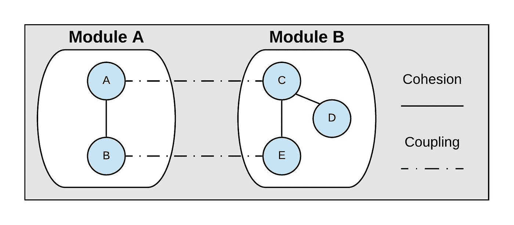
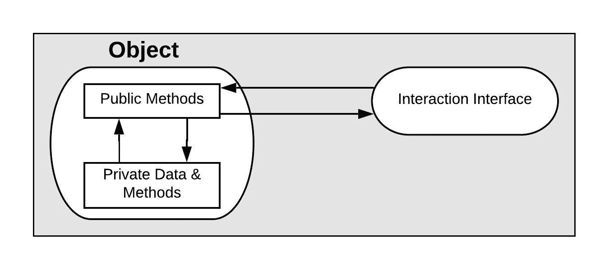
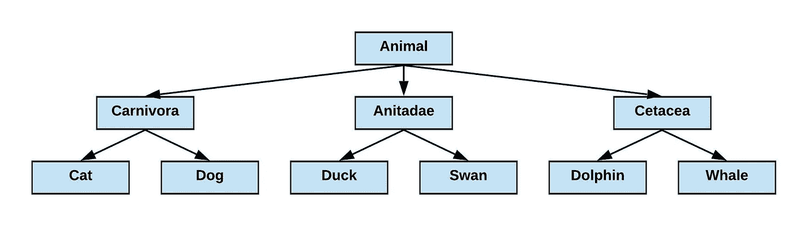
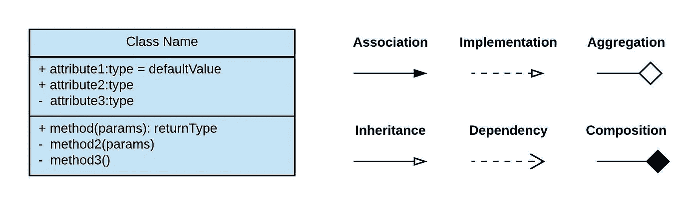
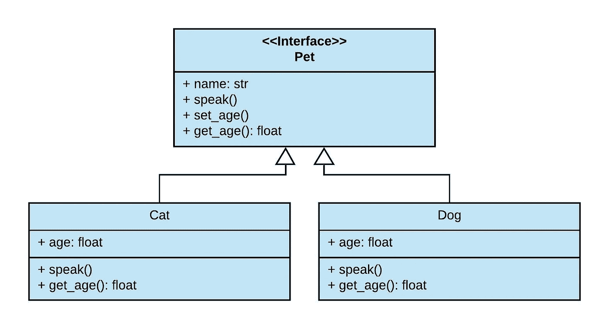
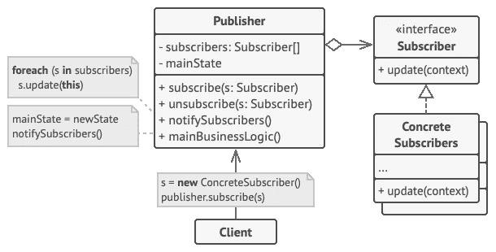

# Python 面向对象编程速成班

> 原文：<https://levelup.gitconnected.com/a-crash-course-on-object-oriented-programming-in-python-a243b35054c0>

抽象、继承、UML 图等等！


图片来自[com break on pix abay](https://pixabay.com/photos/solar-system-sun-mercury-venus-439046/)

本文介绍了理解面向对象编程(OOP)的基础知识所需的一切，包括继承和封装等概念，最后给出了 Python 代码示例。建议对 Python 编程语言有一个基本的了解。重点将放在以下方面:

*   为什么要面向对象编程？
*   松散耦合和紧密结合
*   抽象、封装、继承和多态
*   统一建模语言(UML)图表
*   Python 演示
*   设计模式

让我们开始吧。

# **为什么要面向对象编程？**

大约在 1966 年，[艾伦·凯](https://en.wikipedia.org/wiki/Alan_Kay)首次创造了术语面向对象编程。虽然名字可能看起来模糊，但是 OOP 范例仅仅意味着使用对象来组织数据和功能。让我们看一个简单的例子。

假设您正在构建一个程序来跟踪宠物店的库存(包括宠物本身)。使用标准编程，您可以通过使用数组来组织关于宠物的基本信息。

```
pet_names = ["Tommy", "Daisy", "Bernard"]
pet_type = ["Dog", "Cat", "Lizard"]
pet_breed = ["Border Collie", "Persian", "Bearded Dragon"]
pet_weight = ["35.0", "8.2", "0.75"] # weight in pounds
```

我只列出了每只宠物的四个描述，尽管只有三只宠物，我们已经有了相当多的代码。这种标准编码方法的真正问题是适应变化。如果我们卖一只宠物呢？让一只新的乌龟(这是一件事)加入宠物名单？我们需要非常小心地调整我们的数组，因为如果只有一个元素移动了位置或者一个索引不正确，我们所有的宠物都会有不匹配的信息！

如果我们的宠物店发展壮大，拥有数百甚至数千只宠物，这种类型的设计规模会非常大。这就是 OOP 来拯救我们的地方！我们可以创建一个存储相关信息的宠物对象，而不是用数组硬编码宠物信息。但是首先，让我们继续建立对 OOP 背后的关键原则的理解。

# **松耦合&紧衔接**

我相信你非常渴望代码示例，但是理解 OOP 背后的思想将使本文末尾的代码示例更有意义。继续，耦合和内聚是两个经常被认为过于复杂的术语，但是它们实际上非常简单，并且对 OOP 的目的有很大贡献。



如果你对 [Python 模块](https://docs.python.org/3/tutorial/modules.html)不熟悉，就把上面的每个模块当作一些带有函数 A、B、C 等的 Python 文件。包括在内。耦合是一个模块和另一个模块之间的交互，而内聚可以被看作是单个模块能做多少事情。

**松(低)耦合良好。**这意味着你的模块是相互独立的。高耦合不好！如果你调用一个函数来添加一个新的宠物到我们的商店，你不希望这个函数在多个文件和多个位置有逻辑。调试起来会非常困难！模块中的功能应该集中在完成单个操作上，而不是分散在代码库中。

**我们想要一个具有高度凝聚力的系统。**一个具有发送电子邮件、更新商店信息以及报税功能的模块很少关注它能做什么。因此，它的内聚力很低。一个高度内聚的模块将专注于格式化电子邮件、发送电子邮件和组织客户联系信息。

# **面向对象的四大原则**

抽象是隐藏看似简单动作的所有可怕细节的概念。想象一下，当你用手机发送短信时，你所要做的就是选择一个联系人，输入你的信息，然后点击发送。然而，在幕后有很多事情在进行。手机有一个专用于发送信息的存储器，它将你的文本发送到卫星或手机信号塔等。有了抽象，你希望技术细节隐藏在简单的动作之外。

**封装**给系统增加了一层验证。假设您编写了一个将文本文档解析为字典的程序。如果您想要一致的结果，您不希望能够在任何时间点访问该字典。



您可能需要一个函数来控制对字典的访问，并给出多种可能的返回结果，比如 None 或声明字典仍在处理中。公共方法允许您访问私有数据和方法，因为它们添加了协议和条件检查，以确保您没有访问敏感或不稳定的信息。

**继承**是更容易理解的 OOP 概念之一。想想一种特殊的动物，比如说鸭子。鸭子游泳游得很好，因为它继承了鸭科的蹼足，鸭科包括天鹅或鹅等水禽。所有这些动物也是鸟类，这意味着它们都有羽毛。继承描述了基于某种等级系统的某些特征。



类层次结构图

最后，**多态性**代表改变的能力。看我们上面的图，树的底部叶子(猫，鸭子，等等。)尽管它们都是动物，但彼此都有差异。遗传是从父母那里获得性状，但多态性是子代之间可能发生的变异。

**统一建模语言(UML)图表**

UML 图是一种显示系统如何协同工作的可视化工具，包括主要角色是什么、数据如何移动以及总体架构和设计。目前，本文将只关注基础知识。



UML 图符号的基础

蓝框是你描述一个类的方式。一个类就像一个对象应该是什么样的蓝图。它在第二个框中给出了描述诸如数组的最大长度、要连接的数据库的名称或存储信息的文件的位置等内容的属性。底部显示的方法是属于类的一部分的函数。在 UML 图中，您可以使用(+)符号指定方法或属性是公共的，还是使用(-)符号指定是私有的。简单地说，任何其他类都可以访问公共方法，但是只有特殊类可以访问私有方法。

这六条线代表了我们在 UML 图中将类相互连接的不同方式。

关联意味着一个类与另一个类有某种类型的基本交互。

**实现**显示一个类正在创建一个接口指定的函数。一个接口本身就是一种契约形式，它将指定*需要由另一个类实现的功能列表。*

**继承**表示一个类正在获得另一个类的特征和方法。*继承特征的类成为父类；例如，Animal 类是 Duck 类的父类。*

**依赖**表示一个类依赖于另一个类，例如，一个执行数据处理的类可能需要另一个类从数据库中获取数据。

**聚合**表示即使父类不存在，子类也可以存在。例如，一组学生可能注册了一个班级，但是如果该班级从计划中删除，这些学生仍然可以存在。

**Composition** 基本上与 aggregation 相反，因为它表示两个类之间的关系——但是父类必须存在，子类才能存在。例如，没有房子，一个房间就不可能存在。

# **Python 演示**

让我们用一个使用 Python 的例子来总结一下我们到目前为止学到的东西。现在我们将保持简单，创建三个类，分别叫做猫、狗和宠物。这是他们的 UML 类图:



这里我们引入了一个稍微不同的类图，叫做接口。接口是需要由另一个类实现的属性和方法*的列表。我们不能实例化宠物类，因为宠物到底是什么？pet 是由 Dog 和 Cat 类继承的父类，它们可以被实例化。*

但是一个类被实例化意味着什么呢？

记住，一个类就像我们想要创建的任何对象的蓝图。*一个类的实例化*就是你实际创建那个对象的时候。下面是 Python 中 Dog 类的一个示例:

```
class Dog:
    def __init__(self, assigned_name, assigned_age):
        self.name = assigned_name
        self.age = assigned_age def speak(self):
        print("Woof!") def get_age(self):
        return self.agemy_dog = Dog("Boomer", 3)
```

这里，Dog 类有三个方法，包括 __init__、speak 和 get_age，稍后会详细介绍这些方法。在代码的最后一行，我们*通过创建对象 my_dog 来实例化*该类，该对象是通过将名称“Boomer”和年龄 3 传递给 dog 类来创建的。这就是为什么我们保留 Pet 类作为一个接口，因为只有一些“宠物”是没有意义的，我们将它定义为一只狗或猫，它继承了 Pet 类的特征。

继续，speak()方法很简单，因为它只是输出“Woof！”。但是里面讲的参数呢， *self* ？所有方法中的 self 参数是 Python 语言用来引用类本身的*实例化*的语法。在 get_age(self)方法中，我们返回 *self.age* ，即类实例化本身的年龄。您可以将参数 self 重命名为您喜欢的任何名称，但是 self 是当前的 Python 标准。此外，类方法的第一个参数引用了类实例化。

最后，__init__ 方法有一个特殊的名字，因为它负责类的初始构造。请注意，除了 self 参数之外，我们还传递了一个指定的姓名和年龄。然后通过 self.age=assigned_age 和 self.name=assigned_name 将这些传递的参数分配给类的实例化。因此，参数“Boomer”和 3 被分配给 Dog 类 my_dog 的实例化。

**界面呢？一个类如何继承它？**

Python 与其他语言略有不同，因为您经常需要导入一个额外的库来获得额外的 OOP 功能。一个流行的库叫做 ABC，代表抽象基类。Python 没有专门的接口类，而是使用了一种叫做抽象类的东西。在我们的例子中，这达到了完全相同的目的，因为它定义了 Dog 和 Cat 类可以实例化，而 Pet 类不能实例化的约束。为此，我们让 Pet 类继承 ABC 库，然后将 speak()方法定义为由 Dog 和 Cat 子类实现的抽象方法。

代码如下:

```
from abc import ABC, abstractmethod
# A Python class can inherit from another class by passing it as an # argument, e.g. Pet(ABC)class Pet(ABC):
    def __init__(self, name, age):
        self.name = name
        self.age = age # the below line enforces the speak() method to be implemented 
    # by another class. Always put pass in the method body of an
    # abstract method.
    @abstractmethod
    def speak(self):
        pass# The Dog and Cat class inherit from the Pet class
class Dog(Pet):
    def __init__(self, name, age):
        # the super() method references the parent Pet class
        super().__init__(name, age) 

    def speak(self):
        print("Woof!") def get_age(self):
        return self.get_ageclass Cat(Pet):
    def __init__(self, name, age):
        super().__init__(name, age) def speak(self):
        print("Meow!") def get_age(self):
        return self.get_agemy_dog = Dog("Boomer", 3)
my_dog.speak()my_cat = Cat("Daisy", 4)
my_cat.speak()
```

注意我们是如何在 Dog 和 Cat 类之间以不同的方式实现 speak()方法的，这就是多态的作用！狗和猫从 Pet 类继承，然后可以调用 Pet __init__ 方法将传递的名称和年龄分配给我们的猫或狗。这是一个 OOP 如何允许我们只需要在 Pet 类中编写指定名字和年龄的代码，而不是子类 Dog 和 Cat 的例子。模块化致胜！

# **设计模式**

既然我们已经理解了 OOP 的基础，包括 UML 类图，以及如何使用 Python 来构造类和实例化它们，我们就准备看看一个强大的新工具——**设计模式。**

设计模式允许我们组织我们的代码库，以便在特定情况下充分利用 OOP 范例。有几十种设计模式，但这里有一些最常见的。

**观察者模式:**这种模式适用于基于发布者到订阅者的系统。媒介本身可以使用这种模式！一个作家可以是一个出版商，而观察者可以是其他追随该作家的媒体成员。这是 UML 图:



重构大师[的观察者模式 UML 图](https://refactoring.guru/design-patterns/observer)

该图在灰色框中包含了一些伪代码，但是我们可以从中央 Publisher 类中看到，我们有两个私有属性——订阅者数组和 mainState，它们跟踪系统的当前状态。Publisher 类还包含四个管理订阅或通知观察者的公共方法。

请注意，通过添加订阅者并通知他们，发布者类与订阅者类相关联。Subscriber 类还与发布者有一个*聚合*关系，这意味着即使某个发布者不存在，订阅者也可以存在。

最后，我们有接口订阅者，它必须由具体的订阅者实现。同样，一个接口就像一个契约；它并不关心一个类是如何实现 public update()方法的，但是从 Subscriber 继承的每个类都必须有一些 update()方法的功能。就 Medium 而言，从您关注的作者处获取更新和从您关注的订阅处获取更新之间可能存在差异，例如更新的频率或您获取的信息量。要点是订户接口*强制*每个子类拥有一个标准的 update()方法来遵守观察者模式。

其他非常有用和常见的模式包括策略、工厂、单例模式等等。Derek Banas 有一个很棒的 YouTube 频道，涵盖了从 UML 图开始的几十种模式，尽管他用 Java 做代码演示。他的设计模式视频教程播放列表如下:

**恭喜你，你已经理解了 Python 面向对象的基础知识！！！**

如果你有进一步的问题或者想要关于 OOP 任何方面的额外信息，请在这篇文章上发表评论，我会很乐意在我有时间的时候添加到这篇文章中。感谢阅读！