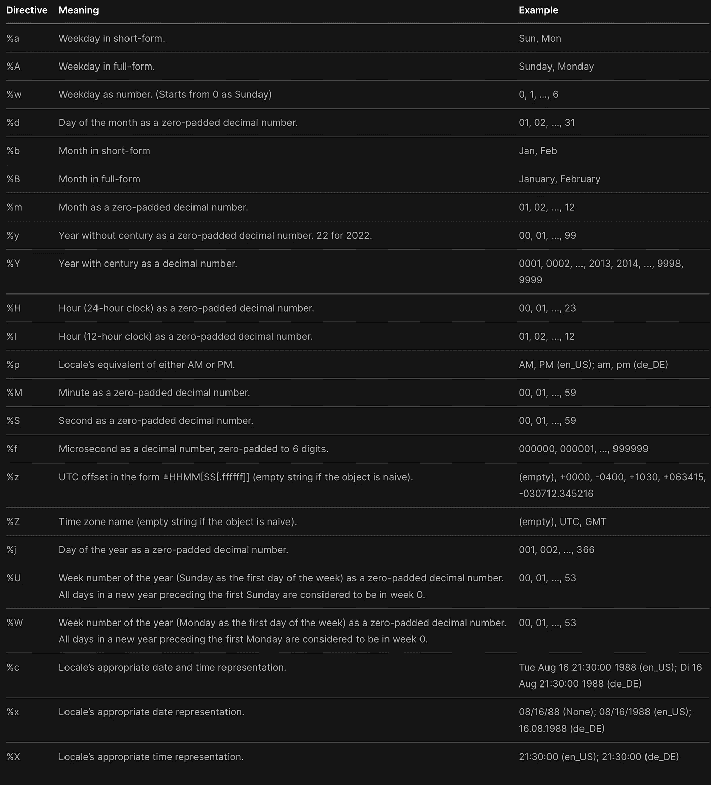

# Python | Part-2 中带 Datetime 模块的日期

> 原文：<https://levelup.gitconnected.com/a-date-with-the-datetime-module-in-python-part-2-a51f42a88f3>

## 如何在 Python 中使用 strftime()和格式化日期？


照片由[莫里茨·金德勒](https://unsplash.com/@moritz_photography?utm_source=medium&utm_medium=referral)在 [Unsplash](https://unsplash.com?utm_source=medium&utm_medium=referral) 上拍摄

在之前的[博客](https://www.sahilfruitwala.com/get-current-date-in-python)中，我们已经探讨了如何获取当前日期、月份、年份和星期几。在这篇博文中，我们将通过一些教程来探索更多的日期时间及其相应的方法。

# 使用 Python 获取当前周数

使用`datetime`有两种方法可以获得当前的周数。

1.  `isocalendar()`
2.  `strftime()`

```
*# isocalendar()*
from datetime import datetimetoday_iso = datetime.today().isocalendar()
print("ISO Calendar:", today_iso)
print("Current Week:", today_iso.week)"""
OUTPUT:ISO Calendar: datetime.IsoCalendarDate(year=2022, week=43, weekday=2)
Current Week: 43"""
```

正如我们所看到的，`isocalender()`方法可以提供年，周，工作日。我们可以用和上周相似的方法提取它们。

```
*# strftime()*
from datetime import datetimetoday_iso = datetime.today().strftime("%V")
print("Current Week:", today_iso)"""
OUTPUT:Current Week: 43
"""
```

strftime()方法有很多可能性。让我们看看我们能用 strftime()做些什么。

# Python 中的 strftime()

`strftime()`方法帮助我们用适当的字符串格式表示日期。我们可以单独或组合使用以下任何一种[格式代码](https://docs.python.org/3/library/datetime.html#strftime-and-strptime-format-codes)。语法:`strftime(format)`

> 注意: **strftime** ()方法可以和 **datetime** ，日期和时间对象一起使用。



strftime()中的格式代码选项表

# 如何在 Python 中获取月份名称

要获得月份名称，我们可以使用带有`datetime`模块的`strftime`方法。

```
*# Month Name using Python*
from datetime import datetimetoday = datetime.today()
month_full = today.strftime("%B")
month_short = today.strftime("%b")print("Today:", today)
print("Month in Full:", month_full)
print("Month in Short:", month_short)"""
OUTPUT:Today: 2022-10-30 16:56:49.644084
Month in Full: October
Month in Short: Oct
"""
```

# 如何在 Python 中获得工作日的名称

要获得星期几的名称，我们可以使用带有`datetime`模块的`strftime`方法。

```
*# Week-Day Name using Python*
from datetime import datetimetoday = datetime.today()
day_full = today.strftime("%A")
day_short = today.strftime("%a")print("Today:", today)
print("Day in Full:", day_full)
print("Day in Short:", day_short)"""
OUTPUT:Today: 2022-10-30 17:01:19.545097
Day in Full: Sunday
Day in Short: Sun

"""
```

# 在 strftime()方法中组合多个格式代码

那么如何以特定的格式显示日期呢？我们可以使用任何特殊字符来分隔格式代码。要使用%,我们必须写出%%。

```
*# Custom Date*
from datetime import datetimetoday = datetime.today()
custom_date = today.strftime("%d %B, %Y")print("Today:", today)
print("Custom Date:", custom_date)"""
OUTPUT:Today: 2022-10-30 17:14:15.280584
Custom Date: 30 October, 2022
"""
```

> *想了解更多？*
> 
> *注册我的* [*简讯*](https://newsletter.sahilfruitwala.com/) *，把最好的文章放进你的收件箱。*