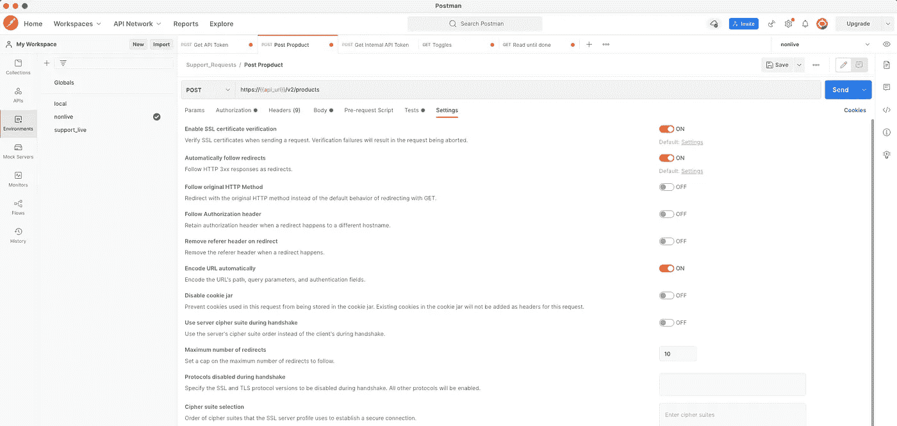
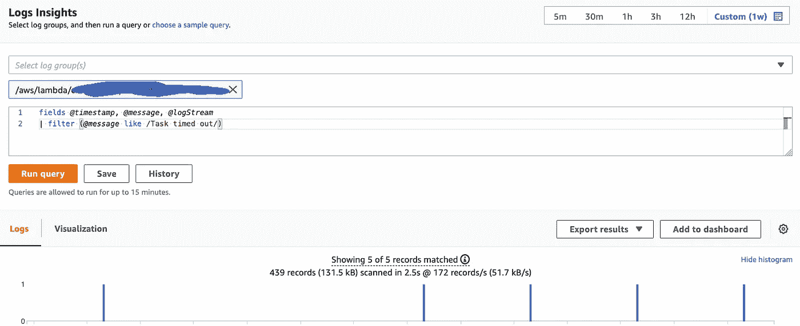
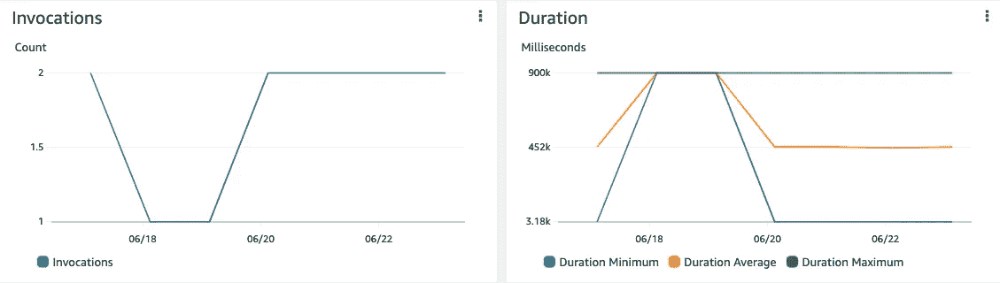
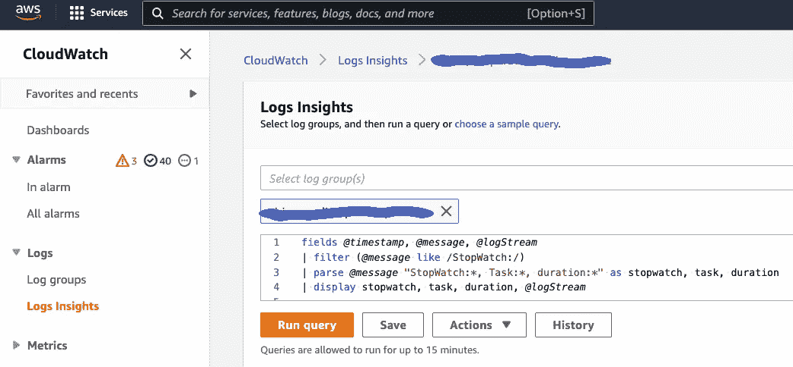
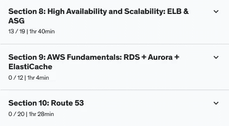

# 幕后:AWS 开发人员的一天

> 原文：<https://levelup.gitconnected.com/a-day-as-an-aws-cloud-developer-879396e85e98>

## 云架构看起来像什么，AWS 开发人员实际上做什么？我是来告诉你的。

佩克斯

# 早上 7:30

我的闹钟响了。我醒来。

我不必像过去那样为通勤做准备，因为我现在远程工作。我从为我蹒跚学步的孩子准备早餐开始我的一天，并把它放在他的幼儿园包里。

# 上午 8 点 40 分

我双脚并拢站在客厅里。我右脚向前迈了一大步，膝盖微微弯曲。我把左手放在地板上，把右臂伸向天花板。

我保持这个交错的姿势一分钟，然后换边重复。

在如此幸运的一天，我坚持早上的例行公事来提高我的注意力并保持健康:几分钟的拉伸或其他类型的锻炼。

# 上午 9 点

我端着一杯咖啡走向办公桌，启动了我的 MacBook。我登录微软团队，为我的晨会做准备。

*早上好拉尔夫。你有时间见我吗？*“我按下 MS 战队上的发送键。

昨天，我回顾了一个吉拉故事的实现代码，这个故事是关于在我们的 spring-boot 服务中保护执行器端点的。但我仍然不确定代码审查是否足以将故事从 QA(质量保证)转移到“完成”，或者我是否需要检查 AWS 控制台中的 [CloudWatch](https://aws.amazon.com/cloudwatch/) 日志洞察或[负载平衡器](https://aws.amazon.com/elasticloadbalancing/)。我希望拉尔夫能帮助我，给我一些启示。

在等待我的问题的答案时，我发现为我们新实现和部署的需求之一移除[特性切换](https://betterprogramming.pub/microservices-cloud-architecture-9d15be866ce6)并不像我想象的那么简单。这不仅仅是通过删除切换器和环境变量来清理 [Terraform](https://www.terraform.io/) 和`*.yml`文件。这需要在源代码中接触比预期更多的逻辑。做这件事时我必须小心。

# 上午 10 点 15 分

我们刚刚完成了我们的[每日站立](https://medium.com/serious-scrum/4-reasons-why-daily-scrums-are-stressful-for-developers-3be4a871db33)，在那里我们讨论了我们昨天完成的事情，我们今天的计划，以及我们前进道路上的任何事情。敏捷大师已经开始了冲刺评审会议。

下午的回顾会被取消了，因为团队的一半人都去度假了。

我很高兴我们使用了[看板](https://kanbanize.com/kanban-resources/getting-started/what-is-kanban)，这减少了我们两周冲刺中的会议数量——比如冲刺规划。多年来，我一直和 Scrum 一起工作，并且已经看到团队如何在计划会议中浪费大量时间来估计下一次迭代中每个问题的工作量。

开发人员倾向于将会议视为一大干扰。尽管在那段时间里效率不高，但我们经常让他们疲惫不堪，情绪低落。

# 上午 11 点半

在与 Ralf 和 Mathias 进行视频通话和讨论后，我仍然觉得有必要阅读更多关于[弹簧致动器](https://www.baeldung.com/spring-boot-actuators)如何工作以及我们为什么使用/需要它的信息。

我花了一点时间在谷歌上搜索，然后我读了一篇教程，阐明了 Spring Boot 2 中的致动器主题，这是我们在项目中使用的版本。

Spring Boot 致动器规则([示例来源](https://www.baeldung.com/spring-boot-actuators))

对我所获得的洞察力感到满意，我解雇了我的邮递员，并向我们的实时系统发送了几个 REST 调用来验证端点的状态。

邮递员(作者截图)

为了确保我们已经正确地调整了那里的执行器安全规则，我向`/actuator` 端点发送了一个 *GET* 请求，以获取`_links` 字段下可用执行器端点的列表。

我可以稍微修改一下代码，创建一个名为`mycustomgroup`和的新的`health`组，向其中添加`diskSpace` 和`ping` 健康指标。为此，我需要做的就是将`application.properties`更新如下:

当我现在调用`/actuator/health` 端点时，我得到以下关于新健康组的 JSON 响应:

当我向`/actuator/health/mycustomgroup`发送请求时，我收到:

通过将`**show-components**`和`**show-details**`属性添加到`application.properties`中的组配置中，我可以获得更多关于它的详细信息:

现在，对`/actuator/health/mycustomgroup`的请求返回以下响应:

我还可以通过使用以下调整，使这些细节只对 ***授权的*** 用户可用:

# 下午 15 点

我的下一个任务是检查我们的一个 Lambdas 的性能，它每天运行一次，并从另一个服务导入数据。我需要验证我们已经修复了其中的超时错误。

CloudWatch 日志洞察查询(作者截图)

我们最近优化了这个函数的源代码，分批发送消息给 [SQS](https://aws.amazon.com/sqs/) ，而不是单独发送每条消息。

如果一切正常，这个调整应该会减少运行时持续时间，当我将当前指标与优化前的指标进行比较时，我可以在 AWS 控制台上跟踪运行时持续时间。

Lambda 的 CloudWatch 指标(作者截图)

我登录 AWS 控制台并打开 CouldWatch，然后在 Logs Insights 中运行以下查询:

CloudWatch 日志洞察查询

通过这个查询，我可以得到关于 Lambda 性能的结果:

AWS CloudWatch 日志洞察—查询(作者截图)

Lambda 是用 Python 实现的，我几周前才开始学习 Python。

这种语言的语法对我来说仍然很陌生。这使得审查源代码的想法有点吓人。

# 下午 17 点

上个月，我购买了 AWS 课程，并预约了“认证解决方案架构师助理”AWS 考试。为了做好准备，我切换到浏览器上的[我的课程](https://www.udemy.com/course/identify-and-fix-javascript-memory-leaks/?referralCode=9C4AC713BDC09E437D99)选项卡，并点击播放按钮。

我今天想完成的部分是 AWS 基础(RDS+Aurora+elastic cache)和高可用性/可扩展性。

AWS 课程部分(作者截图)

# 想要更多吗？

感谢阅读！我为一群聪明、好奇的🧠人写关于工程、技术和领导力的文章💡。 [**加入我的免费电子邮件简讯，获得独家访问**](https://rakiabensassi.substack.com/) 或在此[注册 Medium](https://rakiabensassi.medium.com/membership)，如果你还没有这样做。

您可以通过以下链接免费获得我的 Udemy 视频课程**(*截止到 2022 年 7 月 20 日* ): [**如何识别、诊断和修复 Web 应用中的内存泄漏**](https://www.udemy.com/course/identify-and-fix-javascript-memory-leaks/?couponCode=565EE11E9B592089160A&source=about_page-------------------------------------)**

** [## 作为软件工程师，如何度过云复杂性高峰

### 贯穿现代系统架构和需求

better 编程. pub](https://betterprogramming.pub/surviving-cloud-computing-complexity-1aabc1024a54)  [## 我从设计企业应用程序中学到的 10 个教训

### 前端架构从来都不是“一劳永逸”的命题，没有任何设计或计划是完美或完整的

better 编程. pub](https://betterprogramming.pub/frontend-architecture-376e6323ef9b) 

# 分级编码

感谢您成为我们社区的一员！更多内容见[升级编码出版物](https://levelup.gitconnected.com/)。
跟随:[推特](https://twitter.com/gitconnected)，[领英](https://www.linkedin.com/company/gitconnected)，[通迅](https://newsletter.levelup.dev/)
升一级就是转型理工招聘👉 [**加入我们的人才集体**](https://jobs.levelup.dev/talent/welcome?referral=true)**