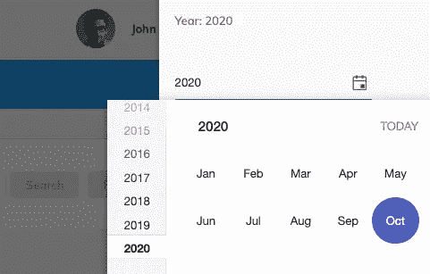

# 自由软件工程师的一天

> 原文：<https://levelup.gitconnected.com/a-day-in-the-life-of-a-software-engineer-cb817cf13d0>

## [软件工程](https://rakiabensassi.medium.com/list/software-engineering-7a179a23ebfd)

## 在家工作和与 scrum 团队合作是什么样子的

由[麦迪森·尤库姆](https://unsplash.com/@madisontraveling?utm_source=medium&utm_medium=referral)在 [Unsplash](https://unsplash.com?utm_source=medium&utm_medium=referral) 上拍摄的照片

# 早上七点半

我醒来，看着我的手机。我有足够的时间准备，我心里想。现在是电晕时间，我正在远程工作。所以，没有必要准备好离开家去坐公交车和地铁。

# 上午 8 点

我泡了一杯茶，走向我的办公桌。我坐在阳台旁边。我喜欢这个地方。它让我与外面的天空、阳光和树木保持联系。

从我的阳台看出去——作者照片

我点击链接，进入缩放室。我们今天有一位客人。是我们的产品负责人(PO)。通常，他不参加单口相声。这是一个非常短的会议，团队在早上聚集在一起评估进展。每个人都交流他们已经取得的成就，他们正在努力或遇到的阻碍，以及他们一天中将要做的事情。

会议结束后，我在深入研究代码之前通读了我的论文。我们使用 ClickUp，但我同时在纸上记笔记。有时候我四岁的孩子会在上面涂鸦。几周前，当我回到我的办公桌时，我发现他正在使用我的键盘，并在我的代码编辑器上敲击。当我问他“你在做什么？”他说:“我想学。”

我的待办事项清单上有我孩子的涂鸦——照片由[作者](https://medium.com/@rakia.bensassi)拍摄

我回到厨房拿些早餐吃的东西。我能感觉到我的腿因为坐得太多而疼痛。我希望我今天能做一次锻炼。

# 上午 10 点半

一个同事在 zoom 上分享了他的屏幕，向我寻求帮助。他在对话框中添加了 5 个自定义字段，但是只显示了 3 个，还有 2 个丢失了。自定义表单域组件是我自己实现的。两天前，我做了重构，移除了一个嵌套表单，这在使用[角反应表单](https://medium.com/better-programming/build-me-an-angular-app-with-memory-leaks-please-36302184e658)时不是一个好的做法。现在这个自定义表单域需要原始的 FormControl 作为输入。

自定义表单域

我查了他的 HTML 和打字稿代码。看起来不错，只是有一个字段输入错误。我很高兴问题很快得到解决，现在表单显示正确。

# 下午 12 点 18 分

我添加了处理数据状态的逻辑。当用户编辑实体时，不允许另一个用户同时更新同一实体。因为这个特性在多个模块中都是必需的，所以我将逻辑添加到了一个父类中，而不是复制代码:

处理实体状态的方法

每个模块的存储服务都继承自 BaseStoreService:

CustomerStoreService 扩展了 BaseStoreService

# 下午 5 点 15 分

我花了一个多小时合并一个拉请求并修复冲突。这并不容易，也令人沮丧。目标特性分支没有随着开发的变化而更新，这也是冲突的原因之一。谢天谢地，我正在使用 IntelliJ Idea，它对我解决合并冲突帮助很大。

做完这些，我转到下一个任务:“在侧面板中显示一个输入字段，允许用户输入整个应用程序的全球年份”。现在，我们的项目中有剑道和角材料领域。我会检查 mat-datepicker 或 kendo-datepicker 是否更符合这一要求。

左边是 kendo-datepicker，右边是 mat-datepicker

# 下午五点半

我添加了 kendo-datepicker，它只允许输入有效的字符和有效的日期:

结果看起来不像预期的那样。我不想向用户显示月份列表。让我们来看看如何修复它:

侧面板上的 kendo-datepicker，用于输入应用程序的全球年份

# **下午 6 点 06 分**

耶…问题解决了！

我不得不使用`'decade'`作为`[bottomView]`的值，而不是`'year'`。区别在于:

*   `'year':`显示一年中的月份
*   `'decade':`显示十年中的年份

侧面板上的日期选择器:显示年份

在提交和推送之后，我将这个变更从我的特性分支合并到开发中。

# 晚上七点半

经过一个小时的休息，我在侧面板上添加了一个 EventEmitter 来发出新输入的年份:

输入全球年份的侧面板

父组件捕获事件，然后将其保存在 AppConfig Store 服务中，该服务是一个 [Angular](https://medium.com/better-programming/angular-10-new-features-dbc779061dc8) BehaviorSubject 服务:

基于行为主体的商店服务

# 晚上 8 点

通常，当传统的 8 小时过去后，我的工作日并没有结束。在这个项目中，我们正处于“关键时刻”，我希望尽可能多地完成当前的开放任务，以减少接下来几周的压力。

今天的任务范围很广，我对自己在一天内实现这一改进的表现很满意。我还有一长串要做的事情，但我现在至少需要几分钟的训练。我在 youtube 上放了一段视频，跟随并聆听了来自[吉米·罗恩](https://www.jimrohn.com/)的鼓舞人心的演讲:

*   自我准备，在机会到来之前做好准备。
*   成功无非是每天练习几个简单的纪律。
*   永远不要希望它更容易，希望你更好。
*   不要把目标定得太低。不要加入容易相处的人群。你不会成长。

我觉得很有必要在自己的生活中运用这些金句和智慧。

# 晚上 11 点半

吃完晚饭，在家里做了一些事情后，我上床睡觉，想着持久化应用程序状态和前端与后端之间的同步。有时候，我会梦到我的代码，早上醒来时会想到实际问题的解决方案。当我白天如此专注于我的工作时，即使是在休息几分钟冲咖啡的时候，我的大脑也会一直想着我面临的任务和问题。我喜欢的是，在那些短暂的时刻，我变得富有创造力，找到了我坐在办公桌前时没有找到的解决方案。

现在该睡觉了。第二天肯定，不平淡不无聊。

我的桌子——照片由[作者](https://medium.com/@rakia.bensassi)拍摄

🧠💡我为一群聪明、好奇的人写关于工程、技术和领导力的文章。 [**加入我的免费电子邮件简讯，独家获取**](https://rakiabensassi.substack.com/) 或在此注册 Medium。

*你可以在 Udemy 上查看我的* ***视频课程****:*[*如何识别、诊断、修复 Web Apps 中的内存泄漏*](https://www.udemy.com/course/identify-and-fix-javascript-memory-leaks/) *。*

 [## 内容创作者的一天

### 接受计划中的偏差会给创造力留出空间

bettermarketing.pub](https://bettermarketing.pub/a-day-in-the-life-of-a-content-creator-d87b0049f66b)  [## Angular 13 的新功能

### 100% Ivy，更好的组件 API，不支持 IE11，等等

better 编程. pub](https://betterprogramming.pub/angular-13-features-ef528a9ae16f)