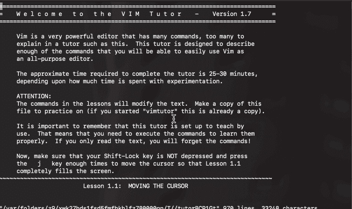

# Vim 导师的一天(Vim Tutor)

> 原文：<https://levelup.gitconnected.com/a-day-with-vim-tutor-vimtutor-25aa2e6ce52c>

## 令人敬畏的 VIM— #1

是一个非常基本、干净、酷的应用程序，教你如何使用 Vim。这是开始使用`vim`的最佳地方。花大约 1 个小时和`vimtutor`在一起，你几乎可以了解`vim`的所有主要特性。

然而，对于对`vim`不感兴趣的人来说，1 个小时有点太多了。因此，我写了这篇 3 分钟的文章，总结了`vimtutor`可以教你什么以及如何教你，然后你可以决定以后投入其中。

# 维姆图特教的东西

`vimtutor`包括 7 课:

*   **第一课**:打开`vim`，移动光标，插入和删除文本，保存和退出`vim`。
*   第二课:快速移动光标(通过文字、动作等移动)，快速删除(通过文字、线条、动作等删除)，撤销和重做。
*   **第三课**:粘贴文本、替换文本、更改单词或行(删除和插入)。
*   **第四课**:行间移动，寻找，替换。
*   第 5 课:运行 shell 命令，读写不同的文件。
*   **第 6 课**:打开并追加文本，复制文本，设置`vim`首选项。
*   **第 7 课**:使用`vim`命令。

# 维姆托如何教学

`vimtutor`采用互动教学方法。当您打开`vimtutor`时，它所做的只是在`vim`中打开一个文本文件，该文本文件显示说明和示例，以便您可以直接在其上进行练习。

# 我和 vimtutor 的一天

如前所述，在与`vimtutor`相处了一个小时后，我已经基本掌握了`vim`的所有主要特性。然而，我只是“知道”这些特性，但我仍然发现在实践中很难记住它们。我的猜测是，我必须在一到两周内每天花 30 分钟在`vimtutor`上，才能记住并习惯所有的功能。就像学一门乐器！

# vimtutor 课程总结

以下是`vimtutor`中所有课程的总结。

 [## 学习 Vim -最佳 Vim 教程(2019) | gitconnected

### 18 大 Vim 教程-免费学习 Vim。课程由开发者提交并投票，使您能够找到…

gitconnected.com](https://gitconnected.com/learn/vim)