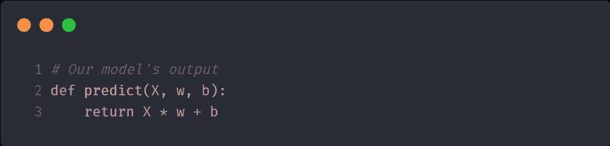

# Python 中梯度下降的恰当介绍

> 原文：<https://levelup.gitconnected.com/a-decent-introduction-to-gradient-descent-in-python-846be2e41592>

[https://pixabay.com/images/id-3501528/](https://pixabay.com/images/id-3501528/)

G 梯度下降是当今机器学习算法中的一个基本元素。我们使用 G *梯度下降*来更新机器学习模型的参数，并试图通过它来优化它。线索是模型会自己更新这些参数。这导致模型做出更好的预测。

在接下来的文章中，我们将深入探讨*梯度下降*，，我将借助一个示例场景来解释它，我们将使用*监督学习*和 Python 来解决它。我们不会为此使用任何 ML 框架，如 PyTorch 或 TensorFlow。完整的源代码可从 [GitHub](https://gist.github.com/larswaechter/c2df0bc9b0f15c64220eb5699b25ddf1) 获得。

# 监督学习

让我们看看[维基百科对监督学习的](https://en.wikipedia.org/wiki/Supervised_learning)定义。

> 监督学习是基于示例输入-输出对学习将输入映射到输出的函数的机器学习任务。

听起来令人困惑，但实际上很简单。假设你想让电脑告诉你一张照片是不是猫的。

在计算机能够告诉你它是不是一只猫之前，你必须教会计算机猫的照片是什么样子的。为此，你向计算机输入许多照片(输入)和照片是否是猫的信息(输出)。这个过程称为*训练阶段*。

当*训练阶段*完成后，你可以向你的电脑展示一张它从未见过的猫的照片，它会告诉你这是不是猫的照片。太神奇了！为此，您的计算机使用它之前刚刚学习的*功能*。

这个猫的例子是一个分类问题。*分类*的任务是预测一个离散的类标签(“猫”和“没有猫”)。另一种类型的问题称为*回归，*这是预测数值或连续值的任务。下面的例子就是这样一个*回归问题*。

# 场景

想象我们是一个游乐园的主人。出于组织的原因，我们想知道或者至少预测第二天的访客数量。幸运的是，我们根据上个季节的天气记录了一些游客数量。

基于天气的游客数量

关于维基百科对监督学习的定义，这些值就是所谓的“示例输入输出对”。温度是“输入”，游客数量是“输出”。

例如，当室外温度为 30 摄氏度时，我们的公园有 620 名游客。这些笔记是我们 ML 模型的训练数据。左栏中的值称为*特性。*右栏中的标签称为*标签*。

最后但并非最不重要的是，注明的数据放在一个美丽的图表。

基于天气的游客数量

回到我们的问题。当我们知道明天将会有多少游客在我们的公园里的时候，我们还能期待看到多少游客呢？如你所见，我们的表格中没有关于 33 C 的访客数量的信息。我们必须预测价值。我们开始吧！

# 线性回归

线性回归帮助我们找到“最佳拟合直线”,我们可以将它放入图表的数据中。当我们发现这条线时，我们可以用它来预测不属于我们记录的其他值，比如当室外温度为 33℃时，明天的访问者数量。

描述我们模型的线性函数

你可能还记得在学校时，一个线性函数被描述为:

线性函数

*   `y`输出(访客)也称为`f(x)`
*   `m`是斜坡
*   `x`是解释变量(天气)
*   `b`是偏见

你可能也很熟悉这个方程的其他一些变量名。使用这个代表我们的线的等式，我们可以预测以后任何给定输入(`x`)的输出(`y`)。

在我们的场景中，当室外温度为 33 摄氏度(`x`)时，我们希望预测访客数量(`y`)，因此是`f(33) = y = m * 33 + b`。

为此，我们必须明智地选择`m`和`b`的值。幸运的是，计算机将为我们做这件事。它们是模型内部的可学习参数。

现在我们知道这个方程是用来预测值的。让我们用 Python 实现这个:

相当于:y = mx + b

注意我们把变量`x`的名字改成了`w`，意思是*权重。*我们的目标是这个`predict()`函数告诉我们任何给定输入变量`X`的输出。为此，我们需要给`w`和`b`赋值。

在我们找到这些值之前，让我们寻找一种方法来衡量我们新的`predict()`函数的质量。一个所谓的*损失函数*可以为我们做到这一点。

# 损失函数

*损失函数*测量模型的预测与其标签的距离。换句话说:它决定了我们的模型有多好。

既然我们使用的是*线性回归*、*、*，我们就不必发明自己的*损失函数*。已经有一个我们可以用了。这个叫做*均方误差* (MSE)。

均方误差

该函数包括四个变量`n`、`i`、`y'`和`y`:

*   `n`是我们拥有的输入输出对的数量(14)
*   `i`是我们正在查看的训练数据中当前对的索引
*   `y'`是从我们的模型中得到的预测值，我们将从一开始声明的`predict()`中得到
*   `y`是我们从训练数据标签中获得的实际输出值

对于来自我们训练数据的每个值，该函数计算标签和来自`predict()`的预测值之间的**差**，并对结果求平方。所有这些结果相加，最后取平均值。

现在我们可以使用*损失函数*来确定我们的模型是好是坏。函数的输出值越小，我们的模型就越好，因为在这种情况下只有很少的错误。另一方面，高值意味着更差的模型。所以，我们的目标是**最小化**的输出，因为我们想要尽可能少的错误。

让我们用 Python 实现 MSE。

Python 中的均方误差

这里我们有四个论点:

*   `X`是一个包含温度的 Numpy 数组(*特性*)
*   `Y`是一个包含访问者数量的 Numpy 数组(*标签*)

`w`和`b`用于`predict()`函数，其输出相当于 MSE 方程中的`y`。因为`X`和`Y`都是 Numpy 数组，所以对每个数组元素执行`(predict(X, w, b) - Y) ** 2`部分。

现在我们能够衡量我们的模型是好是坏。请记住，我们试图为`predict()`中的`w`和`b`找到合适的值。

现在，让我们使用`loss()`函数来测量我们的模型的*损失*，用一些随机数来表示权重`w`。为了简单起见，我们将设置`b = 0`，因此预测只取决于`predict()`中的`w`。

不同重量的损失

你可以看到，当我们设置`w = ~14`时，模型的*损失*最小。这个位置也被称为最小*位置*。当人们看到图表时，他们可以很容易地识别这个点。另一方面，计算机不能这样做。此外，您并不总是知道重量`w`可能接近哪个数字。如果*最小值*在`w = 3000`会怎么样？x 轴上的刻度太小，无法直观地识别最小*值*。

所以我们需要找到一种方法来告诉计算机如何找到这个点。为此，*梯度下降*是正确的选择。

# 梯度下降

*梯度下降*是寻找函数局部*最小值*的算法。在这种情况下，我们试图找到我们的*损失函数*的最小值*，因为在这个位置，模型做出了**最佳预测**。*

在*梯度下降*中，我们在图表中选择一个随机起点。从这个位置开始，我们将朝着最小值*迈出许多步*。但是我们怎么知道该往哪个方向走(向左还是向右)以及一步应该走多远呢？

## 梯度

为此，我们使用所谓的*渐变。**梯度*实际上可以有两种含义，这取决于函数参数的数量。

在这两种情况下，你可以说一个函数的*梯度*是在它的所有**偏导数**的帮助下计算的。不过先说一下*渐变*是什么。

**一个参数:f(x)**

如果我们有一个类似于`f(x) = 2x + 1`的函数，它只依赖于一个参数(`x`)，那么梯度就是图在任意给定点的**陡度**，也称为*斜率*。举个例子吧。

这是随机选择函数`f(x) = 2x + 1`的图形。

f(x) = 2x + 1

让我们计算给定点的*梯度*。为此，我们首先计算关于`x`的偏导数，因为这是我们唯一的参数。

结果是`2`，函数`f(x)`的*斜率*到底是多少。因为它是一个线性函数，所以在任意给定点`x`处*梯度*等于`2`。

如果我们有像`f(x) = (x - 3)^2 + 2`这样的非线性函数呢？在这种情况下，它的图表如下所示。

(x - 3) + 2

你可能会注意到这个图表类似于我们上面的*损失函数*。现在，我们计算图中任意一点的*梯度*。同样，我们首先计算关于`x`的偏导数，因为这是我们唯一的参数。

如你所见，每个点的*斜率*并不相同。这里就看`x`了。假设我们站在图表中的`x = 6`。该点的*坡度*又名*坡度*是多少？在这种情况下是`2*(6–3) = 6`。红线是在给定点`x`处`6`的*斜率*的切线。

x = 6 时的梯度

再比如。假设我们在同一张图中的`x = 4`处。这里的*坡度*又名*坡度*为`2*(4-3) = 2`。

x = 4 时的梯度

这里重要的是*梯度* **越来越减少**越来越接近图表的*最小值*。在我们的示例点比较上面两幅图的*斜率*。第二个具有较小的*斜率*，因为该点更接近最小*斜率*。

在图形*最小值*处，其中`x = 3`处，G *半径*为`0`。在这个位置根本没有*斜率*，如红色切线所示。

x = 3 处的坡度= >无坡度

因此，一般来说，我们可以说*梯度*告诉我们是否远离图表的最小值*或*。*坡度*越小，我们就越接近*最小值*。

好吧，但这对我们有什么帮助？借助于*梯度*，我们可以**最小化**我们的*损失函数*的输出。这就是我们的目标，我们希望将损失降到最低。

假设上面的图表是我们损失函数的过程，其中`y`是*损失*和`x`是*权重。*我们想要找到`x`的值，其中`y`是最小的，因为`y`是*损失*、*、*，并且我们想要在我们的模型中有一个*最小损失*来做出更好的预测。在上面的场景中，那将是在位置`x = 3`。

但是我们如何找到这个点`x`？这就是*梯度下降*算法发挥作用的地方。

## 梯度下降(续)

在*梯度下降*中，我们将`x`(权重)设置为随机初始值。假设我们设置了`x = 6`。那是我们的起点。实际上，这个值可能是`0`。我们的功能同上。

起点 x = 6

从那里开始，我们计算给定起始位置`x`的*梯度*。之后，我们根据*渐变的*大小向左迈一小步(因为我们想达到最小值)。

我们如何知道我们是需要向左移动还是向右移动？在这种情况下，*坡度*为**正**，因为在这个位置有一个正斜率。所以，我们知道我们必须向左走。如果我们在一个更靠左的地方，我们必须向右走，因为那里的*斜率*是**负**。

正斜率与负斜率

让我们回到下降。现在我们到达了图表上的一个新的点，我们再次计算*的*梯度*。然后，我们又向左走了一步。然而，这一次，我们采取的步骤比前一步稍微**小**，因为*梯度*随着我们接近*最小值*而减小。*

我们更接近最小值

我们重复这个过程多次，直到我们达到或者至少接近图表的最小值*。*

**

*我们几乎达到了最小值*

*这里重要的是，每走一步，步长就变得越来越小。这是因为我们的步长取决于给定位置的*梯度*(斜率)的大小，我们越接近图表的*最小值*，梯度就越小。正如你在上面看到的。*

*实际上，步长不仅仅取决于*渐变的*大小。在我们的起始位置(`x = 6`)处，*斜率*也是`6`。现在想象我们向左走`6`步。在这种情况下，我们会错过图表的最小值*和结束时太左。这就是为什么我们必须走一定比例的*坡度*。**

*这个比例也叫*学习率。*在我们的*梯度下降*的每次迭代期间(当我们采取单步时)，算法将*学习率*乘以*梯度*。由此产生的产品称为*渐变步长:* `gradient_step = lr * gradient`。这是我们向左迈出的实际一步。*

**学习率*是我们自己设定的值。我们可以用`0.001`作为例子。过高的*学习率*可能会导致迈出过大的步伐，我们可能会错过*最小值*。如果*学习率*太小，我们往往无法在给定的迭代次数内达到最小*学习率*。*

*然后，从我们当前的*权重*中减去每次迭代中得到的*梯度步长*，即`x`值:`x = x - gradient_step`。这样我们的*重量*就一步步接近目标值:即*损失* ( `y`)最小的值。*

*如果`gradient_step`为负是因为*斜率*为负，我们**将**加上`gradient_step`，因为减和减都是正，并相应向右移动。*

*现在让我们把这些都放在一起，用 Python 实现它。请记住，图形的`x`值在我们的代码库中表示为*权重* `w`。*

**

*Python 中的梯度下降*

*正如我前面提到的，梯度*是利用函数对每个参数的偏导数计算出来的。在这种情况下，我们的函数是*损失函数* (MSE)。目前我们只处理一个参数`w`。所以，我们计算关于`w`的偏导数。你可以在`gradient()`中看到结果。这篇文章可能会让你更好地理解 MSE 的偏导数是如何计算的。**

*因为到目前为止我们只处理一个参数，所以当我们在`gradient()`函数中调用`predict()`时，我们为`b`传递`0`。我们现在就解决这个问题。*

***两个参数:f(x，y)***

*到目前为止，我们假设我们的模型只依赖于一个参数`x`，也称为*权重* `w` *。但事实并非如此。如果我们看一下`predict()`函数，我们可以看到它对于给定值`X`的输出取决于权重`w`和偏差`b`。所以我们有两个参数。**

**

*“X”的输出实际上取决于“w”和“b”*

*这意味着，上面的图表不再正确。*

**

*这里的输出仅取决于一个参数= >错误*

*这里的`y`是我们的*损失*和`x`重量(`w`)。现在，我们需要偏差`b`的另一个维度，因为我们模型的*损失*取决于我们将为`w` **和** `b`设置的值。*

*这意味着我们的*损失函数*有**三个轴**，并且可能看起来像下面这样，带有一些*权重*和*偏差*的随机值。绿色十字表示图表的最小值*。**

****

**损失函数包括“w”和“b”**

**在我们的场景中，我们有一个这样的函数，它取决于两个输入参数`x,y`也就是`w,b`，梯度*是一个**向量**，它可以被解释为“最快增长的方向和速率”。换句话说:它显示了从我们图表中的给定位置开始的最陡上升方向。***

**想象你站在一座山的山谷里，用手指着山顶。在这种情况下，你的手指是*渐变。*它指向最陡的斜坡。**

**与这个方向相反的是最陡下降的方向。如果我们沿着这个方向走，会发生什么？我们到达图的最小值*。对于给定的`w`和`b`，我们的*损失*最小的点。使用这个位置的坐标作为*重量*和*偏差*，我们的模型将做出最佳预测。***

**当函数有两个参数时我们如何计算*梯度*？就像上面一样，我们计算**相对于`x`(重量)的偏导数**。此外，我们对`y`(偏置)也做了同样的处理。**

**让我们用 Python 来实现它。我们可以考虑上面对`w`计算的偏导数。而且，我们在调用`predict()`时不再传递`0`作为参数，而是传递`b`。**

****

**“loss()”相对于“w”和“b”的偏导数**

**请记住，*渐变*是一个**矢量**。在这种情况下，向量有两个元素。这就是为什么我们从`gradient()`返回两个值。**

**由于从现在开始我们有两个*渐变*，我们必须改变我们的`train()`功能。值`w`和`b`都必须在每次迭代后更新。**

****

**Python 中的梯度下降**

# **预测**

**最后，我们有了从头回答问题所需的一切。这是我们的代码库:**

****

**嗯，问题是什么来着？**

> **当我们知道明天会有 33 摄氏度的时候，我们的公园里会有多少游客呢？**

**我们来回答这个。为此，我们采取以下措施:**

1.  **读取训练数据**
2.  **训练模型**
3.  **做出预测**
4.  **输出**

****

**做出预测**

**当我们的模型完成训练后，它将为`w`和`b`设置适当的值。现在我们可以使用这两个参数来预测`x = 33`的输出。我们简单地调用`predict()`并传入相应的参数。**

**当我们运行 Python 程序并预测值时，我们将获得以下关于*权重*、*偏差*和预测的输出:**

****

**33 摄氏度的预测**

**如你所见，我们预计第二天会有 **~543 名访客**。我们还可以预测任何一天的访客数量。我们只需改变调用`predict()`时传入的`X`参数(度)。**

**让我们看看在训练阶段的每次迭代之后，模型是如何改进的。到底有没有改善？**

****

**损失曲线= >每次迭代后的损失**

**如你所见，开始时*损失*非常高。这就是模型最差但改进最快的地方。后来每一次迭代后改善越来越少。最后，由于*梯度*下降，损失*下降较慢。***

**还记得一开始描述我们模型的线性函数吗？这个函数现在看起来如下:**

****

**代表我们模型的线性函数**

**它用于预测值。这是我们机器学习模型的核心。这里很酷的一点是，在训练数据的帮助下，机器从一开始就学会了为`x`和`y`设置适当的值。神奇！**

**就是这样！我希望这篇文章能帮助你更好地理解*梯度下降*。您可以在 [GitHub](https://gist.github.com/larswaechter/c2df0bc9b0f15c64220eb5699b25ddf1) 找到完整的源代码，以及一些额外的函数来创建本文中的图表。**

**这篇文章最初发表在我的博客上。看一看。**

** [## Python 中梯度下降的恰当介绍

### 2021 年 2 月 22 日梯度下降是当今机器学习算法中的一个基本元素。我们使用渐变…

拉斯瓦切特.德夫](https://larswaechter.dev/blog/gradient-descent-introduction-python/)**