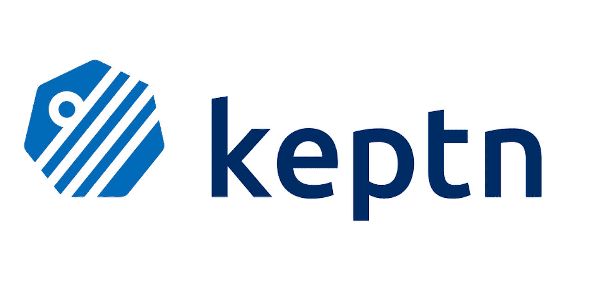

# 自动化多阶段交付的声明性方法

> 原文：<https://levelup.gitconnected.com/a-declarative-approach-towards-automating-multi-stage-delivery-aa2470875ec4>

将应用程序从代码阶段投入生产是一个漫长的过程，如果处理不当，该过程的很大一部分可能需要大量的人工干预。幸运的是，如果您在 Kubernetes 上托管这个应用程序，您可以利用一个令人难以置信的工具来自动化几乎所有的事情。

# 它试图解决什么？

一个典型的 Kubernetes 应用程序的 CI/CD 过程从一个构建开始，该构建对应用程序代码执行一些初步测试，然后构建一个 docker 映像，将其推送到一个注册表，然后将其部署到 dev。

然后，该应用程序在开发环境中进行一系列功能测试，然后转移到试运行环境，在那里进行多轮性能测试。

整个过程可能涉及许多手动过程，如检查测试结果、手动评估测试结果，甚至管理环境的推广。

此外，每个流程都需要自己的一套工具，如打包工具(maven、npm、gradle、…)、自动化测试工具(selenium、jmeter、…)、容器注册中心(dockerhub、jfrog、nexus、…)、部署工具(helm、kubectl、…)。您可能还需要一些脚本化的定制逻辑。当不同的应用程序使用不同版本的工具或者一起使用不同的工具时，事情会变得更加复杂。在这种情况下，每个团队都需要自己的管道，随着时间的推移，这很难维护。

而且这还不止于此。当应用程序进入生产时，它需要监控、可观察性和支持以防出现问题。整个周期在时间和人力方面都付出了巨大的代价。Keptn(发音为 captain)试图在一个工具中解决所有问题。

# 它是如何工作的？

[Keptn](https://keptn.sh/) 使用可插拔工具和服务创建可重用管道，以创建端到端部署(和维护)流程。

简单的声明性流程可以以 Kubernetes 资源的形式定义，以构建、测试和部署应用程序。

## 事件驱动架构

来源:https://keptn.sh/docs/concepts/architecture/

Keptn 是事件驱动的，这意味着它使用定义良好的 CloudEvents 来处理持续交付和运营自动化过程中可能发生的几乎所有事情。不同的小服务注册这些事件，将事件转换成 API 调用。

有一个大的列表[列出了可以直接插入的可用服务](https://keptn.sh/docs/integrations/)。如果您首选的工具不在列表中，可以选择使用 webhooks 和 Kubernetes 作业创建定制服务。

这种方法使得添加(订阅事件)和删除(取消订阅事件)工具变得很容易；流水线中不需要硬编码。这也意味着一个构建不会被另一个阻塞。它可以为相应的服务发送一个事件以进行操作，并在接收到“完成”事件时进行报告；不需要持有资源和等待。

## 声明流程

要声明一个流程，只需创建一个船厂类型的资源(其 CRD 将作为 Keptn 部署的一部分安装)。它可以包含诸如阶段、测试、[部署策略](https://keptn.sh/docs/0.9.x/manage/shipyard/#deployment)(如直接、蓝绿和用户管理)、阶段间测试评估、质量关等细节。

你可以在这里找到船厂文件[的语法](https://keptn.sh/docs/0.14.x/manage/shipyard/)。

造船厂文件允许自定义，如

*   手动或自动批准继续进行
*   质量关口和测试评估(在后面的章节中讨论)
*   根据条件转移生产流量
*   阶段失败时的回滚应用程序
*   借助于`triggeredOn`属性的复杂序列

## 实施质量关

Keptn 不需要任何额外的工具(或按照以下术语的服务)来实施质量检查。它带有内置的[灯塔服务](https://pkg.go.dev/github.com/keptn/keptn/lighthouse-service#section-readme)。

要使用它，您需要声明两件事

*   **服务水平指标(SLI)**
    需要评估的性能和安全指标
*   **服务水平目标(SLO)**
    评估 SLIs 中定义的指标

SLOs 将 sli 与绝对值或以前的版本指标进行比较，以生成并汇总应用程序性能和运行状况的总分。

# 这并没有结束

Keptn 不仅仅停留在部署上，它在维护方面更进一步

## 自动化操作

在生产失败/恶化的情况下，Keptn 允许您定义一组补救步骤。它以 Kubernetes 补救资源的形式定义，其中包含一系列可用于补救生产故障的步骤，如扩展应用程序或关闭功能标志。

执行补救步骤后，它将评估 SLO(之前定义的),以检查性能是否有所提高，或者是否需要下一组步骤。

如果没有补救措施证明是有帮助的，可以将问题上报，并通知相应的团队。

## 监控和警报

基于配置的 SLIs(在前面的步骤中讨论过)，Keptn 配置收集指标的抓取端点。

此外，基于配置的 SLO，如果任何评估失败，则可以配置警报。

# 离别赠言

作为一名 DevOps 工程师，我可以有把握地得出结论，Keptn 可以让我的生活更轻松。Keptn 拥有一个精心设计的架构，在保持简单的同时提供了无数的选项和定制。

Keptn 于 2020 年 6 月 23 日被 CNCF 接受，并在撰写本文时处于沙盒项目的成熟水平。要了解实际情况，请观看这个 [CNCF 点播网络研讨会:利用 Keptn](https://www.cncf.io/online-programs/cncf-on-demand-webinar-introduction-to-keptn/) 实现从“Hello World”到企业规模的自动化 SRE