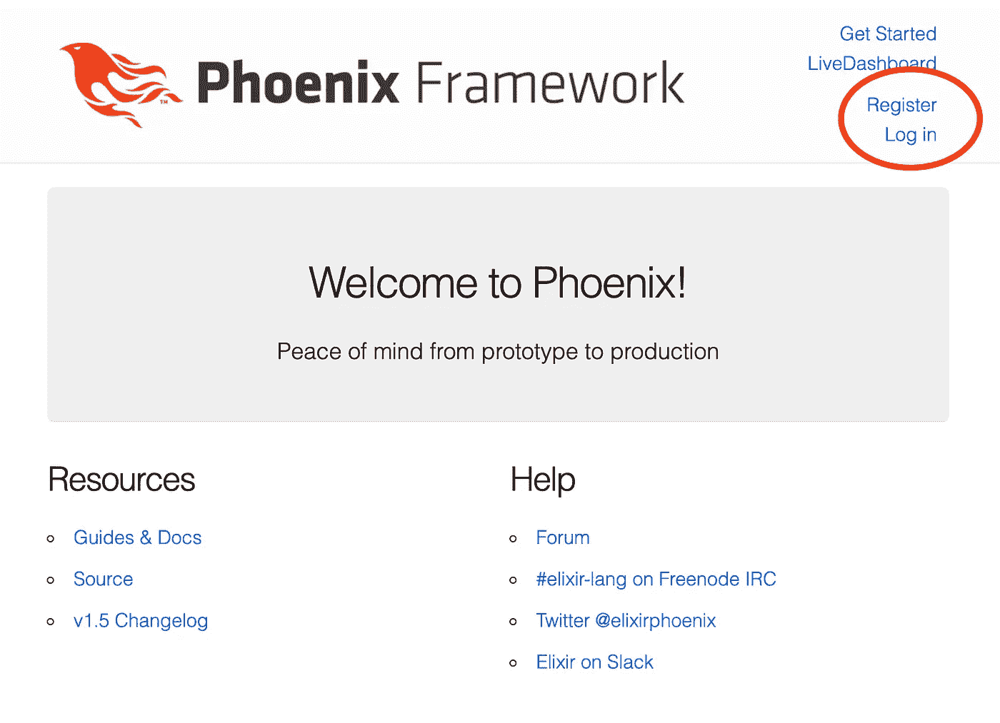
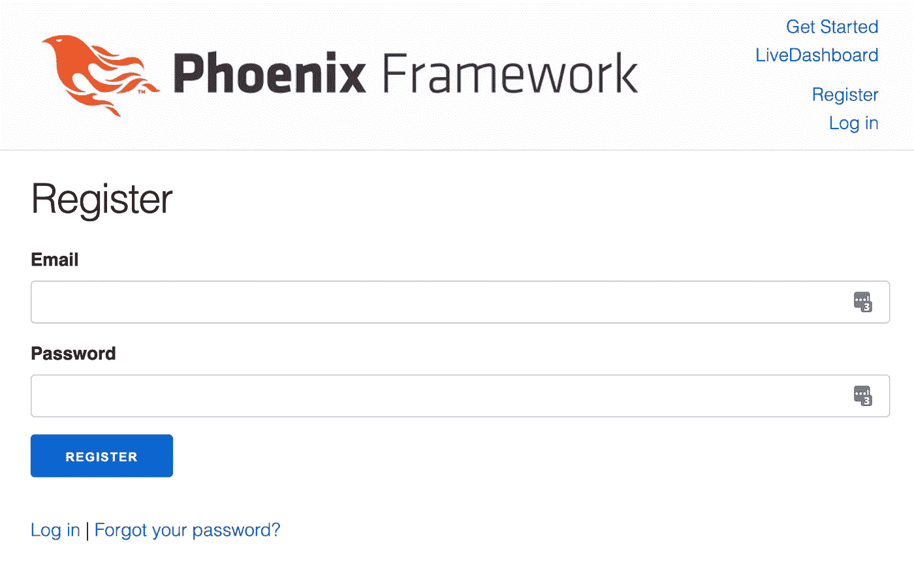
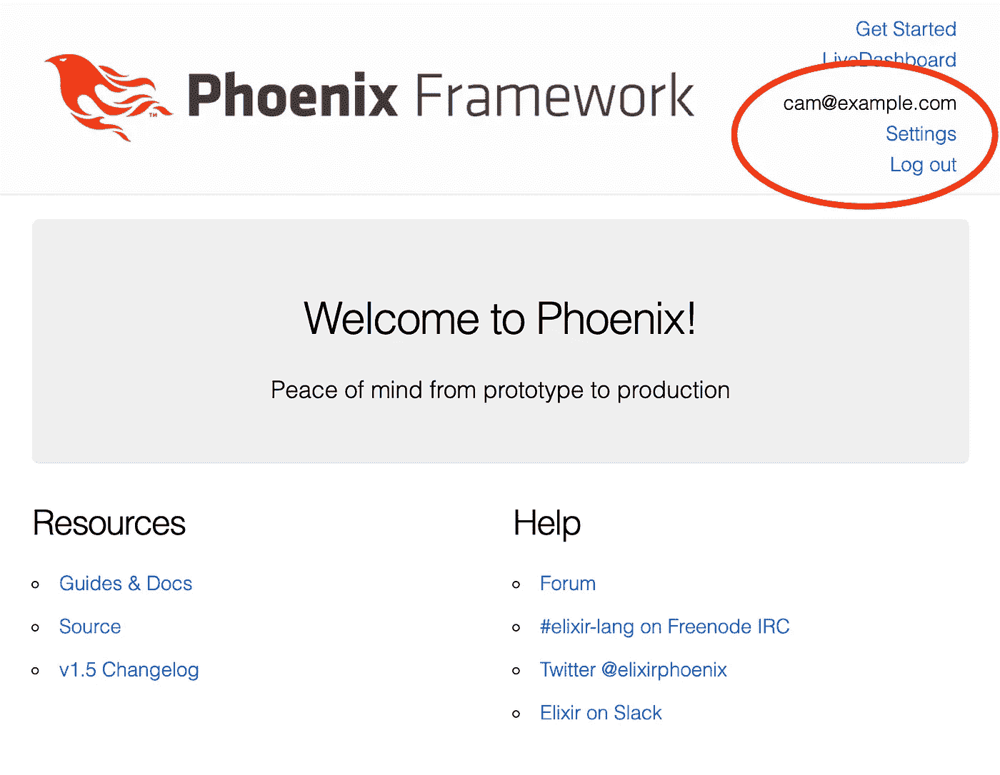
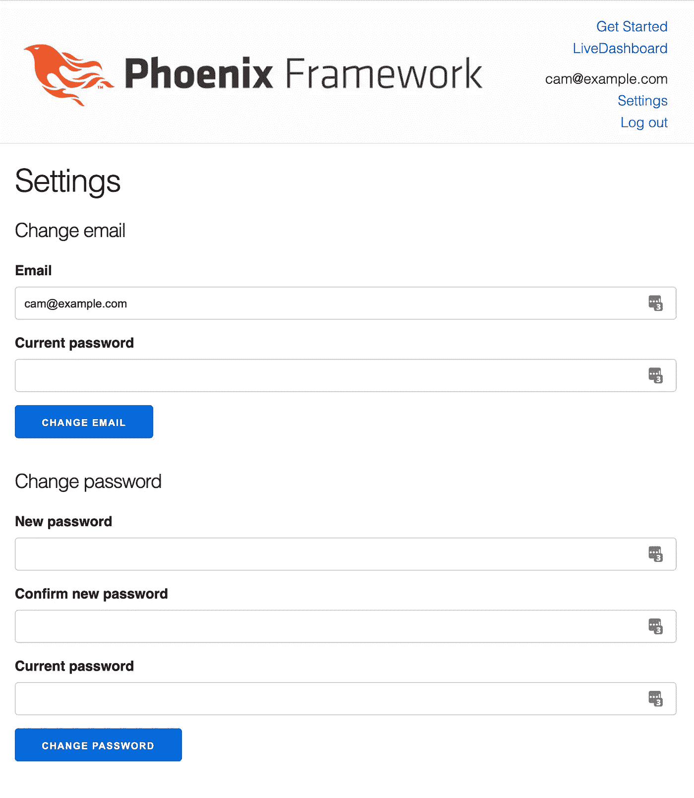

# 使用 phx.gen.auth 深入研究 Elixir Phoenix 中的身份验证

> 原文：<https://levelup.gitconnected.com/a-deep-dive-into-authentication-in-elixir-phoenix-with-phx-gen-auth-9686afecf8bd>


卡伦·艾姆斯利在 [Unsplash](https://unsplash.com/s/photos/mountains?utm_source=unsplash&utm_medium=referral&utm_content=creditCopyText) 上的照片

对于 Elixir，我发现很多时候我在使用一个库做一些事情和滚动自己的解决方案之间左右为难。很多时候，Elixir 本身的语言和 Phoenix 框架的简单性非常适合于实现您自己的解决方案，而不是依赖于第三方解决方案。这与不久前在 Ruby 工作时的情况大相径庭，在那时，使用 gem 做任何事情都几乎是一种下意识的反应。你需要附件？使用[回形针](https://github.com/thoughtbot/paperclip)。授权？使用[康康康](https://github.com/CanCanCommunity/cancancan)。认证？使用[设计](https://github.com/heartcombo/devise)。

有时候，在 Elixir 中，没有可以满足您需求的包，或者它们已经过时了。我在过去遇到过几次这种情况，当我能够为一个特定的用例实现自己的直截了当的解决方案时，我感到惊喜。这并不是说优秀的套餐不存在长生不老药。他们确实如此。 [Ecto](https://hexdocs.pm/ecto/Ecto.html) 绝对惊艳。苦艾酒太棒了。还有很多其他的也很棒。我想说的是，在《长生不老药》里做复杂的事情出奇的容易。

仙丹和凤凰的认证没什么不同。在我之前参与的项目中，我们用一些 [Guardian](https://github.com/ueberauth/guardian) 或第三方身份提供商拼凑了自己的身份认证解决方案。在每一种情况下，解决方案都工作得很好，但是我们最终不得不自己写一堆代码。代码本身并不特别复杂，但是如果我们可以使用像 devise 这样的东西，它会更加复杂。那是几年前的事了，从那以后，Elixir 的认证领域有了一些发展，也许最引人注目的是 [Pow](https://powauth.com/) 。电费单本身是一个健壮、模块化和可扩展的认证和用户管理解决方案。我曾经在一些玩具项目中使用过 Pow，它工作得非常好。它做了很多，实际上感觉类似于使用 devise 的所有电池。虽然 Pow 和 devise 都很容易使用，但它们的背后相当复杂。

当我不完全理解我的应用程序的核心方面时，我会有点不舒服。虽然我可以花时间钻研 Pow 的内部工作，但我更愿意花时间来确保我为我的用户实现了正确的解决方案。几个月前，我听说了一种针对 Elixir 的新身份验证解决方案，它也有同样的想法。这个解决方案起源于何塞·瓦里姆在凤凰城回购协议上的[拉请求。José在这篇博客文章](https://github.com/dashbitco/mix_phx_gen_auth_demo/pull/1)中描述了他拉请求[背后的动机，但是，从本质上来说，它是为了展示如何将一个简单、透明和直接的身份验证解决方案添加到一个具有最小外部依赖性的准系统 Phoenix 应用程序中，或者用他的话说:](https://dashbit.co/blog/a-new-authentication-solution-for-phoenix)

> 我意识到最好的认证框架是*根本没有认证框架*。何塞·瓦里姆

从那以后， [Aaron Renner](https://github.com/aaronrenner) 把 José原来的 PR 变成了一个包， [phx.gen.auth](https://github.com/aaronrenner/phx_gen_auth) 。

与 devise 和 Pow 不同，phx.gen.auth 是一个代码生成器。phx.gen.auth 不是将模型的一部分隐藏在库的内部，而是生成一些基本文件，任何在 Phoenix 工作过的人都会熟悉这些文件。

让我们试一试，看看它会产生什么。

要开始，您需要一个 Phoenix 应用程序。只要在系统上安装了 Elixir 和 Erlang，就可以通过运行以下命令创建一个新的 Phoenix 应用程序:

```
$ mix phx.new <your_app_name>
```

或者，如果你正在使用`asdf`，你可以按照这里关于[如何用 asdf](https://carlyleec.medium.com/create-an-elixir-phoenix-app-with-asdf-e918649b4d58) 创建仙丹凤凰 app 的说明[。](https://carlyleec.medium.com/create-an-elixir-phoenix-app-with-asdf-e918649b4d58)

在设置完 Phoenix 应用程序后，您可以通过将 phx.gen.auth 作为依赖项添加到您的`mix.exs`中，开始向您的应用程序添加身份验证。

```
def deps do
  [
    {:phx_gen_auth, "~> 0.6", only: [:dev], runtime: false},
    ...
  ]
end
```

然后安装它，并重新编译依赖项。

```
$ mix deps.get
$ mix deps.compile
```

现在我们可以用下面的命令运行生成器了:

```
$ mix phx.gen.auth Accounts User users
```

在这里，我们告诉生成器，我们希望将我们的认证上下文命名为`Accounts`，我们的用户模式命名为`User`，我们的用户表命名为`users`。

这会生成一些文件，并为我们更新一些现有的代码。首先，它添加了一个新的依赖项`bcrypt_elixir`。因此，让我们在做其他事情之前先安装它:

```
$ mix deps.get
```

太好了。接下来，它添加了一个迁移来创建我们的`users`表和`users_tokens`表。让我们运行迁移来创建这些表。如果您还没有创建数据库，请确保首先运行`mix ecto create`，并且不要忘记确保您已经在`config/dev.exs`和`config/test.exs`中为您的本地数据库设置更新了数据库配置😉。要迁移数据库，请运行:

```
$ mix ecto.migrate
```

# 查看生成的 UI

生成器创建控制器和模板以及认证逻辑。让我们来看看我们用发电机得到了什么。您可以使用以下命令运行服务器:

```
$ mix phx.server
```

如果你在一个新的 Phoenix 应用上运行生成器，你的主页应该是这样的:



请注意，在页面顶部，我们有一些到`Register`和`Log in`的链接。我们可以点击`Register`创建一个新用户。



太棒了。一张登记表！正是我一直想要的。填完表格并注册后，看看你的控制台。您应该会看到如下所示的消息:

```
==============================Hi [cam@example.com](mailto:cam@example.com),You can confirm your account by visiting the URL below:[http://localhost:4000/users/confirm/2VKEJZ8L1Ms2YTZYukUplCK_lLw99RX-kcWer04f0bs](http://localhost:4000/users/confirm/2VKEJZ8L1Ms2YTZYukUplCK_lLw99RX-kcWer04f0bs)If you didn't create an account with us, please ignore this.==============================
```

那是用户确认信息。在安装了像 [Bamboo](https://github.com/thoughtbot/bamboo) 这样的电子邮件服务后，你可以把它作为电子邮件发送给你的用户。请注意确认页面 URL 中的标记。回到网页，你应该也注意到我们在标题、`Settings`和`Log Out`链接中有了一些新的选项。



如果我们点击`Settings`，我们可以选择更改我们的电子邮件或密码。



好的，很酷。这是一个简单但功能强大的用户界面。接下来，我们将更详细地查看下面的代码，以理解 phx.gen.auth 实际上是如何实现认证逻辑的。

# 到代码中

为了概述 phx.gen.auth 提供的功能，让我们看一下我们的路由器文件(`lib/<app_name_web>/router.ex`)。

它生成了许多路线和相应的控制器动作。控制器提供了一个很好的关注点分离，我们将在下面依次查看每一个是如何工作的，但是，在我们继续之前，值得指出的是，生成器已经在我们的路由器文件中创建了一些基于路由的授权。注意插头；`require_authenticated_user`和`redirect_if_user_is_authenticated`。这些都是从`UserAuth`模块导入的，该模块提供了一些使用会话和`%Conn{}`的实用函数。我们将在下面更详细地查看`UserAuth`,但是这里值得注意的是，如果用户已经通过身份验证，某些路由(如注册和登录路由)将如何重定向。有道理，对吧？其他途径，如更改用户的设置，需要对用户进行身份验证。酷吗？好吧，继续。

# 用户注册

如果我们看一下我们的`UserRegistrationController`模块，你可以看到它公开了两个动作:`new/2`和一个`create/2`。

## `UserRegistrationController.`新/2

`new/2`动作非常简单。它接受一个`%Conn{}`，从`Accounts`上下文中获得一个带有空`%User{}`结构的注册变更集，并在`new.html`模板中呈现注册表单。没有什么太令人惊讶的。

## `UserRegistrationController.`创建/2

`create/2`动作取注册表中提交的`%Conn{}`和`user_params`并传递给`Accounts.register_user/1`。让我们看看`Accounts.register_user/1`。

它用一个空的`%User{}`结构和从注册表单提交的参数创建一个注册变更集。然后，它将一个新的用户记录插入到数据库的`users`表中。到目前为止一切顺利。基本的凤凰元素，对吧？在我们继续之前，让我们看一下`User`模式文件，并检查用户是如何定义的，以及`User.registration_changeset/3`函数在做什么。

我们可以看到,`User`模式是用一个虚拟密码字段定义的，这意味着`%User{}`结构上的`password`字段是一个派生字段，它不会持久存储在数据库中。然而，`hashed_password`是持久的。除此之外，我们还有一个`email`字段和一个`confirmed_at`字段。关于模式最后要指出的一点是，由于`password`字段存储在`%User{}`结构上，至少在内存中，我们需要小心不要意外泄露密码。为了在某种程度上降低风险，`@derive`属性用于确保在`%User{}`上执行`Inspect`协议时，例如当您调用`IO.inspect(%User{})`时，密码不会泄露。

`registration_changeset/3`函数接受一个`%User{}`结构、一些属性的映射和一个选项的关键字列表。这些属性应该如下所示:

```
%{"email" => "me@example.com", "password" => "some_password"}
```

该函数将属性转换成一个变更集，然后通过`validate_email/1`和`validate_password/2`管道传输该变更集。这里需要注意的一件很酷的事情是`opts`关键字列表是如何传递给`validate_password/2`的。`opts`关键字列表可以*可选*包含`[:hash_password, false]`。这防止了`validate_password/2`将`hashed_password`添加到变更集中。这种灵活性对于使用 LiveView 进行动态表单验证非常有用，并且不需要两个单独的变更集函数。phx.gen.auth 生成器实际上并不生成任何 LiveView 代码，但它是一些很好的预见。如果`[:hash_password, false]`不在`opts`中，那么`maybe_hash_password/2`将把散列密码作为变更集上的一个变更。 [Bcrypt](https://hexdocs.pm/bcrypt_elixir/Bcrypt.html) 库的`hash_pwd_salt/1`被用来处理随机生成的 salt 的散列。这里还要注意的一点是，`confirmed_at`字段没有被修改。下面关于用户确认的部分将更多地处理这个字段，但是这个字段确实给了你为已确认和未确认的用户实现定制体验的机会。

酷，好的。但是，我们实际上还没有完成控制器中的`create/2`功能。如果对`Accounts.register_user/2`的调用由于某种原因失败，可能是数据库中已经存在一封电子邮件或者密码不够长，那么将返回一个包含变更集的`:error`元组。在这种情况下，变更集随后被传递回视图，以便可以在模板中呈现错误。如果对`Accounts.register_user/2`的调用成功，那么将返回一个带有`%User{}`结构的`:ok`元组。接下来会发生两件事。首先，调用`Accounts.deliver_user_confirmation_instructions/2`，然后用户通过调用`UserAuth.log_in_user/3`实际登录。

让我们先看看`Accounts.deliver_user_confirmation_instructions/2`。

该功能有`%User{}`和`confirmation_url_fun`功能。在这种情况下，该函数是一个围绕`Routes`路径函数的匿名函数，该函数只返回确认页面的路径，该路径是用传递给匿名函数的任何内容参数化的，在这种情况下，该路径将是由`UserToken.build_email_token/2`生成的令牌。😅听起来比实际情况要复杂得多。无论如何，这个函数第一次使用了我们所看到的`UserToken`模式。简而言之，让我们看看`UserToken`模式是如何定义的，以及用户确认令牌是如何生成的。

`UserToken`模式包含一个`token`、一个`context`和`sent_to`字段。`token`字段存储原始的或散列的随机生成的二进制令牌。`context`字段可以包含以下任意一个字符串:`["confirm", "reset_password", "session"]`或基于用户电子邮件的动态字符串，如`"change:me@example.com"`。最后，`sent_to`为电子邮箱地址。函数`build_email_token/2`获取一个用户和一个上下文，在这种情况下是`"confirm"`，并返回一个元组，第一项是 base64 URL 编码的令牌和包含该令牌的哈希版本的`%UserToken{}`结构。令牌的哈希版本将保存在`user_tokens`表中的数据库中，而 base64 URL 编码版本将包含在发送给用户的确认页面 URL 中。

如果我们跳回`Accounts.deliver_user_confirmation_instructions/2`，我们可以看到新创建的`%UserToken{}`被插入到数据库中，base64 URL 编码的令牌被传递给`confirmation_url_fun`函数，其结果被传递给`UserNotifier.deliver_confirmation_instructions/2`。生成的`deliver_confirmation_instructions/2`函数在这一点上没有做太多事情。它只是向控制台记录一条消息，但是`UserNotifier`中的`deliver/2`函数可以用来调用 [Bamboo](https://hexdocs.pm/bamboo/readme.html#delivering-emails-in-the-background) 的一些实现。

最后，为了在用户注册控制器中实际完成`create/2`动作，用户登录并通过调用`UserAuth.log_in_user/3`创建一个新会话。我将在下面详细介绍这一点。

# 用户会话

`UserSessionController`模块通过创建和销毁会话来处理用户登录和退出应用程序。会话控制器公开了三个动作:`new/2`、`create/2`和`delete/2`。

## `UserSessionController.`新/2

`new/2`动作除了在`new.html`模板中呈现签到表单之外什么也不做。请注意，我们没有使用变更集来创建表单，而是在为`%Conn{}`分配的赋值中传递了一个`:error_message`。

## `UserSessionController.`创建/2

`create/2`动作从登录表单中获取`user_params`，并试图通过调用`Accounts.get_user_by_email_and_password/2`来获得一个用户。如果找不到用户，`new.html`模板会显示一条故意含糊的一般性错误消息。如果找到用户，则通过调用`UserAuth.log_in_user/3`登录。在我们看这个函数之前，让我们看看如何在`Accounts.get_user_by_email_and_password/2`中获取用户。

该函数通过用户的电子邮件在数据库中查找用户，然后通过调用`User.valid_password?/2`检查用户的密码是否有效。

在`User.valid_password?/2`中，通过调用`Bcrypt.verify_pass/2`来验证密码。注意，如果没有找到用户，则调用`Bcrypt.no_user_verify/0`。这是防止计时攻击的重要防御机制，计时攻击测量身份验证检查所需的时间，以确定用户是否存在。

好，跳回`create/2`，进入`UserAuth.log_in_user/3`。

再来看`Account.generate_user_session_token/1`和`UserToken.build_session_token/1`。

这与我们之前看到的确认令牌非常相似，其中为令牌生成了一个随机的二进制文件。但是，这次在将令牌插入数据库之前，不对其进行哈希处理。

好，回到`UserAuth.log_in_user/1`，用`%Conn{}`创建一个新的会话，会话令牌被添加到会话的 assigns 中。请注意，还使用会话令牌将一个`:live_socket_id`分配给会话的分配者，以便在注销时可以断开 LiveView 套接字。同样值得注意的是，如果用户单击登录表单上的`:remember_me`复选框，令牌也会被签名到一个“记住我”cookie 中。最后，`login_in_user/1`将用户重定向到`user_return_to`或`signed_in_path/1`。`user_return_to`从哪里来？

还记得在`Router`中用于保护认证路由的插头吗？其中之一就是`UserAuth.require_authenticated_user/2`。

如果用户没有通过身份验证，它会将他们重定向到登录页面，并将他们的当前路径作为`:user_return_to`添加到会话中。这样，我们可以让用户返回到他们在通过身份验证之前试图访问的页面。很好。在我们继续之前还有一件事。您可能会想，“好吧，这就是某人登录的方式，但是我们如何检查某人是否已经登录，以及他们的会话令牌是否有效？”。很高兴你问了。在`Router`中使用了另一个插头，我之前没有提到。如果你看一下`Router`里的`browser`管道，你会看到发电机增加了一个`fetch_current_user`插头。这个插头被我们所有的路线使用，并且再次从`UserAuth`模块导入。

该函数首先尝试从会话分配中的`:user_token`或签名的“记住我”cookie 中的`%Conn{}`获取用户令牌。如果它确实找到了一个令牌，那么`:current_user`就会得到`%Conn{}'s`上的`nil`所分配的集合。否则，如果它确实找到了一个令牌，它将尝试通过调用`Accounts.get_user_by_session_token/1`和随后的`User.verify_session_token_query/1`从该令牌获取一个用户。让我们看看那些函数。

查询从`user_tokens`表中选择`token`匹配给定令牌且`context`为`"session"`的地方，然后连接`users`表，最终返回与用户令牌相关联的用户。对于用户，`fetch_current_user/2`将`current_user`添加到`%Conn{}'s`分配中。这样，管道中稍后使用`%Conn{}`的任何东西都可以访问当前用户。好了，这就是创建会话的方法，让我们看看如何使用`delete/2`操作来销毁会话。

## `UserSessionController.`删除/2

`delete/2`动作调用`UserAuth.log_out_user/1`来破坏用户的会话。

从会话中检索当前令牌。为了清除任何会话令牌，在调用`Accounts.delete_session_token/1`时删除`user_tokens`表中包含会话令牌的所有行。删除会话令牌后，它会为任何 LiveView 套接字连接广播一条`"disconnect"`消息。最后，它清除会话，删除 remember me cookie，并将用户重定向到`"/"`。完成后，用户将被注销，并需要重新认证才能访问任何`require_authenticated_user`的路线。

这就结束了会话操作。希望现在您对 phx.gen.auth 如何处理用户进出应用程序有了一些了解。还记得在上面的注册部分，我谈到了发送给用户(或登录到控制台)的确认消息吗？下一节将讨论当用户点击确认消息中的确认链接时会发生什么。

# 用户确认

`UserConfirmationController`模块处理新用户的确认。它公开了三个动作:`new/2`、`create/2`和`confirm/2`。

## UserConfirmationController.new/2

`new/2`动作呈现一个页面，供用户重新发送确认电子邮件。表单发布到`create/2`动作。

## UserConfirmationController.create/2

`create/2`动作和我们在`UserRegistrationController.create/2`中看到的差不多。通过用户的电子邮件地址从数据库中查找用户，并像注册时一样设置新的确认消息。

## 用户确认控制器.确认/2

当用户点击确认消息中的确认链接时，他们将被定向到由`UserConfirmationController.confirm/2`动作处理的路径`users/confirm/:token`。`confirm/2`动作获取 URL 中参数化的令牌，并试图通过调用`Accounts.confirm_user/1`将用户标记为已确认。再来看看`Accounts.confirm_user/1`和后续的`UserToken.verify_email_token_query/2`。

`verify_email_token_query`比我们之前看到的`verify_session_token_query`要复杂一点。在这个查询中，需要对给定的令牌进行 URL 解码，然后进行哈希运算，然后才能根据数据库中实际存储的内容对其进行查询。如果查询运行时没有返回用户，则返回一个`:error`；然而，如果找到一个用户，那么它将被传递给`confirm_user_multi/2`事务，该事务将更新用户的`:confirmed_at`字段，并从`user_tokens`表中删除与该用户相关的任何确认行。回到`confirm/2`，不管确认的结果如何，用户都将被重定向到`"/"`；但是，如果确认成功，将会显示一条适当的闪烁消息。如果用户已经得到确认，则不会显示任何消息。最后，如果出现错误，会显示相应的错误提示信息。

这就是用户确认的工作原理。在下一节中，我们将了解 phx.gen.auth 如何为无法登录的用户重置密码。

# 用户密码重置

`UserResetPasswordController`模块处理未认证用户的密码重置。它公开了四个动作:`new/2`、`create/2`、`edit/2`和`update/2`。

## UserResetPasswordController.new/2

这个操作只是呈现一个表单，用户可以通过输入他们的电子邮件请求重置密码。表单发布到`create/2`。

## UserResetPasswordController.create/2

这个功能和我们看到的`UserConfirmationController.create/2`很像。它试图通过电子邮件获取用户，并创建一个散列的`"reset_password"`令牌，该令牌在`user_reset_password_url`中被参数化。然后，用户被重定向到`"/"`，并在一条即时消息中得到查看电子邮件的指示。与确认消息一样，`Account.deliver_user_reset_password_instructions/2`目前只向控制台记录一条消息。

## UserResetPasswordController.edit/2

`edit/2`动作呈现用于更改用户密码的表单。该表单包含一个`:password_confirmation`字段，而注册时没有。这是为了减少注册过程中的摩擦。注意，一个用户正被传递给`Accounts.change_user_password/2`。这是从哪里来的？它来自`get_user_by_reset_password_token/2`插头，在进行`edit/2`和`update/2`动作之前`%Conn{}`通过该插头。毒品。`Accounts.get_user_by_reset_password_token/1`函数的工作方式类似于我们上面看到的通过确认令牌获取用户的方式。在查询数据库之前，必须首先通过 URL 解码解开给定的令牌，然后对其进行哈希处理。如果没有找到用户，那么用户被重定向到`"/"`，显示一个有用的 flash 消息，并且`%Conn{}`被暂停，以便管道中没有其他东西运行。但是，如果找到一个用户，那么更改密码表单将呈现一个由新检索到的用户生成的变更集。

## UserResetPasswordController.update/2

就像`edit/2`一样，`%Conn{}`通过`get_user_by_reset_password_token/2`进行管道传输，这样用户就可以在`update/2`中使用。密码重置表中的`user_params`被传入`Accounts.reset_user_password/2`。

在事务内部，`reset_user_password/2`更新用户的密码，并从`user_tokens`表中删除与用户相关联的所有令牌，以确保清除所有会话数据。如果有错误，则将有错误的变更集返回给用户。如果交易成功，则用户被重定向到登录页面。

这一节讨论了在用户未经身份验证时重置用户密码的问题。下一节将介绍如何在用户通过身份验证后更改他们的密码和电子邮件地址。

# 用户设置

`UserSettingsController`模块处理已验证用户的电子邮件和密码的更新。它暴露了三个动作:`edit/2`、`update/2`、`confirm_email/2`。

## UserSettingsController.edit/2

`edit/2`动作非常简单，它只是在同一个页面上呈现两个表单。一个表单用于更改用户的电子邮件，一个用于更改用户的密码。注意，表单的变更集是用`assign_email_and_password_changesets`插件设置的。

## UserSettingsController.update/2

更新电子邮件和更新密码表单都发送到`update/2`动作。函数模式对参数进行匹配，以确定参数来自什么形式。我们先来看看更新密码。

发送到`update/2`动作的表单包含用户的`current_password`和他们想要进行的`password`更改。这些与`current_user`一起被传递给`Accounts.update_user_password/3`。这与我们在上面看到的用于重置密码的`Account.reset_user_password/2`几乎相同。这里唯一的区别是，由于用户已经登录，所以在更改密码之前会验证`current_password`。就像上面重置密码时一样，`user_tokens`表中与用户相关联的所有行都被删除，以确保任何会话数据都被清除。

现在让我们看一下更新用户的电子邮件。

发送到`update/2`动作的表单包含用户的`current_password`和他们想要进行的`email`更改。用户连同`current_password`和`email`被传递到`Accounts.apply_user_email/3`。这个函数创建一个变更集，检查电子邮件是否真的会改变，验证新的电子邮件，并验证`current_password`。然后，它不是使用变更集来更新`users`表，而是对变更集应用一个`:update`操作，返回一个更新的`%User{}`结构。这个`%User{}`结构和用户之前的电子邮件然后被传递到`Accounts.deliver_update_email_instructions/3`。这个函数的行为类似于我们上面看到的其他传递函数。像其他函数一样，它创建一个令牌，该令牌在发送给用户的 URL 中被参数化(或者现在实际上只是登录到控制台)。但是与上面的函数不同，这个`%UserToken{}`的上下文变成了`"change:#{current_email}"`。例如，如果我当前的电子邮件是`me@example.com`并且我想将其更改为`yeezy@example.com`，那么`context`将是`change:me@example.com`并且`:sent_to`字段将是`yeezy@example.com`。然后，生成的消息被发送(或记录)到用户的新地址，并带有包含令牌的确认链接。此时，用户的电子邮件在数据库中仍然没有改变。看看`confirm_email/2`是如何更新的。

## user settings controller . confirm _ email/2

`confirm_email/2`从参数中取出我们上面讨论过的令牌，并将其与`current_user`一起传递给`Accounts.update_user_email/2`。记住，`current_user`还有旧邮件。所以在我上面的例子中，它仍然是`me@example.com`。在 `update_user_email/2`中，它用`"change:#{user.email}"`构建了一个`context`字符串，并用它和令牌一起查询`%UserToken{}`。与我们上面看到的其他电子邮件验证查询类似，令牌必须经过 URL 解码和哈希处理，然后才能在查询中使用。一旦`%UserToken{}`被取回。上面示例中的`UserToken.sent_to`、`yeezy@example.com`的值可以传递给一个事务函数，该函数最终更新`users`表中的用户，并从`user_tokens`表中删除用户和`"change:#{user.email}"` `context`的所有行。如果一切正常，那么用户将被重定向到用户设置页面。如果出现问题，则会显示一条带有一般错误消息的 flash 消息，用户仍会被重定向到用户设置页面。

用户设置到此为止。

# 包扎

这可能有点太深奥了，但是 18 分钟或者不管你花了多长时间读完这篇文章，真的不算太长。而且，我打赌你现在对 phx.gen.auth 已经有了相当好的理解；足够了，跳到你自己的代码，让你的应用程序的认证解决方案成为你自己的，让它对你的用户来说棒极了。最终，Elixir Phoenix 中的 phx.gen.auth 和 authentication 真的没有那么可怕。主要是长生不老药和凤凰…这很简单😏。如果你有任何问题或意见，请在下面的评论中告诉我。