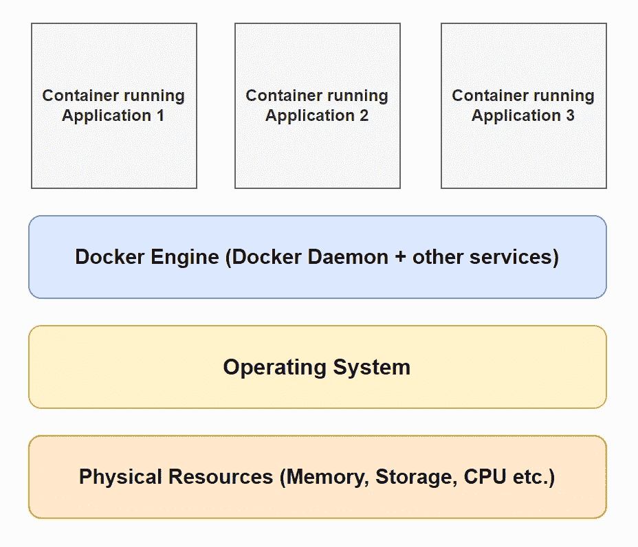
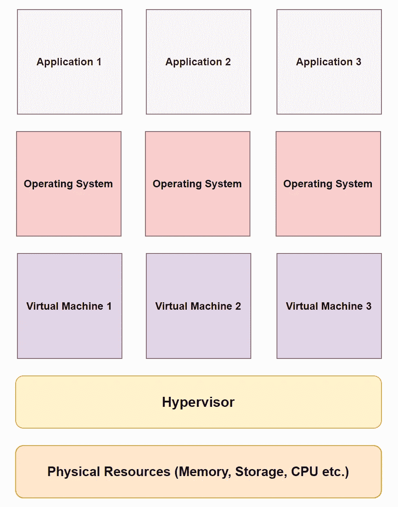
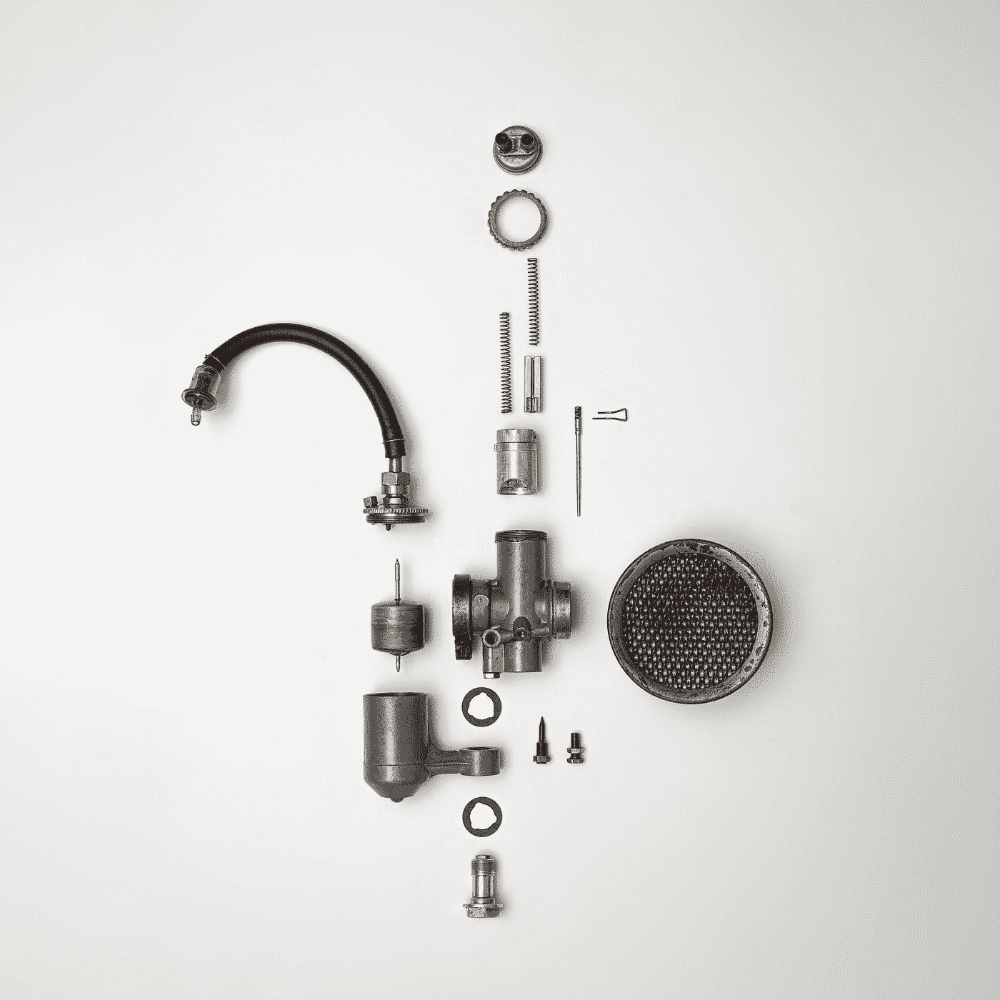
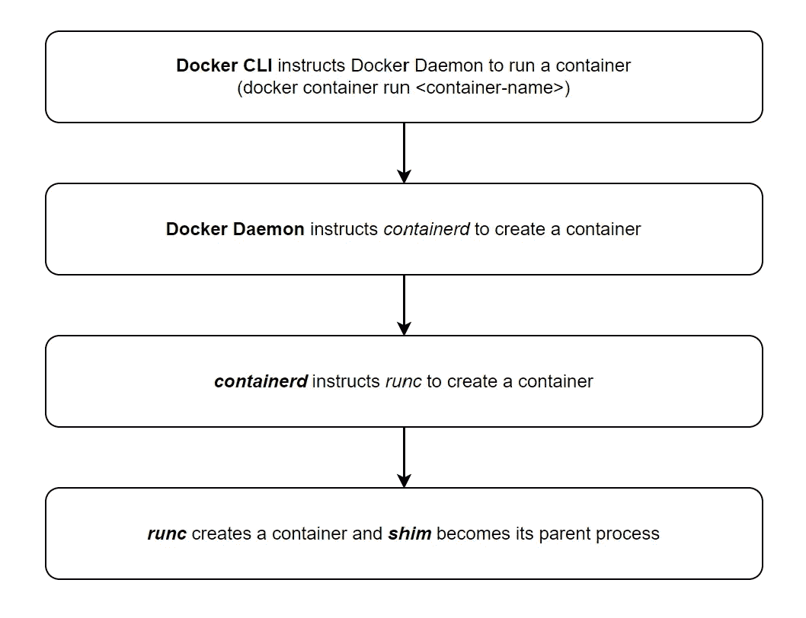

# 深入了解 Docker 的实际工作方式

> 原文：<https://levelup.gitconnected.com/a-deep-dive-into-how-docker-works-879178de803a>

我们来谈谈 docker 守护进程、containerd、runc、shim 等等！

# Docker 是什么？

根据维基百科:

> Docker 是一组平台即服务(PaaS)产品，使用操作系统级虚拟化来交付称为容器的软件包中的软件。

如果您不熟悉 Docker 和 Containers，这个定义可能会令人困惑。

穆罕默德·拉赫马尼在 [Unsplash](https://unsplash.com?utm_source=medium&utm_medium=referral) 上的照片

简单说一下吧！

# 什么是 Docker 容器？

Docker 容器是一个软件包，它捆绑了运行应用程序所需的一切(代码、运行时、系统工具、系统库和设置)。

> 一台服务器/主机可以运行多个容器，每个容器可以独立运行一个应用程序。

照片由[凯利·麦克林托克](https://unsplash.com/@kelli_mcclintock?utm_source=medium&utm_medium=referral)在 [Unsplash](https://unsplash.com?utm_source=medium&utm_medium=referral) 上拍摄

# 与虚拟机的比较

容器类似于虚拟机(VM)。

但是，它们之间的一个显著区别是**容器不包含和运行自己的操作系统**。

这使得容器**变得轻量级**(几兆字节大小！).

[通风视图](https://unsplash.com/@ventiviews?utm_source=medium&utm_medium=referral)对[防溅罩](https://unsplash.com?utm_source=medium&utm_medium=referral)的拍照

# 内部工作的差异

Docker 包含 **Docker 引擎**，这是一个**操作系统虚拟化**工具。

它通过创建多个容器来工作，这些容器共享运行在服务器/主机上的单个操作系统的资源。

码头工人的内部工作(图片由作者提供)

另一方面，虚拟机是由**虚拟机管理程序**创建的，虚拟机管理程序将硬件资源划分到不同的虚拟机中(**硬件虚拟化**)。

虚拟机的内部工作原理(图片由作者提供)

每个虚拟机都有自己的操作系统，在其上运行应用程序。

与容器相比，这使得虚拟机:

*   需要更多的**空间**
*   启动/引导需要更多的时间
*   需要更多的**维护**(在安装补丁/升级方面)

# Docker 引擎是什么？

Docker 引擎是 Docker 技术的核心。

亚历山大·安德鲁斯在 [Unsplash](https://unsplash.com?utm_source=medium&utm_medium=referral) 上拍摄的照片

它是帮助创建、运行和管理容器的软件服务的集合。

Docker 引擎由以下主要组件组成:

*   [**Docker 守护进程**](https://docs.docker.com/get-started/overview/#the-docker-daemon) :监听 Docker API 请求，管理 Docker 镜像、容器、网络和卷
*   [***容器***](https://containerd.io/) *:* 管理容器生命周期的工具
*   [***runc***](https://opensource.com/life/16/8/runc-little-container-engine-could)*:*一个在 Linux 上生成和运行容器的 CLI 工具。它运行在[*lib container*](https://jancorg.github.io/blog/2015/01/03/libcontainer-overview/)*之上，这是一个帮助连接并与主机内核*一起工作的工具。**
*   *[***垫片***](https://iximiuz.com/en/posts/implementing-container-runtime-shim/)*

*Docker 按照以下步骤创建容器:*

**

*运行容器所涉及的步骤(图片由作者提供)*

# *Docker 整体工作如何？*

*让我们来谈谈涉及的三个主要术语:*

## *码头客户*

*这是命令行界面，用于指示 Docker 引擎创建、运行、停止和执行容器上的其他操作。*

## *码头主持人*

*这是安装 Docker 的机器。*

*Docker 主机包含 Docker 引擎，Docker 技术的核心。*

*除了 Docker 引擎，主机还存储用于创建容器的 [***图像***](https://docs.docker.com/get-started/overview/#docker-objects) 。*

> *图像是创建容器的模板。*

## *Docker 注册表*

*它是一个公开可用图像的存储库，Docker 主机可以下载这些图像，然后使用它们来创建容器。*

*默认情况下，Docker 被配置为使用 [Docker Hub](https://hub.docker.com/) 作为其注册表。*

*注册表包含存储库，每个存储库由不同版本的图像组成。*

*例如，Docker Hub 的 [Ubuntu 库](https://hub.docker.com/_/ubuntu)包含多个图像(标记为`[18.04](https://git.launchpad.net/cloud-images/+oci/ubuntu-base/tree/bionic/Dockerfile?h=refs/heads/dist-amd64&id=0b99ba2f4ec4dbe55b72c6b1c81eed4393b33346)` [、](https://git.launchpad.net/cloud-images/+oci/ubuntu-base/tree/bionic/Dockerfile?h=refs/heads/dist-amd64&id=0b99ba2f4ec4dbe55b72c6b1c81eed4393b33346) `[latest](https://git.launchpad.net/cloud-images/+oci/ubuntu-base/tree/jammy/Dockerfile?h=refs/heads/dist-amd64&id=0b99ba2f4ec4dbe55b72c6b1c81eed4393b33346)` [、](https://git.launchpad.net/cloud-images/+oci/ubuntu-base/tree/jammy/Dockerfile?h=refs/heads/dist-amd64&id=0b99ba2f4ec4dbe55b72c6b1c81eed4393b33346) `[rolling](https://git.launchpad.net/cloud-images/+oci/ubuntu-base/tree/jammy/Dockerfile?h=refs/heads/dist-amd64&id=0b99ba2f4ec4dbe55b72c6b1c81eed4393b33346)`等)。)*

**

*Gabriel Heinzer 在 [Unsplash](https://unsplash.com?utm_source=medium&utm_medium=referral) 上拍摄的照片*

*总的来说，码头工人按照以下步骤工作:*

1.  ***Docker 客户端**指示 Docker 守护进程运行容器。
    在 Linux 上，这是通过本地 IPC/Unix 套接字完成的(`/var/run/docker.sock`)。在 Windows 上，这是通过`npipe:////./pipe/docker_engine`完成的。*
2.  ***Docker 守护进程**在其本地缓存/本地存储库中搜索上述容器的映像。*
3.  *如果此处没有该图像，将在 **Docker Hub** 上搜索并下载。*
4.  *如果存在，Docker 守护进程指示 ***containerd*** 创建并运行容器(如上所述)。*

*要阅读更多关于 Docker 的内容，请参考下面的链接。*

* [## Docker 概述

### Docker 是一个开发、发布和运行应用程序的开放平台。Docker 使您能够分离您的…

docs.docker.com](https://docs.docker.com/get-started/overview/#docker-architecture)* 

**本文到此为止！**

**感谢阅读！**

**如果你是 Python 或编程的新手，可以看看我的新书，书名是'* [**《没有公牛**t 学习 Python 指南》**](https://bamaniaashish.gumroad.com/l/python-book) **'** *下面:**

* [## 学习 Python 的无牛指南

### 你是一个正在考虑学习编程却不知道从哪里开始的人吗？我有适合你的解决方案…

bamaniaashish.gumroad.com](https://bamaniaashish.gumroad.com/l/python-book)  [## 通过我的推荐链接加入 Medium——Ashish Bama nia 博士

### 阅读 Ashish Bamania 博士(以及 Medium 上成千上万的其他作家)的每一个故事。您的会员费直接…

bamania-ashish.medium.com](https://bamania-ashish.medium.com/membership) 

# 分级编码

感谢您成为我们社区的一员！在你离开之前:

*   👏为故事鼓掌，跟着作者走👉
*   📰查看[升级编码出版物](https://levelup.gitconnected.com/?utm_source=pub&utm_medium=post)中的更多内容
*   🔔关注我们:[Twitter](https://twitter.com/gitconnected)|[LinkedIn](https://www.linkedin.com/company/gitconnected)|[时事通讯](https://newsletter.levelup.dev)

🚀👉 [**加入人才集体，找到一份令人惊喜的工作**](https://jobs.levelup.dev/talent/welcome?referral=true)*