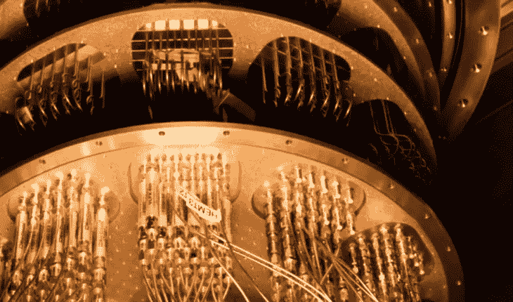
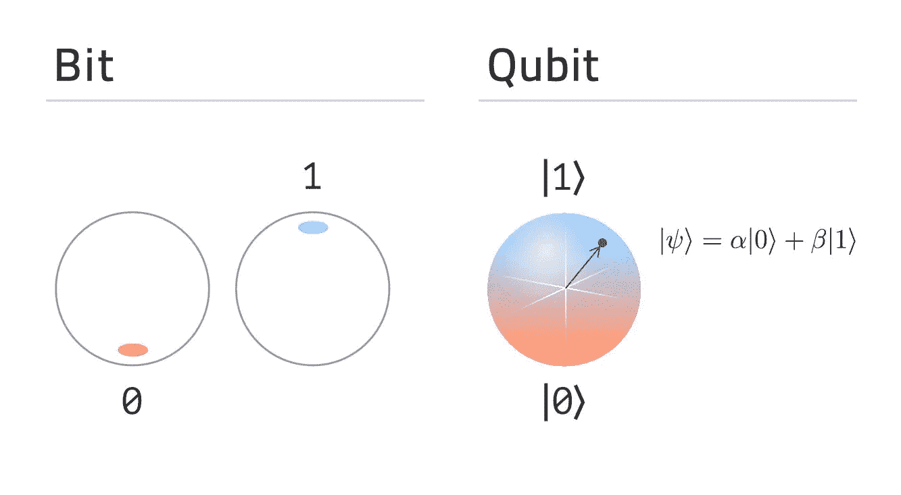
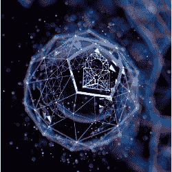
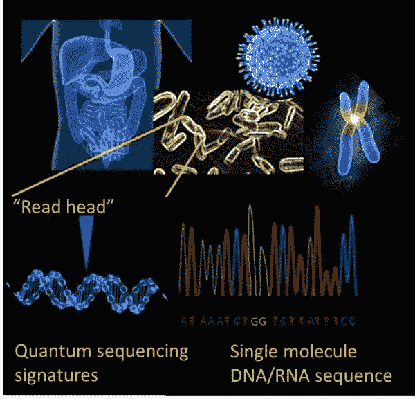
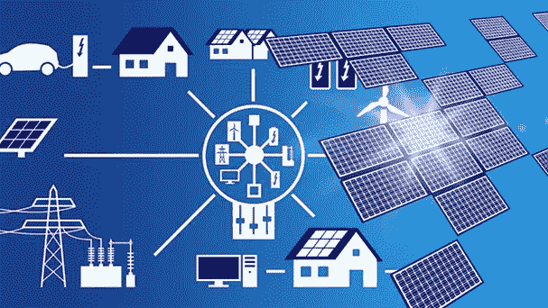
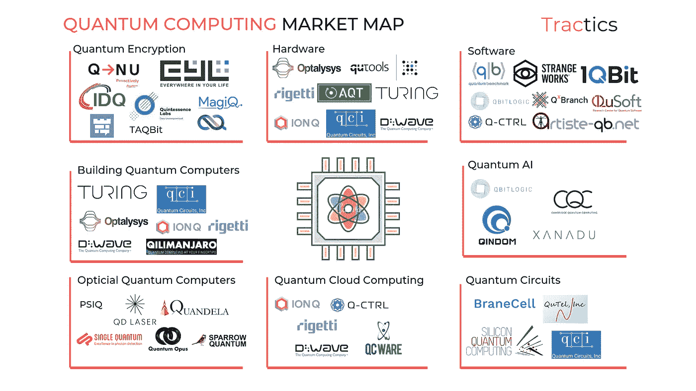

# 对量子计算的深度技术探索

> 原文：<https://levelup.gitconnected.com/a-deep-tech-dive-into-quantum-computing-c7a9d10f1d23>

由谢恩·朗克(Shane Rounc)e 在 [Unsplas](https://unsplash.com/s/photos/technology?utm_source=unsplash&utm_medium=referral&utm_content=creditCopyText) h 上拍摄

从热力学出发，[工业革命](https://www.tandfonline.com/doi/abs/10.1080/14786435.2013.784402)诞生了。然后，[电磁学](https://siarchives.si.edu/history/featured-topics/henry/electromagnetism)的发展把我们推进了信息时代。现在，随着量子力学的应用，我们迎来了由量子计算驱动的**量子时代**。由于技术的加速发展，一个范式的转变已经开始，这是一个转折点，技术的发展从看似恒定的增长变成了指数增长。接下来发生的事情几乎是不可理解的。

量子计算机可以利用量子力学独特的信息处理能力，以指数方式优化解决大型复杂问题所需的时间和能量。这可能是自集成电路以来的下一件大事，正如我们所知，它将改变全球市场和生活。

> 想象一下，在可见的宇宙中有从 10⁷⁸到 10⁸的原子，因此一台具有 265 个量子位的量子计算机可以存储整个宇宙中的所有值，我们希望在十年内打破这一界限。

现在，我们只是处在超越世界的尖端，这个世界我们只能通过科幻电影来想象。截至目前，量子计算机还处于婴儿期，只有第一代 NISQ 处理器，量子信息潜力有限。基本上，他们的年龄与经典计算的 1984 年 Macintosh 相当。麦金塔诞生 10 年后，一种算法震惊了计算机科学和物理世界。

1994 年，麻省理工学院应用数学教授彼得·肖尔向世界介绍了一种算法，这种算法允许一台**量子计算机以近乎瞬时的速度**将整数分解成质因数。这是量子计算的潜力开始从它的老兄弟(经典计算机)中脱颖而出的地方。

## 量子计算与经典计算

量子计算机解决问题的速度可能比经典计算机快几个数量级。

*你可以问得多好？*

**嗯，谷歌的量子计算机** **花了**[**200 秒完成了一个经典计算机要花一万年才能完成的问题。**](https://research.aimultiple.com/quantum-computing-stats/)

由[Brian Wang/nextbigfuture.com](https://www.nextbigfuture.com/2019/09/google-quantum-computer-solves-problem-1-billion-times-faster-than-best-supercomputer-which-might-mean-quantum-supremacy.html)提供

通过以比经典超级计算机快 15 到 20 亿倍的速度超越 IBM 的 Summit 超级计算机，我们尝到了一个适当构建的量子系统可能保留的巨大能力。

这些机器已经在解决经典计算机无法解决的复杂数学、现实世界问题的预期中显示出很大的希望。尽管你必须考虑到量子计算机的速度比较并不总是像经典计算机那样相似。经典计算机处于它们的成人形式，因为量子技术仍然是一个非常年轻的孩子。

由 Franz Georg Fuchs 提供

打破经典计算机和量子计算机的机制，可以归结到驱动它们的东西。经典计算机由比特驱动，比特只能是 0 或 1，开或关。量子计算机使用的量子位可以以这些状态的叠加形式存在，即一个量子位可以是 **0 或 1，或者同时是 0 或 1，关或开或关和开**。

现在，量子计算机还不能取代经典计算机。相反，它们将通过运行复杂的模拟和算法来解决最困难的问题。这种强大的机器有着广泛的应用，可以颠覆整个行业。

## **网络安全**

由[红眼](https://cacm.acm.org/magazines/2019/4/235578-cyber-security-in-the-quantum-era/fulltext?mobile=false)提供

今天的许多加密实践已经过时。2019 年，科技集团[戴尔报道](https://www.techrepublic.com/article/63-of-organizations-face-security-breaches-due-to-hardware-vulnerabilities/)，

> “2019 年，63%的公司表示，由于硬件或芯片级的安全漏洞，他们的数据在过去 12 个月内可能受到威胁。”

目前，AES ( [高级加密标准](https://searchsecurity.techtarget.com/definition/Advanced-Encryption-Standard))支持三种加密密钥大小 128 位、192 位和 256 位，为了解决当今的安全问题，这意味着密钥大小应该加倍以支持相同的保护级别。现在，要破解 RSA (Rivest Shamir Adleman) 2048 位加密密钥的终极标准，经典计算机需要数万亿年的时间。

量子增强型网络安全公司 Quintessence Labs 设计出通过使用 Shor 算法，“一台具有 4099 个完全稳定量子位的量子计算机可以在 10 秒内破解 RSA-2048 加密。”

因为已经证明用量子技术破解 RSA 是可能的。网络安全的解决方案是使用量子随机数发生器和 QKD(量子密钥分配)技术的**不可破解网络**。事实上，各国已经采取措施提供这一解决方案。

中国的防黑客量子通信技术已经接近完成。大约 4 年后，他们发射了第一颗卫星，开始在北京与露天的 QKD 建立量子网络。QKD 是，

> QKD 是一种安全的通信和信息传输技术，它基于“量子纠缠”现象进行加密，在这种现象中，一对纠缠的粒子即使相距很远，也保持连接并相互影响— [刘震](https://www.scmp.com/news/china/science/article/3117005/chinas-experiment-quantum-communication-brings-beijing-closer)

这个 4600 公里长的网络是一个巨大的里程碑，标志着开发一个不受黑客攻击的安全通信网络的目标，美国已经注意到了这一点。

随着《国家量子倡议法案》的出台，美国能源部计划向 T2 投入 1000 多亿美元来建设一个“不可破坏的互联网”。这种量子互联网将开创一个全新的通信时代，不仅是安全的，还将提供光速数据传输。

## 卫生保健

由[科罗拉多工程应用科学学院](https://www.colorado.edu/chbe/2015/01/05/nagpal-and-chatterjee-receive-1m-keck-foundation-research-award-quantum-molecular)提供

> “用经典的计算机模拟人脑 1000 亿个神经元的行为是不可行的，但是量子机器学习有望满足这一要求。”— [Amit Ray](https://amitray.com/) ，QC 先锋

[**花了 15 年时间和数十亿美元**](https://medicalfuturist.com/quantum-computing-in-healthcare/) **破解了人类 DNA 的密码**。然后，花了 10 年时间将基因组测序的成本和时间减少了 100 万倍。尽管如此，开发药物是一个及时的过程，成本高昂。凭借规模模拟的量子能力，科学家和临床医生可以整合大量跨功能数据集来加速患者风险建模、分析影像(如 CT 扫描等)。

量子技术一旦被提炼为稳定的，将能够在几周甚至几天内分解基因组测序，这将导致[个性化医疗](https://www.ncbi.nlm.nih.gov/pmc/articles/PMC2957753/)。通过运行近瞬时基因组模拟，**治疗计划可以针对患者进行专门定制**。然而，医疗行业已经采取了一些措施来采纳私营部门的人工智能进步，因此采用量子测序方法需要时间。

## **能源**

由[研究中心提供](https://www.tudelft.nl/en/eemcs/the-faculty/departments/electrical-sustainable-energy/dc-systems-energy-conversion-storage/research/energy-management-system-for-microgrids/)

在今天这个时代，我们正在经历一场与人类足迹直接相关的生态危机。这场危机使得可持续发展成为许多公司的首要目标。通过量子计算，我们可以解决动态能源系统(如大规模的热量、风力和水流)的不可能建模挑战，降低当今回归算法的不确定性水平。

随着能源系统数据处理的加速，整个能源价值链的能源网格效率和安全性将大大提高。诸如[电网拓扑控制](https://www.dnsstuff.com/what-is-network-topology)、[综合电网惯性建模](https://www.current-news.co.uk/blogs/synthetic-inertia-and-its-role-in-improving-grid-stability)以及大规模跨网交易能量等问题将更易管理。

将量子计算整合到当前的能源分配模型中，可以彻底降低任何与可再生能源相关的成本。它将在工程界产生巨大的影响，不仅创新类似的系统，而且为量子计算可以解决的所有应用提供更多的关注。

## 市场范围

由 [Sankaranarayanan](https://medium.com/datadriveninvestor/quantum-computing-73-companies-that-are-changing-the-computing-landscape-f39ebf0ccfee) 提供

[量子计算市场预计](https://www.globenewswire.com/news-release/2020/04/06/2011932/0/en/Worldwide-Quantum-Computing-Market-2019-to-2030-Drivers-Restraints-and-Opportunities.html)将从 2019 年的**5.071 亿美元增长到 2030 年的约 640 亿美元，CAGR 为 56.0%** ，一些人认为它可能会在 2035 年 攀升到**万亿美元的市场。**

据量子内部人士称，2020 年，8.6 亿美元将用于资助质量控制公司，而这仅仅是个开始。截至目前，量子市场有点贫瘠，但它开始受到关注。以下是一些在该领域产生重大影响的顶级公司(带有相关链接):

1.  [**暗星量子实验室**](https://www.linkedin.com/company/darkstarquantumlab/)
2.  [**D 波**](https://www.dwavesys.com/)
3.  [**里盖蒂计算**](https://www.rigetti.com/)
4.  [**牛津量子电路(OQC)**](https://oxfordquantumcircuits.com/)
5.  [**IonQ**](https://ionq.com/)
6.  [**硅量子计算**](http://sqc.com.au/)
7.  [**【剑桥量子计算(CQC)】**](https://cambridgequantum.com/)
8.  [**微软**](https://www.microsoft.com/en-us/quantum)
9.  [**谷歌**](https://research.google/teams/applied-science/quantum/#:~:text=About%20the%20team,innovations%20of%20tomorrow%2C%20including%20AI.)
10.  [**IBM Q**](https://www.ibm.com/quantum-computing/)
11.  [**萨帕塔**](https://www.zapatacomputing.com/orquestra/?gclid=CjwKCAiAgJWABhArEiwAmNVTB731tigBvtABNb1_sHIo80LJcUZOC8DXfaeYRp81NeXf3ddgnwSdwhoCw34QAvD_BwE)
12.  [strange works](https://strangeworks.com/)
13.  [**霍尼韦尔**](https://www.honeywell.com/us/en/company/quantum)
14.  [**冷量子**](https://www.honeywell.com/us/en/company/quantum)
15.  [**英特尔**](https://www.intel.com/content/www/us/en/research/quantum-computing.html)
16.  [**量子计算公司**](https://quantumcomputinginc.com/)
17.  [**国粹实验室**](https://www.quintessencelabs.com/)

随着市场的进一步发展，QCaaS(量子计算即服务)形式的开发工具越来越多，我们将开始看到更多的创业公司。

## **量子未来**

量子计算仍处于早期，所以我们只是让它的潜力黯然失色。需要强大的计算能力，能够克服药物/疫苗发现、安全加密、投资组合风险评估等方面的困难。将有助于量子计算行业的市场份额增长。足够多的公司用量子技术解决复杂的现实世界问题只是时间问题，从那时起，没有人能够忽视它的破坏性变化。

我们仍然处于量子计算机的欺骗阶段，但随着 QCaaS 市场的持续增长，更多的开发人员将能够创建创新的解决方案，将这项技术推向可能是迄今为止最具破坏性的时代！