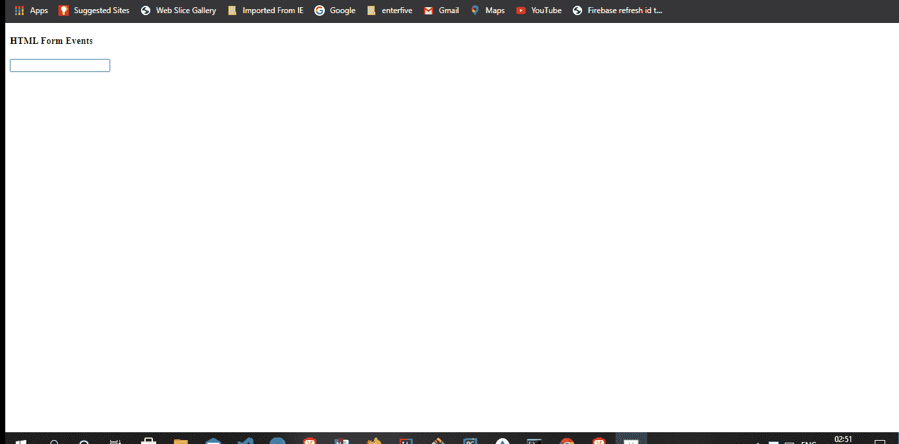

# HTML 表单事件属性的详细分类

> 原文：<https://levelup.gitconnected.com/a-detailed-breakdown-of-html-form-event-attributes-925ab40b1ddf>


> 不要立志谋生，要立志有所作为。丹泽尔·华盛顿

# 目录

1.  [简介](#5e4b)
2.  [HTML 表单事件](#6fa2) 2.1[onblur](#2bef)
    2.2[onchange](#c195)
    2.3[on context menu](#1c51)
    2.4[onfocus](#875a)
    2.5[on input](#70cc)
    2.6[on invalid](#2bf7)
    2.7[on reset【T24](#c7d3)
3.  [结论](#3302)

# 介绍

HTML 表单允许用户在网页上输入数据，这些数据将被发送到服务器进行处理。HTML 表单是一种与 web 应用程序交互的强大方式。它们包括各种称为控件的元素，如(文本输入、复选框、单选框、选择框等)。

**HTML** 表单包含在一个`<form></form>`元素中。`<form>`元素有各种属性，其中一些包括 ***动作属性、目标属性*** 和 ***方法属性*** 。

# 动作属性

**动作**属性有助于确定表单提交后将发送到服务器的表单数据的类型。

从上面的代码中，表单数据在 action 属性的帮助下被发送到一个名为 *"testpage.php"* 的文件中。

# 目标属性

该属性向浏览器指定特定的页面来显示表单提交后收到的响应。

此外，**目标**属性可以具有以下值:

*   响应显示在新的浏览器窗口或选项卡中。

*   响应显示在当前窗口中。这是**目标**属性的默认值。

*   响应显示在父框架中

*   响应显示在窗口的整个正文中

# 方法属性

**方法**属性指定提交表单数据时使用的特定超文本传输协议( **HTTP** )方法。

有两种类型的 **HTTP** 方法属性可以与 **<表单>** 元素一起使用。它们包括**获得**和**职位。**

**获取**属性

```
<form action="/testpage.php" method="get"
```

*   上面的例子在提交表单数据时使用了 **GET** 方法。

文章属性

```
<form action="/testpage.php" method="post">
```

*   上面的例子在提交表单数据时使用了 **POST** 方法。

此外， **HTML** 表单中最常用的元素之一是 **<输入>** 标签。 **<输入>** 标签可以在 **HTML** 表单中以多种方式显示。其中一些包括:

```
<input type=”text”>
```

***显示单行文本输入栏。这是输入元素的默认类型。***

```
<input type=”radio”>
```

***显示一个单选按钮(用于选择多个选项中的一个)。***

```
<input type=”checkbox”>
```

***显示一个复选框(用于选择零个或多个选项)。***

```
<input type=”submit”>
```

***显示一个提交按钮(用于提交表单)。***

```
<input type=”button”>
```

***显示一个可点击按钮。***

既然我们已经介绍了 **HTML** 表单的基础知识，让我们深入了解各种表单事件。

# HTML 表单事件

# 1).onblur 事件

当一个对象失去焦点时, **onblur** 事件呈现。onblur 事件主要用于表单验证，即当用户离开表单字段时。

**HTML 中的语法**

```
<element onblur="myFunction">
```

# 例子

这里，我们将创建一个输入字段，一旦输入字段失去焦点，它将显示一个警告框。

> index.html

上面我们有一个名为的函数，它是在一个 ***onblur*** 属性中声明的。然后，我们将脚本标签链接到 JavaScript 页面的顶部，在那里我们将执行警报操作。

> app.js

在 JavaScript 文件中，我们:

*   通过 ***id*** 访问输入字段，调用 ***myInput*** 中的***blur function()***函数。
*   声明了一个名为 ***的模糊变量。***
*   然后我们创建了一个条件，如果表单中输入的值被称为*，那么一旦输入字段失去焦点，就会弹出一个警告框。*

## *结果*

**

# *2).onchange 事件*

*当一个元素的值改变时，发生 **onchange** 事件。它用于 *<等元素输入> <选择>* 和 *< textarea >。**

***HTML 中的语法***

```
*<element onchange="myFunction">*
```

# *例子*

*这里，我们将创建一个 select 元素，它基于 change 事件返回 DOM 上的不同值。*

> *index.html*

*在 ***HTML*** 页面中，我们有一个 select 元素，它显示了各种选项及其值。这里要注意的两件重要事情是:*

*   ****onchange****事件属性中的 ***clubSelect()*** 函数。**
*   **包含 ***结果*** 类的***div****。这是我们展示活动价值的地方。***

> ***app.js***

***在这里，我们只是简单地做了:***

*   ***声明在 **HTML** 页面中创建的 ***clubSelect()*** 函数。这使我们能够访问变更事件。***
*   **创建一个访问该类的 ***结果*** 变量。**
*   **将结果变量赋给 ***textContent*** 方法，这样有助于我们给节点设置一个给定的文本。**

## **结果**

****

# **3).oncontextmenu 事件**

*****on context menu****事件在用户右击窗口上的对象时执行其动作。所有浏览器都支持***on context menu****事件。****

*****HTML 中的语法*****

```
***<element oncontextmenu="event">***
```

# ***例子***

***在这个例子中，当我们右击时，我们将在一个 **div** 中显示一个警告框，而不是上下文菜单选项。***

> ***index.html***

***在***HTML****文件中，我们有一个包含了***on context menu***事件的属性。该属性包含名为 ***myAlert()*** 的函数，该函数将在 JavaScript 文件中用于创建警告框。****

> **app.js**

**在 ***app.js*** 文件中，当***on context menu***在 ***div*** 内触发时，我们调用了 ***myAlert()*** 函数，并在其中声明了一个警告框。**

> **style.css**

## **结果**

****

# **4).焦点事件**

**当用户将鼠标焦点设置在网页上的特定元素上时，将触发 ***onfocus*** 事件。与 **onblur** 事件相反。**

**它主要与 ***<一起使用，输入>，<选择>，*** 和 ***<一个> HTML*** 元素。**

****HTML 中的语法****

```
**<element onfocus="myFunction">**
```

# **例子**

**这里，当输入字段处于焦点时，我们将显示一个警告框。**

> **index.html**

**在上面的文件中，我们:**

*   **在 input 元素中声明了 ***onfocus*** 事件。**
*   **用单词 focus 创建了一个*值*属性**
*   **然后，我们将该文件链接到我们的 JavaScript 文件，奇迹就在这里发生了。**

> **app.js**

**在 ***app.js*** 文件中我们:**

*   **调用了***focus function()***函数。**
*   **创建了**和焦点变量。***val****变量访问输入字段，而 focus 变量保存单词 focus。*****
*   ***最后，我们创建了一个条件，如果表单的值包含单词" *focus* "并且输入字段处于事件状态，那么应该显示一个警告框。***

## **结果**

********

# **5).oninput 事件**

**当文本元素(如或)的值发生变化时，触发***on input***事件。与事件类似，主要区别是当有更改时，输入事件会立即触发，而事件仅在元素失去焦点时发生。**

****HTML 中的语法****

```
**<element oninput="myFunction">**
```

# **例子**

**这里，我们将在页面上显示输入字段的值，因为值发生了变化。**

> **index.html**

**在我们上方:**

*   **创建了一个输入标记。其中有一个名为“ ***myInput*** ”的 **id** ，我们将在 JavaScript 文件中引用它。**
*   **我们还将***oniput****事件属性声明为。***

> ***app.js***

*****app.js** 文件很简单。我们所做的只是:***

*   ***请参考页面上的函数。***
*   ***声明了一个名为*的变量 values* ，它访问输入元素。***
*   **然后我们访问 id 为 ***id 为*** 的 **div** ，在这里我们将显示输入字段中的文本。**
*   **借助***text content****方法，我们可以将文本赋给 **div** 标签。***

## ***结果***

******

# ***6).on 无效事件***

******oninvalid*** 事件发生在可提交的输入元素无效且不满足特定条件时。在大多数情况下，会显示一条错误消息，说明输入提交无效的原因。***

****HTML 中的语法****

```
**<element oninvalid="myFunction">**
```

# **例子**

**在这里，我们显示一个警告框，当在输入字段中提交一个空时，它会显示一条消息。**

> **index.html**

**从上面的 HTML 文件，我们创建了一个输入字段，预计将在用户名。在输入字段中，我们有一个名为 ***testValidity()的函数。*** 这个函数将用来在 JavaScript 文件中显示我们的警告框。**

> **app.js**

**这里我们简单引用 ***testValidity()*** 的函数，设置在***【HTML】****文件中***on invalid****事件属性内。每当提交带有输入空字段的表单时，警告框将显示消息“字段不能为空”。****

## ***结果***

******

# ***7).重置事件***

***当用户单击表单中的重置按钮时，会发生***on reset****事件。这将表单设置回预定义的状态。****

*****HTML 中的语法*****

```
***<element onreset="myFunction">***
```

# ***例子***

***在本例中，我们将创建一个输入字段，一旦单击 reset 按钮，该字段将被清除。一旦该事件触发，我们将记录表单在浏览器页面上被点击的时间。***

> ***index.html***

***在这里我们:***

*   ***创建了一个 form 标记，它接受一个 ***id*** 和一个***on reset****事件属性。****
*   ***创建了一个接受一些文本的输入字段。***
*   ***将窗体状态设置为空的重置按钮。***
*   ***最后，我们创建一个 ***p*** 标签，它带有一个 ***id*** *名为****display****来显示表单被重置的时间。****

> ***app.js***

***在 JavaScript 文件中，我们简单地:***

*   ***参考了我们的 ***resetForm()*** 函数。***
*   **接下来，我们追加 ***textContent*** 方法，以显示单击 rest 按钮时的当前日期。**

## **结果**

****

# **8).在线搜索事件**

**当用户在元素内部发起搜索时，会发生 ***onsearch*** 事件。将有一个“搜索”类型来触发它。**

****HTML 中的语法****

```
**<element onsearch="myFunction">**
```

# **例子**

**我们将创建一个输入字段，允许用户在按下 enter 按钮后进行搜索。搜索到的值将显示在页面上。**

> **index.html**

**在 index.html 的**文件中，我们:****

*   ***创建了一个名为 **id** 的输入元素。我们还声明了接受函数的***on search****事件属性****
*   ***最后，我们创建了一个 **p** 元素，它有一个被调用的 **id** 来帮助显示页面上输入字段的值。***

> ***app.js***

*   ***引用了 **HTML** 文件中声明的函数 ***searchInput()*** 。***
*   **访问了 **HTML** 文件中的 **id 的**。**
*   **最后，一旦按下 ENTER 键，我们就在页面上显示输入字段的值。**

## **结果**

****

# **9).onselect 事件**

*****onselect*** 事件仅在*<input type = " text ">*或 *< textarea >* 元素上选择了特定文本时发生。**

****HTML 中的语法****

```
**<element onselect="myFunction">**
```

# **例子**

**在本例中，我们将创建一个输入字段。目标是在一个警告弹出框中显示输入字段中选择的文本数量。**

> **index.html**

**在***index.html***文件上面，我们:**

*   **创建了一个包含值“快乐是免费的”的输入字段。**
*   **同样，我们选择了一个名为 ***的函数作为我们的属性()。*****

> **app.js**

**在这里我们:**

*   **引用了 **HTML** 页面中的 ***selected()*** 函数。**
*   **创建了一个名为**的变量高亮显示。**在这个变量中，我们获取输入字段中文本的值，同时获取输入字段开头和结尾的索引。**
*   **最后，当文本被选中时，我们会显示一个警告框，显示在输入字段中选择的单词数。**

## **结果**

****

# **10).onsubmit 事件**

**当用户在页面上提交表单时，触发 ***onsubmit*** 事件。**

****HTML 中的语法****

```
**<element onsubmit="myFunction">**
```

# **例子**

**在这个例子中，我们将提交表单中的值。我们将从另一页得到确认信息。**

> **index.html**

**在***index.html***页面中，我们:**

*   **有一个表单元素，它带有一个动作，当提交表单时，该动作会路由到一个***submit.html***页面。**
*   **在表单内部，我们还有 event 属性，它接受名为 ***myFunction()*** 的函数**
*   **此外，有两个输入元素。一个接受姓名输入，另一个是帮助我们提交表单的按钮。**

**在 JavaScript 文件中，我们简单地调用了在 **HTML** 页面中声明的 ***myFunction()*** ，然后我们创建了一个在表单提交时显示消息的警告框。**

*****submit.html***文件是表单提交时显示的页面。**

## **结果**

****

# **结论**

**本文旨在介绍 **HTML** 表单事件属性如何工作的基础知识。**

**此外，[这里的](https://github.com/desoga10/HTML-form-event-attributes)是 GitHub 到本文中使用的代码示例的链接。**

***原载于 2020 年 12 月 5 日 https://thecodeangle.com*[](https://thecodeangle.com/a-detailed-breakdown-of-html-form-event-attributes/)**。****