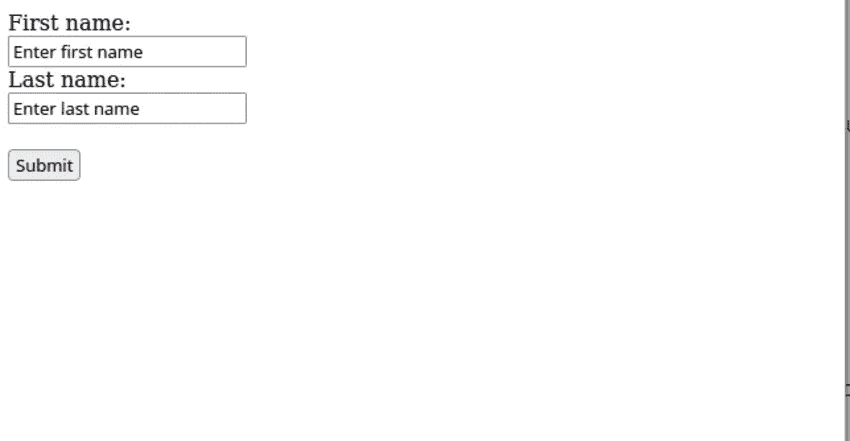
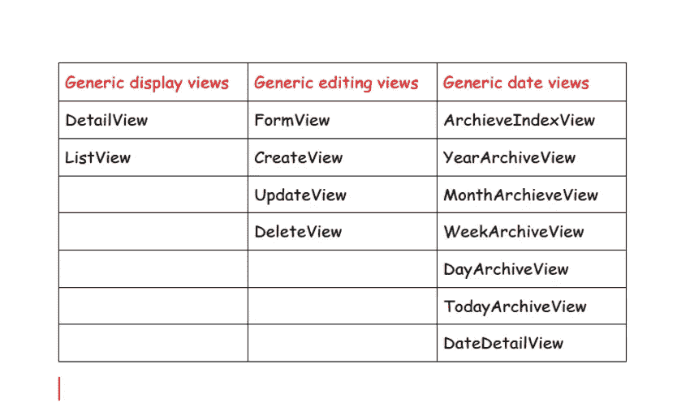
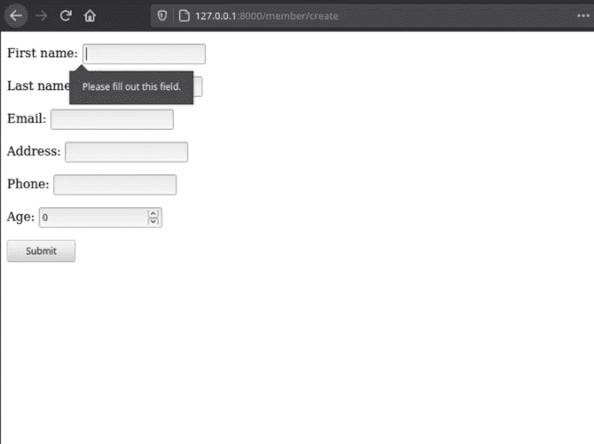
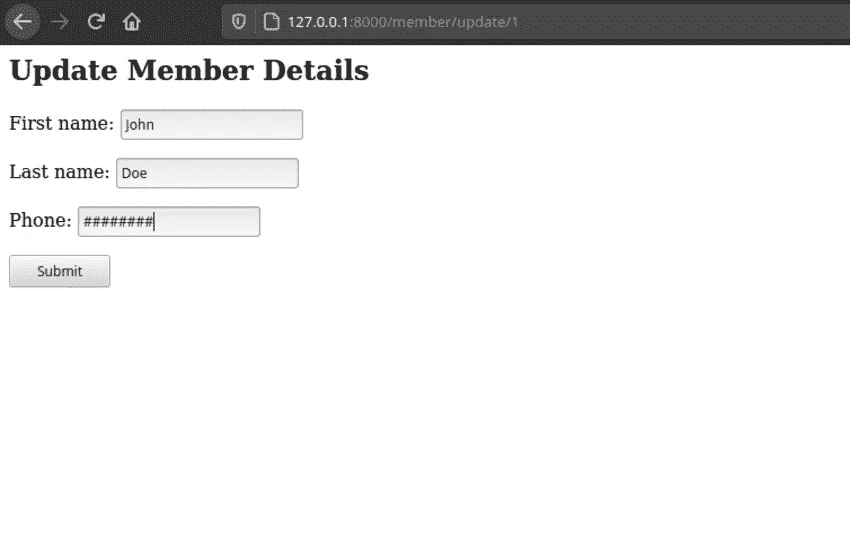
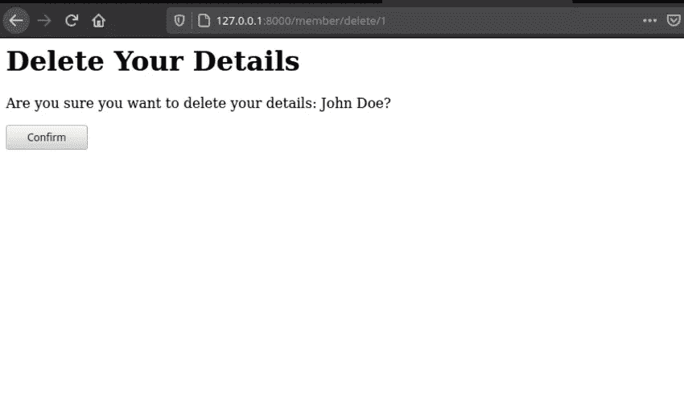

# Django 表单的详细指南

> 原文：<https://levelup.gitconnected.com/a-detailed-guide-to-django-forms-c4aa9b366608>

## **在 Django 应用程序中使用 Django 表单**


由 [Faisal](https://unsplash.com/@faisaldada?utm_source=unsplash&utm_medium=referral&utm_content=creditCopyText) 在 [Unsplash](https://unsplash.com/s/photos/python-programming?utm_source=unsplash&utm_medium=referral&utm_content=creditCopyText) 上拍摄的照片

如果一个表单满足以下标准，则被认为是功能性的。

*   表单应该在发送到服务器之前验证用户输入的数据
*   当提交无效数据时，表单应该显示错误。
*   表单还应该通知用户提交成功。

在任何应用程序中使用表单都是一个乏味的过程。幸运的是，Django 表单处理了所有复杂的数据验证过程，当表单成功提交时，向用户显示错误消息和通信。本教程将创建一个成员资格应用程序来添加、更新、读取和删除他们的数据。

为项目创建一个目录

```
mkdir Forms
```

如果您希望在虚拟环境中工作，请为此项目创建并激活一个虚拟环境。您必须安装 [virtualenv](https://virtualenv.pypa.io/) 。

```
python3.8 -m venv envsource env/bin/activate
```

使用 pip 安装 Django

```
pip3 install Django
```

创建一个名为 django_forms 的 Django 项目

```
django-admin startproject django_forms
```

创建一个名为 members 的 Django 应用

```
cd django_forms
django-admin startapp members
```

将应用程序添加到`settings.py.`中的已安装应用程序列表

# **创建模型**

我们知道会员申请表包含个人信息，因此我们将创建一个包含以下字段的会员模型:

*   名字
*   姓氏
*   电子邮件
*   地址
*   电话
*   年龄

会员的 app 有一个文件`models.py`。为`Member`模型添加以下代码。

应用迁移

```
python3.8 manage.py makemigrationspython3.8 manage.py migrate
```

# 形式

一个简单的 HTML 表单如下所示:

在浏览器上呈现时，它看起来像这样:



简单的形式

# **从模型创建表单**

Django 表单帮助表单创建更容易，因为它们为我们处理了大部分繁重的工作。为了在我们的应用程序中使用 Django 表单，我们首先需要在成员目录中创建一个文件`forms.py`。

接下来，从`django`导入`Member`模型和`forms`，如下图所示。

```
from .models import Memberfrom django import forms
```

导入之后，我们将为我们希望拥有的每个表单创建一个类。由于我们需要有一个页面，允许成员提交他们的详细信息，第一个表单将是一个接受用户输入的表单。

表单接受一个参数`forms.ModelForm`，`forms.ModelForm`是一个 Django helper 类。因为我们已经在模型中创建了我们的字段，所以没有必要再次创建字段。内部的`Meta`类将告诉应用程序我们将使用的模型和字段。

# **在视图中使用表单**

既然我们已经完成了`MemberCreate`表单，我们需要借助基于类的通用视图在模板上呈现它。Django 提供了通用的基于类的视图来处理表单。

这些类别分组如下。



通用视图

最常用的视图有:

*   通用显示器—这些是`DetailView`和`ListView`
*   通用编辑视图-包括`FormView`、`CreateView`、`UpdateView`、`DeleteView`

我们要创建的第一个类是`MemberCreate`视图。打开`views.py`并导入`Member`型号、`MemberCreateForm`和`CreateView`

```
from .models import Memberfrom .forms import MemberCreateFormfrom generic.edit.views import CreateView
```

`MemberCreate`类有三个属性，即:

*   模型
*   模板名称
*   表单 _ 类

```
class MemberCreate(CreateView): model = Member template_name = "members/member_create_form.html" form_class = MemberCreateForm
```

继续创建`member_create_form.html` 模板，它应该在成员应用程序的模板目录中。

```
members -templates - members -member_create_form.html
```

将下面的代码添加到我们上面创建的模板中。

标签`{{ form.as_p }}`使用段落呈现表单，而``保护表单免受 CSRF 攻击。您也可以使用`{{form-as_table}}`来呈现表单，它使用一个表格来呈现表单。

# 资源定位符

我们就要看到浏览器上呈现的表单了。最后一部分是将视图挂在我们的 URL 路径中。如下更新根`urls.py`文件

```
from django.contrib import adminfrom django.urls import path,include urlpatterns = [path('admin/', admin.site.urls),path("", include('members.urls')),]
```

创建一个文件`members/urls.py`，用`MemberCreate`视图添加到`member/create`的路径，并设置名称为`createmember`。

表单现在已经完成。如果您导航到[http:localhost:0 . 0 . 0 . 0:8000/members，](http://127.0.0.1:8000/member_create)您应该会看到按照我们的意图呈现的表单。



创建成员表单

创建所有其他表单的标准将与上述标准相同，即:

*   在 forms.py 中创建一个表单类，并添加必要的属性
*   在 views.py 中创建一个类，并添加所需的属性
*   为表单创建模板
*   在 URL 中挂钩视图

所以让我们快速创建其余的表单。

## 更新和删除成员表单

成员也应该有选择编辑或删除他们的信息，让我们来处理。打开`forms.py`，添加`MemberUpdate`类，并指定哪些字段可以编辑。

```
class MemberUpdateForm(forms.ModelForm): class Meta: model = Member fields = ("first_name","last_name","phone")
```

## 视图

让我们创建视图进行渲染。打开`views.py`，从`django.views.generic.edit`导入`UpdateView`和`DeleteView`级。
创建`MemberUpdate`和`MemberDelete`类，并声明必要的属性。在`MemberDelete`类中，我们不需要显示任何字段。

## 创建模板

在模板目录下创建`member_update_form.html`和`member_delete_form.html`

**member _ update _ form . html**

**member _ update _ form . html**

**member _ delete _ form . html**

## 添加 URL

members/URL . py

**测试表格:**



更新表单



删除形式

**重定向**

我们的表格工作正常，但一旦提交，用户应该被重定向到另一个页面，让我们创建一个简单的主页，将显示所有成员的详细信息。

打开 views.py 并创建一个呈现主页的视图。

views.py

## home.html 模板

更新 urls.py。

```
path('', views.home, name="home"),
```

更新视图以包含一个`success_url`

您还可以在模型中使用`get_absolute_url`方法来提供重定向链接。get_absolute_url 是一个 Django 约定，确保用户不会再次提交数据。

```
#models.pydef absolute_url(self): return “member/list”
```

如果您在`Member`模型上使用`[get_absolute_url()](https://docs.djangoproject.com/en/3.2/ref/models/instances/#django.db.models.Model.get_absolute_url)`，您不需要为`MemberUpdate`或`MemberDelete`提供 success_url

**结论**

当创建具有通用视图的表单时，数据被直接提交给模型。这确保了您不必担心验证和不正确的数据，因为所有的繁重工作已经为您完成了。

恭喜你，在 Django 中创建表单所需要的一切。你可以在这里阅读更多关于如何在 Django 中添加认证的内容。