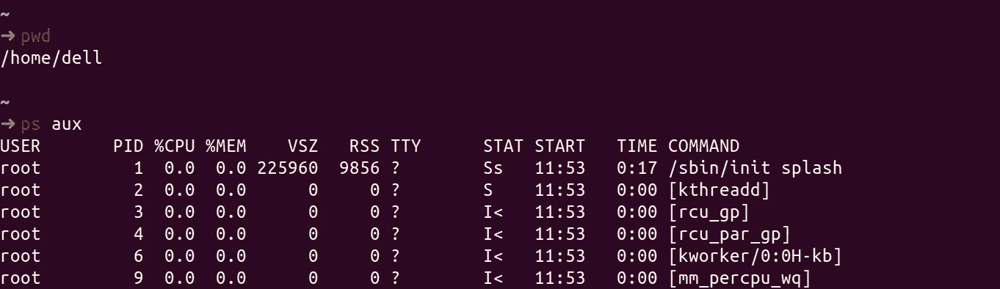
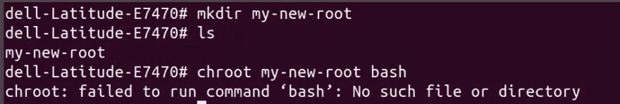
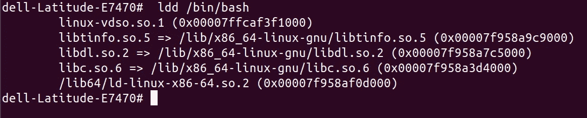
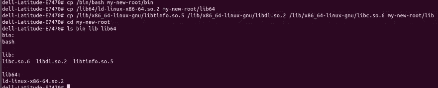
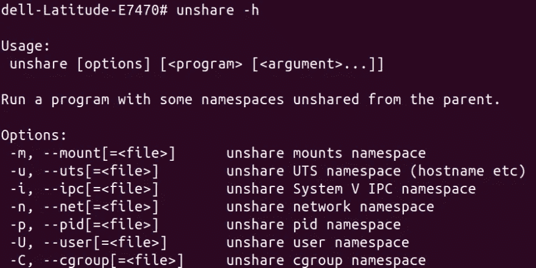

# Docker 免费介绍容器(自己写一个)

> 原文：<https://levelup.gitconnected.com/a-docker-free-intro-to-containers-write-one-on-your-own-a12f2a0f2255>


容器是允许您运行进程的操作系统技术的集合。容器本身是一项非常古老的技术，但是在引入 Docker 和他们为创建、部署和运送容器而构建的软件系统之后，它使得容器被广泛采用。我们将看看在没有 docker 的情况下构建一个容器所需的原子单元，这样你就可以跳过像“轻量级 VM”、“与 docker 有关的东西”、“穷人的虚拟化”这样的定义。

那么我们需要什么技术来创建自己的容器呢？

我们先来看看一个 OS 为我们做了什么。操作系统运行进程，进程是一个实体，代表系统中要实现的基本工作单元。有一个**进程控制块**，它是一个由操作系统维护的表，其中借助一个称为 PID(进程 ID)的特殊数字来标识每个进程。它还有进程的状态以及特权、内存信息、环境变量、路径、子进程等。

每个进程都有一个特定的根目录，该进程在其中执行。实际上，您可以在文件系统中名为`/proc`的文件夹中或者通过运行一个命令来找到这些信息:

```
ps aux
```

这是它在我的机器上的样子:



> *关于这一点还有很多，但我们将继续关注 Linux 系统的高级概述。*

现在，如果我们能够创建一个进程并隔离它，这样它也可以在其他地方运行，而无需安装整个操作系统，我们可以称之为容器。为了隔离这个进程，也就是说，使它不可能在自己的文件夹之外寻找，我们需要“监禁”它。我们可以使用以下命令来实现:

```
chroot /path/to/new/root command
```

它将更改该进程及其子进程的根文件夹，因此该进程将无法访问该文件夹之外的任何内容。让我们作为超级用户遵循一些步骤:

```
mkdir my-new-root
chroot my-new-root bash
```

这里我们创建了一个新文件夹，然后使用`chroot`命令“改变根目录”并在其中运行`bash`命令。

您应该会看到一些错误，如 bash 未找到或命令未被识别。参考以下截图:



因为命令 bash 运行在 my-new-root 内部，它不能访问新根目录之外的任何内容，所以它无法找到运行 bash shell 的程序。

要解决这个问题，请使用`ldd`。`ldd`打印程序运行所需的其他共享对象。

```
ldd /bin/bash
```

该命令输出运行某个程序所需的依赖关系:



让我们将它们复制到 my-new-root 中各自的文件夹中。

```
mkdir my-new-root/{bin,lib64,lib}
cp /bin/bash my-new-root/bin
cp /lib/x86_64-linux-gnu/libtinfo.so.5 /lib/x86_64-linux-gnu/libdl.so.2 /lib/x86_64-linux-gnu/libc.so.6 my-new-root/lib
cp /lib64/ld-linux-x86-64.so.2 my-new-root/lib64
```

在这里，我们创建了 3 个文件夹，bash 所需的共享库位于其中(在 lib 和 lib64 下)。然后我们将这些对象复制到其中。



现在，如果我们运行`chroot my-new-root bash`，它将在 my-new-root 内部打开一个 bash shell。你可以通过`pwd`来验证它，它应该输出`/`

> *你为什么不试着在这也启用* `*ls*` *命令呢？*

尽管我们的新根不能访问外部文件，但它可以看到主机容器上仍在运行的进程。如果我们想在同一个主机上运行多个容器，这对我们来说是行不通的。为了实现真正的隔离，我们还需要对其他进程隐藏这些进程。如果没有这样做，那么一个容器可以杀死进程的 PID，卸载文件系统，或者改变其他容器的网络设置。每个进程位于 UNIX 世界中定义的 7 个名称空间之一。我们可以使用一个名为`unshare`的命令来查看这些:



我们可以看到上面重要的 7 个名称空间。我们可以使用 unshare 命令来限制这些名称空间。

```
unshare --mount --uts --ipc --net --pid --fork --user --map-root-user chroot my-new-root bash
```

现在，我们的新根已经限制了对来自这些名称空间的进程的访问。他们现在也可以获得重复的 PID！那才是真正的孤立。

最后一件事，名称空间不能像内存限制一样帮助我们限制物理资源。对于它们，我们有`cgroups`，它本质上是一个文件，我们可以在其中收集 PID 并定义 CPU、内存或网络带宽的限制。它之所以重要，是因为一个容器可以耗尽主机环境的资源(比如受到 [fork bomb 攻击](https://www.imperva.com/learn/application-security/fork-bomb/))供其他容器使用。

> *注意:Windows 操作系统不容易受到传统的派生炸弹攻击，因为它们不能派生其他进程。*

下面是我们如何做的(不要担心命令，我们只是在学习容器是由什么组成的)

```
# outside of unshare'd environment get the tools we'll need here
apt-get install -y cgroup-tools htop

# create new cgroups
cgcreate -g cpu,memory,blkio,devices,freezer:/sandbox

# add our unshare'd env to our cgroup
ps aux # grab the bash PID that's right after the unshare one
cgclassify -g cpu,memory,blkio,devices,freezer:sandbox <PID>
# Set a limit of 80M
cgset -r memory.limit_in_bytes=80M sandbox
```

> *你可以在这里* 了解更多关于 [*cgroups*](https://www.kernel.org/doc/Documentation/cgroup-v1/cgroups.txt)

就是这样！现在我们已经创建了自己的容器。
**让我们在没有 docker 的情况下创建图像**

# 形象

图像本质上是作为文件对象的预制容器包。
我们可以使用下面的命令将这个容器打包成一个压缩文件:

```
tar cvf dockercontainer.tar my-new-root
```

现在，我们可以将它运送到其他地方，并创建一个文件夹来解压缩它:

```
# make container-root directory, export contents of container into it
mkdir container-root
tar xf dockercontainer.tar -C container-root/# make a contained user, mount in name spaces
unshare --mount --uts --ipc --net --pid --fork --user --map-root-user chroot $PWD/container-root ash # change root to it
# mount needed things
# change cgroup settings
# etc
```

就这样？这意味着我们可以四处走动，使用这样的容器。不尽然，docker 为你做的远不止这些。它为我们提供了一个令人敬畏的预烤图像注册表，联网，导入，导出，运行，标记，列表，杀死这些图像等。

# **码头集装箱的好处**

1.  运行时:docker 引擎允许我们使用不同的编译包，并在不同的操作系统上运行相同的包。它的运行时也提供了很好的工作流程优势
2.  图像:强大的可移植性，图像注册，图像差异
3.  自动化:你的容器可以通过一台本地计算机到达 jenkins，所有的文件都包含一个配置文件。它还支持容器的缓存和多阶段构建。因此，映像构建非常快

用 Go 编程语言编写的上述过程的例子可以在这里找到和它的伴随[视频](https://youtu.be/_TsSmSu57Zo)。

我们将在以后的文章中讨论所有这些。谢谢你坚持到这篇文章的结尾。


如果对你有所帮助，请分享。你可以在[推特](https://twitter.com/dpkahuja)上向我问好。保重:)