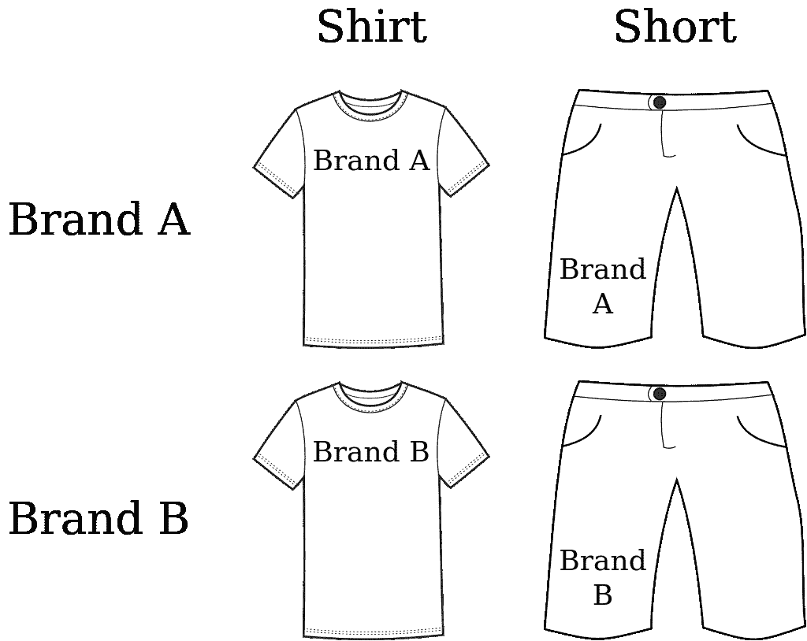
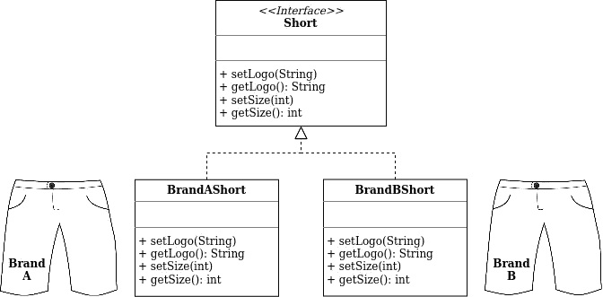
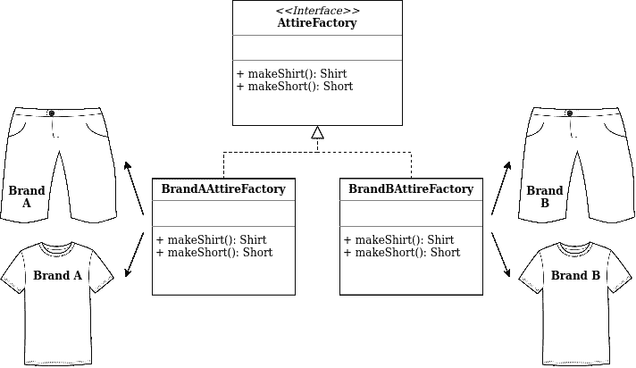
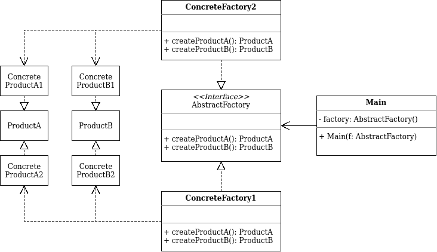

# 学习 Golang 抽象工厂的简单指南

> 原文：<https://levelup.gitconnected.com/a-easy-guide-to-learn-abstract-factory-in-golang-6e27c1453999>


[卡洛斯·阿兰达](https://unsplash.com/@carlosaranda?utm_source=medium&utm_medium=referral)在 [Unsplash](https://unsplash.com?utm_source=medium&utm_medium=referral) 上拍摄的照片

抽象工厂设计模式解决了在不指定具体类的情况下创建整个产品组的问题。

# 问题



假设您正在创建一家运动服装店。您的代码可以由表示以下内容的类组成:

1.  一组相关产品:`Shirt` + `Short`
2.  该组的变体。例如，产品`Shirt` + `Short`在这些变体中可用:`Brand A` + `Brand B`

当顾客收到不相配的运动服时，他们会不高兴。需要一种方法来创建单独的运动服装对象，以便它们与同一组的其他对象相匹配。

还有另一个问题，运动服供应商经常更新他们的目录，你不想每次都改变代码源代码。

以下是解决方案…

# 解决办法


照片由[斯科特·格雷厄姆](https://unsplash.com/@homajob?utm_source=medium&utm_medium=referral)在 [Unsplash](https://unsplash.com?utm_source=medium&utm_medium=referral) 上拍摄

*   为产品组的每个不同产品显式声明接口
*   然后让产品的所有变体都遵循这些接口
*   例如，所有的 shorts 变体都可以实现`Short`接口等等



*   声明抽象工厂——一个包含产品组中所有产品的创建方法列表的接口(例如，`makeShirt`、`makeShort`等)
*   这些方法必须返回由前面提取的接口表示的抽象产品类型:`Shirt`、`Short`等



*   对于产品组的每个变体，基于 AbstractFactory 接口创建一个单独的工厂类
*   客户端代码必须通过工厂和产品各自的抽象接口与它们一起工作
*   这允许更改传递给客户端代码的工厂类型，以及客户端代码接收的产品变体，而不会破坏实际的客户端代码

# 图表



# 利弊

当然，抽象工厂设计模式也有自己的权衡。下面是这种设计模式的一些优点和缺点。

## 赞成的意见

*   一个工厂的产品相互兼容
*   避免具体产品和客户代码之间的紧密耦合
*   履行*单一责任原则*
*   满足*打开/关闭原则*

## 骗局

*   代码可能会变得比它应该变得复杂

# 如何用 Golang 编写一个简单的抽象工厂？


伊利亚·巴甫洛夫在 [Unsplash](https://unsplash.com?utm_source=medium&utm_medium=referral) 上拍摄的照片

## iShoe 界面

声明一个实现`shoe`功能的接口。

## iShort 接口

声明一个实现`short`功能的接口。

## 给鞋打上商标

## 给短裤打上烙印

## 给混凝土工厂打上商标

## 品牌 B 鞋

## 品牌 B 短

## 品牌 B 混凝土厂

## 运动服工厂界面

## 主要的

## 说明

*   定义一个接口来创建所有不同的产品，但是将实际的产品创建留给具体的工厂
*   每种工厂类型都与产品种类非常相似
*   `main`将调用工厂对象的创建方法，而不是直接创建产品
*   由于每个工厂类型都与一个产品种类非常相似，所以它的所有产品都是兼容的
*   `main`只通过它们的抽象接口与工厂和产品一起工作

## 怎么跑

命令:`go run .`

```
# go run .
Logo: brandB
Size: 14
Logo: brandB
Size: 14
Logo: brandA
Size: 14
Logo: brandA
Size: 14
```

# 外卖食品

我希望您理解如何用 Golang 编写一个简单的抽象工厂，更重要的是理解抽象工厂设计模式如何帮助您更好地设计代码并确保可维护性。

这里是我的 github 页面的链接，提供了 Golang 中抽象工厂设计模式的所有源代码:[https://github . com/leonardyoexl/go-patterns/tree/update _ creation _ patterns/creation/abstract _ factory](https://github.com/leonardyeoxl/go-patterns/tree/update_creational_patterns/creational/abstract_factory)

在下一篇文章中，我可能会探索用 Golang 编写的责任链设计模式。敬请关注！和平！✌️