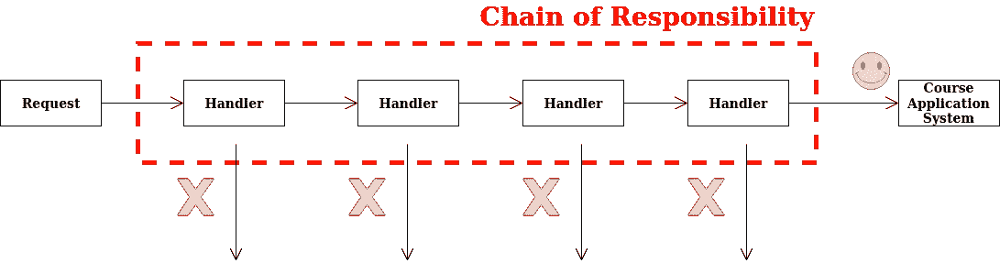

# 学习 Golang 责任链的简单指南

> 原文：<https://levelup.gitconnected.com/a-easy-guide-to-learn-chain-of-responsibility-in-golang-979eba3bda44>


迈克·阿隆佐在 [Unsplash](https://unsplash.com?utm_source=medium&utm_medium=referral) 上的照片

# 什么是责任链？

*   一种行为设计模式，允许您沿着处理程序链传递请求
*   收到请求后，每个处理程序决定是处理请求还是将请求传递给链中的下一个处理程序。

# 问题


假设您正在开发一个在线课程申请系统。这里是在课程可以被应用之前的检查列表。

*   你的一位同事 Jimmy 建议，将原始数据直接传递给课程申请系统是不安全的。所以您添加了一个额外的验证步骤来净化请求中的数据。
*   你的一个同事，汤米，注意到系统容易受到暴力破解密码。为了解决这个问题，您立即添加了一个检查，过滤来自同一个 IP 地址的重复失败的请求。
*   您的一位同事 Daniel 建议，您可以通过返回包含相同数据的重复请求的缓存结果来加速系统。因此，您添加了另一个检查，仅当没有合适的缓存响应时，才让请求传递到系统。

## 头疼得厉害

*   检查的代码看起来已经很乱了，随着您添加每个新特性，它变得越来越臃肿
*   改变一张支票有时会影响到其他支票
*   最糟糕的是，当您试图重用检查来保护系统的其他组件时，您必须复制一些代码，因为这些组件需要一些检查，而不是所有的检查。

# 解决办法



*   CoR 依赖于将特定的行为转换成称为*处理程序*的独立对象
*   该模式建议您将这些处理程序链接成一个链
*   每个链接的处理程序都有一个字段，用于存储对链中下一个处理程序的引用。除了处理请求之外，处理程序还会沿着链进一步传递请求
*   请求沿着链传递，直到所有处理程序都有机会处理它。

# 图表


## **处理器**

*   声明所有具体处理程序通用的接口。
*   通常只包含一个处理请求的方法和另一个设置链中下一个处理程序的方法

## **基础处理器**

*   可选类，用于放置所有处理程序类通用的样板代码
*   这个类定义了一个字段，用于存储对下一个处理程序的引用
*   主类通过将一个处理程序传递给前一个处理程序的构造函数或设置器来构建一个链

## **主**

*   只编写一次链，或者根据应用程序逻辑动态编写链

## **混凝土搬运人员**

*   包含处理请求的实际逻辑
*   收到请求后，每个处理程序决定是否处理它以及是否沿着链传递它
*   通常是自包含的和不可变的，通过构造函数只接受一个数据

# 利弊

## 赞成的意见

*   控制请求处理的顺序
*   履行**单一责任原则**
*   满足**打开/关闭原则**

## 骗局

*   一些请求可能无法处理

# 如何在 Golang 中编写一个简单的责任链？

## 部分

## 材料

## 装配

## 包装

## 工作

## 主要的

## 说明

`section.go`是一个处理程序接口。这个接口处理请求并设置链上的下一个处理程序。

`material.go`是具体的处理程序。它决定是否应该处理收集材料的请求，并可以在链中向上移动。

`assembly.go`是一个具体的处理者。它决定是否应该处理执行组装工作的请求，并且可以在链中向上移动。

`packaging.go`是具体的处理程序。它决定是否应该处理执行打包工作的请求，并可以在链中向上移动。

`main.go`是嫖客。初始化处理程序链。

## 怎么跑

命令:`go run .`

```
Material section gathering materials
Assembly section assembling…
Packaging section doing packaging
```

# 外卖食品

我希望您理解如何用 Golang 编写一个简单的抽象工厂，更重要的是理解责任链设计模式如何帮助您更好地设计代码并确保可维护性。

这里是我的 github 页面的链接，链接到 Golang 中责任链设计模式的所有源代码:[https://github . com/leonardyoexl/go-patterns/tree/master/behavioral/chain _ of _ respons ibility](https://github.com/leonardyeoxl/go-patterns/tree/master/behavioral/chain_of_responsibility)

谢谢你。和平✌️