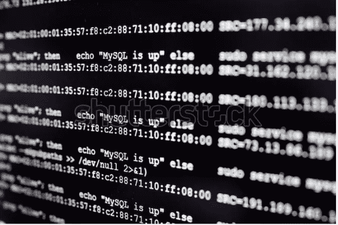
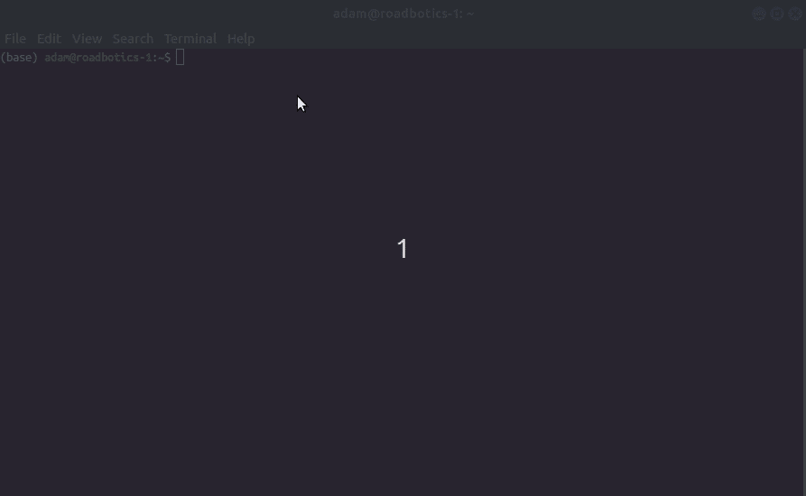
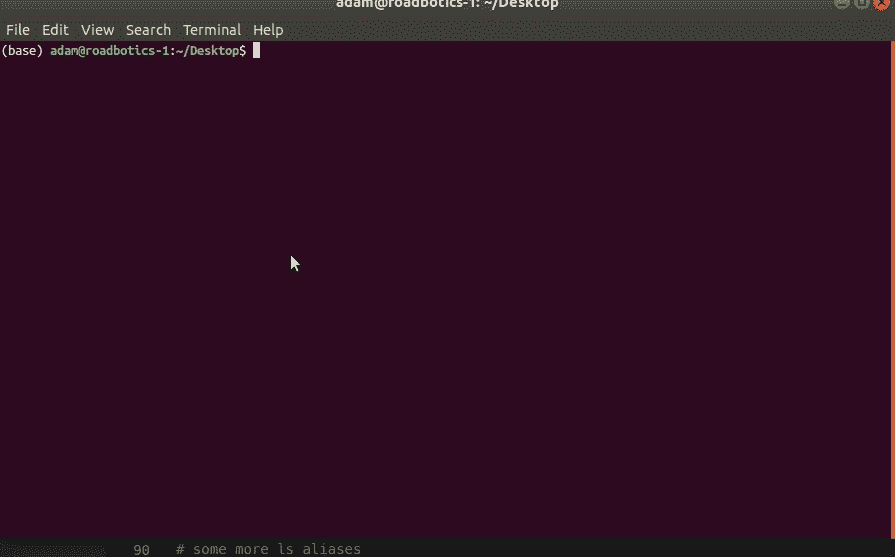
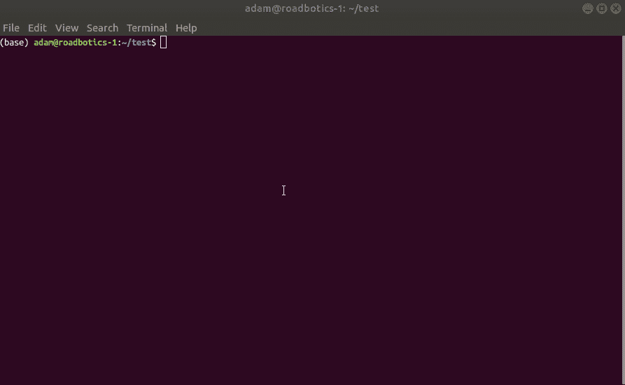
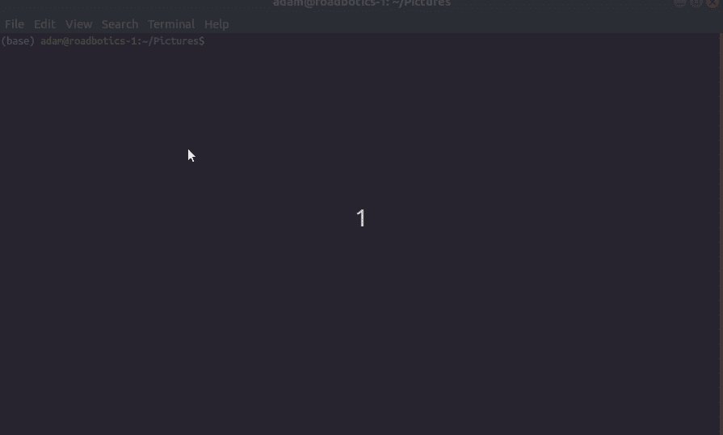
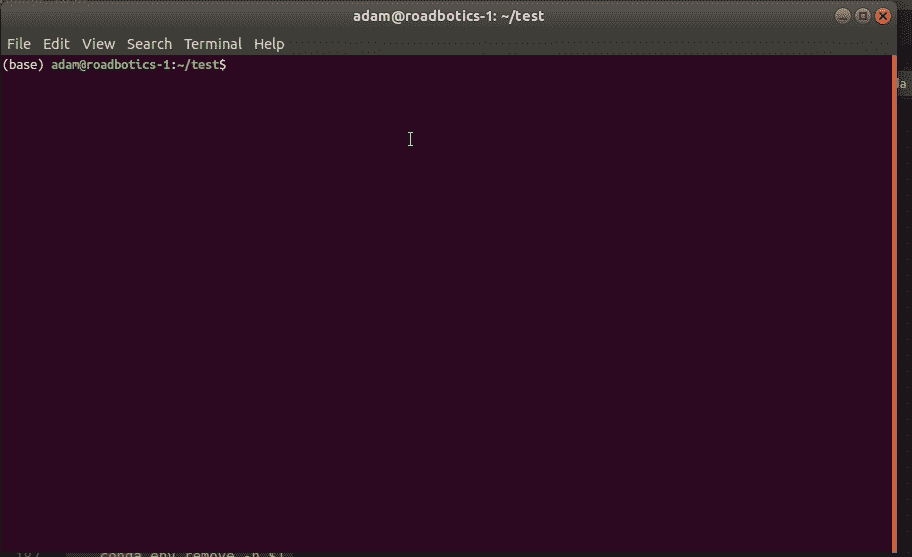

# 一些方便的 Bash 别名

> 原文：<https://levelup.gitconnected.com/a-few-handy-bash-aliases-cf6d24f2ae82>

## Bash 的快速别名



如果你不熟悉([入门指南](https://medium.com/@tzhenghao/a-guide-to-building-a-great-bashrc-23c52e466b1c))有一个特殊的文件，传统 Linux 上的`~/.bashrc`和 Mac 上的`.bash_profile`，用于存储所有终端会话的别名。你可以*也应该*利用这些来打造超级定制的计算体验，并大幅提升你的工作效率。在本指南中，我将分享一些我最喜欢的定制 bash 配置文件命令。**如果你有一些分享，请留下评论，我会把它们放在文章里。**

# 懒骨头

有些命令非常常见，将它们重新映射为两三个字母的单词更容易，

```
alias gr='grep'
alias cl='clear'
alias lc='wc -l'  # Count lines in a file
```

# 元

以下快捷方式与使用`.bashrc`文件本身有关。

```
alias rcopen="code ~/.bashrc"
alias rccat="cat ~/.bashrc"
alias refresh=". ~/.bashrc && echo 'refreshed...'"
```

1.  `rcopen`在 VSCode 中打开 bash 概要文件进行快速编辑(用`vi`、`nano`或您选择的编辑器替换`code`)。
2.  `rccat`将其内容打印到终端。这对于试图记住一个命令非常有用，例如`rccat | grep foo`在配置文件内容中搜索“foo”。
3.  对文件`refresh`进行编辑后，只需将其应用于当前终端(否则必须打开一个新的终端来查看更改)。

看吧。下面的 gif(用 [Peek](https://github.com/phw/peek) 制作)是我们如何使用它们的例子。我将搜索命令“hello ”,对其进行编辑，然后刷新 shell。



快速查找、编辑和刷新您的 bash 配置文件

# 航行

人体工程学导航可能是我最喜欢使用终端的原因。简单的第一步是创建常用文件夹的快捷方式。

```
alias desk="cd ~/Desktop"
alias down="cd ~/Downloads
```

进入文件夹后，使用类似`tree (sudo apt-get install tree)`的强大工具深入查看，或者使用下面的`dcount`和`ll`别名快速总结文件/文件夹的大小。

```
alias ll='ls -lah'           
alias lla='ls -l -d $PWD/*'  # Shows full file paths
alias dcount="du -sch ./*"
```

也许终端没有剪切它，你只需要在文件浏览器中打开当前文件夹

```
alias vopen="nautilus . 2>&1"
```



增强的导航和浏览

# 文件争论

尝试这些复制命令(ctrl + alt + v 随后粘贴)

```
alias cpy="xclip -selection clipboard"
alias pwdcp="pwd | cpy"
alias fpath="readlink -f" 
```

`cpy`可用于管道，例如`echo 'foo' | cpy`将‘foo’复制到剪贴板。`pwdcp`在粘贴当前目录的完整路径时非常有用，例如粘贴到导航栏中。相反，如果需要当前文件的完整路径，请尝试`fpath.`



玩复制/粘贴游戏

# 操作系统材料

快速关机、重启和清除`~/Downlaods`文件夹的一些基本命令。

```
alias godmode="sudo -s"
alias poweroff="sudo shutdown -h now"
alias restart="sudo reboot"
alias cleardown="cd ~/Downloads && rm -r *"
```

注意，任何时候使用`rm -r *`都是在玩火。我强烈建议使用`trash`命令和映射`rm`，这样`rm -r`将把删除的文件放到`trash:///`文件夹中(假设是 Linux——不确定是 mac equiv。)

```
sudo apt-get install trash-cli
$ alias rm=trash
```

有时候查看你的[公共 IP 地址](https://www.whatismyip.com/what-is-my-public-ip-address/#:~:text=What%20Is%20My%20Public%20IP%20Address%3F,we%20show%20on%20our%20homepage.)是有用的(`ifconfig`没有显示这个)

```
function myip(){
   myip="$(dig +short myip.opendns.com @resolver1.opendns.com)"
   echo "My WAN/Public IP address: ${myip}"
}
```

作为一名程序员，当运行 TensorFlow 模型这样的 GPU 密集型代码时，监控 GPU 是有用的，但 Nvidia 显示器配置还有很多需要改进的地方(反正在 Ubuntu 18.04 上)。试试这个可爱的家伙

```
alias showgpu="watch -d -n 0.5 nvidia-smi"
```



`nvidia-smi`输出 GPU 的文本摘要，而`watch -d -n 0.5`每 0.5 秒刷新一次视图，并突出显示任何更改。这对于监控 GPU 进程、温度和利用率百分比尤其有用。

# 码头工人

清除 [docker 缓存，](https://docs.docker.com/config/pruning/)显示停止的容器，编辑 docker 配置文件，并用这些别名将 shell 放入一个正在运行的容器中

```
function dclear(){
  docker system prune -a
}alias dockstopped="docker ps -a | grep Exit"
alias dconfig="cat ~/.docker/config.json"function dssh(){
   docker exec -it $1 /bin/bash
}
```

注意传递给`dssh`的参数是`docker ps`命令的输出。

# 蟒蛇

如果你是 Python 程序员，你可以使用 [anaconda](https://www.anaconda.com/) 来管理虚拟环境。如果是这样，请考虑使用以下别名来快速列出、创建和删除 conda 环境。

```
alias cenvs="conda info --envs"
alias activate="conda activate"
alias deactivate="conda deactivate"function cremove(){
    conda env remove -n $1
}function ccreate(){
   conda create -n $1 python=3.6 pip
   conda activate $1
}
```

参考前面的**导航**部分，如果`cd`进入一个 python 项目文件夹，考虑激活一个相关的虚拟 env。例如，作为别名的一部分

```
alias helloproject="cd ~/Projects/hello && activate helloproject"
```



快速列出/创建/删除 conda 虚拟环境的别名。