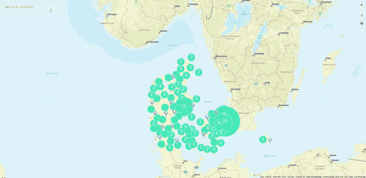
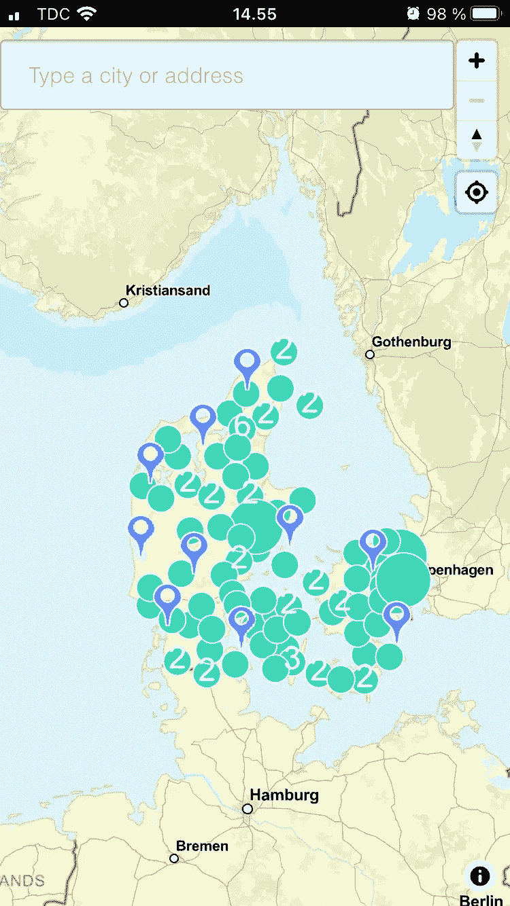
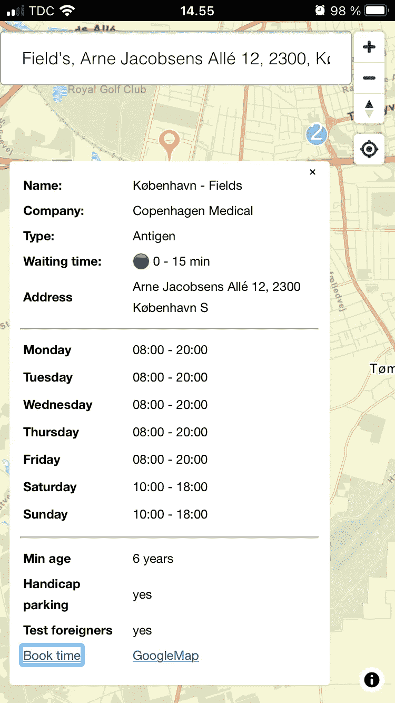
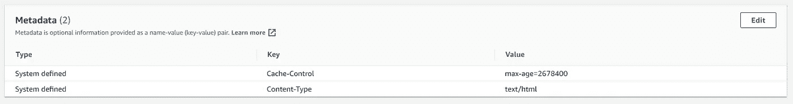
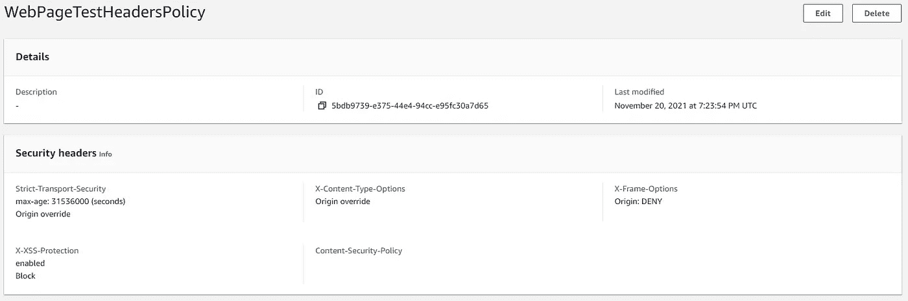
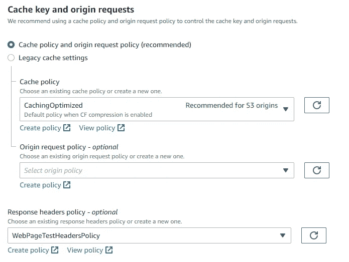
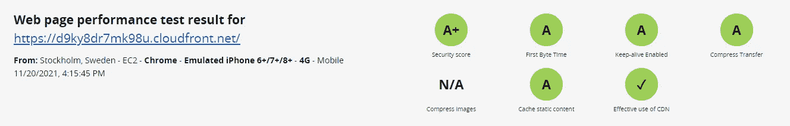

# 由 Amplify Geo 和位置搜索驱动的“查找电晕测试中心”PWA

> 原文：<https://levelup.gitconnected.com/a-find-corona-test-centers-pwa-powered-by-amplify-geo-and-location-search-bcd6c23dcf7d>

鉴于最近丹麦 Corona 案例的可悲增长和我对 AWS 社区建设者计划的参与，我决定通过创建一个渐进式 React web 应用程序来结合这两个主题，该应用程序旨在搜索我居住的丹麦的 Covid19 考试中心。

地图使用

我将使用 [Amplify Geo](https://aws.amazon.com/about-aws/whats-new/2021/09/amplify-geo-aws-amplify/) 和 [Amazon Location Service](https://aws.amazon.com/location/) ，前者为网络应用程序添加位置感知功能，后者提供安全、可靠、高质量的地理空间数据，这些数据来自老牌全球提供商，如 [Esri](https://www.esri.com/en-us/home) 和[Here.com](https://www.here.com/)。

数据可通过 Rest API 从 [Coronasmitte](https://coronasmitte.dk/#) 和 [CphMed](https://www.cphmed.com/) 获得，这两个网站也是查找中心信息的非常有价值的网站。

最后，该应用程序将被部署在与 S3 相关的 CloudFront 发行版上。你可以在这里浏览 web app [。](https://d9ky8dr7mk98u.cloudfront.net/)

# 先决条件

本文假设您:

*   知道如何通过 Create React App 工具创建一个[渐进式 React app](https://create-react-app.dev/docs/making-a-progressive-web-app/)
*   知道如何在项目中配置和初始化放大器
*   熟悉 Geo 的[入门指南](https://docs.amplify.aws/lib/geo/maps/q/platform/js/#sample-application)

# 应用使用案例

该应用程序的用户将能够:

*   使用位置和位置组(也称为集群)导航交互式地理地图，能够通过地址栏搜索位置，并通过位置搜索服务获得建议。

搜索文本、缩放等等

*   当点击特定位置时，访问有价值的测试中心信息，如地址、开放时间、等待时间、类型(抗原或 PCR)等，这又会打开一个弹出窗口。

关于考试中心的信息

# 放大 Geo 主要组件

[入门指南](https://docs.amplify.aws/lib/geo/maps/q/platform/js/#sample-application)相当全面，所以我不会重复本文中的很多步骤。相反，让我们看看 Amplify Geo 中的两个主要组件:地图和位置搜索。

## 地图

基于 [MapLibre GL](https://github.com/maplibre/maplibre-gl-js) 库，Amplify Geo [Maps](https://docs.amplify.aws/lib/geo/maps/q/platform/js/) 主要通过 *maplibre-gl-js-amplify* 包抽象交互矢量地图的用法，在网络上可视化交互矢量地图，其中公开了两个非常重要的方法:

*   *createMap，*非常自明的初始化地图默认属性的方法，如缩放级别，地图中心等。
*   *绘制点，*在给定坐标的情况下，将它们组织成集群(位置组)和非集群(指示特定测试中心的标记)选项，用于修改地图中元素的外观和感觉。聚类中的数字表示该区域中存在的考试中心的数量。

完整代码可以在 [GitHub](https://github.com/aladevlearning/app-corona/blob/main/src/components/CoronaMap/CoronaCentresMap.js) 中找到。下面的代码片段显示了上述方法的实现。

创建地图选项

## 位置搜索

[位置搜索](https://docs.amplify.aws/lib/geo/search/q/platform/js/)通过在后台使用 Esri 或 Here Geo 定位平台，实现地址、城市等位置的搜索。通过将它与几个 React 组件( [AutoSuggest](https://react-autosuggest.js.org/) 和[de bounce input](https://github.com/nkbt/react-debounce-input)—Github code[这里是](https://github.com/aladevlearning/app-corona/blob/main/src/components/SearchField/SearchField.js))相结合，用户能够输入文本，这最终会弹出一系列通过 *Geo.searchByText* 方法通过位置搜索找到的建议。

绘制地图选项

# 渐进式 Web 应用程序陷阱

在撰写本文时，PWA 可以安装在桌面和 Android 的 Chrome 浏览器上(通过三点菜单和安装应用程序项目)。对于 IOS，您可以从 Safari 手动将应用程序添加到主屏幕，获得如下内容:

我手机上的 PWA 图标

# 评估应用安全性和性能

[网页测试](https://www.webpagetest.org/)是一个成熟的网站，可以用来衡量你的网页的安全性和性能。经过初步筛选后，显然需要采取一些措施:

*   出于缓存目的，控制缓存头应设置为 S3 存储桶，方法是通过编辑和*添加元数据*选项向存储桶中的所有对象添加元数据:

*   由于[最近发布了](https://docs.aws.amazon.com/AmazonCloudFront/latest/DeveloperGuide/example-function-add-security-headers.html)下的*策略* - > *响应头*，创建一个添加安全相关头的自定义策略

*   通过关联缓存策略和我们刚刚创建的响应头策略来编辑分发行为。

经过上述改变后，我们从一个完整的血液报告到一个更好的视图:

以上不是默认的 Amplify *add hosting* 命令的一部分，但是最近发布的关于[自定义资源](https://aws.amazon.com/blogs/mobile/extend-amplify-backend-with-custom-aws-resource-using-aws-cdk-or-cloudformation/)、[导出](https://aws.amazon.com/blogs/mobile/export-amplify-backends-to-cdk-and-use-with-existing-deployment-pipelines/)和[覆盖](https://aws.amazon.com/blogs/mobile/override-amplify-generated-backend-resources-using-cdk/)的版本可以通过 CDK 堆栈帮助实现自动化。

# 摘要

Amplify Geo 可让您在数小时内轻松快速地设置安全、可扩展的地图功能和基础设施。

关于 PWA 区域，我将来可能会添加一个[组件](https://github.com/as-ideas/add-to-homescreen-react)，它可以主动弹出安装过程。

由于我仍在自由层区，我也非常有兴趣关注[定价](https://docs.amplify.aws/cli/geo/maps/#map-pricing-plan)，如果有值得一提的东西出现，我一定会更新这一部分。

# 参考

[https://docs . amplify . AWS/lib/geo/getting-started/q/platform/js](https://docs.amplify.aws/lib/geo/getting-started/q/platform/js/)