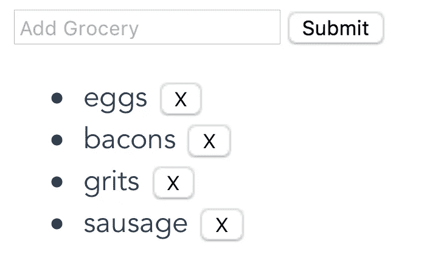

# Vue3 初探——一个组合 API 教程

> 原文：<https://levelup.gitconnected.com/a-first-look-at-vue3-composition-api-3154c6ea2c26>


由[活动创作者](https://unsplash.com/@campaign_creators?utm_source=medium&utm_medium=referral)在 [Unsplash](https://unsplash.com?utm_source=medium&utm_medium=referral) 上拍摄的照片

虽然 Vue 3 还没有完全出来，但是仍然有一些部分可以在 Vue 2 项目中实现。许多开发人员一直在探索的最流行的特性之一是复合 API。

实际上，在现有项目中开始使用它非常容易——所以我们不要浪费时间，直接开始吧。

# 那么什么是组合 API 呢？

通过将特定特性(例如搜索)的所有代码分组在一起，组合 API 允许更直观地定义反应式组件逻辑。

与当前的 API 相比，新组件 API 的结构在几个组件之间也更具可伸缩性和可重用性。

从本质上讲，它允许将组件逻辑组合到一个整洁的小组合函数中，这些函数可以在组件之间重用。

如果你想了解更多关于组合 API 的技术细节，我肯定会继续下去，查看更深入解释它的[文档](https://vue-composition-api-rfc.netlify.com/#basic-example)。

# 组合 API 示例

对于这个例子，我们将创建一个简单的杂货列表组件，它显示杂货列表并允许用户添加/删除商品。

首先，让我们看看使用当前的 Vue 2 API 会是什么样子。

这是维护购物清单项目的功能。现在想象一下我们可能希望这个组件具有的所有其他特性:搜索、排序、价格匹配等。

这应该只是显示这样一个简单的应用程序。



生成的网页。

所有这些特性都会给组件的数据和方法部分添加大量代码，并使跟踪单个特性变得更加困难。这就是组合 API 发挥作用的地方。

# 实现组合 API

现在，让我们将它转换成包含新的组合 API。首先，我们必须使用`npm install --save @vue/composition-api`来安装它

然后，为了将它实际导入到您的项目中——我们必须将它包含在`main.js`文件中。为此，只需添加以下几行:

```
import VueCompositionApi from '@vue/composition-api' Vue.use(VueCompositionApi)
```

我将展示这个新组件，然后进一步分解它。

这应该与我们创建的第一个组件具有完全相同的功能。

# 等等，这是怎么回事？

您可能会注意到脚本的组织看起来完全不同。让我们深入了解一下。

首先，`data`和`methods`选项完全消失了，取而代之的是这个新的`setup`方法。这个方法在生命周期钩子`beforeCreate`之后、`create`之前被调用。

虽然您可以在这个 setup 方法中声明 state 变量和方法，但是这个示例的工作方式是将所有的杂货列表功能都包含在它自己的方法中。这也可以从可重复使用的外部文件导入。这个方法所要做的就是从其他方法返回它希望可见的变量和函数。

```
setup() {
    const { state, addGrocery, deleteGrocery } = useGroceryList(); return { state, addGrocery, deleteGrocery };
}
```

然后，就有了这个`state`可变的东西。需要注意的一件重要事情是，它指向电抗值，这是 Vue3 的变化之一，能够直接控制暴露哪些电抗元素。虽然这并不意味着我们必须在模板中引用变量作为`state.input`,但它给了我们更多的精度，让我们确切地看到从每个方法中导出了什么。

```
let state = reactive({
    input: "",
    groceries: []
});
```

我们不必在组件的一个宽泛的`methods`选项中声明我们所有的函数，我们只需在我们的`useGroceryList`方法中声明它们，并将它们组合在一起。当一个组件中有许多不同的特性和方法时，这是非常有用的。

```
function addGrocery() {
    state.groceries.push(state.input);
    state.input = "";
}function deleteGrocery(index) {
    state.groceries.splice(index, 1);
}return { state, addGrocery, deleteGrocery };
```

重要的是，我们希望能够从模板中访问的所有内容都由*`useGroceryList()`和`setup()`方法返回。*

# *这怎么更好？*

*与 Vue 2 当前用于实现组件逻辑的 API 相比，使用组合 API 有三大优势:可读性、可伸缩性和熟悉性。*

## *1.可读性*

*在 Vue 2 中，每个组件都有许多不同的部分，这些部分是成功拥有反应逻辑所必需的:数据、计算、方法等等。*

*在具有数百/数千行代码的大型应用程序中，这些部分可能彼此相距很远，这使得跟踪代码和调试声明、逻辑等变得更加困难。*

*组合函数包含了所有的声明和逻辑——使得代码更易读、更易理解。*

## *2.可量测性*

*除了组合功能允许代码更加模块化和组织化，它还允许代码更容易维护和扩展。*

*现在，有几种方法可以重用组件逻辑，最流行的方法是 VueJS Mixins。然而，mixins 有一些限制。*

*[](/how-to-use-mixins-in-vuejs-a40cc3fb4428) [## 如何管理 VueJS 中的 Mixins

### 通过正确使用 mixins 来避免键入重复的代码，从而节省您的时间、代码和精力。

levelup.gitconnected.com](/how-to-use-mixins-in-vuejs-a40cc3fb4428) 

首先，当 mixins 与组件内部的变量名/方法冲突时，它会变得很棘手。第二，也是更重要的一点，mixins 不灵活——它们被定义，然后原样导入到组件中。

使用组件功能，特定功能所需的所有数据都是独立的，不会与组件冲突。此外，因为它们只是您的典型函数，所以它们可以接受各种参数并适应每个组件的需求。

## 3.熟悉

正如您可能在示例中看到的，对于熟悉 Javascript 的人来说，这些函数的语法非常直观。现在，您需要了解更多关于 VueJS 特定生命周期挂钩和组件架构的知识来实现一个特性。但是通过暴露 Vue 的反应能力，用组合 API，Vue 3 使它变得简单多了。

对于一门已经非常适合初学者的语言来说，这只会让它变得更好。

# 总之…

组合 API 是使代码更具可读性和可维护性的好方法。它将有助于更大的 Vue 项目更加模块化和可重用，这大大减少了开发人员将面临的麻烦。

虽然这只是 Vue 3 即将到来的变化的冰山一角，预计将于 2020 年在 Q1 正式发布，但这是 Vue 团队正在进行的对开发人员友好的变化的一个非常有希望的迹象。看起来他们已经发现了开发团队的许多痛点，并试图提供可行的解决方案，同时不做极端激烈的改变。* 

*如果你有兴趣了解更多关于 Vue 3 的知识，请下载我的免费 Vue 3 备忘单，里面有一些基本知识，比如合成 API、Vue 3 模板语法和事件处理。*