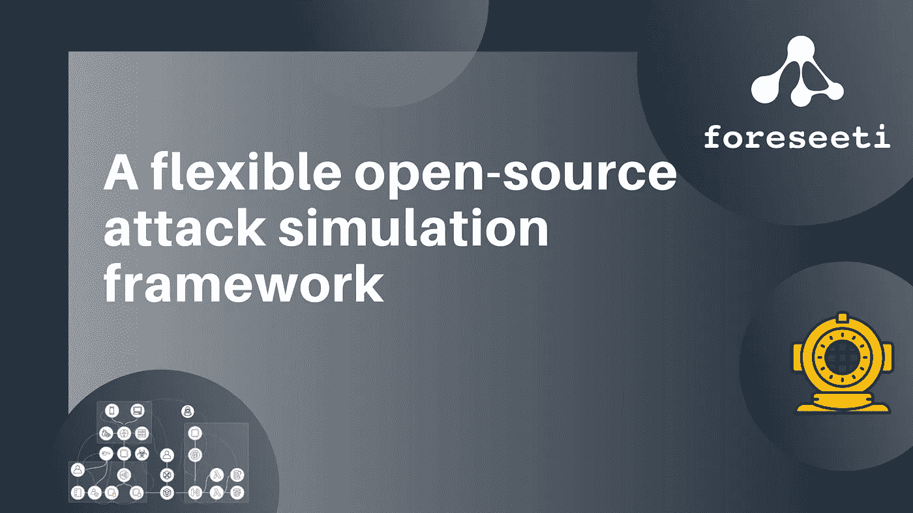

# 一个灵活的开源攻击模拟框架

> 原文：<https://levelup.gitconnected.com/a-flexible-open-source-attack-simulation-framework-e273dcd8de34>



对于应用程序
开发和系统分析来说，威胁建模变得越来越普遍。然而，大多数威胁建模
方法仍然是高度手动的。也就是说，你必须弄清楚
你正在分析的系统是什么样的，以及哪些类型的威胁
需要缓解。对于正在开发的小型应用程序来说，这可能是一项有用的活动，但是对于大型系统来说，这是不可伸缩的。

为了创建一个现有系统的模型，建议根据可用的数据源来做这件事
，例如网络和漏洞
扫描器、防火墙规则和资产清单。通过这样做，你得到了一个反映整个系统的精确模型，因为它实际上是被实现的，而不是建模者的梦幻视图。您可以持续更新您的模型。


有了您系统的这个新的精确模型，现在是时候弄清楚
它是否安全了。当你意识到有很多弱点会被攻击者利用时，你需要决定最好的缓解策略是什么。为此，威胁建模社区一直依赖于
安全专家。然而，在一个平行宇宙中，其他人一直在使用
攻击图来运行模拟回答这些类型的问题。攻击图社区的
问题类似于
图(模型)的创建。由于系统庞大而复杂，所以
图也变得庞大而复杂。因此，创建一个是困难的、耗时的、容易出错的，并且结果不太可信。

我在这里提出的新想法是将威胁模型与
攻击模拟结合起来。为此，我们开发了元攻击语言
(MAL) [1]。这是一个开源框架[2]，可以用来创建特定于领域的(建模)语言(DSL)。使用 MAL，您可以
描述您对哪些资产感兴趣，例如计算机、网络、
软件，这些资产可能会受到哪些攻击，以及可以减轻这些攻击的
防御措施。有了 MAL，你就可以完全自由地创建自己的威胁建模和攻击模拟语言。有趣的是，当你实例化你的资产时，例如
Robert 的 MacBook Air 运行 macOS Big Sur v.11.2.3，你还会得到它的
底层攻击和防御图。因此，当您有了
威胁模型(资产以及这些资产是如何相互联系的)时，您可以
自动运行一个模拟来指出您的弱点在哪里
以及可以添加哪些缓解措施来降低风险的建议
。

下面是一个恶意代码的小例子，这是基于米特企业 ATT & CK 矩阵
的
技术和缓解措施，摘自一篇研究论文【3】。

在这个小例子中，我们可以看到两类资产，即:
账户和软件。其中我们有用户帐户和
管理员帐户，WindowsAdmin 继承自一般的
管理员帐户。对于软件类别，我们有窗口和服务。
对于每项资产，都定义了攻击步骤。例如，如果攻击者
获得了用户帐户的用户权限，这可能会导致 Windows 机器上的
useraccestokenmanipulation 攻击。资产
也可以有相关的防御。对于用户权限攻击，一个可能的防御措施是拥有适当的用户帐户管理。资产之间的
关联也被定义，例如一台 Windows 机器
运行多个服务。

```
category Account {
        asset UserAccount {
        | userRights
                -> windows.userAccessTokenManipulation
        # userAccountManagement
                -> windows.userAccessTokenManipulation
}
asset AdminAccount {
        | adminRights
        # privilegedAccountManagement
}
asset WindowsAdmin extends AdminAccount {
        | adminRights
                +> windows.adminAccessTokenManipulation
        # privilegedAccountManagement
                +> windows.adminAccessTokenManipulation
        }
}
category Software {
        asset Windows {
                & userAccessTokenManipulation
                info: "Adversaries may use access tokens to operate           under a different user or system security context to perform actions and evade detection." -> service.exploitationForPrivilegeEscalation
                & adminAccessTokenManipulation
                       -> service.exploitationForPrivilegeEscalation
}
        asset Service {
                | exploitationForPrivilegeEscalation
        }
}
associations {UserAccount [userAccount] * <--Accesses--> 1 [windows] WindowsAdminAccount [adminAccount] * <--Accesses--> 1 [windows] WindowsWindows [windows] 1 <--Runs--> * [service] Service}
```

任何基于 MAL 的 DSL 都可以使用 foreseeti [4]的 [securiCAD](http://foreseeti.com/foreseeti-overview) 工具运行。
这将为您提供更高级的功能，例如漂亮的
图形表示、多用户环境、用于数据导入的 API、酷的
指标和报告。Foreseeti 拥有基于 MAL 和
的 DSL 和产品，在更成熟和广泛使用的 DSL 中，您可以找到 AWS
(securiCAD Vanguard) [5]、Azure [6]和 on-prem IT [7]的 DSL。也有用于车辆系统[8]和电力系统[9]的 DSL 可用。如果你不想用这些现成的，你可以根据自己的需要定制，或者
从头开始创建自己的。大多数 DSL 都是开源的，可以通过 MAL GitHub 库访问。
想象一下，一个点击工具就能获得对您整个
基础设施的网络安全分析。我们还没有完全做到这一点。然而，有了 MAL 我们
不需要太多的点击就能意识到这一点。

[1] **马尔** [https://doi.org/10.1145/3230833.3232799](https://doi.org/10.1145/3230833.3232799)彭图斯·约翰逊、罗伯特·拉格斯特伦和马蒂亚斯·埃克斯特特。2018.威胁建模和攻击模拟的元语言。《第十三届可用性、可靠性和安全性国际会议论文集》(ARES 2018)。

【2】**MAL 为开源** [https://mal-lang.org](https://mal-lang.org)
**Foreseeti** 【3】[https://foreseeti.com](https://foreseeti.com)

**DSLs** 【4】AWS—[https://foreseeti.com/securicad-vanguard-for-aws/](https://foreseeti.com/securicad-vanguard-for-aws/)
【5】Azure—[https://foreseeti.com/securicad-enterprise/](https://foreseeti.com/securicad-enterprise/)
【6】coreLang—[https://doi.org/10.1007/978-3-030-62230-5_4](https://doi.org/10.1007/978-3-030-62230-5_4)
Katsikeas s .等人(2020)一种面向 IT 领域的攻击模拟语言。在安全的图形模型中。葛兰西 2020。计算机科学讲义，第 12419 卷。斯普林格。
【7】车郎—[https://www.scitepress.org/Link.aspx?doi = 10.5220/0007247901750182](https://www.scitepress.org/Link.aspx?doi=10.5220/0007247901750182)
Katsikeas，s；约翰逊，p。Hacks，s .和 Lagerströ，R. (2019 年)。车辆网络攻击的概率建模和模拟:元攻击语言的应用。第五届信息系统安全与隐私国际会议论文集。
【8】powerLang——
Hacks，s，Katsikeas，s，Ling，e .等 power lang:一种面向电源域的概率攻击模拟语言。能源信息 3，30 (2020 年)