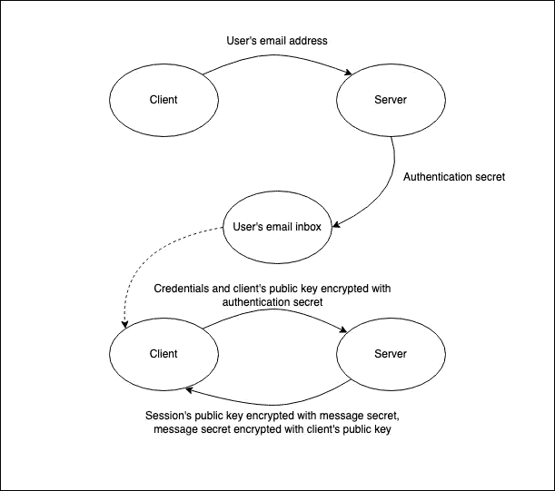
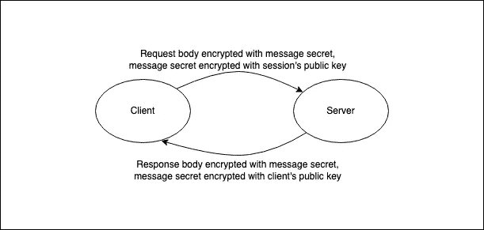
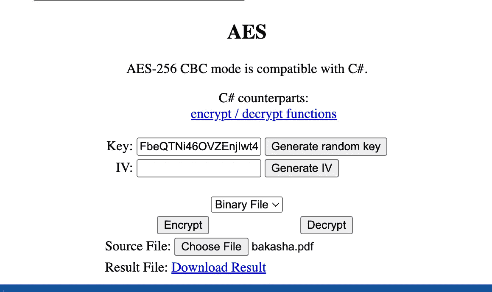

# 一个免费且简单的兼容 C#的 Javascript 加密工具

> 原文：<https://levelup.gitconnected.com/a-free-and-easy-c-compatible-encryption-tool-for-javascript-cf6712f10f06>

[cotton bro 拍摄的照片](https://www.pexels.com/photo/photo-of-person-taking-down-notes-7319070/)

很久以前——几年前——我的任务是建立安全的通信渠道，既能在公共互联网上工作，又能提供无线的内部解决方案。后端解决方案主要是用 C#编写的，c#是 Javascript 的浏览器客户端。

当时我对密码学知之甚少。现在，我已经比大多数开发人员学到了更多，我可以自信地承认，我几乎没有掌握基础知识。

良好的安全性是符合每个人最大利益的事情之一。这种事情可以成就或摧毁一种产品或服务，也可以在瞬间搞垮一个大行业。这是我们所有人都认为开发人员会考虑并正确实现的事情，这是大多数开发人员认为他们理解的事情，但事实上，他们远远偏离了这条曲线:

[忍者猫, CC0, via Wikimedia Commons](https://commons.wikimedia.org/wiki/File:Dunning%E2%80%93Kruger_Effect_01.svg)

**如果是你，不要太难过！至于我自己，我一直在进步，直到我觉得自己笨拙地潜伏在绝望的山谷中。我们不可能在所有方面都是专家。**

## 战略

作为一名密码爱好者，我相信专家们会从下面的模式中挑出很多东西:请在评论中随意向我倾诉…我总是渴望了解更多！

我提出的认证模式在原理上有点类似于安全 HTTP 的工作方式，不依赖于认证机构。

1.  客户端生成一个公钥和私钥对，如果它还没有这样做的话。
2.  客户端通过向服务器发送包含用户电子邮件地址的请求来发起认证挑战，服务器生成认证秘密并将其发送到所提供的电子邮件地址(或移动电话)。
3.  用户将身份验证密码以及他们的电子邮件地址和密码输入客户端。
    *密码可能对安全目的没有帮助，但出于合规目的却是必需的。*
4.  客户端使用用户的凭据及其公开的 RSA 密钥发出身份验证请求，所有这些都使用 256 位 AES-CBC 密码通过电子邮件发送的身份验证机密进行了加密。
5.  如果服务器可以使用身份验证机密解密凭证和公钥，并且凭证与系统*中注册的凭证相匹配，则客户端已成功通过身份验证。
    * *哈希加盐* [***妥妥的***](https://crackstation.net/hashing-security.htm) *！出于对一切神圣事物的热爱，绝不储存明文凭据*！
6.  身份验证成功后，服务器会为会话生成一个公钥和私钥对，并为身份验证响应生成一个密码。
    *密钥生成可能需要一段时间，值得考虑在发起挑战时预先生成密钥对。*
7.  服务器使用使用生成的密钥加密的会话公钥和使用客户端公钥加密的生成的密钥进行响应。

成功通过身份验证后，每条消息将按如下方式加密:

1.  客户端生成一个随机字符串，用作特定于消息的秘密。
2.  使用生成的机密对消息进行加密，使用会话的公钥对生成的机密进行加密。
3.  服务器使用会话的私钥解密机密，并使用解密的机密解密邮件。
4.  服务器处理请求。
5.  服务器生成一个随机字符串，用作特定于消息的秘密。
6.  使用生成的机密对消息进行加密，使用客户端的公钥对生成的机密进行加密。
7.  客户端使用其私钥解密机密，并使用解密的机密解密消息。

> 值得注意的是，我的模式计算量很大，这对一些人来说可能是一个障碍。我相信有更优化的方法来实现既定目标。话虽如此，性能对于我们的目的来说还是绰绰有余的。

## 实施

有了上面的模式，我很快发现设置这一切并不容易。相当多的移动部件，对开发社区没有太大兴趣。

> **随着时间的推移，我越来越感到沮丧的是，人们对良好的安全性关注得如此之少，而我们通常似乎又如此依赖希望和祈祷。**

我不想太深入地探究我遇到的问题的细节，所以我将列出它们并将其链接到相关代码，这样如果您感兴趣，就可以深入了解:

*   [c#中 RSACryptoServiceProvider 密钥和 OpenSSH 密钥之间的转换](https://github.com/therightstuff/simple-free-encryption-tool/blob/master/examples/csharp/RSAKeys.cs)
*   [用 Javascript 生成兼容 C#的 RSA 密钥](https://github.com/therightstuff/simple-free-encryption-tool/blob/master/src/keyGenerator.js)
*   [在 C#中配置兼容 Javascript 的 RSA 加密和解密](https://github.com/therightstuff/simple-free-encryption-tool/blob/master/examples/csharp/RSA.cs)
*   [用 Javascript 配置兼容 C#的 RSA 加密和解密](https://github.com/therightstuff/simple-free-encryption-tool/blob/master/src/security.rsa.js)
*   [在 C#中配置兼容 Javascript 的 AES 加密和解密](https://github.com/therightstuff/simple-free-encryption-tool/blob/master/examples/csharp/AES.cs)
*   [在 Javascript 中配置兼容 C#的 AES 加密和解密](https://github.com/therightstuff/simple-free-encryption-tool/blob/master/src/security.aes.js)

这些步骤没有一个是微不足道的，正如您通过检查上面的代码所看到的，对于一般开发人员来说，几乎没有一个代码是直观的。即使我以前使用过所有这些软件包，我也很少有机会能正确地完成任何一项，而不会再感到头疼，并且不得不重新学习一大堆东西。

## 公开可用的解决方案

2019 年 2 月，我意识到我需要一种简单可靠的方法来与非技术人员分享加密代码，并决定将我之前学到的一切放入一个名为 [**简单免费加密工具**](https://www.npmjs.com/package/simple-free-encryption-tool) 的全面 npm 包中，它既可以在 node.js 后端运行，也可以在你的浏览器中运行，甚至不需要克隆就可以快速使用。

*   GitHub 的 HTML 预览:[**https://htmlpreview.github.io/?https://github . com/the right stuff/simple-free-encryption-tool/blob/master/dist/index . html**](https://htmlpreview.github.io/?https://github.com/therightstuff/simple-free-encryption-tool/blob/master/dist/index.html)
*   我自己的托管拷贝以防 HTML 预览不工作:[**https://industrialcuriosity.com/sfet/**](https://industrialcuriosity.com/sfet/)

> 如果你担心隐私，请在浏览器中打开开发工具，切换到网络选项卡。所有的加密和解密都是在您的浏览器客户端本地执行的，没有任何东西被发送出去进行处理。

这使得强大的 RSA 和 AES 密钥生成和加密易于实现，并且可用于客户端-服务器通信。它还允许我给某人一个棒上的加密包(只需复制 **dist** 文件夹)，他们可以(理论上)在任何机器上运行！

## 邮件加密与文件加密

在某种程度上，文件的加密和解密成为我特别感兴趣的事情。如果您向下滚动到示例页面的底部，我添加了使用 AES 加密或解密二进制文件以及消息的功能:

当然，这不是加密文件的标准格式，但它确实能完成任务。我希望它能为任何需要它的人服务，或者激励他们！

## 结论

良好的安全性是符合每个人最大利益的事情之一，我们将良好的安全实践和工具的使用“民主化”也符合每个人的最大利益。这个包是我个人试图解决软件生态系统和开发人员教育中缺失的一个关键元素的结果，我很高兴它能被使用和改进。

感谢阅读，注意安全！

# 分级编码

感谢您成为我们社区的一员！在你离开之前:

*   👏为故事鼓掌，跟着作者走👉
*   📰查看[级编码出版物](https://levelup.gitconnected.com/?utm_source=pub&utm_medium=post)中的更多内容
*   🔔关注我们:[推特](https://twitter.com/gitconnected) | [LinkedIn](https://www.linkedin.com/company/gitconnected) | [时事通讯](https://newsletter.levelup.dev)

🚀👉 [**加入升级人才集体，找到一份惊艳的工作**](https://jobs.levelup.dev/talent/welcome?referral=true)