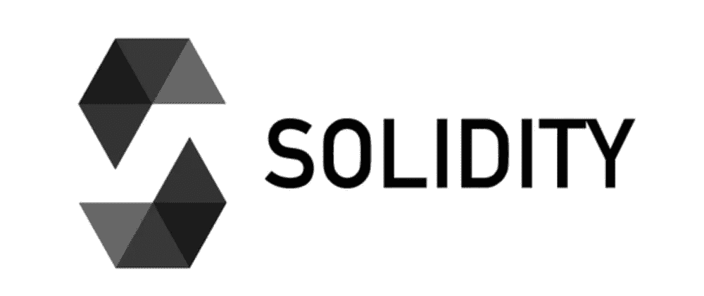
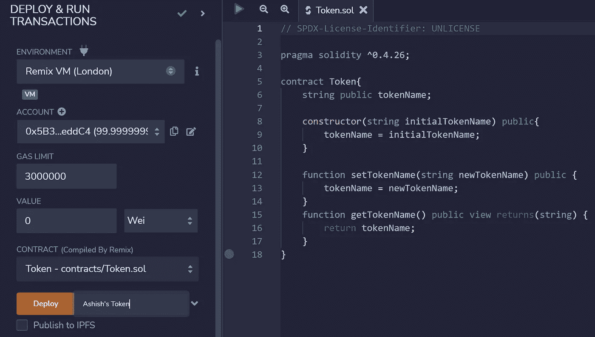
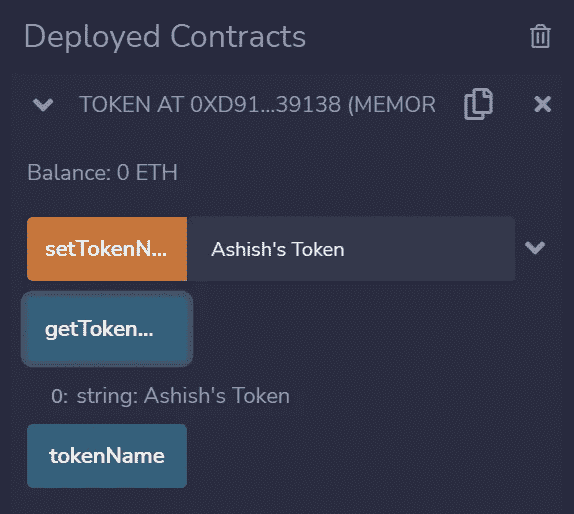

# 稳健的第一课温和(但有效)

> 原文：<https://levelup.gitconnected.com/a-gentle-but-effective-first-lesson-in-solidity-db0de2f503a1>



Solidity 徽标(图片由作者提供)

# 什么是扎实？

Solidity 是一种编程语言，用于创建针对[以太坊虚拟机(EVM)](https://ethereum.org/en/developers/docs/evm/) 的[智能契约](https://en.wikipedia.org/wiki/Smart_contract)。

# 坚固性的特征

1.  它是一种面向对象的高级语言。
2.  它是一种**花括号**语言(使用花括号定义语句块)。
3.  它受到 C++、Python 和 JavaScript 的影响。
4.  它是**静态类型的**，即它的变量类型是显式声明的，并在编译时确定。

# 选择编码平台

要编写 Solidity Smart 合同，可以使用:

*   在线集成开发环境，如 [Remix](https://remix.ethereum.org/) 或，
*   一个代码编辑器如 [VSCode](https://code.visualstudio.com/) 连同[solidity扩展](https://marketplace.visualstudio.com/items?itemName=JuanBlanco.solidity)

# 撰写可靠的智能合同

让我们创建一个名为`Token.sol`的新文件。

> 注意，实体文件以扩展名`.sol`命名。

## SPDX 许可证标识符

Solidity smart 契约以一个表明其许可的注释开始。

例如:

`// SPDX-License-Identifier: **MIT**`

人们可以使用:

*   `**UNLICENSED**`:如果不允许使用或者许可证不在 SPDX 许可证列表中
*   `**UNLICENSE**`:授予每个人所有权利

> 注意单行和多行注释的写法如下:

```
// Single-line comment/*
Multi-line 
comment
*/
```

## 杂注

`pragma`关键字用于启用编译器特性和检查。

例如`pragma solidity ^0.4.26;`

这表明该文件不能用早于 0.4.26 版的编译器编译，也不能用 0.5.0 及更高版本的编译器编译。


Nenad nova kovi 在 [Unsplash](https://unsplash.com?utm_source=medium&utm_medium=referral) 上拍摄的照片

## 进口

*   全局文件可以作为`import "filename";`导入，但这不是首选方法，因为它通过将所有全局符号从“filename”导入到当前全局范围中，不可预知地污染了名称空间。
*   文件应导入为:

`import “filename” as symbolName;` 或


*   为了避免命名冲突，可以使用:

```
import {symbol1 as alias, symbol2} from "filename";
```

## 定义合同

可靠性契约类似于 JavaScript 中的**类**。

它们可以通过以太坊交易或从实体合同中创建。

要定义一个契约，可以使用`contract`关键字以及花括号中的契约名称和内容。

```
contract Token {
    ...
}
```

合同包含:

*   **状态变量**
*   **功能**(可以修改这些变量)

## 状态变量

这些变量的值永久存储在协定中。

与这些相关的常见类型有:

*   布尔(`bool` ): `True`和`False`
*   有符号整数(`int`):`8`步骤中的`int8`到`int256`
*   无符号整数(`uint` ): `uint8`到`uint256`，以`8`为步骤
*   地址(`address`):以太坊地址，20 字节值
*   应付地址(`address payable`，可以发乙醚给它)
*   可枚举列表(`enum`):这些将变量限制为几个预定义值中的一个

> N 注意`undefined`或`null`值不存在于实体中。

我们定义一个名为`tokenName`的状态变量如下:

```
contract Token {
    string public tokenName;
}
```


照片由 [Shubham Dhage](https://unsplash.com/@theshubhamdhage?utm_source=medium&utm_medium=referral) 在 [Unsplash](https://unsplash.com?utm_source=medium&utm_medium=referral) 上拍摄

## 功能

函数可以在协定定义的内部或外部定义。

固体中的函数可定义如下:

```
contract Token{ string public tokenName; function **setTokenName**(string newTokenName) public {
        tokenName = newTokenName;
    }
}
```

> 注意函数定义和契约定义可以不用`;`结束

让我们定义另一个返回`tokenName`变量的函数。

```
contract Token{ string public tokenName; function setTokenName(string newTokenName) public {
        tokenName = newTokenName;
    } function **getTokenName**() public view returns(string) {
        return tokenName;
    }
}
```


照片由[你好我是](https://unsplash.com/@helloimnik?utm_source=medium&utm_medium=referral) [Unsplash](https://unsplash.com?utm_source=medium&utm_medium=referral) 上的 Nik

## 构造器

创建协定时，会调用其构造函数。

这可以使用关键字`constructor`来定义，如下所示。

构造函数接受一个名为`initialTokenName`的`string`类型参数。

```
pragma solidity ^0.4.26;contract Token{
    string public tokenName; **constructor**(string initialTokenName) public{
        tokenName = initialTokenName;
    } function setTokenName(string newTokenName) public {
        tokenName = newTokenName;
    } function getTokenName() public view returns(string) {
        return tokenName;
    }
}
```

你注意到`public`这个关键词了吗？

# 能见度

*   `public`
*   `private`
*   `internal`
*   `external`

**状态变量**可以有`public`、`internal,`和`private`可见性。

*   `internal`状态变量只能从它们在派生契约中定义的契约中访问。
*   `public`状态变量与`internal`相似，除了 Solidity 编译器自动为它们生成 getter 函数。
*   `private`状态变量可以从定义它们的契约中访问，但在派生契约中不可见。

**功能**可以拥有所有四种可见性。

*   `external`可以从其他合同和通过交易调用函数
*   `public`函数可以内部调用，也可以通过消息调用。
*   `internal`只能从当前合同或从其派生的合同中访问功能
*   `private`功能只能从当前合同中访问，在派生合同中不可见

第二，你注意到了吗？

## 查看功能

这些函数从不修改合同的状态，但是可以用来查看它。

W 关于`returns`的帽子？

**返回值**的函数在定义中有`returns`关键字。


由 [Unsplash](https://unsplash.com?utm_source=medium&utm_medium=referral) 上的 [Shubham Dhage](https://unsplash.com/@theshubhamdhage?utm_source=medium&utm_medium=referral) 拍摄的照片

# 完整的合同代码

```
pragma solidity ^0.4.26;contract Token{
    string public tokenName; constructor(string initialTokenName) public{
        tokenName = initialTokenName;
    } function setTokenName(string newTokenName) public {
        tokenName = newTokenName;
    } function getTokenName() public view returns(string) {
        return tokenName;
    }
}
```

# 部署

合同可以使用 [Remix](https://remix.ethereum.org/) 部署在 **Remix VM(伦敦)区块链**上。



部署智能合同(图片由作者提供)

# 与智能合同交互

Remix 提供了一个方便的交互工具来测试我们合同中的功能。



与已部署的合同交互(图片由作者提供)

# 进一步阅读

 [## 坚固性-坚固性 0.8.17 文件

### 部署合同时，您应该使用最新发布的 Solidity 版本。除了特殊情况，只有…

docs.soliditylang.org](https://docs.soliditylang.org/en/v0.8.17/index.html) 

*这就是你第一堂扎实课的全部内容！*

*感谢阅读！*

[](https://bamania-ashish.medium.com/membership) [## 通过我的推荐链接加入 Medium-Ashish Bama nia 博士

### 阅读 Ashish Bamania 博士(以及 Medium 上成千上万的其他作家)的每一个故事。您的会员费直接…

bamania-ashish.medium.com](https://bamania-ashish.medium.com/membership) 

# 分级编码

感谢您成为我们社区的一员！在你离开之前:

*   👏为故事鼓掌，跟着作者走👉
*   📰查看[升级编码出版物](https://levelup.gitconnected.com/?utm_source=pub&utm_medium=post)中的更多内容
*   🔔关注我们:[Twitter](https://twitter.com/gitconnected)|[LinkedIn](https://www.linkedin.com/company/gitconnected)|[时事通讯](https://newsletter.levelup.dev)

🚀👉 [**加入人才集体，找到一份令人惊喜的工作**](https://jobs.levelup.dev/talent/welcome?referral=true)