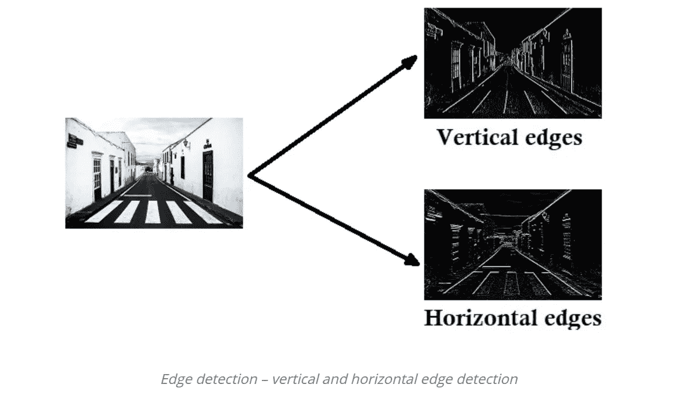
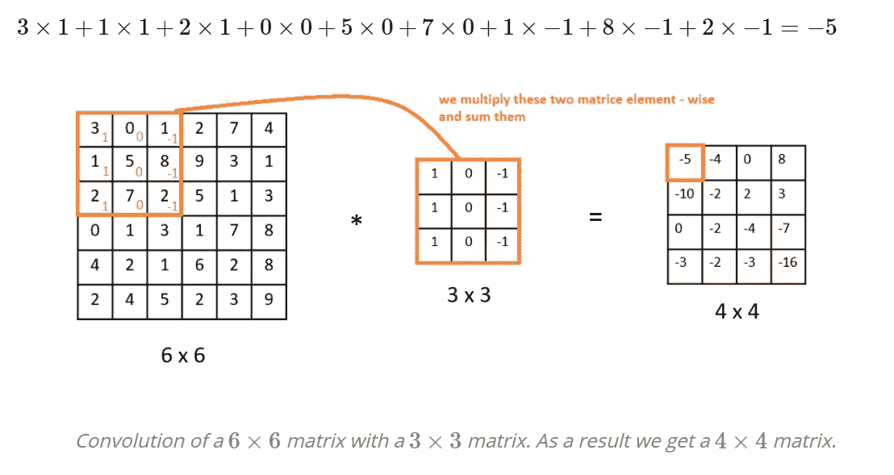
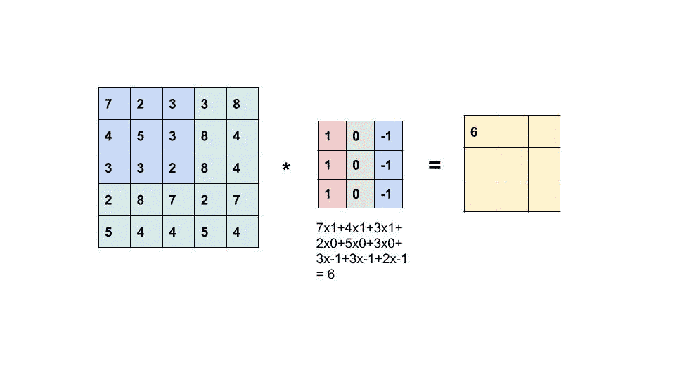
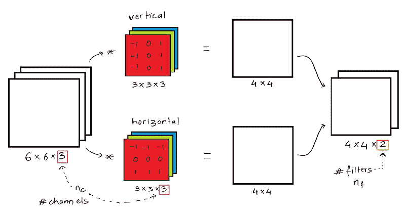

# 卷积神经网络简介

> 原文：<https://levelup.gitconnected.com/a-gentle-introduction-to-convolutional-neural-networks-98923560578f>

绝对初学者的基本概念

由 [WanderLabs](https://unsplash.com/@wanderlabs?utm_source=medium&utm_medium=referral) 在 [Unsplash](https://unsplash.com?utm_source=medium&utm_medium=referral) 上拍摄的照片

L 让我们想象一下，经过几年的拖延和天真，你没有在跑步前拉伸或热身，有一天早上你决定去跑步。你开始像菲比一样奔跑(F.R.I.E.N.D.S 参考警报！)在不平的地面上跑了大约 15 分钟后，你突然失去平衡摔倒，伤了脚踝。回家后，你发现你的脚踝肿了，而且有剧痛。你想知道你是否扭伤或骨折，但不想去看医生，因为你不想感染致命的病毒！

突然，你想起了和你朋友的一次对话，关于一个应用程序，它使用卷积神经网络(CNN，从现在开始)在图片的帮助下检测受伤的类型。你打开应用程序，拍下你脚踝和大腿的照片，它显示这是一种扭伤，你只需要休息，压缩和抬高就可以恢复健康。

听起来很有趣，对吗？！几乎不可思议的是，自我诊断受伤可以如此简单和可靠。这是由于 CNN 的进步而成为可能的医学世界的未来。

那么 CNN 是什么呢？如果你从来没有听说过这个术语，没关系，没有必要恐慌，即使我直到去年才听说过他们，如果你听说过他们，但他们对你来说仍然是一种神秘，不要担心你是在正确的地方。除了医学应用，CNN 在人脸识别、场景标记、图像分类、动作识别甚至自然语言处理方面都非常有用。下次当你在亚马逊上购物时，当“你可能也会喜欢”的部分会弹出来，你就知道 CNN 在工作了。

# **定义卷积神经网络？**

根据维基百科的说法，一个**卷积神经网络** ( **CNN** ，或 **ConvNet** )是一类深度神经网络，最常用于分析视觉图像。哇等一下，*术语警告！！*

**神经网络**是一种计算模型，灵感来自人脑中生物神经网络处理信息的方式。在人工神经网络(或神经网络)中，一组节点相互连接，每个圆形节点代表一个人工神经元，一个箭头代表从一个人工神经元的输出到另一个人工神经元的输入的连接。而**深度神经网络**只是在人工神经网络中输入和输出层之间存在多层时使用的术语。

来源:[https://www . pyimagesearch . com/2016/09/26/a-simple-neural-network-with-python-and-keras/](https://www.pyimagesearch.com/2016/09/26/a-simple-neural-network-with-python-and-keras/)

所以在继续之前，还有一件事，CNN 的神经元有可学习的权重和偏好。每个神经元接收输入，执行点积，然后进行非线性运算。如果所有这些听起来太复杂和模糊，没关系，你不需要太担心。我只是想让你知道这些术语。

# CNN 的图像数据

CNN 最常见的应用是图像识别和分类(也称为计算机视觉)——识别人脸、物体、交通标志，最著名的应用是猫/狗分类。为了理解 CNN 是如何应用于图像的，我们需要理解图像是如何存储在我们的设备中的。

照片由[理查德·布鲁约](https://unsplash.com/@richardbrutyo?utm_source=medium&utm_medium=referral)在 [Unsplash](https://unsplash.com?utm_source=medium&utm_medium=referral) 上拍摄

这张可爱的小狗图片以矩阵的形式存储在我们的笔记本电脑中，每个值(像素)指定了该像素处图像的明暗程度(在本例中为红色、绿色或蓝色)。

并且由于这是具有三个颜色通道的彩色图像，所以它是三维的(黑白图像是一维的)。对于图像，你可能经常听到的一个术语是张量**。张量类似于矩阵，但具有任意维数。**

## **CNN 的积木:**

1.  **卷积-** 卷积或滤波器是可以在主图像的小部分上相乘的张量。它用于从图像中提取特定的图案，如水平线、垂直线等。我们想要从图像中提取的特征取决于卷积内的值。

示例:检测垂直边缘

假设我们有一个 6x6 像素(我们的矩阵大小)的图像，我们构造一个 3x3 的滤波器来进行卷积运算，用星号( ***)** 标记。那么我们如何获得输出呢？想象一下，我们将 3x3 滤波器粘贴到输入图像的顶部 3x3 区域，然后将元素乘积相加。这将产生输出的第一个元素(左上角)。我们将继续这样做，在整个图像上移动 3×3 的过滤器，产生 4×4 的输出。为了更好地理解，请看下图:

来源:http://datahacker.rs/edge-detection/

来源:[https://medium . com/datadriveninvestor/卷积神经网络-3b241a5da51e](https://medium.com/datadriveninvestor/convolutional-neural-networks-3b241a5da51e)

卷积不必是正方形矩阵，并且可以使用多个大过滤器来捕捉更复杂的视觉模式。

2.**填充-** 当我们应用卷积时，会出现两个问题——首先，每个卷积操作都会导致图像缩小。过了一会儿，图像开始变得很小。第二，如果你注意到上图中出现在角落的像素在输出中只被使用一次，相比之下，在中间的像素被多次使用来产生输出。所以我们在某种程度上丢弃了图像边缘附近的大量信息。

填充大小为一的 CNN

解决方法是一种叫做填充的技术。听起来确实如此。当一只鞋不适合我们时，我们用棉球垫它；这个和那个相似。在这种情况下，我们用零填充图像，以帮助我们保持图像的原始大小。如果我们用一个额外的像素填充边框，我们说填充等于 1(如图所示)。填充大小通常是一个奇数，以便我们在填充后得到一个对称的图像。但是要垫多少呢？？

*   **有效卷积—无填充:**如果我们的输入图像大小为 n x n，并且我们使用大小为 f x f 的滤波器，则可以使用 n-f+1 x n-f+1 来计算我们的输出图像大小。
*   **相同卷积——填充，使得输出图像大小等于输入图像大小:**填充的大小可以使用 p = (f -1)/2 来计算，其中 f 是滤波器大小。

3.**步幅-**CNN 中的步幅是在图像上水平或垂直扫描特征时想要跳过的步数。步幅越大，维度收缩得越快。

[https://github . com/VDU moulin/conv _ 算术/blob/master/gif/padding _ strides . gf](https://github.com/vdumoulin/conv_arithmetic/blob/master/gif/padding_strides.gif)

这里，步幅大小为 2，填充大小为 1。如果您仔细观察，您会注意到，由于步长大小为 2，因此滤波器没有进入相邻区域，而是跳过了两步。

> **应用卷积后，具有“f”滤波器大小、“p”填充和“s”步幅大小的图像的输出可以使用以下公式计算:**
> 
> ***输出=[(n+2p-f)/s]+1 {万一这个数是奇数我们取结果的地板}***

## 3D 图像上的简单 CNN:

来源:[https://towards data science . com/convolutionary-neural-network-ii-a 11303 f 807 DC](https://towardsdatascience.com/convolutional-neural-network-ii-a11303f807dc)

恭喜你，你坚持到了最后。你现在可以放心地和你的朋友谈论 CNN 了。最后，综上所述，如前所述，彩色图像是 3D 的，换句话说，它们有三个通道。因此，如果我们想检测图像的垂直和水平边缘，我们需要应用两个过滤器。在得到它们的输出后，根据卷积部分描述的方法，堆叠两个滤波器，我们将得到想要的特征。

瞧啊。如果这是你读完这篇文章后想到的词，那么我写第一篇文章的努力是成功的。以及你试图理解 CNN 的基础知识。但是，如果不幸的是事实并非如此，我会在以后的文章中尽量提供更多的信息，请在评论中告诉我。同时，您可以查看一些帮助我理解这些概念的优秀资源:

 [## 图像类型- MATLAB 和 Simulink

### 索引图像由数据矩阵 X 和色彩映射表矩阵 map 组成。map 是一个类 double 的 3 乘 3 数组…

www.mathworks.com](https://www.mathworks.com/help/matlab/creating_plots/image-types.html)  [## 用于视觉识别的 CS231n 卷积神经网络

### 目录:卷积神经网络非常类似于以前的普通神经网络…

cs231n.github.io](http://cs231n.github.io/convolutional-networks/)  [## 卷积神经网络的直观解释

### 什么是卷积神经网络，为什么它们很重要？卷积神经网络是…

ujjwalkarn.me](https://ujjwalkarn.me/2016/08/11/intuitive-explanation-convnets/)  [## #002 CNN 边缘检测|主数据科学

### 卷积运算是卷积神经网络的基础之一。源自拉丁语\(…

datahacker.rs](http://datahacker.rs/edge-detection/) 

祝你有美好的一天，注意安全！