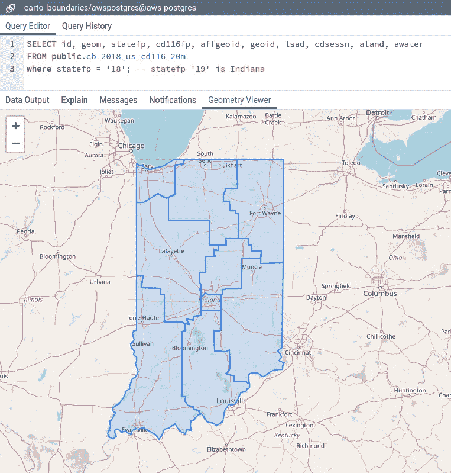

# 地理微服务

> 原文：<https://levelup.gitconnected.com/a-geographic-microservice-43408dd8f012>

第 1 部分:PostgreSQL、PostGIS 和 AWS 云后端


PostGreSQL + PostGIS +无服务器+ AWS

## 微服务的概念

传统的**整体式**网络应用很难扩展。随着代码库的老化和变得更加复杂，添加新功能或新技术变得越来越困难。

在**微服务**架构中，每个应用组件都作为自己的服务运行，并通过 API 调用而不是直接与驱动应用的其他服务通信。每个服务执行一个**单一功能**，并且**是独立的**，不受其他进程或其他进程变化的影响。这个想法是用更小的独立结构来分解一个整体结构，从而增加应用程序的弹性。


应用程序分解


《2001:太空漫游》中的巨石柱

## 云中的后端

亚马逊网络服务(AWS)通过[亚马逊关系数据库服务](https://aws.amazon.com/rds/)满足了我们的后端需求。

Amazon RDS 使得在云中建立一个便宜的(几乎免费的)、可伸缩的关系数据库变得很容易。因为我们希望服务提供地理空间数据，所以我们将使用一个 [PostGreSQL](https://www.postgresql.org/) 实例，并将添加一个 [PostGIS](https://postgis.net/) 扩展，以提供大量地理功能。

要创建一个 AWS [PostGreSQL](https://www.postgresql.org/) 数据库实例，需要一个免费的 [AWS 帐户](https://aws.amazon.com/free)。登录 AWS 后，将您的浏览器指向 [AWS RDS 控制台](https://console.aws.amazon.com/rds)，在那里您可以创建一个新的数据库。


用 Amazon RDS 创建一个新的云数据库

下面是我用来创建一个新的 [PostGreSQL](https://www.postgresql.org/) 实例的数据库配置。


创建新数据库

记住记下 **DB 实例标识符**、**主用户名**和**密码**，以便我们在短时间内连接到新实例。


一旦数据库被创建并可用，您将看到它在控制台中列出。我的新实例花了几分钟才变得可用。


新的

接下来，为了能够连接到新的云数据库，需要完成几个配置步骤。

首先，我们需要通过选择列表中的数据库，点击**修改**，然后适当地编辑**连接**设置，使其可公开访问。


接下来，我们需要编辑入站安全组规则，以便我们可以从我们计算机的 IP 地址连接到实例。


当您进入**编辑入站规则**部分时，从下拉列表中选择**我的 IP** ，您计算机的 IP 地址将被填充到那里。这将限制到数据库的连接，现在只能来自我们的计算机 IP 地址。

*如果不将此设置为您的 IP 或 allow all，与新实例的连接将失败*。


编辑入站规则，只允许访问特定的 IP 地址

更改之后，将花一些时间修改实例。然后在控制台上显示为**可用**。


## 连接到云

接下来，使用 [**pgAdmin**](https://www.pgadmin.org/) 连接到我们的新实例，完成我们的后端。


连接和安全细节

在 [**pgAdmin**](https://www.pgadmin.org/) 中插入**端点**和**端口**信息，创建一个新的服务器连接模态窗口。使用之前提到的主用户名和密码**。**

****

**使用 pgAdmin4 连接到云数据库**

**在 [**pgAdmin**](https://www.pgadmin.org/) 中连接成功后，我们需要实际创建数据库，并将其命名为: **carto_boundaries** 。创建数据库，将所有权授予我们之前在 RDS 控制台中创建的主用户。**

****

**创建数据库:carto_boundar**

**接下来，我们需要启用 [**PostGIS**](https://postgis.net/) 扩展，这将使我们的数据库**地理空间化**。启用 PostGIS 很简单，只需一条 SQL 语句。**

```
create extension postgis;
```

****

**创建 PostGIS 扩展模块**

**创建扩展后，一个新表 **spatial_ref_sys** 将出现在数据库中。**

****

**空间参考系统表**

**该表记录了与不同的[地理地图投影](https://en.wikipedia.org/wiki/Map_projection)一起工作所需的元数据，无需为此费心。**

## ****加载数据****

**接下来，让我们用一些地理数据加载新数据库。地理数据可以直观地表示为点、线或多边形。**

****

****美国国会选区边界线**是一个有趣的多边形地理数据示例，可从[美国人口普查](https://www.census.gov/geographies/mapping-files/time-series/geo/carto-boundary-file.html)中轻松获得。例如，假设我们正在查看基于地区边界的不公正的选区划分。以下是美国第 116 届国会选区的一瞥。边界线是蓝色的。**

****

**美国国会选区:第 116 届国会**

****最小的**大小的区域边界文件(蓝色箭头)将很好地满足我们的目的。**

****

**红色:更多细节，更大；蓝色:较少细节，更小的文件**

**较大的文件包含更多的细节和曲线，当地区边界是河流和/或州边界时尤其明显。**

**为了比较，我下载了最高分辨率的边界文件和最低分辨率的。在下面的地图中，请注意不同的分辨率层层叠加。红色边界完全遵循俄亥俄河和密西西比河的边界，而蓝色边界更加一般化。因为绘制所有曲线需要更多的数据，所以红色边界集比蓝色边界集具有更大的文件大小。**

****

**红色(6.9 MB)对蓝色(<1.0 MB)**

**Simply drag the desired downloaded boundary zip file into [**)QGIS**](https://www.qgis.org/)在地图上直观地查看。**

**除了国会选区，各种各样的边界线都可以在上面提到的美国人口普查资源中找到。州界、国会选区、地区、大都市地区和许多其他地方都可以免费获得。**

## ****将 QGIS 连接到云****

**接下来，我们可以使用 [**QGIS**](https://www.qgis.org/) 直接连接到新的云数据库。我们希望将之前下载的地区数据发送到新的云数据库 **carto_boundaries** 。**

**插入我们之前用来连接 [**pgAdmin**](https://www.pgadmin.org/) 的连接信息，在 [**QGIS**](https://www.qgis.org/) 浏览器内建立另一个连接。**

****

**接下来使用 [**QGIS**](https://www.qgis.org/) 中的 **DB Manager** 工具将 geo 图层直接导入到云数据库: **carto_boundaries。****

****

**将地理数据导入 AWS RDS(目标地图投影 4326)**

****

**将地区地理数据成功导入 AWS 云**

**现在我们的新区表已经被填充到云中，我们可以在 [**pgAdmin**](https://www.pgadmin.org/) 中再次查询它。这里我们查询刚刚插入的前 100 行数据。**

```
SELECT id, geom, statefp, cd116fp, affgeoid, geoid, lsad, cdsessn, aland, awater
FROM public.**cb_2018_us_cd116_20m** --congressional districts table
LIMIT **100**;
```

****

**云中的 geom 列**

**注意 **cb_2018_us_cd116_20m** 表格中的 **geom** 列。这是保存每个地区边界的地理信息的列。**

**有趣的是，如果你点击 [pgAdmin](https://www.pgadmin.org/) 中的**眼列**，会弹出一个几何图形查看器，所以可以在地图上直观的看到结果。**爽**！！！**

****

**点击眼睛！**

****

**从云中直观显示的几何数据**

**因为它只是 SQL，所以我们可以对它进行查询。例如，假设我们只想要加利福尼亚州的地区。**

```
SELECT id, geom, statefp, cd116fp, affgeoid, geoid, lsad, cdsessn, aland, awater
FROM public.cb_2018_us_cd116_20m
where statefp = '06'; — statefp '06' is California
```

****

**加州国会选区**

**或者，**印第安纳**怎么样……**

```
SELECT id, geom, statefp, cd116fp, affgeoid, geoid, lsad, cdsessn, aland, awater
FROM public.cb_2018_us_cd116_20m
where statefp = '18'; -- statefp '18' is Indiana
```

****

**印第安纳国会选区**

**现在，基于 AWS 云的数据库已经正常工作，填充了一些数据，我们可以成功地查询它，我们希望通过 AWS**上的 REST API 微服务公开国会选区表中的数据。****

**API 将需要返回 GeoJSON ，这是一种编码各种地理数据结构的格式，对网络地图也很友好。此外，我们将利用[无服务器](https://www.npmjs.com/package/serverless)、[亚马逊 API 网关和 AWS Lambda](https://docs.aws.amazon.com/whitepapers/latest/microservices-on-aws/microservices-on-aws.html) ，让我们的微服务尽可能简单。**

**这些主题包含在 [**第二部分**](https://will-carter.medium.com/a-geographic-microservice-d7634bd060ac) 中。**