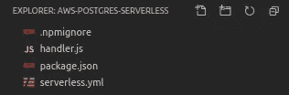

# 地理微服务

> 原文：<https://levelup.gitconnected.com/a-geographic-microservice-d7634bd060ac>

第 2 部分:无服务器、AWS API 网关、Lambda 和 Mapbox


## 快速回顾

在[第 1 部分](/a-geographic-microservice-43408dd8f012)中，我们完成了 AWS 微服务的后端，包括一个 [**PostGreSQL**](https://www.postgresql.org/) 关系数据库，并启用了 [**PostGIS**](https://postgis.net/) 地理空间扩展。 [**PostGIS**](https://postgis.net/) 扩展允许新的云数据库存储地理数据，并能够执行地理 SQL 查询。

记住，基于矢量的地理数据可以作为[点、线和多边形](https://www.igismap.com/gis-tutorial-basic-spatial-elements-points-lines-and-polygons/)存储在数据库中。


上次我们成功导入了来自美国人口普查局的[**美国国会选区多边形**](https://www.census.gov/geographies/mapping-files/time-series/geo/carto-boundary-file.html) 数据。多边形构成了每个地区的边界线。我们使用 [**QGIS**](https://qgis.org/) 连接到新的 AWS 云数据库，并将地区数据导入到云中。

一旦填充完毕，我们就可以查询 [**pgAdmin**](https://www.pgadmin.org/) 中的数据。以下是从 **cb_2018_us_cd116_20m** 表中查询到的前 100 个区。

```
SELECT id, geom, statefp, cd116fp, affgeoid, geoid, lsad, cdsessn
FROM public.**cb_2018_us_cd116_20m**
limit 100;
```


从云 AWS RDS 查询地理国会选区数据

由于地区边界线数据由**多边形**表示，我们可以看到它们在 **pgAdmin** 中用 [**几何查看器**](https://www.compose.com/articles/geofile-pgadmin-4-and-the-geometry-viewer/)**直观地显示在地图上，这是对 **pgAdmin** 非常有用的补充。**

****

**直观显示在地图上的地区查询结果**

**从这里开始，我们想向上移动堆栈，通过一个 RESTful 微服务 API 公开这个地区的数据，这个 API 也将使用 **AWS Lambda 函数托管。**来自 [**AWS Lambda** 文档](https://docs.aws.amazon.com/lambda) …**

> **有了 **AWS Lambda** ，你可以运行代码**而无需供应或管理服务器**。你只为你消耗的计算时间付费——当你的代码不运行时**不收费。您可以为几乎任何类型的应用程序或后端服务运行代码—所有这些都无需管理。只需上传你的代码，Lambda 就会为你的代码提供高可用性的运行和扩展。你可以从任何网络或手机应用程序中直接调用它。****

**这种类型的设置，其中我们有一个**自包含服务**，是弹性应用程序的构建块。在这种情况下，**微服务**将返回国会选区 **GeoJSON** ，这是一个地理数据的开放标准，随时可以显示在网络地图上。**

**在做了一些研究之后，[无服务器框架](https://github.com/serverless/serverless)被推荐为使用 **AWS Lambda** 函数的有用工具。有了**无服务器框架**，我们将能够轻松地…**

> **…开发和部署您的 **AWS Lambda** 功能，以及它们所需的 **AWS** 基础设施资源。这是一个 CLI，**提供了现成的结构、自动化和最佳实践**，允许您专注于构建复杂的、事件驱动的、无服务器的架构，由函数和事件组成。**

****

**无服务器框架**

**希望**无服务器**能够帮助 **AWS** 尽可能顺利地部署，我们将使用它提供的结构和功能模板。**

**首先，全局安装**无服务器** it:**

```
$ npm install serverless -g
```

****

**安装无服务器框架**

**接下来，通过在终端提示符下输入以下内容，创建一个名为**AWS-postgres-server less**的新模板。**

```
$ serverless
```

**当询问项目类型时，选择 **AWS Node.js** 。**

****

**接下来，初始化项目。**

```
$ cd aws-postgres-serverless
$ npm init
```

****

**初始化无服务器项目**

**此时，该项目有 4 个文件:**

****

**初始模板**

**在 **handler.js** 中，我们可以看到一个为我们预先编写的 **Lambda** 函数。看起来这是一个“hello world”函数，它传递了一条消息，表明该函数执行成功。**

```
module.exports.hello = async (event) => {
  return {
    statusCode: 200,
    body: JSON.stringify(
      {
        **message**: 'Go Serverless v1.0! Your function executed    
        successfully!',
        input: event,
      },null,2),
  };
};
```

**让我们稍微改变一下消息，这样我们就可以确定我们的代码正在更新。**

```
module.exports.hello = async (event) => {
  return {
    statusCode: 200,
    body: JSON.stringify(
      {
        **message**: '**Hooray! It works!**',
        input: event,
      },null,2),
  };
};
```

**接下来，看看这个项目的配置文件**。它为微服务将响应的**的**路线提供了许多定制和定义。****

**注意这个函数条目是如何引用 **handler.js** 中的 **hello** 函数的。**

****

**serverless.yml 函数条目**

**为了测试服务和 **hello 函数**，我们需要安装另一个 npm 包 **serverless-offline** 。**

```
$ npm install --save serverless-offline
```

****

**安装无服务器-脱机**

**接下来，替换(或注释掉)serverless.yml 中的文本，并添加以下配置设置。*server less . yml 中的缩进很重要，所以要小心。***

```
service: aws-postgres-serverlessframeworkVersion: '2'provider:
  name: aws
  runtime: nodejs12.x
  lambdaHashingVersion: 20201221functions: hello:
    handler: handler.hello
      events:
        - http:
          method: get
          path: /helloplugins:
  - serverless-offline
```

**此处全文 **serverless.yml** 至此。该服务将公开一个名为 **hello** 的函数。**

****

**无服务器. yml**

**在终端的测试环境中启动服务。**

```
$ serverless offline
```

****

**测试服务**

**如果我们在 hello 路线上访问本地服务…**

```
[http://localhost:3000/dev/hello](http://localhost:3000/dev/hello)
```

**我们可以看到它在我们的网络浏览器中工作。万岁！**

****

**你好世界！**

**现在，在我们将功能部署到 **AWS** 云之前，我们需要在 **AWS** 中设置一个**用户**，该用户有权与我们的 **AWS** 生态系统的其他部分进行交互，特别是在[第 1 部分](/a-geographic-microservice-43408dd8f012)中讨论和设置的 **AWS RDS Postgres/PostGIS** 云数据库。**

## **配置 AWS IAM**

**要创建用户，请访问 **AWS** 控制台，并使用您的帐户和密码登录。登录后，导航至 [**AWS IAM** 控制台](https://console.aws.amazon.com/iam)。在这里，我们将创建一个新的**用户**，并将该用户添加到一个新的**组**，授予与 **AWS RDS** 、 **API 网关**和 **Lambda** 交互所需的权限。**

**首先，创建 **aws-postgres-users** 组，并赋予它必要的权限。**

****

**创建 AWS-postgres-用户组**

```
Grant the following policies: [](https://console.aws.amazon.com/iam/home?region=us-east-1#policies/arn:aws:iam::aws:policy/AmazonRDSFullAccess) AmazonRDSFullAccess
AWSLambdaFullAccess
IAMFullAccess
AmazonAPIGatewayAdministrator
AWSCloudFormationFullAccess
```

**然后，创建一个名为 **aws-postgres** 的新**用户**，并将该用户添加到 **aws-postgres-users 组**。您将看到用户的**访问密钥 ID** 和**秘密访问密钥**。**

****此信息只向您显示一次，因此请务必注意。****

**现在，回到终端，用下面的命令配置您的安全凭证，在适当的地方用上面提到的值替换您的值。这将允许服务使用提供的凭据进行操作。**

```
$ serverless config credentials --provider aws --key **<your_access_key>** --secret **<your_secret_key>**
```

## **部署！**

**现在，我们已经准备好部署到云了，这是通过以下命令完成的:**

```
$ serverless deploy
```

****

**部署微服务！**

**然后，如果我们在浏览器中访问该服务，我们可以看到 hello 功能正常工作！**

********

**来自云端的你好**

**微服务**中的 hello world 功能是一个不错的开始。然而，这篇文章的真正目的是公开在第 1 部分中创建的 **AWS RDS PostgreSQL** 后端的地理空间数据。****

**为此，首先我们需要安装 [pg](https://www.npmjs.com/package/pg) npm 包，这是一个用于 **Node.js、**的非阻塞 **PostgreSQL** 客户端，允许连接到我们的 **AWS RDS PostgreSQL** 数据库。**

```
$ npm install --save pg
```

****

**安装 pg**

**接下来，我们需要在一个名为 **db.js** 的新文件中定义我们与数据库的连接，其内容如下。这是我们在 [*第 1 部分*](/a-geographic-microservice-43408dd8f012) 中创建的 **AWS RDS** 数据库的连接。**

```
module.exports = {
  database: 'carto_boundaries',
  host: 'aws-postgres-postgis.x.us-east-1.rds.amazonaws.com',
  user: 'awspostgres',
  password: 'XXXXXX'
}
```

**根据创建的数据库，用实际值替换这些值。**

****注意:如果你把这段代码提交给 github，别忘了。git 忽略这个 db.js 文件。它包含数据库凭据。****

****

**隐藏你的证件！！！**

**接下来，在 **handler.js** 中，让我们添加一个名为 **getDistricts** 的新方法，它连接到数据库并返回第一个区。以下是该查询的 SQL 语句。**

```
SELECT id, geom, statefp, cd116fp, affgeoid, geoid, lsad, cdsessn,
aland, awater
FROM public.cb_2018_us_cd116_20m 
**limit 1;**
```

**上面的 SQL 驱动下面的 **getDistricts** 函数:**

```
module.exports.getDistricts = (event, context, callback) => { const client = new Client(dbConfig)
  client.connect()

  let sql = `
  SELECT id, geom, statefp, cd116fp, affgeoid, geoid, lsad, cdsessn,
  aland, awater
  FROM public.cb_2018_us_cd116_20m 
  **limit 1**`.trim() client
    .query(sql, null)
      .then((res) => {
        const response = {
          statusCode: 200,
          body: JSON.stringify(res.rows),
        }
        callback(null, response)
        client.end()
      })
      .catch((error) => {
        const errorResponse = {
          statusCode: error.statusCode || 500,
          body: `${error}`,
        }
        callback(null, errorResponse)
        client.end()
      })
}
```

**为了公开这个新的 **getDistricts** 函数，我们需要更新 **serverless.yml** 为新函数添加一个 http 方法和路径。**

```
getDistricts:
  handler: handler.getDistricts
    events:
    - http:
      method: get
      path: /getDistricts
```

**现在，如果我们在网络浏览器中访问我们的新路线:**

```
[http://localhost:3000/dev/getDistricts](http://localhost:3000/dev/getDistricts)
```

**我们可以看到连接工作正常，这是数据库中第一个地区返回的数据！**

****

**数据库中的结果**

****

**目前情况看起来不错。**

**然而，上面输出中的 **geom 列值对于我们的前端 web 地图来说没有用**。**

****

**原始几何列**

**幸运的是， **PostGIS** 允许以 **GeoJSON** 格式返回结果，方法是将查询包装在函数中，将结果转换成 **GeoJSON** 。这个 **getGeoJsonSQL** 助手函数将接受一个非 geo **SQL** 语句，并返回一个 **SQL** 语句，该语句将返回 **GeoJSON** 作为结果。所有原始的 **SQL** 查询列都包含在返回的 **GeoJSON** 中。**

****

**从 PostGIS 中选择 GeoJSON**

**现在，在 **getDistricts** 函数中，我们将 **SQL** 传递给 **getGeoJsonSqlFor** 函数。当我们这次在响应体中返回结果时，我们从 geo 查询结果的第一行返回 **jsonb_build_object** ，这将是一个描述地区边界的 **GeoJSON** 字符串。**

****

**从 SQL 结果返回 GeoJSON**

**再次访问/getDistricts 路径，我们看到返回的是 **GeoJSON** **多多边形**数据，而不是之前的原始 geom 数据。**

****

**国会选区的 GeoJSON**

**通过更仔细地检查 **GeoJSON** 结果，注意它由一个**特征**数组组成，每个特征包含一个**坐标**数组。**坐标**数组包含一系列的经纬度坐标，这些坐标沿着地区边界的轮廓，为每个地区形成一个**多边形**。**

****

**GeoJSON 由经纬度坐标组成**

**所以现在，**微服务**返回单个地区的 **GeoJSON** 。我们可以很容易地在此基础上完成我们在第 1 部分结束时的目标，返回特定州的选区。**

**我们在[第 1 部分](/a-geographic-microservice-43408dd8f012)中导入的 districts 表有一个 **statefp** 列，但是这不是一个可以传递到 API 中的用户友好的值，因为 **statefp** 值并不常见。我们希望能够接受来自用户的两个字母的州缩写，并让它驱动下面查询中的 **statefp** 参数。**

****

**为了进行这样的查询，我们需要向服务背后的数据库添加额外的数据，特别是美国的州数据。这个数据需要有 **statefp** 以及 **stusps** (两个字母的州缩写列)来完成连接。**

**方便的是，从 [**美国人口普查**](https://www.census.gov/geographies/mapping-files/time-series/geo/carto-boundary-file.html) 中获得的美国州界线数据具有所需的 **statefp** 、 **stusps** 和 **name** 列。**

****

**因此，让我们将美国的州数据(包括州界地理数据)导入到云数据库中的一个新表中，就像我们之前使用 **QGIS** 处理地区数据一样。**

****

**将美国各州数据导入云中**

**有了新表，我们可以通过两个字母的州名缩写( **stusps** )来查询 **pgAdmin** 中的特定州名。**

****

**状态数据在云中**

**此外，我们可以使用连接来获取特定州缩写的地区。**

```
SELECT districts.*, states.stusps as state_abbrev, states.name as state_name
FROM cb_2018_us_state_20m states
JOIN cb_2018_us_cd116_20m districts on districts.statefp = states.statefp
WHERE stusps = $1;
```

**上面的 SQL 驱动了一个新的**getdistricsforstate**函数。**

****

**getDistrictsForState 函数**

**为了将**getdistricsforstate**公开为新的 **AWS Lambda** 函数，我们必须再次在 **serverless.yml** 中添加对的引用。**

****

**然后，如果我们再次启动实例并为 Indiana 传递“in ”,我们将在 **GeoJSON** 中获得 Indiana 的所有地区。**

****

**GeoJSON 的印第安纳国会选区**

## **调整微服务访问**

**在这一点上，为了使我们的服务可以在 **AWS** 上从生产中访问，还需要一个快速添加。**

**在返回的响应对象中，添加**头**键，并使用以下对象作为其值。**

```
**headers**: {
  "Access-Control-Allow-Origin": '*',
  "Access-Control-Allow-Methods": 'GET'
}
```

****

**这将允许从任何地方连接到我们的服务。**

**如果熟悉下面的 **CORS** 策略错误，您就会理解为什么需要 headers 值。**

****

**不要被 CORS 政策阻挡**

**最后，我们把最新的 **AWS Lambda** 函数(**getdistricsforstate**)推送给 AWS 云微服务。**

```
$ serverless deploy
```

****

**部署微服务**

**部署服务后，我们可以在浏览器中访问生产路线。**

****

**印第安纳地区，来自 AWS 微服务**

**如果需要 CA，则更改 URL 中的参数。**

****

**加利福尼亚地区，来自 AWS 微服务**

****地图****

**现在我们有了一个能够动态返回美国每个州的国会选区 GeoJSON 数据的微服务，在地图上显示选区有多容易？非常。**

**在 **QGIS** 中，我们可以很容易地从源代码中添加一个区图层。导航到图层>添加图层>添加矢量图层。选择**协议 HTTP(S)** 。确保选择 **GeoJSON** 作为类型。对于 **URI** ，将 IN for Indiana 追加到源 url 中，以检索该州的地区。**

****

**将区域从云中添加到 QGIS 中**

**网络地图怎么样？当然可以。**

**[**Mapbox GL JS**](https://docs.mapbox.com/mapbox-gl-js/api/) 是一个非常强大的开源库，用于创建地图并在其上显示地理数据。 **GeoJSON** 是一种常见的 web 地图源格式。**

**下面是一个基于地图框的网络地图的[演示，它调用微服务并根据 URL 中传递的州值显示相应的地区。](https://fergusdevelopmentllc.github.io/awsmap/index.html?state=IN)**

```
[https://fergusdevelopmentllc.github.io/awsmap/index.html?state=IN](https://fergusdevelopmentllc.github.io/awsmap/index.html?state=IN)
```

****

**印第安纳国会选区**

**下面是生成上面地图的 HTML 和 JavaScript。**

**在第 48 行，您将看到服务被调用的位置，传递了 state abbreviation 参数。**

****

**要查看其他州的地区，请更改 URL。比如这里的 [**加州**](https://fergusdevelopmentllc.github.io/awsmap/index.html?state=CA) 。**

```
[https://fergusdevelopmentllc.github.io/awsmap/index.html?state=CA](https://fergusdevelopmentllc.github.io/awsmap/index.html?state=CA)
```

****

**加州国会选区**

**在本项目的第 3 部分中，我们将探索 **PostGIS** 的更多功能，旨在找到一种基于美国各县人口的感兴趣区域的方法。**

**这里是本文讨论的无服务器代码的 [github 库](https://github.com/FergusDevelopmentLLC/aws-postgress-serverless)。**