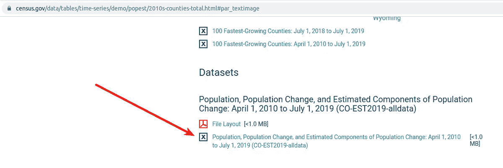

# 地理白日梦

> 原文：<https://levelup.gitconnected.com/a-geographical-daydream-bd551b3617f1>


让我们想象一个新的现实。

噗！亚历克斯一挥手，我们神奇地发现我们现在占据了一个**全新的人的身体……**

…一个刚从普渡大学**的**兽医学院**毕业，在**印第安纳州**的**万事俱备。太神奇了！


右边的是我们，抱着猫。我们的名字叫**丽莎**。在快速浏览我们的新记忆后，我们“记得”兽医学校很难，现在我们渴望在世界上留下我们的印记。我们想把我们一生的工作奉献给帮助动物和它们的人类变得更加健康和快乐。这是我们的**人生使命**。

同样，幸运的是，我们记得我们刚刚赢得了 10 亿美元的大奖💰 💰 💰！所以，金钱不是我们追求人生目标的目标。


我们的目标是开一家新的最先进的**动物医院**，但是不知道最大化我们努力的**最佳地点**。我们唯一能确定的是，我们想专注于印第安纳州，我们最喜欢的州。此外，我们想要一个人口足够多的地方来支持医院，但不想要一个人口超密集的大都市。此外，我们不想把我们的医院建在一个人烟稀少的地方，不可能养活许多宠物和它们的人类。

# **地理数据**

为了回答寻找最佳位置的问题，我们可以考虑利用**地理数据**来帮助我们区分潜在的动物医院位置感兴趣的区域，显示最佳位置选择的方法。

地理数据与特定位置相关联。这允许我们询问基于位置的问题，例如*计算在* *特定区域内* ***存在多少个位置。***

地理数据有三种类型:**多边形、**点和**线**。


**多边形**代表地图上*包围的*形状，例如州或县的边界线。


印第安纳州和县多边形

**点**是地图上单独的“兴趣点”。它们代表地球表面唯一的[经纬度位置](https://journeynorth.org/tm/LongitudeIntro.html)。现有动物医院的位置将在我们的地图上用**点**表示。


印第安纳州现有的动物医院

**线条**代表连续的地理特征，如道路或河流。在这里，我们不会考虑线地理数据。

[PostGIS](https://postgis.net/) 是用于 [PostgreSQL](https://www.postgresql.org/) 对象关系数据库的空间数据库扩展器。它增加了对地理对象的支持，允许在 SQL 中运行与位置相关的查询。我们将使用 SQL 的强大功能来回答在哪里建立新的动物医院的问题，并使用免费的开源地理信息系统 QGIS 在地图上直观地查看我们的结果。本帖所有地图均由 QGIS 合成。


QGIS + PostGreSQL + PostGIS

# 我们如何为新医院寻找最佳地点？

为了简单起见，我们将考虑一个特定地区的人口(人数)，并将该人数与该地区现有医院的数量进行比较。

**人口多而医院数量少的地区**将是我们认为服务不足的地区，这是我们将首先**关注的地方**。

幸运的是，美国人口普查局提供了大量的地理和其他方面的数据。我们将能够从那里收集我们的地理多边形(县)以及所需的人口数据。

# 收集地理数据

我们首先需要印第安纳州的州界。州界地理数据可以在这里找到[。](https://www.census.gov/geographies/mapping-files/time-series/geo/carto-boundary-file.html)


选择细节较低、较小的州边界数据集

原始**状态**数据 zip 文件命名为:**CB _ 2018 _ us _ state _ 20m . zip**

为了仔细检查，我将地理数据加载到 QGIS 中，以确保这是我们想要的。只需将下载的 zip 文件拖到 QGIS 中的新项目上，就可以在地图上直观地看到它。


州地理数据

## 县边界(多边形)

接下来，我们需要县边界，因为我们希望**找到每个县内现有医院的数量**，并将该数量与特定县的人口进行比较。


原始的**县**数据 zip 文件命名为:**CB _ 2018 _ us _ county _ 20m . zip**。在地图上看起来也不错。


县地理数据

## 动物医院(点)

重要的是，我们需要印第安纳州所有现存动物医院的位置。[兴趣点工厂](http://www.poi-factory.com) (Point of Interest Factory)通常被证明有助于找到许多主题的基于点的数据集。他们有一个很棒的国家动物医院位置数据集。

[](http://www.poi-factory.com/node/15044) [## 美国动物医院，包括阿拉斯加和夏威夷

### 登录或注册下载文件原始文件:动物医院 _ 美国. csv (3.62 MB)包括 32547 个位置在…

www.poi-factory.com](http://www.poi-factory.com/node/15044) 

在对下载的数据进行了一些整理之后，我能够将其编辑成以下相关的栏目:


我将这些数据导入到一个**geo _ animal _ hospitals _ USA**表中，将纬度/经度列转换成地理数据。然后，我可以查询数据，并在地图上显示结果。

```
-- animal hospitals in usa
SELECT 
  id,
  **geom**,
  longitude,
  latitude,
  name,
  city,
  state
FROM public.**geo_animal_hospitals_usa**;
```


查询美国所有的动物医院

然后，我可以添加一个 where 子句，只返回印第安纳州现有的医院。

```
-- animal hospitals in indiana
SELECT 
  id,
  **geom**,
  longitude,
  latitude,
  name,
  city,
  state
FROM public.**geo_animal_hospitals_usa**
**where state = 'IN'**;
```

我们可以在 QGIS 中直观地看到查询结果，显示印第安纳州现有的动物医院位置(红点)。


注意 **geo_animal_hospitals_usa 表**中的 **geom** 列及其数据类型 **geometry(Point)** 。这个专栏是 POSTGIS 带来的。这是存储地理格式化数据的地方。

# 收集人口数据

接下来，我们需要获得印第安纳州各县的人口数据。人口普查网站也为我们提供了这些数据。

**县人口数据**

县人口数据可以在这里找到[，以逗号分隔值(CSV)格式。找到数据集区域，下载文件: **co-est2019-alldata.csv** 。该文件包含整个美国的县人口数据](https://www.census.gov/data/tables/time-series/demo/popest/2010s-counties-total.html)



在删除了数据集中大部分不相关的列(有很多！)，以下是我们将使用的列。pop_2019 是该县的预计人口数。


下面是创建 population_county 表的 SQL，并使用 COPY 命令用上面的数据填充它。

```
CREATE TABLE population_county (
  id SERIAL,
  state VARCHAR(255),
  state_name VARCHAR(255),
  name VARCHAR(255),
  pop_2019 integer,
  PRIMARY KEY (id)
);COPY population_county(state, state_name, name, pop_2019)
FROM '/tmp/pop_county.csv'
DELIMITER ','
CSV HEADER;
```

# **制作地图**

现在我们已经有了所有必要的数据，我们可以使用 SQL 查询来构建一个带有逻辑的地图，以找到动物医院的理想位置。首先，从一个干净的地图开始，我只添加了开放的街道地图基础层，这样当我们添加更多的层时，我们可以很容易地找到我们的方向。


接下来，我们将进行查询以检索 QGIS 中的**州**地理数据。为此，导航到:Database > DBManager，将 SQL 粘贴到查询框中，然后将结果加载到地图中。


在 QGIS 中使用 SQL 加载地理数据

```
--get all states
SELECT 
  geom,
  statefp,
  geoid,
  stusps,
  name,
  aland,
  awater
FROM public.geo_state_raw;
```

这里我们检索所有的状态…


然而，我们只对印第安纳州感兴趣，这很容易通过为 statefp = **'18'** 添加 where 子句来限制。

```
--add where to limit to Indiana (statefp = 18
SELECT 
  geom,
  statefp,
  geoid,
  stusps,
  name,
  aland,
  awater
FROM public.geo_state_raw
**where statefp = '18'**; 
```

现在我们只有印第安纳了…


接下来，我们将使用这个查询添加印第安纳州现有的动物医院…

```
-- animal hospitals in Indiana
SELECT 
  id,
  geom,
  longitude,
  latitude,
  name,
  city,
  state
FROM public.**geo_animal_hospitals_usa**
where state = 'IN';
```

结果显示印第安纳州所有的动物医院。


接下来，我们可以编写查询来突出显示每个医院的人均数量较高的县。产生这个结果的查询如下。

```
select 
  county.geom,
  county.name, 
  max(pop.pop_2019) as pop_2019,
  count(hospitals.geom) as **animal_hospital_count**,
  CASE 
    WHEN count(hospitals.geom) = 0 
    THEN max(pop.pop_2019) 
    ELSE max(pop.pop_2019) / count(hospitals.geom) 
  END
  AS **persons_per_hospital**
from geo_county_raw county
left join population_county pop on pop.name = CONCAT(county.name, ' County')
**left join 
  geo_animal_hospitals_usa as hospitals 
  on ST_WITHIN(ST_Transform(hospitals.geom, 4326),
  ST_Transform(county.geom, 4326))**
where pop.state_name = 'Indiana'
and county.statefp = '18'
group by county.geom, county.name
order by persons_per_hospital desc;
```

神奇的是在左边连接到**地理 _ 动物 _ 医院 _ 美国**点表。这是一个地理空间连接。

使用 [**ST_WITHIN**](https://postgis.net/docs/ST_Within.html) 左连接到 **geo_animal_hospitals_usa** ，以便我们可以在**animal _ hospitals _ count**列中统计每个县的动物医院数量。

现在我们有了一个县的人口数和一个县现有医院的数量，然后我们添加第二个计算列， **persons_per_hospital** ，它是该县的人口数除以现有医院的数量。这个数字越高，该县医院服务的人数就越多。

在下面的地图中，使用基于 persons_per_hospital 列的分级符号系统，通过暗绿色阴影来标识具有高 persons_per_hospital 计数的县。


根据每个医院的人员来表示县

我还在上面添加了现有的医院点图层。


印第安纳动物医院

印第安纳州的这四个县(Stark、Tippecanoe、Fayette 和 Vigo)看起来很有意思，也是我们将进行更多调查的地方。


如果我们从北到南观察这些县，每个县接受服务的人数是相似的。

## 斯塔克县

这个地区看起来有可能，县内只有另外一家动物医院。每家动物医院有将近 23，000 人。


## 蒂佩卡诺县

这个县的人口有点多，是斯塔克县的 8 倍多。这里现有 8 家医院，该县每家动物医院的人数接近 24，500 人。现有的医院看起来集中在印第安纳州的西拉斐特。


## 法耶特县

费耶特县和斯塔克县差不多。它的人口很少，只有一家医院。该县最大的城镇是印第安纳州的康纳斯维尔。


## 维戈县

最后，我们有印第安纳州特雷霍特的家乡维哥县。人口不像蒂皮卡诺伊县那么多，但比费耶特和斯塔克要多。每家现有医院的人数大约是 27k 人。这就是为什么我认为我们应该首先考虑 Vigo 县，其次是 Tippecanoe 县，作为我们新动物医院的选址。


# SQL 的力量

为地图生成数据的 SQL 查询很酷的一点是，它很容易修改以查看不同的感兴趣区域。这里，我们只需调整 where 子句，就可以对伊利诺伊州而不是印第安纳州进行查询。

```
select 
  county.geom,
  county.name, 
  max(pop.pop_2019) as pop_2019,
  count(hospitals.geom) as animal_hospital_count,
  CASE 
    WHEN count(hospitals.geom) = 0 
    THEN max(pop.pop_2019) 
    ELSE max(pop.pop_2019) / count(hospitals.geom) 
  END
  AS persons_per_hospital
from geo_county_raw county
left join population_county pop on pop.name = CONCAT(county.name, ' County')
left join 
  geo_animal_hospitals_usa as hospitals 
  on ST_WITHIN(ST_Transform(hospitals.geom, 4326),
  ST_Transform(county.geom, 4326))
**where pop.state_name = 'Illinois'
and county.statefp = '17'**
group by county.geom, county.name
order by persons_per_hospital desc;
```

较暗的区域“服务不足”。


伊利诺伊州:各县每所动物医院的人数

科罗拉多怎么样？


科罗拉多州:各县每所动物医院的人数


他们必须得救！

## 参考

[https://www.census.gov](https://www.census.gov)/
https://www . census . gov/geographies/mapping-files/time-series/geo/carto-boundary-file . html
https://www . census . gov/geographies/mapping-files/time-series/geo/carto-boundary-file . html
[https://www.census.gov/cgi-bin/geo/shapefiles/index.php?year = 2019&layer group = Places](https://www.census.gov/cgi-bin/geo/shapefiles/index.php?year=2019&layergroup=Places)
[https://www . census . gov/content/census/en/data/datasets/time-series/demo/popest/2010s-total-cities-and-town . html # ds](https://www.census.gov/content/census/en/data/datasets/time-series/demo/popest/2010s-total-cities-and-towns.html#ds)
[https://www . census . gov/data/tables/time-series/demo/popest/2010s-counties-total . html](https://www.census.gov/data/tables/time-series/demo/popest/2010s-counties-total.html)
[https://www2.census.gov/geo/pdfs/reference/GARM/Ch9GARM.pdf](https://www2.census.gov/geo/pdfs/reference/GARM/Ch9GARM.pdf)