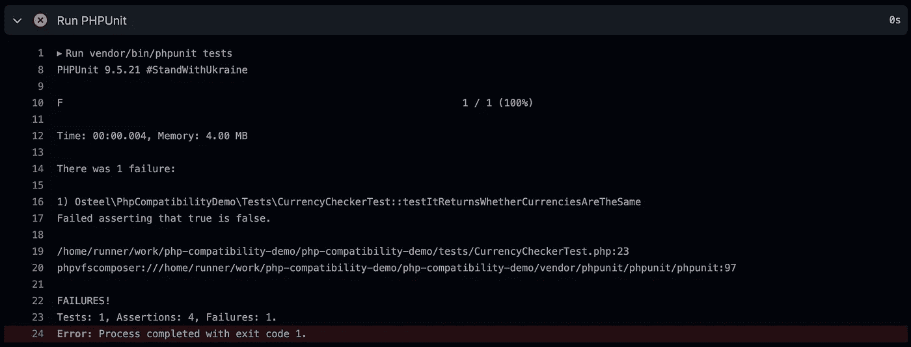

# 一个 GitHub 工作流来检查你的 PHP 包与一系列依赖版本的兼容性

> 原文：<https://levelup.gitconnected.com/a-github-workflow-to-check-the-compatibility-of-your-php-package-with-a-range-of-dependency-19b674c41b95>

## 对于我们不知道目标环境约束的场景


PHP 开发人员工作的一个常见方面是处理 [Composer](https://getcomposer.org/) 依赖项。我们把别人的作品当成乐高积木来建造自己的项目，充分利用开源运动这一美好事物。

作为这些社区工作的典型最终用户，我们维护一个依赖项列表，这些依赖项的版本通过`composer.lock`文件被*固定*。我们不需要考虑支持这些依赖项的其他版本，就像我们不需要考虑适应一系列 PHP 版本一样——我们在应用程序的目标环境的约束下工作，这些环境是已知的，并且预计会随着时间的推移而保持稳定。

对于开源软件维护者来说，情况有所不同。他们很大程度上不知道用户环境的约束，所以他们能做的最好的事情就是确保他们的库与尽可能多的 PHP 和依赖版本兼容。

这就是兼容性测试至关重要的地方。开源维护者需要确保对代码所做的任何更改都将适用于`composer.json`中列出的所有版本。手动这样做是不切实际的，所以他们求助于测试覆盖和自动化脚本。

这篇文章探索了一种自动化兼容性测试的方法，结合使用测试覆盖和 [GitHub 动作工作流](https://docs.github.com/en/actions/using-workflows)。

# 在这篇文章中

*   完成工作流程
*   故障
*   结束语
*   资源

# 完成工作流程

这是工作流程的最终版本。如果你只是为了代码而来，请随意复制和重用下面的代码。否则，继续阅读文件的渐进分解，由一个示例项目支持。

也可以查看本文的[资源库](https://github.com/osteel/php-compatibility-demo)进行参考。

# 故障

以下是工作流程的完整分解。我们将使用一个示例项目增量地构建它，随着我们扩展支持的依赖版本的范围，我们将更新这个示例项目。

# 初始设置

这一步是可选的，但是如果您是一个“通过实践学习”的人，您可能希望在您的机器上构建这个示例项目，并在我们进行的过程中更新它。如果你不知道，你可以阅读这一部分，因为它包含了一些相关的信息。

如果你这样做了，那么[现在创建](https://github.com/new)一个新的空的 GitHub 库。称它为`php-compatibility-demo`(或者其他任何你觉得有灵感的东西)，并确保它是公开的，这样你就可以享受免费的 GitHub Actions [津贴](https://docs.github.com/en/billing/managing-billing-for-github-actions/about-billing-for-github-actions)(除非你有一个付费账户，在这种情况下，你可以随意保持库的私密性)。

> 下面假设您的开发设置支持 PHP 8.0+并且您已经可以使用 Composer 和 Git 访问终端。

在您的开发机器上克隆存储库，并初始化一个新的 Composer 项目:

```
$ git clone php-compatibility-demo
$ cd php-compatibility-demo
$ composer init
```

最后一个命令将询问您一系列问题，并在最后生成一个`composer.json`文件。大多数问题在本文的上下文中并不重要，但是请确保为项目类型选择`[library](https://getcomposer.org/doc/04-schema.md#type)`，为最小稳定性选择`[stable](https://getcomposer.org/doc/04-schema.md#minimum-stability)`，并为 PSR-4 自动加载位保留默认值。

完成后，将`/vendor/`和`composer.lock`添加到`.gitignore`文件中:

```
/vendor/
composer.lock
```

这是与常规公司项目的第一个主要区别，在常规公司项目中，开发人员通常会提交`composer.lock`文件，因此应用程序在不同环境中是一致的。在这里，我们采用不一致性，让 Composer 根据客户机环境的约束来决定使用什么依赖版本。

在这种情况下，GitHub 工作流是另一个客户端环境，我们不希望它选择一个`composer.lock`文件来强制安装特定版本，而我们的目标是测试所有版本。

# 库和测试覆盖率

有了这些，让我们花点时间讨论一下我们的测试项目。我们将在 [Money](https://github.com/moneyphp/money) 的基础上构建一个小的库，Money 是一个流行的 PHP 包，方便了货币值和货币的操作。

我们的库将包含一个助手类——`CurrencyHelper.php`——这将简化货币的操作。它将公开两个方法——一个确保一堆`Money`对象拥有相同的货币，另一个返回一个`Money`对象的[数字 ISO 4217 码](https://en.wikipedia.org/wiki/ISO_4217#Active_codes)。

你很快就会意识到这个库是毫无意义的，但是它提供了一个很好的例子来支持这篇文章，所以我相信你会视而不见。

这是您在本节末尾应该得到的文件结构(请记住，您也可以随时参考本文的[库](https://github.com/osteel/php-compatibility-demo)进行比较):

```
php-compatibility-demo/
├── src/
│   └── CurrencyHelper.php
├── tests/
│   └── CurrencyHelperTest.php
├── vendor/
├── .gitignore
├── composer.json
└── composer.lock
```

让我们安装货币库:

```
$ composer require moneyphp/money:^4.0
```

请注意，我们有意在这里导入 v4，即使当您阅读本文时，它可能不是最新版本。

让我们也安装 [PHPUnit](https://phpunit.de/) 作为开发依赖:

```
$ composer require --dev phpunit/phpunit
```

现在创建`src/CurrencyHelper.php`文件:

如果您也在您的机器上构建这个示例库，不要忘记更新顶部名称空间中的供应商名称。

`isSame`方法接受任意数量的`Money`对象，并返回一个布尔值，表明它们是否使用同一种货币。它的工作方式是从数组中移除第一个元素(使用`[array_shift](https://www.php.net/manual/en/function.array-shift)`)，然后使用`Money`类中的`isSameCurrency`方法将这个元素的货币与其他元素的货币进行比较。

第二个方法——`numericCode`——将一个`Money`对象作为其唯一的参数，并返回其货币的数字 ISO 代码，使用来自`ISOCurrencies`助手类的`numericCodeFor`方法(它是货币库的一部分)。

下面是`tests/CurrencyHelperTest.php`的内容，这个类测试我们的“库”的行为:

这些测试将允许我们稍后确认我们的库是否与各种 PHP 和依赖版本一起工作。同样，不要忘记在顶部更新供应商的名称。

让我们检查测试是否通过:

```
$ ./vendor/bin/phpunit tests
```

如果是这样，我们可以继续工作流程。

# 基本工作流程

让我们从一个简单的 GitHub Actions 工作流开始，它唯一的工作就是运行测试套件。基本上就是我们刚刚做的，但是是以自动化的方式。

我们需要在项目的根目录下创建一个新的`.github`文件夹，它本身包含一个`workflows`文件夹，我们在其中添加一个名为`ci.yml`的文件。这些目录是 GitHub 约定——平台期望在那里找到我们的工作流，`ci.yml`是其中之一。

这是更新后的文件结构:

```
php-compatibility-demo/
├── .github/
│   └── workflows/
│       └── ci.yml
├── src/
│   └── CurrencyHelper.php
├── tests/
│   └── CurrencyHelperTest.php
├── vendor/
├── .gitignore
├── composer.json
└── composer.lock
```

下面是`ci.yml`的内容:

让我们快速分解一下——我们首先给工作流起一个名字(“CI”代表“持续集成”)，然后定义触发它的条件(这里，任何推送到`main`分支的变更，或者任何向它打开的拉请求)。

然后我们列出要执行的作业。在我们的例子中只有一个——运行测试套件。我们将这个作业称为“PHPUnit ”,并指定它将在最新的 Ubuntu 版本上运行。

然后我们定义组成工作的步骤——检查代码、设置 PHP、安装 Composer 依赖项，最后运行测试套件。前三步使用流行的 GitHub 动作(见`uses`键):

*   [结账](https://github.com/actions/checkout)；
*   [设置 PHP](https://github.com/shivammathur/setup-php)；
*   [作曲家安装](https://github.com/ramsey/composer-install)。

最后一步我们不需要 GitHub 动作，因为这是一个简单的命令。

保存文件，提交并推送。几秒钟后，您应该会在 GitHub 存储库的 *Actions* 选项卡下看到类似这样的屏幕:


您可以点击工作流运行来查看日志

这就是我们工作流程的第一个版本。这已经是相当不错的第一步了，因为工作流将在任何时候触发一些新代码被推送到/一个拉请求被打开到`main`，自动报告任何重大变化。

但到目前为止，我们只测试了一组依赖版本——当工作流到达*安装 composer 依赖项*步骤时，无论 Composer 决定什么都是最好的。

让我们更进一步。

# 相关性范围

比方说我们想同时支持 PHP 7.4+和 PHP 8.0+。我们不会让 Composer 根据客户端环境中可用的软件版本尽最大努力，而是通过明确列出我们的库兼容的 PHP 版本来提示它。

打开`composer.json`并更新`require`部分，如下所示:

```
"require": {
    "php": "^7.4|^8.0",
    "moneyphp/money": "^4.0"
},
```

我们现在同时支持 PHP 7.4+和 PHP 8.0+。但是等等，这是行不通的——Money library[需要 PHP 8.0+](https://github.com/moneyphp/money/blob/v4.0.0/composer.json#L27) 用于它的 v4，所以如果我们想添加对 PHP 7.4 的支持，我们还需要包含一个旧版本的 Money。

再来更新一下`composer.json`:

```
"require": {
    "php": "^7.4|^8.0",
    "moneyphp/money": "^3.0|^4.0"
},
```

我们现在也支持货币 v3 和 v4。由于 Money v3 [需要 PHP 5.6+](https://github.com/moneyphp/money/blob/3.x/composer.json#L27) ，我们也应该兼容 PHP 7.4。

由于我们已经更新了`composer.json`，让我们用下面的命令来确保我们的本地`composer.lock`是最新的:

```
$ composer update --lock
```

我们现在需要更新我们的工作流程，以确保测试套件可以在两个版本的 PHP 上运行:

这里的主要变化是增加了`strategy`部分。一个[策略](https://docs.github.com/en/actions/using-workflows/workflow-syntax-for-github-actions#jobsjob_idstrategy)允许我们为我们的工作定义一个[矩阵](https://docs.github.com/en/actions/using-workflows/workflow-syntax-for-github-actions#jobsjob_idstrategymatrix)-一种使用不同配置运行步骤的方法。

但是让我们先快速看一下`fail-fast`——通过将这个[属性](https://docs.github.com/en/actions/using-workflows/workflow-syntax-for-github-actions#jobsjob_idstrategyfail-fast)设置为`false`,我们确保这些步骤将针对所有配置运行，并且即使其中一个配置失败也不会被中断。我们希望得到所有 PHP 版本的全面反馈，这样我们就可以解决出现的任何问题。

然后是`matrix`部分，由一个`php-version`键组成，它是一个值数组。这样做的目的是，对于每一个连续运行的步骤，`php-version`键将被赋予一个来自数组的新值，直到我们到达数组的末尾。

请注意，我们也在这里列出了 PHP 8.1，因为它与 PHP 8.0 有一些显著的不同。

在*设置 PHP* 步骤中，我们可以看到`php-version`键被进一步引用。我们在`with`部分下添加了一个新的`php-version`键——这是我们使用 Setup PHP GitHub 操作中的[配置选项](https://github.com/shivammathur/setup-php#php-version-required)分配当前运行值(`${{ matrix.php-version }}`)的地方。

让我们尝试一下——提交并推送更改，然后再次转到存储库的 *Actions* 选项卡。稍等几秒钟，您应该会看到这次运行失败了:


单击工作流运行 PHP 7.4 作业出现了一个问题:


点击它并展开*运行 PHPUnit* 日志:



有意思。我们的一个测试断言在第 23 行失败了:

```
$this->assertFalse($checker->isSame($amount1, $amount2, $amount4));
```

查看货币库的[变更日志](https://github.com/moneyphp/money/blob/master/CHANGELOG.md)，原因似乎是因为`Money@isSameCurrency`方法只增加了对来自 v4 的多个参数[的支持。我们知道这个版本只能和 PHP 8.0+一起使用，这也解释了为什么 Composer 在检测到 PHP 7.4 的时候会安装 Money v3。](https://github.com/moneyphp/money/blob/v4.0.0/CHANGELOG.md#changed)

为了解决这个问题，我们需要改变`isSame`方法在`CurrencyHelper.php`中的工作方式:

```
public function isSame(Money ...$amounts): bool
{
    if (count($amounts) === 1) {
        return true;
    }

    $first = array_shift($amounts);

    foreach ($amounts as $amount) {
        if (! $first->isSameCurrency($amount)) {
            return false;
        }
    }

    return true;
}
```

我们现在循环遍历这些元素，并将它们的货币与第一个元素的货币逐一进行比较，而不是一次将`$amounts`数组的所有剩余元素传递给`isSameCurrency`。

在推动我们的更改之前，让我们确保没有破坏我们的库:

```
$ ./vendor/bin/phpunit tests
```

提交并推动并再次检查*动作*选项卡:


错误没了！

所以看起来我们的库现在兼容 PHP 7.4+和 PHP 8.0+。

或者是？

# 测试依赖性较低的版本

让我们再看一下日志。单击最近成功运行的工作流，并从左侧输入 *PHPUnit (7.4)* 作业。展开*Install composer dependencies*日志，并查找引用货币库的行。

看起来 Composer 默认选择了最新的次要版本(撰写本文时为 3.3.1 版):


问题是我们希望我们的库也能兼容以前的版本——我们怎么能强迫 Composer 安装最低版本——3 . 0 . 0？

我们需要再次更新`ci.yml`:

请注意，我们已经向矩阵中添加了一个新键— `dependency-versions`。它也是一个数组，有两个值— `lowest`和`highest`。

这一次，我们利用了 Composer Install GitHub 操作中的[配置选项](https://github.com/ramsey/composer-install#dependency-versions)，允许我们强制 Composer 使用最低或最高版本的依赖项。

我们可以看到在下面的*安装 composer 依赖项*步骤中使用了`dependency-versions`键。我们给它添加了一个新的`with`部分，有一个单独的`dependency-versions`键，我们把矩阵中的当前值(`${{ matrix.dependency-versions }}`)分配给它。

当值为`lowest`时，Composer Install GitHub Action 将在后台运行该命令:

```
$ composer update --prefer-lowest --prefer-stable
```

向矩阵中添加新的值数组会有什么后果？答案是，两个数组的组合有多少，就会触发多少步运行。

让我们来看看它的运行情况——提交并推送新的工作流，并再次检查*操作*选项卡:


看起来新版本有问题。如果我们点击它，我们会看到测试套件是为每个 PHP 和依赖版本运行的，以及为来自`dependency-versions`数组的每个值运行的。

但是所有使用`lowest`值的运行都失败了:


让我们找出原因。点击 *PHPUnit (7.4，最低)*作业，展开*运行 PHPUnit* 日志:


错误如下:

```
Call to undefined method Money\Currencies\ISOCurrencies::numericCodeFor()
```

如果我们再看一下钱库的 changelog，可以看到这个方法是用 v3.0.5 添加的[。](https://github.com/moneyphp/money/blob/v4.0.0/CHANGELOG.md#305---2017-04-26)

我们现在有两种方法来解决这个问题——要么我们更新`CurrencyHelper@numericCode`方法并手动实现[变更](https://github.com/moneyphp/money/compare/v3.0.4...v3.0.5#diff-0631517d385a0d04aa9dbc68ee7e92163b406e084208483ab1837c3ace4bb7f1)，要么我们将支持的最低版本提升到 3.0.5。

既然这个版本是小[补丁](https://semver.org/#summary)，那么做后者感觉也是合理的。

让我们最后一次更新`composer.json`:

```
"require": {
    "php": "^7.4|^8.0",
    "moneyphp/money": "^3.0.5|^4.0"
},
```

提交和推送，并等待工作流运行完成:


不再有错误！

为了更好地测量，让我们确保我们的本地`composer.lock`再次与`composer.json`同步:

```
$ composer update --lock
```

# 结束语

兼容性测试再次强调了对我们的应用程序进行良好测试的重要性。即使我们不需要支持一系列依赖版本，每当我们发现自己需要更新其中一个版本时，拥有一个强大的测试套件会给我们信心，它不会破坏我们代码的某些部分。这也适用于升级到新的 PHP 版本。

不过话说回来，大部分 PHP 开发人员都不用过多考虑这个。当我创建我的第一个开源库 T2 的时候，以及后来，当我开始探索用 PHP 构建控制台的时候，我个人开始更认真地研究兼容性测试。

[](/how-to-build-and-distribute-beautiful-command-line-applications-with-php-and-composer-50b6420245f2) [## 如何用 PHP 和 Composer 构建和发布漂亮的命令行应用程序

### PHP 不一定只能在 web 上使用——开始创建自己的 CLI 工具怎么样？

levelup.gitconnected.com](/how-to-build-and-distribute-beautiful-command-line-applications-with-php-and-composer-50b6420245f2) 

然而，您可能最终会发现自己处于这样一种情况，需要用有限的目标环境知识来构建和提供一个 PHP 包。无论是在私人公司，还是作为一种回馈社区的方式，当那一天到来时，手边有这样的指南可能是有用的。

# 资源

*   [文章储存库](https://github.com/osteel/php-compatibility-demo)
*   [GitHub 动作文档](https://docs.github.com/en/actions)
*   [GitHub 动作工作流程文档](https://docs.github.com/en/actions/using-workflows)
*   [结账(GitHub 动作)](https://github.com/actions/checkout)
*   [设置 PHP (GitHub 操作)](https://github.com/shivammathur/setup-php)
*   [Composer 安装(GitHub 操作)](https://github.com/ramsey/composer-install)
*   [PHP 钱库](https://github.com/moneyphp/money)

*本故事原载于*[*tech . osteel . me*](https://tech.osteel.me/posts/a-github-workflow-to-check-the-compatibility-of-your-php-package-with-a-range-of-dependency-versions)*。*

# 分级编码

感谢您成为我们社区的一员！更多内容见[级编码出版物](https://levelup.gitconnected.com/)。
跟随:[推特](https://twitter.com/gitconnected)，[领英](https://www.linkedin.com/company/gitconnected)，[通迅](https://newsletter.levelup.dev/)
**升一级正在改造理工大招聘➡️** [**加入我们的人才集体**](https://jobs.levelup.dev/talent/welcome?referral=true)