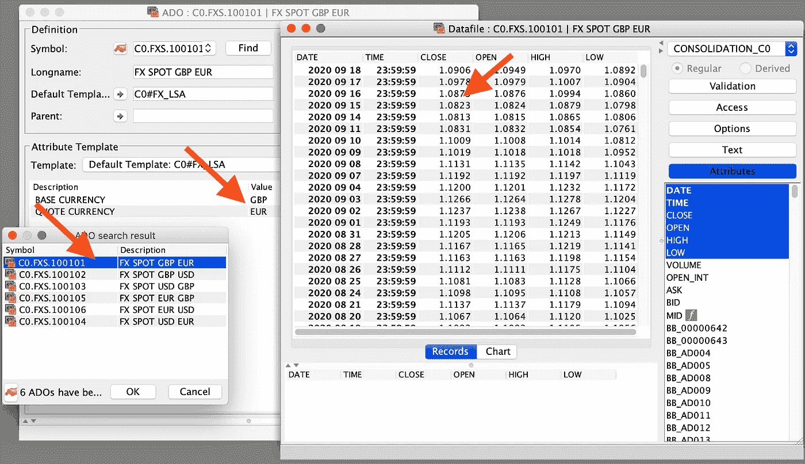
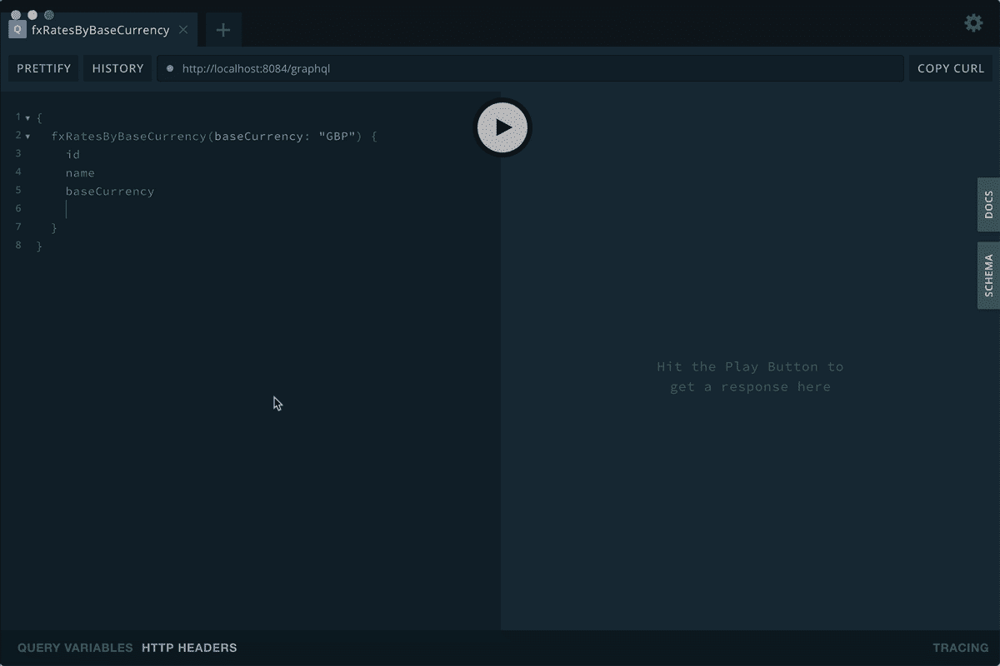

# 用于资产控制的 GraphQL 服务

> 原文：<https://levelup.gitconnected.com/a-graphql-service-for-asset-control-69475f4e66a9>

在这篇博文中，我将展示如何为存储在[资产控制](https://www.asset-control.com/)中的外汇汇率实现 GraphQL 服务。在随后的[文章](https://medium.com/@mhmtio/a-react-app-for-plotting-fx-rates-for-asset-control-afb203623824)中，我将在一个小的 React 应用程序中使用 GraphQL 数据来生成这些汇率的图表。

*虽然本文的目标是资产控制，但是您可以看到如图所示的 GraphQL 服务的实现如何适用于其他系统。*

你可以在这里找到源代码:[https://github.com/mhmtio/ac-graphql](https://github.com/mhmtio/ac-graphql)

首先，什么是 GraphQL？

# GraphQL 是什么？

根据[https://graphql.org/](https://graphql.org/)， *GraphQL 是一种用于 API 的查询语言，也是一种用现有数据完成这些查询的运行时*。

大多数人都熟悉 REST APIs，其中对(可能参数化的)URL 的请求以 JSON 格式返回响应。虽然 GraphQL 服务仍然返回 JSON，但是它的优点和相对优势在于它的查询语言。快进到我们将要构建的内容，请看下面的查询:

我们对外汇汇率感兴趣，我们通过其基础货币进行查询。我们指定结果应该包含报价货币以及带有日期和利率值的时间序列。

# 资产控制数据的 GraphQL 服务

现在，我想以外汇汇率为例，展示如何实现用于资产控制的 GraphQL 服务。

# 资产控制中的外汇汇率

我们需要一些数据。为此，我们在资产控制中设定了一小组外汇汇率，这些汇率仅由基础货币和报价货币以及时间序列来表征:

# 实现 GraphQL 服务

现在，我们可以以外汇汇率为例，来看看如何实现一个用于资产控制的 GraphQL 服务。如上所述，完整的源代码可以在这里找到:[https://github.com/mhmtio/ac-graphql](https://github.com/mhmtio/ac-graphql)

让我们在 pom.xml 中定义必要的依赖关系(Gradle 用户，请根据需要进行调整):

前两个库是 GraphQL 所必需的，第三个库用于启用 CORS(因此我们可以稍后使用 React 应用程序中的服务)，最后一个库用于使用我们已经在 [Adetta](https://terrafino-solutions.com/adetta/) 中使用的功能访问资产控制数据，Adetta 是我们用于资产控制的测试自动化解决方案。

任何 GraphQL 的核心都是模式，所以让我们在`resources/schema.graphqls`下定义它:

我们定义一个查询`fxRatesByBaseCurrency`,它将允许我们在给定基础货币的情况下找到外汇汇率。该查询返回 Ado 类型的数组。

Ado 类型保存一些静态数据，尤其是我们外汇汇率的基础货币和报价货币及其时间序列。timeseries 由一个 TimeseriesRow 数组组成，该数组依次保存日期和利率。

接下来我们实现一个我们称之为`GraphQLProvider`的 Spring `@Component`:

这个类让我们可以访问一个`GraphQL` bean，我们基于`schema.graphqls`和`GraphQLDataFetchers`对其进行初始化。您会注意到有两个数据提取器:

*   一个实现了`fxRatesByBaseCurrency`查询
*   另一个用来获取给定 Ado 的时间序列。

让我们看看`GraphQLDataFetchers`中的两个数据获取器:

事情是这样的:

*   `AcAccess`实例为我们提供了与资产控制交互的便捷方法(见下文)
*   `getFxRatesByBaseCurrency`使用 GraphQL 查询的 baseCurrency 参数和`findAdosByBaseCurrency`方法返回 ado 列表。
*   使用`getAdoData`方法，我们为每个 Ado 的数据创建一个映射，该映射符合模式中定义的属性:id、name、baseCurrency 和 quoteCurrency。
*   `getTimeseriesDataFetcher`数据提取器在 Ado 环境中运行，我们使用 Ado 数据访问相应的地图。我们检索 Ado ID 并使用 AcAccess 实例来获取时间序列。
*   这里，我们将结果包装在`TimeseriesRow`的实例中(见下文)。这是为了表明我们不局限于通用地图，也可以使用自定义类型。

快速浏览一下`TimeseriesRow`，它只是一个日期和利率的包装器:

现在，我们可以看看如何在资产控制中实际访问我们的数据。类`AcAccess`是我们在 [Adetta](https://terrafino-solutions.com/adetta/) 中使用的资产控制 API 上的一个薄层。

*   `findAdosByBaseCurrency`为 C0 包装 adoBrowse 呼叫。给定基础货币的 FXS Ados。
*   `getTimeseriesFor`返回给定 Ado 和数据文件树的所有收盘价。

# 尝试一下

我认为如果你还在阅读，你应该看到一个结果，所以让我们开始吧！

我们将把它包装成一个 Spring Boot 应用程序并运行它:

要查看我们新创建的资产控制 GraphQL 服务的运行情况，虽然我们还没有 React 应用程序，但我们可以使用 [GraphQL Playground](https://www.apollographql.com/docs/apollo-server/testing/graphql-playground/) :

您可以在左边看到查询，在右边看到结果。修改查询以包含 timeseries 可以按预期工作。

在这个小项目的第二部分，我们将构建一个使用 GraphQL 服务的 React 应用程序，然后绘制外汇汇率图表。即将推出…

感谢您的阅读。