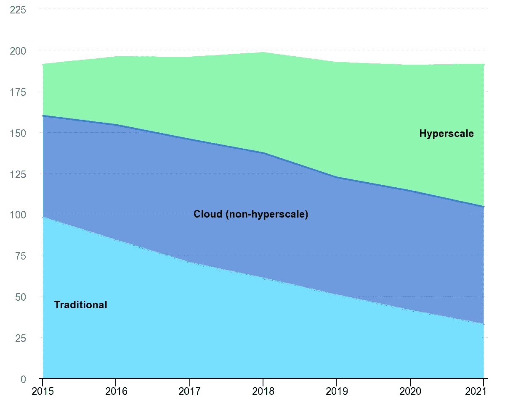

# 绿色机遇

> 原文：<https://levelup.gitconnected.com/a-green-opportunity-f28d0ad29703>

## 改善用户体验，让开发者保持理智，同时帮助拯救地球。

照片由 [Unsplash](https://unsplash.com?utm_source=medium&utm_medium=referral) 上的 [israel palacio](https://unsplash.com/@othentikisra?utm_source=medium&utm_medium=referral) 拍摄

从 1956 年到 2015 年，计算性能增加了*万亿倍*。

随着性能以如此快的速度增长，软件开发人员不需要将计算资源视为有限的。现在我们生产的大部分软件比乌塞恩·博尔特更接近贾巴小屋，这有什么奇怪的吗？

人类使用一台具有 2MHz CPU 和 4KB RAM 的导航计算机去月球旅行。相比之下，2018 年 10 月的英特尔酷睿 i9–9900k 配备了八个内核，频率可达 5GHz。那是相当大的跳跃。

如果你把注意力转移到文件大小上，今天网页的平均大小是 3.5 MB。相比之下，1993 年的原版《毁灭战士》游戏才 2.39 MB，当时是一款设定基准的互动游戏。

你可以进行无休止的比较，当然，有些比较是不公平的，因为竞争环境已经发生了根本的变化，但重点是。

**软件性能现在是一个巨大的未开发的机会领域，**开发者可以改善他们的用户、他们自己的体验，同时帮助拯救地球。

# 8.5%的机会

照片由 [Siora 摄影](https://unsplash.com/@siora18?utm_source=medium&utm_medium=referral)在 [Unsplash](https://unsplash.com?utm_source=medium&utm_medium=referral) 上拍摄

> “就温室气体而言，数字的影响占地球总排放量(GHG)的 3.7%，根据假设，到 2025 年可能占 7%至 8.5%”。— [绿色卫士](https://greenspector.com/en/energy-consumption-of-the-30-most-popular-mobile-apps-in-the-world/)

这些数字来自格林斯佩克特最近的一份报告，虽然它们令人吃惊(尽管可能并不令人惊讶)，但它们也凸显了摆在我们面前的机会的规模。

> “今天，像脸书这样最受欢迎的应用程序，每月有超过 20 亿活跃用户在智能手机上使用……
> 
> 在每一类应用程序中，相近的功能存在很大的差异，这可以转化为可避免的混乱，从而获得可访问的优化。30–40%?”— [格林斯派克](https://greenspector.com/en/energy-consumption-of-the-30-most-popular-mobile-apps-in-the-world/)

**如果实现这种级别的优化成为软件开发的标准目标**，潜在的能源节约、性能提升以及由此带来的用户体验改善将是非常显著的。

现在是开发商发挥作用的时候了。

> “你不能通过今天的逃避来逃避明天的责任。”——亚伯拉罕·林肯

# 我们的超大规模未来

向云基础设施的转移——国际能源机构，按数据中心类型划分的全球数据中心能源需求，国际能源机构，巴黎[https://www . IEA . org/data-and-statistics/charts/Global-data-centre-energy-demand-by-data-centre-type](https://www.iea.org/data-and-statistics/charts/global-data-centre-energy-demand-by-data-centre-type)

随着[亚马逊网络服务](https://aws.amazon.com/)、[微软 Azure](https://azure.microsoft.com/) 和[谷歌云](https://cloud.google.com/)的兴起，数据中心现在是大多数企业和消费者数字互动的关键组成部分。因此，很自然地，它们消耗了大量的能量。

> “2018 年全球数据中心的电力需求估计为 198 太瓦时，约占全球最终电力需求的 1%(Masanet 等人，2018)。”— [国际能源机构](https://www.iea.org/reports/tracking-buildings/data-centres-and-data-transmission-networks)

然而，有些令人惊讶的是，硬件能效和虚拟化技术的进步目前正在抵消对数据中心不断增长的需求，正如国际能源署(IEA)2019 年 5 月发布的这份报告所示。

**很明显**我们正在实现数据能耗百分比的最低目标，我们的重点需要放在运行在这些数据上的软件上。

# 改变计划

跨部门的能源使用要求—对绿色软件工程从业者观点的实证研究—[https://dl.acm.org/doi/10.1145/2884781.2884810](https://dl.acm.org/doi/10.1145/2884781.2884810)

2016 年的一项[研究收集了开发人员对绿色软件工程的观点，无疑为我们提供了一个良好的起点——](https://dl.acm.org/doi/10.1145/2884781.2884810)[需求](https://medium.com/@alexlaycy/love-your-documentation-fbda96461e64)。

毫不奇怪，移动开发人员经常对能源使用有要求(63%的人回答说，有时、经常或几乎总是有)，然而*令人惊讶的是，数据中心开发人员很少这样做(只有 27%的人表示很少)。*

尽管如此，我们还是跳过前面。

就目前的情况而言，首先在如何编写能源使用要求方面缺乏共识，而且相对而言，能够帮助你确认是否实现目标的工具也很少。

> “能源使用要求通常用能源使用以外的术语来表述。有趣的是，许多示例目标和要求都是用电池寿命或能源使用之外的东西来表达的。我们认为，这可能是由于缺少测量能源使用的工具支持(参见第 3.5 节)。”— [受影响的研究](https://dl.acm.org/doi/10.1145/2884781.2884810)

有一个缺口需要填补。

# 打破循环。

由 [Pascal Swier](https://unsplash.com/@pascalswier16?utm_source=medium&utm_medium=referral) 在 [Unsplash](https://unsplash.com?utm_source=medium&utm_medium=referral) 上拍摄的照片

**开发人员同意**一般的模式是存在的，即*“导致好的或坏的能源使用”*，但是对于给定的情况或任务，没有任何东西可以帮助定义什么是合理的，什么是不合理的。没有衡量标准。没有人决定成为权威的代言人，这与谷歌通过诸如 [Page Insights](https://developers.google.com/speed/pagespeed/insights/) 这样的工具推动网页性能的方式类似。

**如果没有这些**，开发人员就没有足够的背景来做出真正明智的决策，能源使用将继续落在优先事项的底部。

我们不能让这种情况继续下去——它每天都在越来越多地影响着我们。

是时候建立一个跨越软件开发世界的联盟了，但是谁来领路呢？