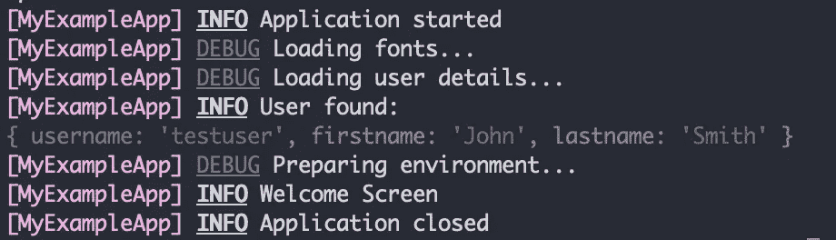
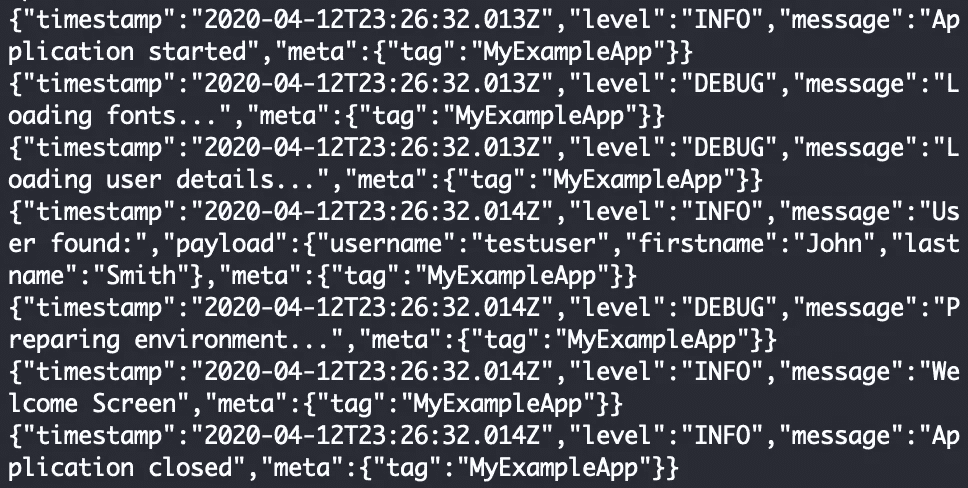

# 应用程序日志指南

> 原文：<https://levelup.gitconnected.com/a-guide-to-application-logging-665b4f38e1a6>

如何避免只见树木不见森林的小贴士


# 什么是应用程序日志？

> 日志的目的是生成一条信息的*轨迹，这将有助于理解用户或信息通过应用程序的路径。*

至少根据我的经验，日志在许多项目中是一个不受重视的话题。有些人在开发之初只将日志用于调试目的，以后再也不会查看它们，而另一些人只是在发生不可预见的事情时才开始添加日志，他们没有任何其他方法来找出最初是哪里出了问题。虽然这些可能是开始向应用程序添加日志的最初原因，但在整个应用程序流中添加日志并跟踪系统中正在发生的事情(无论是否是预期的)是非常有益的。在小规模的个人项目中，您可能没有太多的日志记录，但是如果您在专业的企业环境中开发，一个强大的日志记录策略变得越来越重要，如果不是一个基本要求的话。在这篇文章中，我想说明为什么日志应该成为你日常开发工作中不可或缺的一部分，并希望在这个过程中给你一些最佳实践和有用的建议。

## 用不同的编程语言登录

虽然这篇文章中的许多原则和技巧适用于大多数编程语言，但我将在我的例子中使用 JavaScript/TypeScript，因为它既是初学者也是专家语言，越来越受欢迎。

## 日志记录与调试


首先，让我们快速看一下现代 JavaScript 应用程序中的调试和日志记录。一些在调试器变得流行之前(或者甚至还没有)使用 JavaScript 的用户可能仍然在开发期间使用`console.log`语句来“调试”问题。其他人可能仅仅依靠单元测试，可能在开发期间依靠[调试器](https://nodejs.org/api/debugger.html)来实现他们的组件，而根本不使用任何日志记录。

在这一点上，我想重申我的声明，日志应该超越开发期间应用程序的简单测试和调试，但是*需要成为您日常开发例程*的一个组成部分。将日志添加到应用程序中不仅有助于您日后发现问题，而且最终会提高您和您的团队对应用程序中数据流的理解。它有助于在瓶颈和潜在问题出现之前就发现它们。

# 有效记录

作为一名 20 多年的专业软件开发人员、架构师和管理人员，我总结了一些关于日志记录的最佳实践:

*   **为每个日志输出添加时间戳**。正确的时间对于理解事件的正确顺序至关重要，尤其是当您需要将不同系统的独立日志拼凑在一起时。最好使用 UTC 时间戳，以避免处理时区，尤其是当您的系统运行在不同的可用性区时。
*   **使用人类可读的信息**。不要只记录值，而是要确保团队中稍后必须分析日志的人理解它们的上下文。在字符串中尽可能地描述(并且合理)，即使用类似“应用程序以默认设置启动”或“数据库成功更新”的字符串，而不仅仅是“启动”和“完成”。
*   **记录事件的来源**。包括日志事件的来源，如类、函数或文件名。这将使找出事件发生的位置变得容易得多，因为日志消息通常彼此非常相似。如果您的日志框架支持标签或标记之类的东西，请使用它们来区分代码库的不同部分。提示:使用`__filename`自动将当前文件名设置为源文件，这使得定位日志的来源变得非常容易。
*   **使用不同的日志级别**。虽然最初您可能会尝试使用相同的方式记录所有事情，但是将日志分为不同的严重级别，例如`INFO`、`WARN`和`ERROR`，可以让您更好地了解情况，并突出需要特别注意的事情。更多关于如何选择适当的水平在下面的章节。
*   **使用标准化的字段名称和一致的数据类型**。标准化您的日志模式确保团队知道在分析日志时要寻找什么。一致性至关重要！
*   **分别保存有效载荷数据和日志信息**。避免使用模板字符串，并将任何有效负载数据记录为单独的对象。即，不是记录字符串“`Created 5 records`”，而是记录字符串“`Created records`”和`{ count: 5 }`作为单独的有效载荷。像这样的静态字符串比动态变化的字符串搜索起来更快更容易。[没人喜欢正则表达式搜索](https://ihateregex.io/)。
*   **JSON 格式的日志数据结构**。JSON 是一种常见的机器可读格式，可以简化以后的日志处理。
*   **为所有工程师提供标准配置**。随着团队的成长，避免混乱。从最佳实践开始，并根据需要偏离。在我自己的项目中，我通常首先设置日志记录，甚至在团队的其他成员加入之前。

让我们在接下来的章节中更深入地研究这些建议。

## 使用日志框架并建立标准

虽然`console.log`经常用于日志记录，尤其是在新项目开始时，因为还没有引入另一个日志记录框架，但它不仅仅是一个日志记录工具，而只是一种将信息打印到控制台的方式。使用`console.log`(以及它的姐妹命令`console.info`、`console.warn`、`console.error`)的最大缺点是它没有强制一种通用格式。你可以随心所欲地记录任何你想记录的东西，这可能会导致一些问题。

因此，我强烈建议使用日志框架。Node.js 中最受欢迎的一个，也是我个人最喜欢的一个是 [Pino](https://github.com/pinojs/pino) ，一个小而快的 JSON 记录器。这里有一个简单的例子:

使用 Pino 记录的示例

注意，我们将`name`标记设置为当前文件名，以便更容易识别日志消息的来源。在第一个`logger.info`调用中，我们只提供了一个简单的字符串，在第二个调用中，我们将用户的名和姓作为单独的有效载荷对象传递给方法。如前所述，我建议将有效载荷和消息分开，避免使用[模板字符串](https://github.com/pinojs/pino/blob/master/docs/api.md#interpolationvalues-any)。您也不需要传递时间戳，因为 Pino 会自动将时间戳以及其他一些有用的信息添加到日志中。

无耻之徒:如果你正在寻找一种可移植的、轻量级的、不依赖第三方的替代产品，请查看下面的要点，我将它作为我自己项目的起点:[https://Gist . github . com/arabold/3a 56 def 70 f 451 c 74956 c 26 e 1720 a 9778](https://gist.github.com/arabold/3a56def70f451c74956c26e1720a9778)。

## 选择日志格式

日志消息有许多不同的通用格式。甚至有一种被称为“[通用日志格式](https://en.wikipedia.org/wiki/Common_Log_Format)的格式，它被许多 web 服务器和其他 Linux 服务所支持。它看起来像这样:

```
127.0.0.1 user-identifier frank [10/Oct/2000:13:55:36 -0700] "GET /apache_pb.gif HTTP/1.0" 200 2326
```

即使经常使用(甚至以这种方式命名)，这个日志输出的例子也不一定是一个好例子。它包括重要的信息，比如事件的来源、时间戳和其他相关属性，但是您是否立即意识到值`2326`的含义？

为了便于机器处理日志，您可能更愿意选择 JSON 作为目标格式。这里有一个 JSON 示例，类似于我自己通常使用的格式:

```
{
  "timestamp": "2020-04-12T23:26:32.013Z",
  "level": "INFO",
  "message": "Application started",
  "meta": {
    "tag": "MyExampleApp"
  }
}
```

实际上，大多数日志框架允许您选择如何将日志消息打印到控制台或文件。因此，这通常只是您第一次为新项目设置日志记录时需要担心的事情。注意，如果我们将日志写到一个文件，通常最好避免使用换行符和换行符，每行写一个*单个* JSON 对象(又名 [JSON 行](https://jsonlines.org/)或`jsonl`)。

如果你想了解更多关于不同的日志格式和它们的用途，请阅读[日志格式——一个(几乎)完整的指南](https://www.graylog.org/post/log-formats-a-complete-guide)。然后坚持使用 JSON)

## 有一个清晰的模式

然而，我认为最重要的技巧是*在属性和数据类型的命名上保持一致*。

*   尽可能避免对相同的属性使用不同的名称。例如，坚持使用`userId`或`user_id`，但不要互换使用！使用描述性名称以避免混淆。
*   保持数据类型的一致性，尤其是避免随机混合相同属性的字符串和数字。以后的搜索和过滤会比你保持单向搜索和过滤困难得多。

> 底线:将日志视为代码库的一部分，并在定义其消息和数据结构时应用同样的活力和勤奋。

## 多个日志记录目标

大多数日志记录框架都允许您控制日志在屏幕上的呈现方式或写入文件的方式。利用该功能并相应地配置您的环境！例如，在开发过程中，大多数日志消息可能会出现在工程师的终端或浏览器控制台中。因此，人类可读的格式，甚至可能带有颜色编码，将是更可取的。稍后，一旦您的应用程序部署在服务器上，使用 JSON 使您的日志易于机器读取。如果您的应用程序在最终用户系统的 web 浏览器中运行，您可能希望完全禁用控制台日志。



开发时在终端中记录输出



在服务器上运行时，相同的日志消息被格式化为 JSON 字符串

例如，Pino 支持使用 [pino-pretty](https://github.com/pinojs/pino-pretty) 为控制台格式化输出。将您的`pacakge.json`启动脚本更新为类似于`node src/index.js | pino-pretty`的东西，以便在您的应用程序每次本地启动时自动应用它。

或者，如果您使用我上面链接的[要点](https://gist.github.com/arabold/3a56def70f451c74956c26e1720a9778)，那么输出格式(JSON 或 console)将根据您的环境自动确定，并且在单元测试期间日志将被完全禁用，以避免干扰其他输出。虽然有点固执，但我发现这是一个非常简单方便的方法，我喜欢在我所有的个人和专业项目中使用。

## 何时记录—在正确的位置添加日志

一旦你选择了你的日志框架并设置好一切，下一个重要的考虑就是*什么时候*你想要记录一些东西。

我通常建议在发生某些事情之前添加一个日志语句*，并在之后记录结果。大多数系统都会自动记录意外错误或异常。因此，仅仅在*操作之后添加一个日志*不会给我们提供除了操作完成之外的额外信息。然而，通常我们并不真正关心成功的案例，而是错误的案例！那么，如果在我们的操作中抛出一个异常，会发生什么呢？则跳过成功消息，而是记录一个错误。太好了！但是如果我们没有记录我们最初尝试的操作，是什么导致了错误仍然是个谜。因此，在*执行重要操作之前的任何时候*添加日志消息，即在*执行后端 API 调用之前的*或在*在数据库中存储记录之前的*，而不仅仅是之后！*

> TL；DR .:记录一个重要操作之前将要发生的事情，包括传递的输入参数。

## 记录什么—选择正确的日志级别

记录器通常区分一组不同的日志级别，这些日志级别根据日志消息的严重性对其进行分类。这些级别通常被命名为“T2”、“T3”、“T4”等。您应该明智地选择级别，对于大多数日志输出，通常默认为“`debug`”，而对于应用程序数据流中的主要连接，则保留“`info`”。

这里需要注意的一点是，对于应用程序错误，您应该只使用`error`*，而不是用户错误*。那是什么意思？例如，用户输入错误的密码是一个简单的*用户错误*，并不保证有一个“`error`日志级别。对于错误的用户输入，您或您的团队几乎无能为力。相反，一个简单的“`info`”应该就够了。这样你就知道发生了什么，以防将来某个时候你不得不查看日志，但你不会发出任何警报。只有在应用程序逻辑中出现(不可预见的)严重问题时，才使用`error`，以避免出现所谓的[警报疲劳](https://whatis.techtarget.com/definition/alert-fatigue)。

## 开发期间的日志记录

我看到许多开发人员仍然在开发过程中向他们的代码添加`console.log`语句，尽管日志框架已经很容易获得。尽量避免！我甚至会启用`no-console` [ESLint 规则](https://eslint.org/docs/rules/no-console)，以防止任何人使用它。

相反，我鼓励你使用`debug`日志(或者`silly` / `verbose`，如果你的框架提供这些日志的话)来做同样的事情，并且*即使在组件完成之后也在应用程序*中保留日志。如果您发现在开发组件时日志足够重要，那么没有理由相信同样的信息以后不会变得同样重要。因此，与其从`console.log`开始，然后再删除日志，不如马上使用一个合适的日志记录器。你可以以后再感谢我；)

## 额外收获:将你的日志发送给日志服务

假设您遵循了这些建议，并根据最佳实践设置了一切，那么最后一个难题是如何使用日志？在本地开发过程中，您可能只需要打开控制台并实时检查日志。但是一旦部署了应用程序，事情就变得更加棘手了。使用 [Amazon Cloudwatch](https://aws.amazon.com/cloudwatch/) 或 [Azure Monitor](https://docs.microsoft.com/en-us/azure/azure-monitor/) 你可以轻松地处理你的 JSON 日志，并通过时间戳、消息或特定属性值搜索日志记录。如果您为您的有效负载对象使用一致的模式，您甚至可以运行[复杂分析](https://aws.amazon.com/log-analytics/),您可能在最初添加日志时甚至没有想到过。

有几种第三方服务可以进一步简化日志的使用，让您的工程团队在真实用户使用您的系统时，可以轻松地实时访问日志。查看 [Loggly](https://www.loggly.com/) 、 [Papertrail](https://www.papertrail.com/) 或 [Logz.io](https://logz.io/) 以获得以日志记录为中心的解决方案，或者查看类似 [DataDog](https://www.datadoghq.com/) 和 [Splunk](https://www.splunk.com/) 的服务以获得更全面的分析平台。

我也喜欢使用错误报告服务，如 [Sentry.io](https://sentry.io/) 或 [Rollbar](https://rollbar.com/) ，它们与应用程序日志记录配合得非常好。例如，只需将您所有的`ERROR`日志发送到这些服务中的一个，当您的系统中发生意外时，您就会收到通知。

## 下一步是什么？

我希望这很好地介绍了应用程序日志记录，以及为什么日志记录应该成为您日常开发工作的一部分，而不是事后的想法或只是穷人的调试工具。提供*一致的和上下文丰富的*日志将减少花费在错误修复上的时间，简化新工程师的入职，让你更快地回到特性开发，提高你和你的团队的整体速度。记录总是我为新项目设置的第一件事。也应该是你的。

祝你好运！