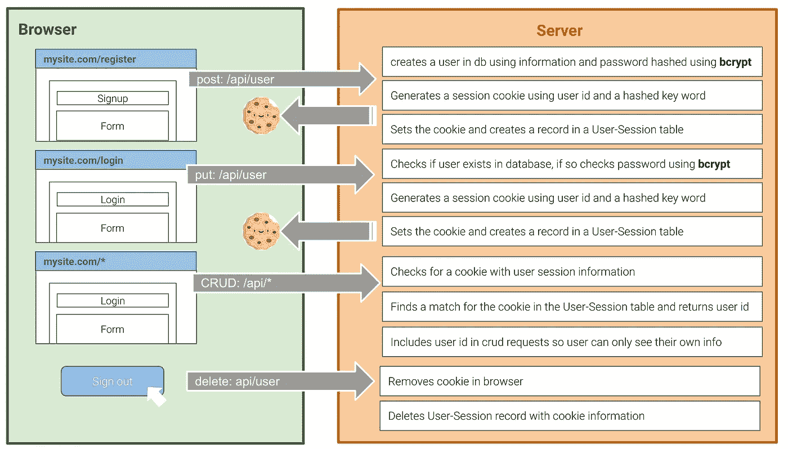
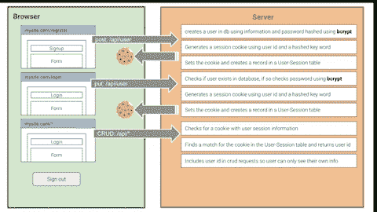

# React 中的身份验证指南

> 原文：<https://levelup.gitconnected.com/a-guide-to-authentication-using-passport-local-in-react-f5b3db06d4d0>

## 我如何在 React 中学习认证

## 介绍

我开始这篇文章的目的是写一个关于在 React 中使用 Passport-Local 的明确指南，因为关于这个特定主题的资源很少。React 是一个构建用户界面的库，身份验证发生在浏览器和服务器之间(在我们的例子中是数据库)。因此，资源的缺乏是由于主题不直接相关。

为了更深入地理解这个主题，我使用 cookies 和 bcrypt 构建了自己的身份验证方法。我对 MERN (MySQL、Express、React、NodeJS)应用程序的不同元素在身份验证上下文中如何相互作用感到困惑。除了介绍注册、登录、散列密码和使用 cookies，我还回顾了:

*   如何确保 CRUD 考虑到已认证用户的身份，以便他们只能查看、创建、删除、更新自己的信息。
*   如何确保只有经过身份验证的用户才能访问某些页面？

## 欢迎使用认证指南！

下面是我的身份验证方法的总结:



我的身份验证方法总结

在 React 中，可以使用全局状态和[上下文](https://reactjs.org/docs/context.html#when-to-use-context)在组件之间共享信息。两者都是确定用户看到什么的有价值的工具；然而，我们将依靠好的老式 cookies 来认证用户。

# 在 MERN 应用程序中认证用户的一步一步

在我们深入之前，让我们澄清一些定义！注册本质上是一个创建新用户记录的请求。登录是获得访问权限的请求。通过检查数据库中是否存在该用户以及所提供的密码是否与记录中的密码相匹配来验证访问权。

把注册想象成加入一个高级俱乐部的名单，把登录想象成出现并出示你的身份证以证明你是你。

## 首先，我们需要建立一些路径

首先创建用户将直接与之交互的路径——我选择创建两个页面，一个用于登录，另一个用于注册。在 App.js 文件夹中，我创建了路线并引用了我想要呈现的页面。


在 React 中创建登录和注册路由

在服务器端，我创建了一个路由 **/api/user** 来处理注册和登录。


API 调用服务器端来实际登录和注册用户

上面的两个部分都可以在一个服务器文件上创建，或者拆分成多个文件，正如我所做的那样。概念还是一样的。

# 注册新用户

当用户注册时，他们填写一个表格，其中包含姓名、用户名/电子邮件和密码等信息。对于我们的应用程序，我们将使用电子邮件作为用户的主要标识符。

…但是密码应该以某种特殊的方式存储吗？

我很高兴你想到了这一点！是的。一种方法是使用 [**bcrypt**](https://www.npmjs.com/package/bcrypt) **，**一个散列密码的库。简单地说，bcrypt 将密码映射成无法识别的东西。事实上，我用密码“password”创建了 20 多个用户，输出的文本没有一个是相似的。因此，在服务器端，在数据库中实际创建用户记录之前，散列密码。这样，如果任何人侵入你的数据库，他们将无法获得任何实际的密码信息。


显示在数据库级别的用户注册

bcrypt 使用异步函数来确保在创建用户记录之前对密码进行哈希处理。创建后，用户 Id 将被绑定到一个会话记录。由于注册和登录的方法类似，我将在后面解释。

# 登录现有用户

当用户登录时，他们用用户名/电子邮件和密码填写表单。这些值被捆绑在 API 请求中。

在服务器端，我们首先检查用户是否存在，然后检查密码是否有效。注意，比较不是三重相等的——事实是*我们*不能直接匹配它们，但是 bcrypt compare 函数可以。


用户登录显示在数据库级别

太好了，我们已经从技术上验证了一个用户！现在，我们需要使*意味着*某事:


# 使用 Cookies 来限制访问

## 基于已验证的用户信息限制访问

让我们访问数据库来理解信息是如何交互的:用户数据(姓名、电子邮件、散列密码)存储在用户表中。第二个表通过跟踪用户和活动会话 Cookies 关系来存储用户会话。每次我们给用户一个 cookie 时，我们都将 cookie 值和用户的 id 存储在这个用户会话表中。用户与用户会话具有一对多的关系，这意味着从技术上讲，一个用户可以同时在多个浏览器上进行身份验证，比如 ipad、iphone 和笔记本电脑。

# 我们将如何使用 Cookies

现在是饼干时间！[cookie](https://en.wikipedia.org/wiki/HTTP_cookie)是浏览器存储的一段数据，随每个请求一起发送。

当用户通过身份验证后，将会创建一个 cookie。由于 cookie 包含在每个请求中，服务器将能够使用会话 cookie 来确认用户的身份。对于每个 CRUD 请求，我们将首先检查会话 cookie，并使用用户会话表将 cookie 匹配回用户，如果关系存在，则返回用户的身份。一旦用户退出，cookie 就会被删除，用户会话记录也会被删除。


如何设置 Cookies 的图示

在这篇文章中，Piraveena 很好地描述了浏览器和服务器之间的关系。看看吧，供你参考。

# 创建 Cookie 是最简单的部分

创建一个 cookie 很简单，但是很难让它足够独特以至于不能被破解。欢迎回来 bcrypt！

```
let cookievalue = bcrypt.hash("secretword",10)
```

要设置 cookie，我们只需要将它与一个响应联系起来

```
res.cookie("cookiename", cookievalue)
```

在您的应用程序中，您可以检查 Inspect 下的应用程序选项卡，以查看这是否正常工作。下面是如何将会话 cookie 的创建与登录过程联系起来的方法:


您可以采用类似的方法进行注册，但是您需要等待在数据库中创建用户，而不是等待确认密码是否存在。从响应中获取用户 Id 来创建用户会话记录。在创建用户会话之前，客户端不会收到响应。

# 删除 Cookies 也一样简单

当用户注销时，我们删除浏览器中的 cookies，并从数据库中删除用户会话关系。



Cookies 会随每个请求一起发送。要访问您特别设置的 cookie，您可以使用解析器。我选择自己解析 cookie，以便更好地理解解析是如何工作的。注意 decodeURIComponent 的用户撤销设置 cookie 时发生的 URL 编码。


如何删除用户并解析出 cookie

# 污垢是棘手的部分

关于 cookies，我们学到的最重要的一点是它们被附加到所有的请求中。这意味着在客户端，我们不需要添加或提供额外的信息来发出 API 请求。

流程如下:

*   解析 cookie 以获得您的特定 cookie
*   使用 cookie 的值向用户会话表发出请求
*   如果结果为空，或者不存在任何关系，则不返回任何内容
*   如果匹配，则返回用户 id，然后使用该 Id 来完成用户最初发出的请求

每次用户发出请求时，我们都会检查他们的凭证，但检查的方式非常微妙，以至于客户都不知道。

这种方法是有效的，因为如果用户注销他们的身份验证，用户会话表上的记录将被擦除，他们将被要求重新登录。


用户会话需要存在，用户才能访问

# 语境呢？

因为我们正在构建一个 MERN 应用程序，所以上下文是一个跨 React 组件共享信息的工具。即使您选择使用用户上下文来跟踪是否有经过身份验证的用户登录，您仍然需要使用 cookies 来验证用户。上下文对于限制用户在给定时间可以查看哪些页面仍然很有价值。例如，设置每次页面加载时检查 cookie 的上下文，如果有 cookie，您可以显示注销按钮，因为这意味着用户已登录。

由于上下文在客户端，我们不想依赖它作为确认用户身份的方法。

# 下一步是什么？

既然您已经了解了身份验证是如何工作的，那么您可以探索其他资源，这些资源可以教您如何使用 Passport、indexedDB、cookie-parse、firebase-authentication 等。世界是你的。