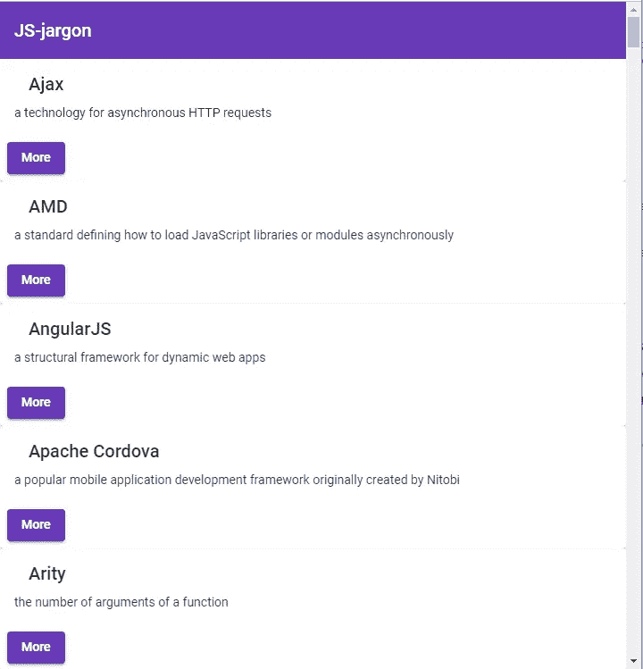
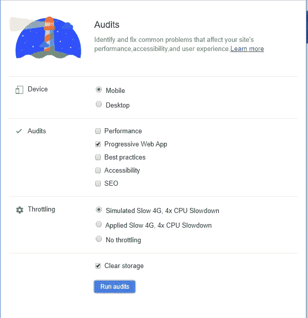
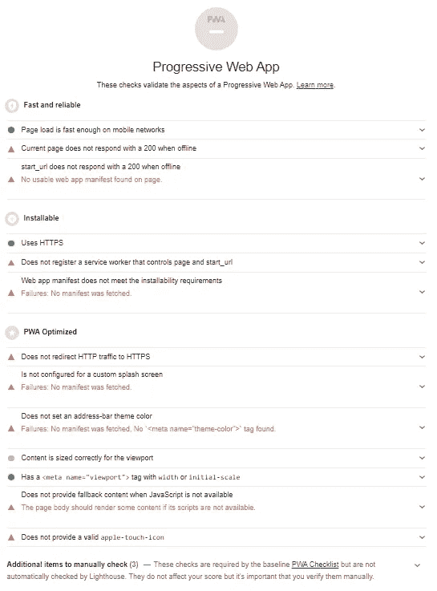
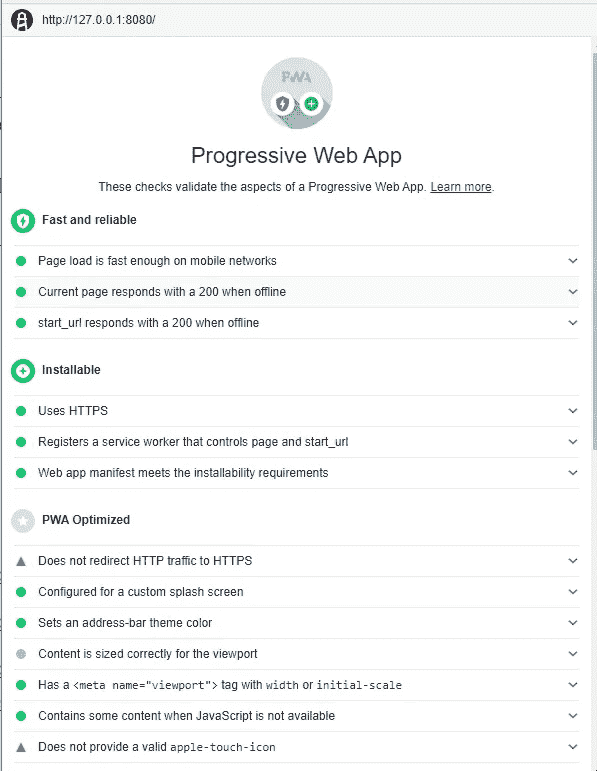

# Angular 8 中构建 PWA 的指南

> 原文：<https://levelup.gitconnected.com/a-guide-to-building-a-pwa-in-angular-acea27ae708d>

## 使用 Angular 创建渐进式 web 应用程序的分步教程


[freestocks.org](https://unsplash.com/@freestocks?utm_source=medium&utm_medium=referral)在 [Unsplash](https://unsplash.com?utm_source=medium&utm_medium=referral) 上拍照

在本教程中，我们将使用最新的 Angular 8 创建一个 PWA。我们将首先创建一个前端 web 应用程序，它将请求一个从[简化 Javascript 行话](https://github.com/HugoGiraudel/SJSJ)生成的 JSON API。为了构建 UI，我们将通过 Angular 材质包使用材质设计。

为了根据 PWA 的核心原则分析我们的 web 应用程序，我们将在本教程的最后运行 Chrome developer tools 中的审计面板(Lighthouse)。

我们先来了解一下什么是 PWA。

# 什么是 PWA？

progress Web Application(PWA)是一套使用现代浏览器功能的指南，旨在创建更像本地应用程序的用户体验。基本上，它仍然是一个网站，但它看起来和感觉上都像一个应用程序，并提供正常网站所不具备的功能。当用户在浏览器中访问您的网址上的 PWA 时，他们会得到一个提示，如果他们想“添加到主屏幕”，而不需要从应用商店下载和安装。当他们从主屏幕打开 PWA 时，没有浏览器 UI 控件，它显示为一个应用程序。

# PWA 的特点

以下是 PWA 的特点以及我们应该关注的原因。

**1。渐进式**

无论用户选择什么样的浏览器，这款应用都应该适用，因为它是以渐进增强为核心原则构建的。

**2。反应灵敏**

该应用程序可以根据屏幕大小、平台和方向来响应用户的行为和环境。

**3。独立连接**

当网络不可用或太慢时，应用程序应该仍然可以在设备上工作。

**4。类 app**

它看起来和感觉像一个应用程序，但不需要下载和安装。

**5。新鲜的**

服务人员更新流程将始终保持应用程序最新。

**6。安全**

通过 HTTPS 访问，以允许授权、安全交易，并防止未经授权的访问

**7。闪屏**

应用程序启动时会添加闪屏。感觉更像是原生 app。

# 安装 Angular CLI 并生成项目

在本节中，我们将安装 Angular CLI 的最新版本，即当前稳定版本的版本 8。对于 Angular 8 项目，建议使用最新的 Node.js 稳定版(即 12.x.x)。

要检查节点版本，请输入以下命令:

```
node -v
```

接下来，使用以下命令安装 Angular CLI:

```
npm i -g @angular/cli
```

要生成新的角度项目，只需运行以下命令:

```
ng new pwatest
```

添加角形材料只需要一个命令，命令如下:

```
cd pwatest
ng add @angular/material
```

在 Angular Material 安装过程中，我们可以选择预建主题或选择“自定义”来使用我们自己的自定义主题。在这里，我选择“深紫色/琥珀色”作为预建主题。

接下来，输入“Y”来设置 HammerJS 的手势识别和浏览器动画的角度材料。

# 设置 HttpClient 和 API 服务

我们将使用 HttpClient 发送 HTTP 请求。首先，我们需要在`app.module.ts`文件中导入 HttpClientModule。

```
import { BrowserModule } from '@angular/platform-browser';
import { NgModule } from '@angular/core';import { AppRoutingModule } from './app-routing.module';
import { AppComponent } from './app.component';
import { BrowserAnimationsModule } from '@angular/platform-browser/animations';
import { HttpClientModule } from '@angular/common/http';@NgModule({
  declarations: [
    AppComponent
  ], imports: [
    BrowserModule,
    AppRoutingModule,
    BrowserAnimationsModule,
    HttpClientModule
  ],
  providers: [],
  bootstrap: [AppComponent]
})
export class AppModule { }
```

对于本教程，我们将使用从 [*简化 JavaScript 行话* GitHub 库](https://github.com/HugoGiraudel/SJSJ)中静态生成的 [JSON API](https://www.techiediaries.com/api/data.json) 。如果您想要使用任何其他资源，请确保您启用了 CORS，这样浏览器就不会因为**同源策略**而不允许读取远程资源。

接下来，我们将创建一个与 API 交互的服务。在我们的项目根文件夹中，执行以下命令:

```
ng g service services/api
```

打开`api.service.ts`并用以下更改更新文件。

```
import { Injectable } from '@angular/core';
import { HttpClient } from '@angular/common/http';
import { Observable } from 'rxjs';export interface Item {
  name: string;
  description: string;
  url: string;
  html: string;
  markdown: string;
}@Injectable({
  providedIn: 'root'
})export class ApiService {
 private baseURL: string = "https://www.techiediaries.com/api/data.json"; constructor(private httpClient: HttpClient) { } fetch(): Observable<Item[]> {
   return <Observable<Item[]>>this.httpClient.get(this.baseURL);
 }
}
```

我们声明了`Item`接口，它表示返回的 JSON 数据的一个条目。然后我们创建了一个`fetch()`方法，它将向声明的`baseURL`变量中的 JSON 端点发送一个 HTTP GET 请求。

接下来，打开`app.component.ts`并添加以下代码:

```
import { Component, OnInit } from '@angular/core';
import { Item, ApiService } from './services/api.service';@Component({
  selector: 'app-root',
  templateUrl: './app.component.html',
  styleUrls: ['./app.component.scss']
})export class AppComponent implements OnInit{
  title = 'firstpwa';
  items: Array<Item>; constructor(private apiService: ApiService) {} ngOnInit() {
    this.fetchData();
  } fetchData() {
    this.apiService.fetch().subscribe(
      (data: Array<Item>) => {
         console.log(data);
         this.items = data;
      }, (err) => {
        console.log(err);
      }
    );
  }
}
```

# 添加用户界面

对于我们的应用程序页面，我们将通过使用有角度的材料添加一个导航栏和页面的框架。

首先，我们需要在我们的`app.module.ts`中导入有角度的材质组件。

```
/*...*/
import { MatToolbarModule, MatCardModule, MatButtonModule } from  '@angular/material';@NgModule({
  declarations: [
    AppComponent
  ],
  imports: [
    /*...*/
    MatToolbarModule,
    MatCardModule,
    MatButtonModule
  ],
  providers: [],
  bootstrap: [AppComponent]
})
export class AppModule { }
```

接下来，打开`app.component.html`，用下面的代码替换里面的内容。

```
<mat-toolbar color="primary">
  <mat-toolbar-row>
    <span>JS-jargon</span>
  </mat-toolbar-row>
</mat-toolbar><main>
  <mat-card *ngFor="let item of items">
    <mat-card-header>
     <mat-card-title>{{item.name}}</mat-card-title>
    </mat-card-header> <mat-card-content>
     {{item.description}}
    </mat-card-content> <mat-card-actions>
     <a mat-raised-button href="{{item.url}}" color="primary">More</a>
    </mat-card-actions>
  </mat-card>
</main>
```

这是应用程序的屏幕截图。



网络应用

# 为生产构建应用程序

为了检查我们的应用程序的 PWA 特性，我们应该首先为生产构建它，因为大多数 PWA 特性在开发期间并不使用。例如，我们不希望在开发中启用服务工作者和缓存，因为我们需要定期更新文件。

使用以下命令为生产构建应用程序。

```
ng build --prod
```

我们的生产构建将在文件夹`dist/pwatest`中可用，我们可以使用`http-server`来服务它。

运行下面的命令来安装 http-server。

```
npm i -g http-server
```

使用以下命令运行 http-server。

```
cd dist/pwatest
http-server -o
```

通过`-o`选项，您的浏览器将自动打开，并导航至[**http://127 . 0 . 0 . 1:8080**](http://127.0.0.1:8080.)。

我们还没有添加任何 PWA 功能，所以在我们这样做之前，让我们看看 Lighthouse 的分析。

# 分析应用程序

我们将使用 **Lighthouse** 来分析我们的应用程序。Lighthouse 是 Google 创建的一个开源审计工具，可用于审计网站和应用程序的可访问性性能、SEO、最佳实践和 PWA 功能。

要访问 Lighthouse，点击`F12`或`Ctrl` + `Shift` + `I`打开 Chrome DevTools，点击**审计**标签。



来自 Chrome DevTools 的灯塔

我们需要将设备选项设置为 ***移动*** 而不是桌面的*来模拟移动环境，并选中 ***渐进式 Web 应用*** 复选框作为我们想要执行的审计类型。接下来，点击 ***运行审计*** 按钮。*

这是目前阶段的结果截图。



第一份审计报告

我们的应用程序未能通过审核，主要与服务人员、渐进增强、HTTPS 和 Web 应用清单有关，这些都是 PWA 的核心方面。

# 实施 PWA 功能

我们可以通过运行以下命令将我们的应用程序转换成 PWA。

```
ng add @angular/pwa
```

新增的 PWA 功能包括:

1.  `manifest.json`文件。
2.  src/assets/icons 文件夹中图标的大小不同。
3.  服务人员— `ngsw-worker.js`

服务工作器是现代浏览器中的一个特性，可以用作网络代理，让你的应用程序拦截网络请求来缓存资产和数据。这可用于实现 PWA 功能，如离线支持、推送通知等。

两个失败的审核(“未注册服务工作者”和“离线时未响应 200”)与**服务工作者**和缓存有关。

我们需要设置一个服务工作器，并使用它在本地缓存文件，以通过这些审核。离线时，服务人员应该返回文件的本地缓存版本。

现在，我们将为生产重新构建并重新运行 Lighthouse，以检查本地托管的应用程序。

这是我们新的审计报告。



第二份审计报告

我们只有两个失败的审计是与 HTTPS 和一个有效的苹果触摸图标。对于 HTTPS，我们需要托管应用程序并配置 [HTTP 到 HTTPS 重定向](https://stackoverflow.com/questions/4083221/how-to-redirect-all-http-requests-to-https)。

为了修复无效的苹果触摸图标，我们可以简单地在`<head>`中的**index.html**中添加以下更改。我们需要指向一个不透明的 192px(或 180px)正方形 PNG。

```
<link rel="apple-touch-icon" href="assets/icons/icon-192x192.png">
```

重新运行审核，如果我们遵循上述所有步骤，我们将通过所有审核。

下一部分: [PWA“主屏幕添加按钮”以及在带 Angular 8 的 Android 设备中的远程调试](/pwa-add-button-to-home-screen-and-remote-debugging-in-android-devices-with-angular-8-3dbaec772a1?source=your_stories_page---------------------------)

# 结论

在本文中，我们学习了如何构建 Angular 8 应用程序，并使用 Angular CLI 将其转换为 PWA。

我们还使用 Google 的 Lighthouse 来审核我们的 PWA 特性应用程序。

如果你认为这篇文章是有帮助的，不要忘记与你的朋友分享。

# 资源

1.  [https://alligator.io/angular/angular-pwa/](https://alligator.io/angular/angular-pwa/)
2.  [https://www.smashingmagazine.com/2018/09/pwa-angular-6/](https://www.smashingmagazine.com/2018/09/pwa-angular-6/)
3.  [https://dev . to/ronak Patel 70/creating-pwa-using-angular-7-step-by-step-guide-1mb 3](https://dev.to/ronakpatel70/creating-pwa-using-angular-7-step-by-step-guide-1mb3)