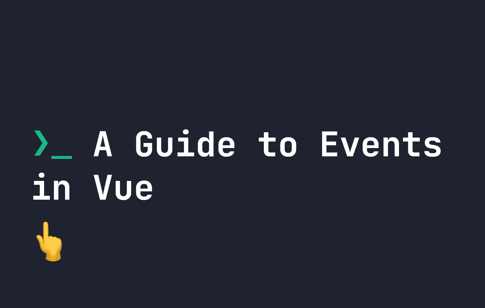

# Vue 事件指南

> 原文：<https://levelup.gitconnected.com/a-guide-to-events-in-vue-70f3ad986fd1>



与任何框架一样，Vue 允许我们通过事件为应用程序和网站增加反应性。Vue 事件的伟大之处在于它们模仿了普通的 Javascript，所以您习惯在 Javascript 中使用的所有事件也可以在 Vue 中使用。

# Vue 基础知识

如果你是 Vue 的新手，我建议你先阅读我关于[制作你的第一个 Vue 应用](https://fjolt.com/article/vue-create-your-first-app)或者[在 Vue](https://fjolt.com/article/vue-using-components) 中创建组件的指南。

# Vue 中的事件

Vue 和大多数 Javascript 中最常用的基本事件是`click`。下面的组件是一个简单的计数器，每单击一次按钮，它就增加 1。为此，我们使用一个内嵌的`@click`事件:

```
<script>
export default {
    data() {
        return {
            counter: 0
        }
    }
}
</script>
<template>
    <button @click="++counter">
        {{ counter }}
    </button>
</template>
```

由于我们可以直接在事件中编写内联 Javascript，我们可以简单地编写`++counter`来增加计数器数据。因此，只要我们单击按钮，上面的值就会增加`counter`，并显示在我们的`button`元素中。

如前所述，我们不仅仅局限于`@click`。所有其他 Javascript 事件也以相同的格式工作。这意味着您可以使用:

*   `@keydown`
*   `@mousedown`
*   `@pointerdown`
*   `@pointerup`
*   `@scroll`
*   等等..

我们不仅仅局限于在事件中内联运行 Javascript。我们可以触发一个方法或函数，如果在我们的 Vue Javascript 中定义了的话。**下面是使用方法代替**的相同代码:

```
<script>
export default {
    data() {
        return {
            counter: 0
        }
    },
    methods: {
        incrCounter: function() {
            ++this.counter
        }
    }
}
</script>
<template>
    <button @click="incrCounter">
        {{ counter }}
    </button>
</template>
```

# v-on 与@ in Vue

你可能已经看到事件被写成`v-on:click` vs `@click`。这两个意思是一样的，并且是可以互换的，所以用你觉得舒服的那个吧！

# 鼠标特定事件

我们可以通过使用`left`、`middle`和`right`修改器进一步修改任何鼠标事件。如果我们触发一个鼠标相关的事件，比如`click`或`mousedown`，那么`mousedown.right`将只跟踪鼠标右键点击，或者`mousedown.middle`将只跟踪鼠标中键点击。

```
<!-- left mouse clicks -->
<button @mousedown.left="incrCounter">
    {{ counter }}
</button>
<!-- right mouse clicks -->
<button @mousedown.right="incrCounter">
    {{ counter }}
</button>
<!-- middle mouse clicks -->
<button @mousedown.middle="incrCounter">
    {{ counter }}
</button>
```

# 在 Vue 事件中使用事件数据

有时，我们想要访问事件或事件中的`e`对象。在我们只想不带其他参数访问`e`本身的情况下，我们不必提及`e`——它会自动直接传递给函数。例如，每当用户点击按钮时，下面的代码仍然会控制台记录`e.clientX`和`e.clientY`:

```
<script>
export default {
    data() {
        return {
            counter: 0
    }
  },
  methods: {
    incrCounter: function(e) {
      ++this.counter
      console.log(e.clientX, e.clientY)
    }
  }
}
</script><template>
    <button @click="incrCounter">
    {{ counter }}
  </button>
</template>
```

当你有两个以上的参数时，事情就变得有点棘手了。在这些情况下，有两种方法可以访问`event`数据。要么封装函数，要么使用预定义的`$event`变量。

例如，假设我们想要将计数器增加一个自定义的数量，并继续控制台日志`e.clientX`和`e.clientY`。这可以通过使用`$event`将事件数据传递给我们的函数来实现:

```
<script>
export default {
    data() {
        return {
            counter: 0
        }
    },
    methods: {
        incrCounter: function(amount, e) { 
            ++this.counter
            console.log(e.clientX, e.clientY)
        }
    }
}
</script><template>
    <button @click="incrCounter(5, $event)">
        {{ counter }}
    </button>
</template>
```

或者，我们也可以将`e`对象直接传递给函数，如下所示:

```
<button @click="(e) => incrCounter(5, e)">
    {{ counter }}
</button>
```

# Vue 事件中的自定义按键事件

Vue 尽量简化事件。如果你过去曾经做过按键事件，你会知道我们经常只想访问一个特定的按键。因此，使用**键**事件，我们可以将公共键直接绑定到事件。例如，在这个输入中，我们将在用户按下`keyup`事件时触发一个事件:

```
<input @keyup="someFunction" />
```

**但是**如果我们想只在用户按下`enter`时触发`@keyup`，我们可以通过以下事件来实现:

```
<input @keyup.enter="someFunction" />
```

我们可以用任何[定义的键盘键值](https://developer.mozilla.org/en-US/docs/Web/API/KeyboardEvent/key/Key_Values)，转换成烤串大小写。例如，`PageDown`是一个键盘按键定义的值，但是在 Vue 中我们写成`page-down`:

```
<input @keyup.page-down="someFunction" />
```

最后，Vue 定义了一些常用的键，这些键不是定义的值。分别是`enter`、`tab`、`delete`、`esc`、`space`、`up`、`down`、`left`、`right`，以及键盘修饰键`ctrl`、`alt`、`shift`、`meta`。

# 键盘修饰键和按键

我们刚刚提到了键盘修饰符`ctrl`、`alt`、`shift`和`meta`，这些实际上可以与我们之前的键值相结合，以增加另一层功能。例如，每当在输入中同时按下`shift`和`enter`时，下面的代码将触发`keydown`事件，从而触发`someFunction`:

```
<input @keydown.shift.enter="someFunction" />
```

# 精确修饰符

最后，我们可以通过使用`exact`来确保只有一个键被按下。例如，只有单独按下`enter`时，下方的才会发射。如果同时按下`enter`和其他组合键，事件将不会触发:

```
<input @keydown.enter.exact="someFunction" />
```

# 最后的想法

Vue 中的事件控制是构建任何完整的 Vue 应用程序的基本元素。我希望你喜欢这个指南。您可以在这里找到更多 [Vue 内容](https://fjolt.com/category/vue)。