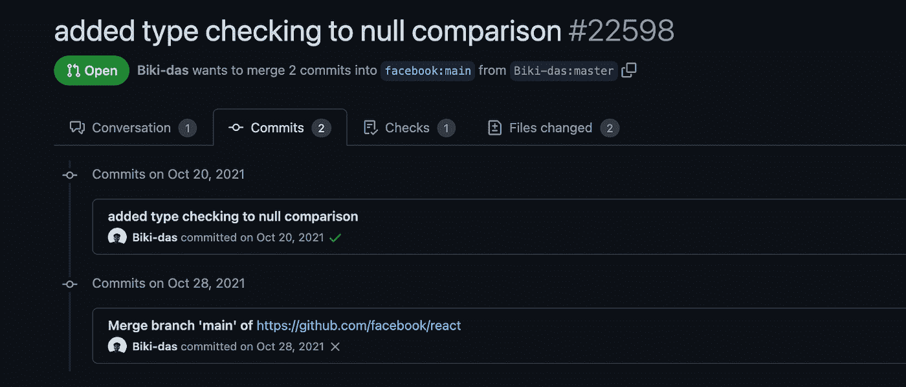
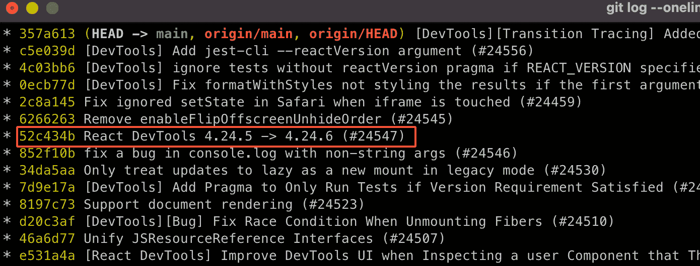
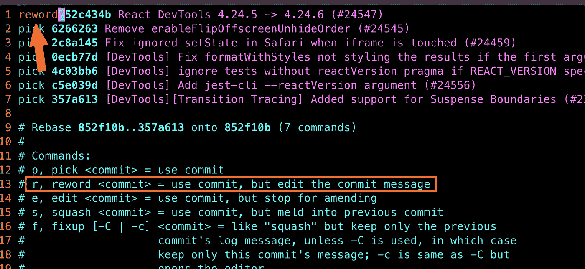
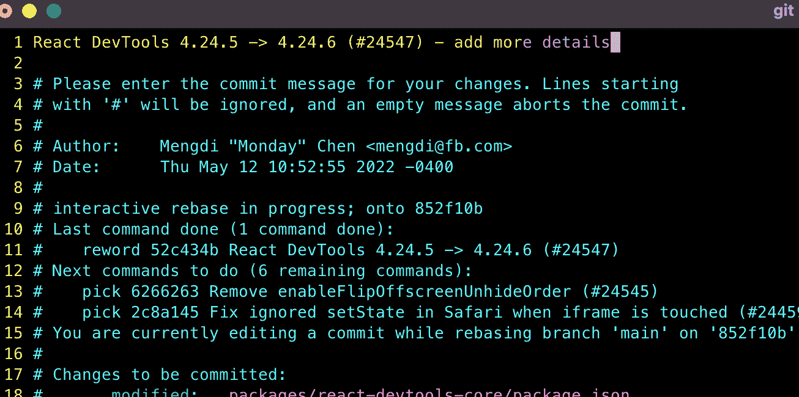
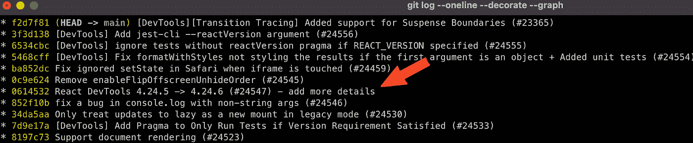
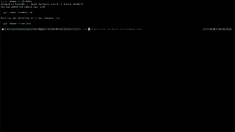
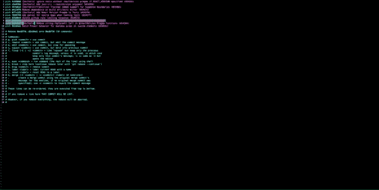

# Git Rebase 指南及实例

> 原文：<https://levelup.gitconnected.com/a-guide-to-git-rebase-with-practical-examples-2d9e1a3fb560>

Git rebase 是一个强大的工具，允许开发人员重写历史。此外，它还用于以 git merge 无法实现的方式更改提交顺序。

值得一提的是，这个工具不仅仅可以用来改写历史。它还有许多其他用例，例如

1.  重新排序提交
2.  更新提交
3.  删除提交

# 例子

克隆存储库([https://github.com/facebook/react](https://github.com/facebook/react))—为了避免获取所有提交，我们可以克隆我们示例中的最后 10 个提交:

```
git clone — depth=100 [https://github.com/facebook/react](https://github.com/facebook/react)
```

每一个例子之后，你的历史都会和 origin/main 不一样。要对齐管路:

```
git reset — hard HEAD~10
git clean -df
git pull origin main — rebase
```

# 。重新排序

# 更改提交顺序

让我们从一个简单的例子开始。您正在为代码评审准备您的分支。代码没问题，但是提交的顺序看起来不太好，可能只是提交的顺序。

```
git log # find the commits you want to reorder
git rebase -i HEAD~5 # swap commits
git log # see the changes
```


# 避免“合并”提交

当处理一个新的特性分支时，通常在某个时间点它会落后于主分支。因此，我们希望获得所有最近的更改，大部分时间我们只是做 git 拉套管这个“合并”提交。Github 拉请求视图看起来是这样的:



这很好，因为这正是 pull 所做的，git fetch，就在 git merge 之后。相反，我们可以使用 rebase“git pull—rebase”来避免它。

# 更新提交消息

如果我们想要更新最后的提交消息，我们可以使用 git commit-amend 来更新它。

当更新引用旧的提交时，最简单的方法是使用交互式 rebase。

首先，找到 git sha git 日志。



然后重定基数

git rebase -i 52c434b~并选择了使用“reword”命令提交消息更新。



下一步是更新提交消息。



再次使用 git log 来查看变化



# 添加/更新要提交的文件

与上一节类似，当添加/更新应该添加到最后一次提交的文件时，git commit-amend-no-edit 将更改添加到最后一次提交，而不进行任何消息编辑。

当一个更改应该更新历史中的提交时，使用交互式 rebase，git rebase -i 52c434b~，并使用 edit 命令。在修改完所有文件后，使用 git commit-a-amend-no-edit。要完成这个过程，请运行 git rebase —继续。

**注意** : *在某些情况下，进程会停止并请求解决冲突。*



# 删除提交

# 合并两个提交

使用 squash 命令合并两个或更多按顺序出现的提交。



# 放弃提交更改

最后，有时删除错误的提交是唯一的选择。

从 git rebase HEAD~3 -i 开始，删除提交行(一个或多个)


# 摘要

Rebasing 是一个 git 命令，它改变分支中的提交顺序。如果您想要将多个提交合并为一个，或者如果您想要在将提交推送到远程存储库之前编辑提交的消息，那么重新设置基础会特别有用。

当开发新功能或对代码库进行重大更改，然后与团队中的其他人共享时，通常会使用重新基础。这使得每个人都可以看到最新的变化，而不必将他们的工作与你的合并。

避免重定公共分支，如主分支或长期分支。请记住，推你的 rebased 分支后就没有回头路了。

# 分级编码

感谢您成为我们社区的一员！在你离开之前:

*   👏为故事鼓掌，跟着作者走👉
*   📰查看[级编码出版物](https://levelup.gitconnected.com/?utm_source=pub&utm_medium=post)中的更多内容
*   🔔关注我们:[推特](https://twitter.com/gitconnected) | [LinkedIn](https://www.linkedin.com/company/gitconnected) | [时事通讯](https://newsletter.levelup.dev)

🚀👉 [**加入升级人才集体，找到一份惊艳的工作**](https://jobs.levelup.dev/talent/welcome?referral=true)