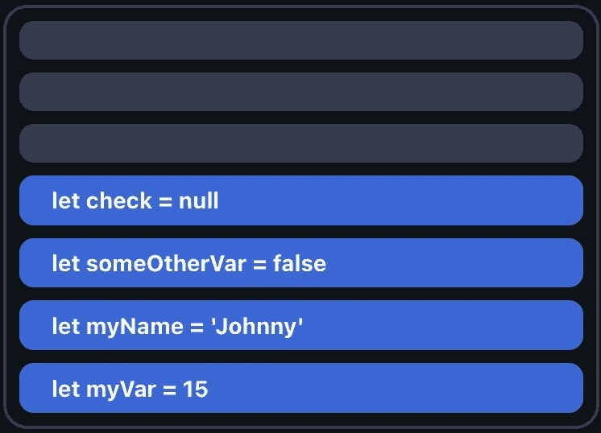
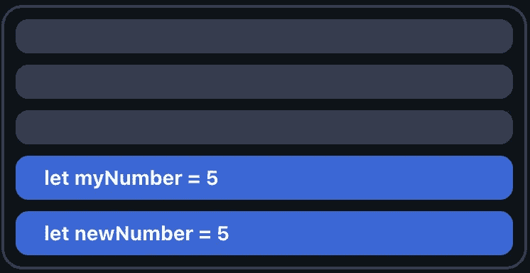
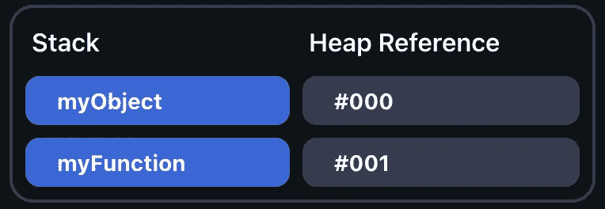
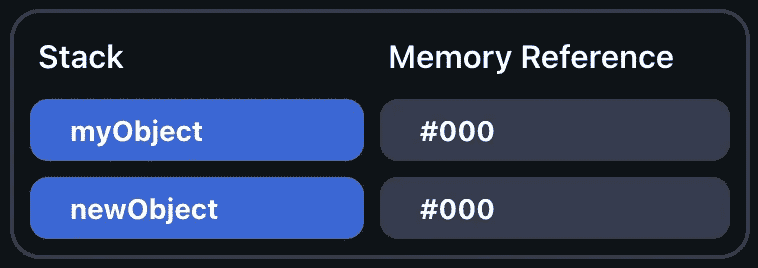

# Javascript 中的堆、栈、引用和值指南

> 原文：<https://levelup.gitconnected.com/a-guide-to-heaps-stacks-references-and-values-in-javascript-3a6fd8e013c3>


一般来说，软件工程中的一个常见概念是引用与值的概念。Javascript 有一种存储变量、对象和函数的有趣方式，误解这种方式会导致进一步的混乱。对于开发人员来说，了解这些概念是如何工作的非常重要，因为这是 Javascript 的基础。在本文中，我们将介绍 Javascript 如何管理值和引用，这将在处理复杂的应用程序和网站时带来好处。

# Javascript 中的内存存储

为了理解我们所说的 Javascript 存储值和引用是什么意思，我们需要理解 Javascript 将它们存储在哪里。Javascript 在两个地方存储这些数据:

*   堆栈是当前 Javascript 线程的暂存空间。由于 Javascript 通常只是单线程的，所以通常只有一个堆栈。堆栈的大小也是有限的，这就是为什么 Javascript 中的数字只能有这么大。
*   **堆**是应用程序级的动态内存存储。从堆中访问和检索数据稍微复杂一点，但是数据存储是动态的——这意味着如果需要，它会扩展，并且不受限制。

当某个东西存储在**堆栈**中时，它由**值**存储。当某个东西被存储在**堆**中时，它被**引用**存储。

# 堆栈存储器

Javascript 在堆栈中存储常规的原语类型，如`number`、`string`、`boolean`、`null`、`undefined`和`bigint`。在代码中定义变量时，它们会被添加到堆栈的顶部:

```
let myVar = 15;
let myName = 'Johnny';
let someOtherVar = false;
let check = null;
```

堆栈:



这意味着如果我们在 Javascript 中重定义一个变量，它会变成一个全新的值。例如:

```
let myNumber = 5;
let newNumber = myNumber;++newNumber;// Returns 5, 6
console.log(myNumber, newNumber);
```

堆栈:



由于 Javascript 为存储在堆栈中的任何东西创建一个新值，即使我们提到 newNumber 与 myNumber 相同，它们也不是指同一个东西。这两个变量变得相互独立，因此改变一个不会改变另一个。

# 堆存储

如果你定义的东西不是一个基本类型，而是一个对象，那么它被存储在堆中。在 Javascript 中，函数和数组也属于“对象”类别。

堆的定义需要更多的思考，而不是在堆栈中容易访问。存储在堆中的所有东西都被赋予了一个引用。

**示例**

假设我们在 Javascript 中定义了一个对象和一个函数:

```
let myObject = { name: "Hello" };
let myFunction = function() {
    return "Hello World";
}
```

如下所示，为每个 myObject 和 myFunction 创建了一个新的引用，引用分别为#000 和#001。该引用是它们在内存中的存储位置。

**堆存储**



与堆栈相比，堆存储的主要区别在于，如果我们再次引用一个对象，引用保持不变。这意味着如果我们尝试创建 myObject 的新版本，它将保留相同的引用:

```
let myObject = { name: "Hello" };
let newObject = myObject;
newObject.name = "Goodbye";// Returns { name: "Goodbye" }, { name: "Goodbye" }
console.log(myObject, newObject);
```

当我们改变一个时，两个都改变——这与我们在堆栈中存储数据时相反。

**堆存储**



# 值和引用的等价性

由于 Javascript 将对象的定义存储为引用，这可能会有点混乱。对于值，我们可以很容易地比较两个事物是否相等:

```
let a = 5;
let b = 5;// Returns true
console.log(a === b);
```

我们很容易比较这两者，因为它们都是值。不过，作为参考，这是一个不同的故事。比较两个对象，通过引用进行比较。即使它们的值相同，它们也不相等，因为它们的引用不同:

```
let a = { name: "Hello" };
let b = { name: "Hello" };// Returns false
console.log(a === b);
```

# 结论

引用和值对您的代码有着真正的影响——尤其是在进行比较时，理解它们的区别是至关重要的。不仅如此，就性能而言，堆栈比堆要便宜得多，而且如果您不知道它是如何工作的，很容易创建太多的堆栈条目。

如果您知道 Javascript 如何处理堆和堆栈存储，您就可以开始优化您的应用程序的性能，以便在这些规则内最佳地工作。我希望你喜欢这个关于 Javascript 中引用和值如何工作的快速指南。[如果你想要更多的 Javascript 内容，可以在这里找到](https://fjolt.com/category/javascript)。