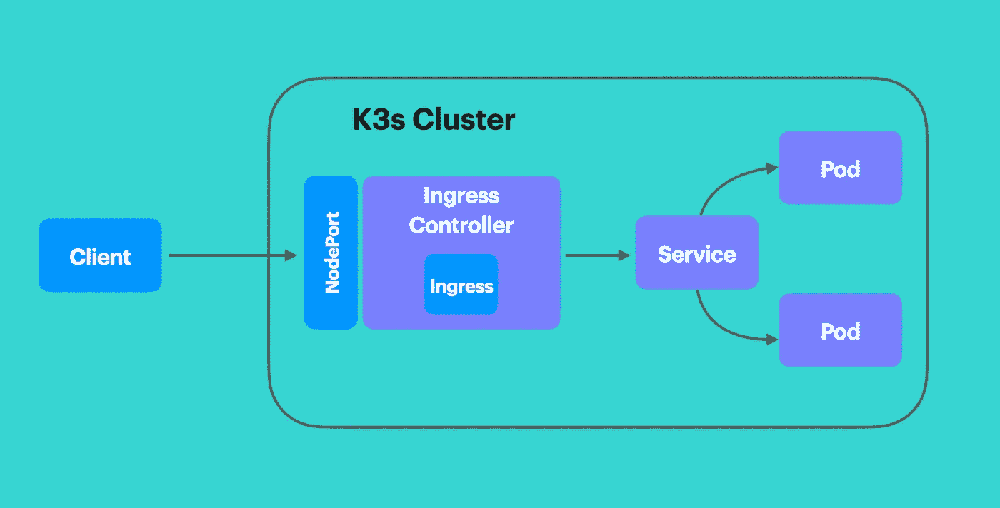

# 使用带节点端口的 Traefik 进入 K3s 的指南

> 原文：<https://levelup.gitconnected.com/a-guide-to-k3s-ingress-using-traefik-with-nodeport-6eb29add0b4b>


## 为了更好地理解无价的云概念

云由称为集群的短暂服务器组和为服务器分配容器的适当方式组成。容器是将应用程序打包成标准化单元的一种方式，因此它可以可靠地运行在云中的任何服务器上。将流量从外部客户端定向到云中的容器，同时确保外部客户端对云保持不可知，这是一个反复出现的问题。常见的解决方案是创建入口控制器。

# 进入

> 进入或进入的行为或事实

入口控制器被授权负责从外部客户端接收输入流量，并确定流量应该被定向到哪个容器。

这是一个相当直观的概念，不需要任何技术专业知识。想象一下，你正在看一场百老汇的戏剧，你有一张蓝色的票，上面写着数字 10。票上没有说明。当你到达剧院时，会有一个引座员迎接你，他会把你带到剧院里一个特定的座位。你已经被引导到正确的座位，而不需要了解组织系统；然而，你明白你的票在某种程度上在交易中起了决定性的作用。现在，想象你是引座员。你的第一个问题应该是，给定一张票的颜色和号码，你如何找到座位？事实证明，剧院分为三个区域，分别对应蓝色、绿色和黄色门票。在每个区域内，座位是随机分配的。当你向顾客打招呼时，你要检查他们的票的颜色，并把他们带到正确的区域。你忽略了票号，因为这是不相关的。关键是引座员(入口)了解剧院(云)的组织系统，并能够将客户(外部客户端)指引到正确的座位(容器)，而客户(外部客户端)除了显示门票(url)的简单合同之外，不需要了解任何东西。

# Kubernetes 的入口

## 术语

*   集群:由 Kubernetes 管理的一组运行 Pods 的服务器。
*   Ingress:Kubernetes Ingress 将集群外部的 HTTP 和 HTTPS 流量暴露给集群内部的服务。
*   入口控制器:负责满足入口请求的应用程序。
*   服务:Kubernetes 服务是一种抽象的方式来公开在一组 pod 中运行的应用程序。服务的实现包括 NodePort 和 ClusterIP。
*   Pod:一组共享网络和存储资源的一个或多个容器。Pod 的容器是协同定位和协同调度的。
*   K3s:一个轻量级 Kubernetes 发行版。
*   容器:一个标准化的软件单元，可以在云中的任何服务器上可靠地运行。

Kubernetes Ingress 有两个要求。

1.  入口控制器
2.  进入

这是一个为 Kubernetes 配置入口的端到端设置示例，这样，作为集群的外部客户端，您可以通过入口控制器访问集群中运行的 Pod。一旦流量被定向到该单元，流量将被定向到该单元中的正确容器。该集群是通过将 Rancher 的 K3s 部署到一个 Raspberry Pi 集群来构建的。关于在 Raspberry Pis 上构建 K3s 集群的更多信息，请参见此处的。



上图描述了以下组件。A `Client`想要向 a `Pod`发送流量。Pod 被部署到 K3s 集群，并通过创建集群 IP `Service`在集群内公开。客户端无法访问该服务，但是`Ingress Controller`可以访问该服务。入口控制器满足由`Ingress`定义的路由规则。入口控制器通过`NodePort`服务暴露给客户端。


Kubernetes 没有部署入口控制器；不过 [Rancher](https://rancher.com) 的 K3s 默认部署一个。上图显示 K3s 选择部署`Traefik`作为入口控制器的实现。因此，Traefik 将承担满足入口请求的责任。K3s 用户提交入口请求，根据各种 HTTP 属性实例化传入流量的路由规则。

上图中描述的入口在 Traefik 上创建了一个路由规则，使得路径与`/`之后的任何内容匹配的传入流量将被重定向到端口`80`的服务`nginx-svc`。

# 创建 K3s 入口资源

以下指南将构建与上一节中的示例相对应的入口配置。

## 运行 Traefik 仪表板

K3s 为入口控制器创建 Traefik 部署，但默认情况下，仪表板是禁用的。在启用仪表板的情况下运行 Traefik 体现了通过应用入口创建的路由规则的概念。

**必须编辑 Traefik 的配置映射才能启用仪表板。**

```
kubectl -n kube-system edit cm traefik
```

此命令允许您在终端中编辑配置图。

必须添加第 31 行和第 32 行来启用仪表板。添加这些行后，要保存文件，请键入`esc + : + wq`。

**重新启动 Traefik 部署。**

```
kubectl -n kube-system scale deploy traefik --replicas 0
kubectl -n kube-system scale deploy traefik --replicas 1
```

**端口转发 Traefik 仪表板**

```
kubectl -n kube-system port-forward deployment/traefik 8080
```

在浏览器中打开仪表板，网址为 [http://localhost:8080](http://localhost:8080) 。当您创建入口时，您的路由规则将显示在此仪表板上。

## 配置 Traefik 路由规则

我们的例子不需要创建 yaml 文件就可以轻松完成；然而，yaml 文件允许您保存您的工作，并轻松地启动和关闭整个配置设置。前面的例子将使用 yaml 文件，而不是命令行命令来构造 Kubernetes 入口资源。

**创建部署
跑`nginx`就可以了。将以下文件另存为`deployment.yaml`。**

```
kubectl create -f deployment.yaml
```

**创建服务** 入口在入口控制器 Traefik 上配置路由规则。Traefik 检查传入的 HTTP 流量，并将流量定向到已触发规则的服务。因此，流量从外部客户端流向 Traefik，然后从 Traefik 流向服务，最后从服务流向 Pod。我们现在将创建此服务。将以下文件另存为`service.yaml`。

```
kubectl create -f service.yaml
```

**创建入口** 入口用路由规则配置 Traefik。这个最小的例子将使用基于*路径的路由*规则。通过检查传入 url 的上下文来评估基于路径的路由规则。在这里，路径是`/`和`pathType: Prefix`。路径`/`捕获所有传入流量，因此像`/context1`、`/context2/anything`这样的上下文都将触发 Traefik 上的路由规则，因为所有这些上下文的前缀都是`/`。将以下文件另存为`ingress.yaml`。

```
kubectl create -f ingress.yaml
```

路由规则现在将在 Traefik 的[仪表板](http://localhost:8080)上可见。


**将节点端口为的入口控制器暴露给外部流量** 已经定义了`nginx`应用的入口规则，但是 Traefik 尚未暴露给外部流量。创建 NodePort 类型的服务将向客户端公开 Traefik。保存以下文件`nodeport.yaml`。

```
kubectl create -f nodeport.yaml
```

**充当外部客户端** 集群的外部客户端现在可以向入口控制器发出请求。入口控制器会将流量重定向到服务`nginx-svc`，服务又将流量定向到 Pod `nginx`。要充当外部客户机，我们需要集群中一台服务器的 IP 地址。

```
kubectl get nodes -o wide
```

获取 Traefik 服务的任何`INTERNAL-IP`和我们的节点端口`30182`，并将其粘贴到浏览器中。将显示 NGINX 默认页面。请注意，外部客户端必须与群集位于同一个网络上，这样才能正常工作。


# 结束语

入口概念在云原生环境中是一个非常宝贵的概念。Kubernetes 提供了入口，但是将入口控制器的实现留给了开发人员。Rancher 的 K3s 提供 Traefik 作为入口控制器。如果没有入口控制器，创建入口将什么也做不了。入口控制器本身就是一个 Pod，必须暴露于外部流量。在本例中，我们使用节点端口进行公开。在评估通过提交入口请求配置的路由规则之后，命中入口控制器的流量将被重定向到配置的服务。

# 附录

指南中的各个文件可以合并成一个文件。通过维护一个文件，很容易创建和销毁整个入口设置。将下面的文件另存为`nginx-ingress-full.yaml`。

**创建**

```
kubectl create -f nginx-ingress-full.yaml
```

**销毁**

```
kubectl delete -f nginx-ingress-full.yaml
```