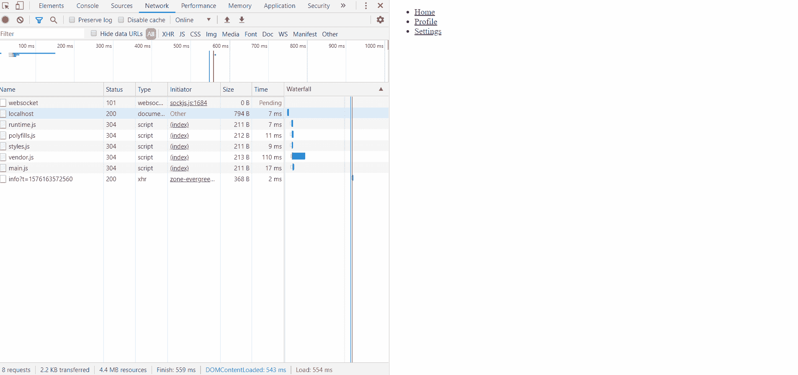

# Angular 8 中的延迟加载模块指南

> 原文：<https://levelup.gitconnected.com/a-guide-to-lazy-loading-modules-in-angular-15925dfbfd7f>

## 在 Angular 中实现延迟加载，并使用浏览器中的开发工具查看网站加载速度


萨姆·所罗门在 [Unsplash](https://unsplash.com?utm_source=medium&utm_medium=referral) 上拍摄的照片

L azy 加载在角度上是一个非常有用的概念。这是一个仅当您导航到路线时加载 NgModules 的过程。如果您有一个包含许多路由的大型应用程序，您应该考虑使用这个概念。它将保持最初的包较小，因此，应用程序可以加载得更快。

# 设置角度应用程序

输入下面的命令来创建一个名为`test-app`的新应用程序，其中包含一个名为`app-routing.module.ts`的路由文件。这是我们需要为我们的功能模块设置延迟加载的文件之一。

```
ng new test-app --routing
```

使用以下命令导航到应用程序的根文件夹:

```
cd test-app
```

# 创建带路由的模块

接下来，我们需要创建我们的功能模块，其中包含要导航的组件。

要创建新模块，请执行以下命令。

```
ng generate module home --route homepage --module app.module
```

上面的命令将生成一个名为`home`和`homepage`的新模块，作为加载 home 组件的路由路径。此外，还会在该模块的**路线**数组中添加`homepage`路线作为`--module`选项。

**app-routing.module.ts**

这是我们的 app-routing.module.ts 文件的结果。

```
import { NgModule } from '@angular/core';
import { Routes, RouterModule } from '@angular/router';const routes: Routes = [
   { path: 'home', 
     loadChildren: () => import('./home/home.module').then(m =>     
     m.HomeModule) 
   }
];@NgModule({
   imports: [RouterModule.forRoot(routes)],
   exports: [RouterModule]
})
export class AppRoutingModule { }
```

属性用于指定第一次导航时需要延迟加载的模块。

在 Angular 8 中，**动态导入**语法被引入到**惰性加载路线**中，作为新特性之一，而不是像以前版本中那样的自定义字符串。

为了演示这种惰性加载的功能，我们需要再创建两个模块，分别叫做 **profile** 和 **settings** 。

```
ng generate module profile--route profile --module app.module
ng generate module settings --route settings--module app.module
```

# 设置界面

我们将在`app.component.html`中创建一个模块列表，用超链接链接到每个组件。

**app.component.html**

```
<ul>
   <li>
       <a routerLink="home">Home</a>
   </li>
   <li>
       <a routerLink="profile">Profile</a>
   </li>
   <li>
       <a routerLink="settings">Settings</a>
   </li>
</ul><router-outlet></router-outlet>
```

以下是您尝试导航到每个模块时的结果。



惰性加载模块

我们可以看到，当我们导航到链接时，每个模块只被称为**和**。你可以通过浏览器中的开发工具检查模块是否被延迟加载。

# 结论

在本文中，我们学习了如何在 Angular 应用程序中实现延迟加载，以及如何在浏览器中检查其功能。

如果你认为这篇文章是有帮助的，不要忘记与你的朋友分享。

# 资源

1.  [https://angular.io/guide/lazy-loading-ngmodules](https://angular.io/guide/lazy-loading-ngmodules)