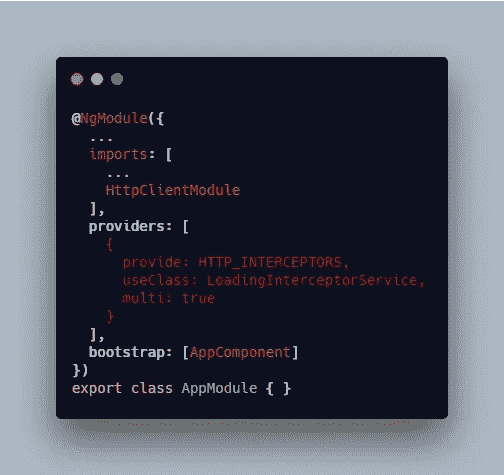

# Angular 应用程序 API 请求的加载状态管理指南

> 原文：<https://levelup.gitconnected.com/a-guide-to-managing-loading-state-for-angular-app-api-requests-83b7429d0e3a>

## 有角的

## 本教程将带您了解如何在 Angular 应用程序中跟踪 API 请求的状态，并显示加载 UI。

图片由 [GC 图书馆创意技术实验室](https://unsplash.com/@goldcoastmedialab?utm_source=unsplash&utm_medium=referral&utm_content=creditCopyText)在 [Unsplash](https://unsplash.com/s/photos/coffee?utm_source=unsplash&utm_medium=referral&utm_content=creditCopyText) 上拍摄

在本文中，我将分享在 Angular 应用程序中 API 调用期间管理加载状态的最佳方法之一。本文将分为以下几个部分:

1.  概观
2.  使用 RxJS 中的 Subject 创建一个装载服务
3.  创建一个装载拦截器
4.  创建独立的加载组件
5.  将拦截器应用于整个项目

*更多类似内容，请查看*[*https://betterfullstack.com*](https://betterfullstack.com)

# 概观

我们希望能够在一个简单且集中的位置管理应用程序的加载状态。

有几种方法可以管理加载状态。

一种方法是在调用 API 的组件上创建一个**加载变量**，并将变量设置为`true`。然后调用一个服务并订阅它，在 API 响应后将变量设置为`false`。这一切都发生在每个组件中。

另一种方法是使用带有`loading$`选择器的状态管理，在根视图组件中，我将从状态选择器订阅`loading$`来显示或隐藏根容器组件中的加载组件。所以每次我们调度一个动作，我都要调度加载动作来设置加载状态为`true` 和`false`。这导致改变加载值的动作的代码重复。

我最终达成了一个更简单的解决方案，使用**事件总线发出**加载事件，并将值设置为`true`或`false`。加载组件将侦听加载事件，以在屏幕上显示或隐藏加载。这在没有国家管理的情况下也能很好地工作。但是，我仍然必须在每次调用 API 时发出加载事件。

以上所有解决方案都有一个共同点——它们大量复制代码。所以我最终决定使用**角度拦截器**来处理装载。

# 使用主题 RxJS 创建装载服务

如果你不知道什么是主题，你可以阅读关于它的 [RxJS 主题用例子解释](/rxjs-subjects-explained-with-examples-78ae7b9edfc?source=friends_link&sk=59c028b3e9fc6348f8faf54f1759701a)。

> 一个`Subject`就像一个`Observable`，但是可以多播给许多`Observers`。`Subjects`就像`EventEmitters`:他们维护着许多听众的注册表。

这里的想法是:

*   创建一个名为`LoadingService`的服务。我更喜欢使用`ng g service loading`来创建服务文件。
*   有一个`loading$`主题，它将把最新的装载状态发送给他们的观察者。
*   有 2 种方法:`startLoading`和`stopLoading`。这些方法会将`true`和`false`的值设置为`loading$`。

loading.service.ts

# 创建一个装载拦截器

拦截器是一种对所有 HTTP 请求做出反应或修饰的技术。Angular 将看到全球范围内的传出和传入的 HTTP 请求，我们可以将其挂钩，以围绕它构建功能。

*   拦截 HTTP 请求，并从加载服务添加`startLoading`和`stopLoading`方法。
*   检查多个请求的情况。

loading-interceptor.service.ts

# 创建独立的加载组件

加载组件将做 3 件主要的事情:

*   包括将在屏幕上显示加载的 HTML
*   收听来自装载服务的`loading$`
*   根据状态值添加要显示和隐藏的样式
*   当生命周期`OnDestroy`发生时，移除订阅

loading.component.ts

对于 UI，您可以使用来自 Angular material、Bootstrap 或自定义的微调器。

在生命周期`AfterViewInit`中，您将从加载服务订阅`loading$`来检查加载状态，并通过使用元素`ref`来改变组件的样式。

请记住，当生命周期**毁灭**发生时，请取消订阅。

# 将拦截器应用于整个项目

要将加载侦听器应用于整个项目，只需将加载侦听器添加到 app 模块中的提供程序中。

AppModule

记住，我们必须导入`HttpClientModule`才能使用`HTTP_INTERCEPTORS`。

# 摘要

本文为在 Angular 应用程序中向屏幕添加加载状态提供了一个很好的解决方案。

为此，我们只需要:

*   主题为`loading$`的服务
*   从服务调用方法的角度拦截器
*   从服务订阅`loading$`主题的加载组件

我希望这篇文章对你有用！你可以跟着我上[中型](https://medium.com/@transonhoang?source=post_page---------------------------)。我也在[推特](https://twitter.com/transonhoang)上。欢迎在下面的评论中留下任何问题。我很乐意帮忙！

 [## 故事-更好的全栈

### 关于 JavaScript、Python 和 Wordpress 的有用文章，有助于开发人员减少开发时间并提高…

betterfullstack.com](https://betterfullstack.com/stories/)