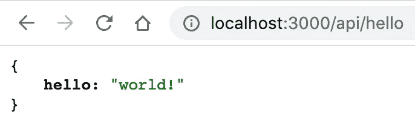
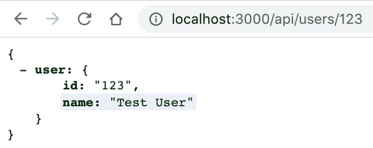
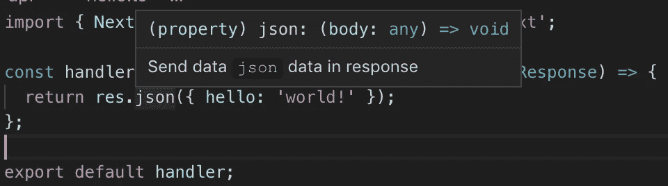

# Next.js API 路线指南

> 原文：<https://levelup.gitconnected.com/a-guide-to-next-js-api-routes-a287eda1f784>

## 使用 API 构建全栈 React 应用程序—无需配置


在 Next.js v9 中，引入了 API 路由，允许您创建 RESTful 端点作为下一个文件夹结构的一部分。我们能够向我们的应用添加业务逻辑，而无需编写任何额外的定制服务器代码，这为我们提供了编写全栈 React +节点应用所需的一切。

通过在我们的下一个应用中封装前端和后端，我们可以快速构建和部署新的应用，并在生产中毫不费力地扩展它们。

在本文中，我将向您展示如何创建 API 路由，并通过一个示例进行工作，然后深入研究 API 路由是如何工作的。

源代码:[https://github.com/treyhuffine/next-api-routes-demo](https://github.com/treyhuffine/next-api-routes-demo)

## 创建 API 路线

可以在`pages/api`目录下声明 API。类似于`pages`目录下的文件和文件夹如何直接映射到页面 URL，同样的情况也发生在`pages/api`上。

当您在`pages/api`中声明一个文件或文件夹时，它将生成一个匹配`/api/<folder>/<file>`的 URL 端点。例如，如果我们创建`pages/api/users.js`，我们的应用程序将公开一个`/api/users`端点。


创建和维护一份简历并不有趣。相反，让我们为你生成一份令人敬畏的简历:) [**简历生成器>**](https://gitconnected.com/resume-builder)

[](https://gitconnected.com/resume-builder) [## 软件工程师简历生成器和示例| gitconnected

### 一份有价值的简历模板，使用您个人资料中的详细信息构建。从你的投资组合网站链接到你的简历或…

gitconnected.com](https://gitconnected.com/resume-builder) 

## 下一个 API 路线示例

首先，我们将初始化下一个项目:

```
npx create-next-app api-routes-democd api-routes-demo
```

现在创建一个`pages/api`文件夹和一个`page/api/hello.js`文件。在该文件中，添加以下代码:

```
const handler = (req, res) => {
  return res.json({ hello: 'world!' });
};export default handler;
```

就这么简单！只需要一个文件/函数来创建一个 API。现在访问`localhost:3000/api/hello`，会得到如下回应:



## API 路线如何工作

Next.js 将从`api`文件夹中的所有文件中寻找默认导出，并将它们视为该路径的处理程序。默认导出必须是将请求和响应作为函数参数的函数。

```
export default (req, res) => {/* Handle an API request*/}
```

Next.js 为我们创建了一个节点服务器(或者一个无服务器的 lambda，如果您将无服务器设置为您的构建目标),并从节点传递请求和响应对象。它还会自动解析请求的主体、查询和 cookies，因为这些在大多数请求处理程序中经常使用。

```
export default function handler(req, res) {
  console.log(req.body) // The request body
  console.log(req.query) // The url query string
  console.log(req.cookies) // The passed cookies res.end('Hello World')
}
```

同样值得注意的是，如果需要在内部进行异步请求，比如查询数据库，处理程序可以使用`async` / `await`。

## 创建动态路由

API 路由还允许我们以与页面相同的方式定义动态路径参数。例如，我们可以使用结构`pages/api/users/[id].js`创建一个通过用户 ID 获取用户的路由。这将创建一条`/api/user/:id`路线，并且可以在查询参数中访问`id`。让我们现在创建这个文件，并添加以下处理程序:

```
export default (req, res) => {
  const { query: { id } } = req

  res.json({ user: { id, name: 'Test User' } })
}
```

访问`localhost:3000/api/users/123`，你会得到如下回应:



## 路线中的错误

如果您想从 API 返回一个错误，您可以简单地使用`res.status()`方法，该方法将为响应设置状态代码。

```
export default async (req, res) => {
  const { query: { id } } = req const user = await getUserById(id) if (!user) {
    return res.status(404).json({
      status: 404,
      message: 'Not Found'
    })
  } return res.json({ user })
}
```

## 处理不同的 HTTP 方法(GET、POST、PUT、PATCH、DELETE)

与我们通常在 Node 中构建服务器不同的一个概念是，我们需要在一个请求处理程序中处理所有的 HTTP 请求方法。我们可以检查`req.method`变量来获取正在使用的 HTTP 方法。最常见的处理模式是使用一个`switch`语句。

```
export default (req, res) => {
  const { method } = req switch (method) {
    case 'GET':
      // handleGet()
      break
    case 'POST':
      // handlePost()
      break
    default:
      res.setHeader('Allow', ['GET', 'POST'])
      res.status(405).end(`Method ${method} Not Allowed`)
}
```

## TypeScript 集成:开箱即用！

要使用 TypeScript，只需安装 TypeScript 以及 React 和 Node 的类型。

```
yarn add -D typescript [@types/react](http://twitter.com/types/react) [@types/node](http://twitter.com/types/node)
```

你甚至不需要创建你的`tsconfig.json`文件。如果 Next 检测到 TypeScript，它会在您运行服务器时为您生成一个。

如果我们重温前面的简单 API 请求，我们可以将名称改为`pages/api/hello.ts`并为路由添加类型。

```
import { NextApiRequest, NextApiResponse } from 'next';const handler = (_req: NextApiRequest, res: NextApiResponse) => {
  return res.json({ hello: 'world!' });
};export default handler;
```

我们将类型`NextApiRequest`和`NextApiResponse`添加到我们的请求和响应中。我们可以看到我们的`.json`方法在`res`上被识别。



## API 路由部署

下一个应用程序的部署方式不会改变。如果您在 next.config.js 文件中使用`target: 'server'`,它将在服务器的`/api`路径下公开 API 路由。如果你`target: 'serverless'`，API 路由将被视为 Lambda 函数，可以使用 Now 无缝部署。无论您选择哪个，到`/api/<handler-file>`的路径都是相同的。

## 端点特定的配置

Next.js 提供了一个 escape hatch，因此您可以单独配置每个处理程序并更改默认行为。例如，如果您需要我们需要原始请求体，您可以选择退出自动解析。

要配置一个端点，导出一个名为`config`的对象，它将被下一次构建自动选取。

```
**export** **const** config = {
  api: {
    bodyParser: false, // Disallow body parsing, consume as stream // OR bodyParser: {
      sizeLimit: '1mb', // Set max body size
    },
  },
}
```

## 包裹

Next 是一个强大的工具，应该是任何开发人员工具箱的一部分。它允许我们快速创建 web 应用程序，而无需担心配置或构建—一切都为我们处理和优化。

**下一条 API 路线的优势:**

*   没有配置
*   每个处理程序都是独立的函数
*   使用参数轻松创建动态路径
*   可以使用微型中间件
*   可以用自己的函数来修饰处理程序
*   可以单独配置每个处理程序
*   构建为 lambda 函数或在节点服务器中使用微
*   现成的打字稿

—[@ trey huffine](https://twitter.com/treyhuffine)|[@ git connected](https://twitter.com/gitconnected)