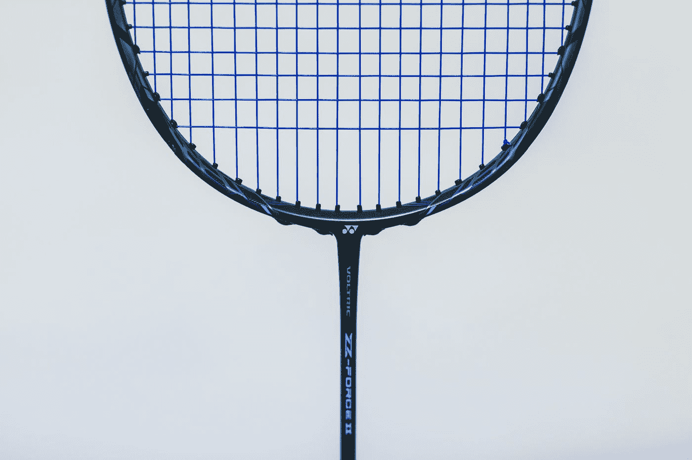
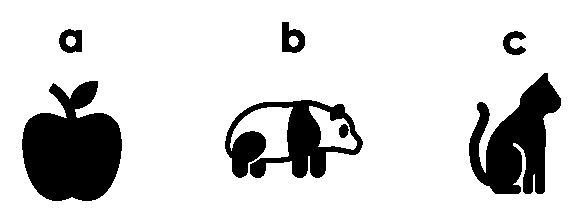

# 球拍编程指南(DrRacket)

> 原文：<https://levelup.gitconnected.com/a-guide-to-programming-with-drracket-bcac4153710e>

用 DrRacket 学习编码？这里有一个非官方的入门指南，介绍初级学生语言(BSL)、中级学生语言(ISL)、带 Lambdas 的 ISL(ISL+)和球拍。



在 [Unsplash](https://unsplash.com?utm_source=medium&utm_medium=referral) 上[温刚斋](https://unsplash.com/@wgzhai?utm_source=medium&utm_medium=referral)的照片

# 没有对球拍的热爱

也就是说，没有人喜欢编程和教学语言——至少，这是我从最近的 Medium.com 搜索中得到的感觉。例如,*球拍*的头条新闻大多是关于腐败计划或勒索。然而，在*球拍*的前五个搜索结果中，应该有一些关于程序设计或函数式编程的基础知识。

我的朋友们，是时候用更多关于 BSL、ISL、ISL+和 Racket 的内容将 DrRacket 从编程博客的地下室中提升出来了。

# 在这个故事中

一个入门指南，通过初级学生语言(“BSL”)、中级学生语言(“ISL”)、带 Lambdas 的 ISL(“ISL+”)和 Racket 来导航 DrRacket，以帮助学生花更多的时间学习，而不是花更少的时间与其他东西搏斗。中的工作代码示例。

1.  DrRacket 入门
2.  BSL、ISL、ISL+和 Racket 概述
3.  BSL 入门
4.  ISL 入门
5.  Lambdas ISL 入门(ISL+)
6.  球拍入门


[国立癌症研究所](https://unsplash.com/@nci?utm_source=medium&utm_medium=referral)在 [Unsplash](https://unsplash.com?utm_source=medium&utm_medium=referral) 上拍摄的照片

 [## 入门指南

### 要开始使用球拍，从网页下载并安装它。如果你是初学者或想使用…

docs.racket-lang.org](https://docs.racket-lang.org/getting-started/index.html) 

# 1.DrRacket 入门

DrRacket 是一个集成开发环境(“IDE”)。就像任何其他 IDE 一样，我们可以在电脑上下载并启动 DrRacket 作为应用程序，并用它支持的任何语言编写代码。举个例子，对于 Python IDE，你用 Python 编码；但是，使用 DrRacket，您可以获得包括 BSL 和 ISL 在内的各种选项。

实际开始之前，[查看文档并从源代码下载 IDE](https://docs.racket-lang.org/getting-started/index.html)。


从 drragide 中选择教学语言。来自作者的桌面。

## 为什么要费心解释 drragide 呢？

在报名参加用 drrack 教授函数式编程的课程之前，我对 DrRacket IDE 及其教学语言没有任何概念。我不知道从哪里开始。而且我没听说过球拍，网上也找不到太多。结果，我很沮丧，为什么我们要花这么多时间在不受欢迎的球拍小子身上，而不是在受欢迎的人群中学习 Python 和 Java。

[](http://htdp.org/) [## 如何设计程序

htdp.org](http://htdp.org/) 

## 用 DrRacket 学习是怎么工作的？

DrRacket IDE 与一本名为 [How to Design Programs](http://htdp.org/) 或简称“HTDP”的数字教材配套使用。就我而言，我所在的班级学习了 HTDP 的部分内容。教材中有解释程序设计概念的章节，并向学生展示了用 DrRacket 解决的编码难题。在早期和高级概念阶段，学生通过用 BSL 编写代码来巩固他们的学习，并随着概念变得更加复杂而进展到 ISL。

在 BSL 和 ISL 之后，我们开始用 ISL+和 Python 编码来练习和强化学习。回想起来，同时用两种语言编码有利于保留、转移和建立技能。

## 为什么要关心 DrRacket？

关注 DrRacket 的两个原因:

*   首先，如果你是一名学生，你很可能别无选择，只能为学校解决这个问题。因此，关心的第一个原因是你没有选择。
*   第二，用 DrRacket 学习编码管用！如果你投入时间，你可以将这些技能转移到几乎任何其他语言上。因此，关心的第二个原因是，你通常可以提高你的软件技能，并有所表现。

[](https://medium.com/@jhc154/learning-to-code-learn-program-design-too-a97cc1c95459) [## 学习编码？也学程序设计。

### 许多人直接进入流行语言，如 Java 或 Python。尽管如此，用球拍的程序设计经常被忽视…

medium.com](https://medium.com/@jhc154/learning-to-code-learn-program-design-too-a97cc1c95459) 

# 2.概述:BSL、ISL、ISL+和 Racket

有了 DrRacket，我们可以通过教学 Racket 的变体来学习编程概念。然而，由于每种变体的工作方式，最好将每种都视为自己的语言。例如，作为球拍的变体，BSL 和 ISL 各自识别不同的语法。同样，适用于球拍的代码可能不适用于 BSL 或 ISL。


从左到右:初级学生语言、中级学生语言、ISL with Lambdas 和 DrRacket IDE 中的 Racket。

## **总是默认为正确的来源**文档**。**

尽管我们应该*总是*引用源文档，但是由于一些原因，使用 DrRacket 这样做是非常重要的。虽然这些文件一开始看起来很神秘，但是通过一些研究，它们会很快成为你最好的朋友。因此，花 5 分钟阅读语法示例并了解可用的函数是值得的。第二，留言板并不总是区分 BSL 或 ISL 问题，因此，您可能最终会寻找一个不适合 BSL 的解决方案。

## 作为参考，以下是指向本指南涵盖的每种语言的源文档的链接。

## 初级学生语言(BSL)文档

 [## 1 名初学者

### 语法符号使用符号 X...(粗体圆点)表示 X 可能出现任意次…

docs.racket-lang.org](https://docs.racket-lang.org/htdp-langs/beginner.html) 

## 中级学生语言(ISL)文档

 [## 3 名中级学生

### 语法符号使用符号 X...(粗体圆点)表示 X 可能出现任意次…

docs.racket-lang.org](https://docs.racket-lang.org/htdp-langs/intermediate.html) 

## 带有 Lambdas (ISL+)文档的中级学生语言

 [## 4 名中级学生

### 语法符号使用符号 X...(粗体圆点)表示 X 可能出现任意次…

docs.racket-lang.org](https://docs.racket-lang.org/htdp-langs/intermediate-lam.html) 

## 球拍文档

 [## 球拍文档

### 这是特定于安装的列表。运行 raco 文档(或 Windows 或 Mac OS 上的 raco 文档)可能会打开一个…

docs.racket-lang.org](https://docs.racket-lang.org/) 

照片由[在](https://unsplash.com/@thisisengineering?utm_source=medium&utm_medium=referral) [Unsplash](https://unsplash.com?utm_source=medium&utm_medium=referral) 上拍摄

# 3.入门:BSL

欢迎来到 BSL。期待什么？解决基础问题*无需*内置函数的简易性。从技术上来说，这些文档包含了你所需要的一切，但是这一节包含了我希望事先知道的三点和三个 BSL 语法的例子。

## 首先，澄清一点和六个顶级提示。

我称之为“BSL ”,但实际上，在初级水平上有两种语言:一种是 [*初级学生*](https://docs.racket-lang.org/htdp-langs/beginner.html) 语言，另一种是 [*初级学生，带列表缩写*语言](https://docs.racket-lang.org/htdp-langs/beginner-abbr.html)。我对 BSL 的引用是对两种初学者语言的引用。

## **在 BSL 中，关于语法需要注意的六点。**

```
; 1\. Use **"double quotes" for strings**, unlike in 'Python'; 2\. Display last line of code with **CMD + CTRL + Up Arrow**, unlike 
; pressing Up Arrow in Terminal or in a repl; 3\. To create a variable, we usually think: a = "apple" 
; but in BSL we must use ***define***:**(define a "apple") ; a is now a string "apple"** 
(string? a) ; -> evaluates to #true
; Output > #true#|
  4\. To comment a line, use the semi-colon; or many, ;;;;; ...
or use a **hash & pipe to open** a comment block and **pipe & hash to close** a comment block
|##|
  5\. By convention, **use the dash instead of underline** for variables.
Ex. a-list-of-strings in BSL instead of a_list_of_strings in Python.
|#; 6\. **No commas, only spaces.** For example, in BSL
; do like: (list 1 3 4 56) NOT like: (list 1, 3, 4, 56)
```

## 第二，BSL 有两个奇特的地方需要一段时间来适应。

对于 BSL，有一种叫做*前缀符号*的东西，其中操作符出现在操作数之前*。此外，几乎每个操作都必须用括号括起来。例如，在下面的代码块中用 BSL 演示了前缀和中缀符号之间的区别。*

```
**; Example of prefix notation in BSL**#|
**To add 1 and 4, we usually think *infix* notation: 1 + 4
however, in BSL we must think *prefix* notation: + 1 4****Also, to evaluate as BSL code we have to surround with (...)**
|#(+ 1 4); output >
; > 5**; infix notation in my brain: [(1 + 2) * (3 + 4)] / 5 - 6 = -1.8
; prefix notation in BSL:** (- (/ (* (+ 1 2) (+ 3 4)) 5) 6); > -1.8; it is normal in BSL to have a bunch of parens
; at the end of a function -> ))]))] )))))]) 
; also, yes, it is annoying
```

## 第三，BSL 有目的地限制某些在 ISL 中可用的内置功能。

这个想法的一部分是迫使学生进行批判性思考，并学习计算机如何评估代码。例如，如果不使用为您排序的内置函数，您将如何告诉计算机对数字或字母列表进行排序？



诱人的反应是使用某种 sort()函数，但是记住，尝试使用 sort 函数只会在 BSL 中返回一个错误。由于这些限制，BSL 中的部分挑战是弄清楚抽象函数是如何工作的。图片来自作者。

# BSL 中列表、结构和函数的三个例子。

## 1.[排行榜](https://docs.racket-lang.org/htdp-langs/beginner.html#%28part._htdp-beginner._.Lists%29)

这个列表是任何程序的主食之一，在 BSL 中得到很大的帮助是不足为奇的。下面的 BSL 代码演示了几种创建和管理列表的方法。**重要提示:列表并不包含 BSL 中每个元素的索引；**但是，您仍然可以返回列表中的元素，如下所示。

```
**; Examples of lists in BSL****; create a list of numbers with define
; the named list is a-list-of-numbers**(define a-list-of-numbers (list 3 1 2))**; get the first number in the list
; in Python, a-list-of-numbers[0] -> 3**(first a-list-of-numbers) ; > 3**; get the second number in the list
; in Python, a-list-of-numbers[1] -> 1**(second a-list-of-numbers) ; > 1**; we can continue on with third, fourth, of a list,...
; but it is usually sufficient to call first and rest****; get the rest of the numbers in the list
; in Python, a-list-of-numbers[1:] -> [1, 2]**(rest a-list-of-numbers) ; > (list 1 2)**; Very important! Understand how first and rest work 
; to unlock recursion****; Return a bool, is the first greater than the second?**(> (first a-list-of-numbers) (second a-list-of-numbers)); > #true**; The Sort function will not work in BSL but *will* work in ISL**(sort a-list-of-numbers); > error sort: this function is not defined
```

[](https://codeburst.io/learn-and-understand-recursion-in-javascript-b588218e87ea) [## 学习和理解 JavaScript 中的递归

### 我将在 10 分钟内带您浏览两个流行的 JS 递归示例，这样您就可以最终理解递归是如何工作的…

codeburst.io](https://codeburst.io/learn-and-understand-recursion-in-javascript-b588218e87ea) 

## 2.结构( [struct](https://docs.racket-lang.org/htdp-langs/beginner.html#%28form._%28%28lib._lang%2Fhtdp-beginner..rkt%29._define-struct%29%29) )和结构列表

除了列表，BSL 还有一个 struct 数据类型。一个相近的类比是 BSL 中的 strucs 类似于 Python 实现类的方式。

 [## 9.类- Python 3.8.5 文档

### 类提供了一种将数据和功能捆绑在一起的方法。创建一个新类会创建一个新类型的对象…

docs.python.org](https://docs.python.org/3/tutorial/classes.html) 

下面的代码示例演示如何在 BSL 中构建类结构列表。

```
**; Example of Structure data and List of Structure data****; create a new data structure called pet
; pet params:
;  id->number, type->string, age->number, 
;  name->string, color->string, weight->number**(define-struct pet [id type age color name weight])**; create a new pet with id of 1**(define pet1 (make-pet 1 "cat" 3 "orange" "Colonel Mustard" 11.4))(struct? pet1) **; -> evaluates to #true**(pet-name pet1) **; -> select just the name from pet1** (pet-color pet2) **; -> select just the color from pet2**; > "Colonel Mustard"
; > "black"**; create a dog and fish pet**(define pet2 (make-pet 2 "dog" 10 "black" "Sir Duke" 25))
(define pet3 (make-pet 3 "fish" 5 "gold" "Mr. Fish" .3))**; we can have a list of structures**
**; a-list-of-pets (alop)
; note: NO commas, only spaces**(define alop (list pet1 pet2 pet3))alop **; -> returns the list of pets**#| **the alop**
> (list
>  (make-pet 1 "cat" 3 "orange" "Colonel Mustard" 11.4)
>  (make-pet 2 "dog" 10 "black" "Sir Duke" 25)
>  (make-pet 3 "fish" 5 "gold" "Mr. Fish" 0.3))
|#pet1 **; -> returns just the one pet**; > (make-pet 1 "cat" 3 "orange" "Colonel Mustard" 11.4)
```

## 3.[BSL 中的功能](https://docs.racket-lang.org/htdp-langs/beginner.html#%28part._beginner-syntax%29)

**如果你想学习或教授递归，DrRacket 中的 BSL 是一个现象级的工具。**像其他语言一样，我们可以在 BSL 中创建函数和利用条件语句。然而，与某些语言不同， **BSL 真的闪耀着** [**递归**](https://beautifulracket.com/explainer/recursion.html) **。**

在下面的三个代码示例中，函数 **get-pets** 通过条件和递归返回所选宠物的名字。

```
**; Example: syntax of a basic function
; given a list of pets as alop from prior example
; alop has a cat, a dog, and a fish****; 1st attempt - pass some parameters to a function
; just to see if it works****; get-pets is the function name
; we pass the alop to a-list in get-pets**(define (get-pets a-list)
  (pet-type (first a-list)))**; return the pet-type of the first pet structure****; call the get-pets function and pass it alop**(get-pets alop) ; -> "cat"
```

现在我们可以将一些东西传递给一个函数，在下一个例子中，让我们添加一个 if 语句来比较一些东西，看看我们可以对结果做些什么。

```
**; Example: function with an if-statement
; Given a list of pets as alop from prior example
; alop has a cat, a dog, and a fish****; 2nd attempt - add a param and see the if statement**
**; Test how string equality works**(define (get-pets a-list pet-property)
 **; for the first pet in the list, if the type is 
  ; equal to the second param pet-property, then**

  (if (string=? (pet-type (first a-list))
                pet-property)
      "something if true"    **; replace later w/function**
      "something if false")) **; replace later w/function****; if given pets and a cat, then true and do something
; if fish, then false and do something else**(get-pets alop "cat") **; -> "something if true"**
(get-pets alop "fish") **; -> "something if false"**
```

从第二遍开始，我们了解到在比较第一个宠物的宠物类型属性和宠物参数“猫”或“鱼”之后，函数可以采取一些行动由于列表中第一个是猫，所以当我们用“猫”测试时，if 语句为真。同样，我们知道“鱼”的计算结果为 false，因为第一个宠物仍然是猫。因此，我们接下来要回答两个问题——函数在 true 时应该做什么，在 false 时应该做什么？

```
**; Example: a recursive function in BSL
; Given a list of pets as alop from prior example
; alop has a cat, a dog, and a fish****; 3rd attempt - add recursive steps**
**; return only the selected type, if matching**; get-pets() matches a-string to a pet struct
; [a-list, a-string]->[a-pet-struct]
; a-list is a list of pet structures
; a-string is one of a pet property
; pet properties: [id type age color name weight](define (get-pets a-list pet-property)
 **; for the first pet in the list, if the type is 
  ; equal to the second param pet-property, then**

  (if (string=? (pet-type (first a-list))
                pet-property)
      (first a-list) **; if match, then return the current pet**
      (get-pets (rest a-list) pet-property)))
 **; else: recursively pass the rest of the list****; if given a pets struct and cat, return the cat
; if fish, then recurse over list until a match**(get-pets alop "cat") 
  **; > (make-pet 1 "cat" 3 "orange" "Colonel Mustard" 11.4)**(get-pets alop "fish") 
  **; > (make-pet 3 "fish" 5 "gold" "Mr. Fish" 0.3)****; not covered here: what happens if we search for a snake?**
```

## BSL 摘要

正如上面最后一个 BSL 示例所示，我们可以用看似简单的初学者语言 DrRacket 学习相当复杂的编程概念，比如递归。


由[托拜厄斯·尼·夸泰·夸泰](https://unsplash.com/@kingtobie?utm_source=medium&utm_medium=referral)在 [Unsplash](https://unsplash.com?utm_source=medium&utm_medium=referral) 上拍摄的照片

# 3.入门:ISL

欢迎来到[中级学生语言](https://docs.racket-lang.org/htdp-langs/intermediate.html)！期待获得更多功能来解决更具挑战性的问题。

通常，BSL 中的所有概念和语法都适用于 ISL 和 ISL+。ISL 中最显著的变化是创建和利用本地功能和定义的能力。


在 DrRacket 中切换语言时，请查看左下角的菜单选项。

## [ISL 中的本地](https://docs.racket-lang.org/htdp-langs/intermediate.html#%28form._%28%28lib._lang%2Fhtdp-intermediate..rkt%29._local%29%29)定义

让我们再看一下 BSL 部分前面的 **get-pets** 函数，以解开 ISL 中本地函数定义的语法。在下面的例子中， **get-pets** 已经被修改，因此变量“current-pet”现在是每次函数运行时宠物列表中的第一只宠物。

```
**; Example of a local function definition
; same get-pets function as before but with a local def**(define (get-pets a-list pet-property)
  (**local**
 **; locally define the first of a list as current-pet
    ; instead of calling (first a-list) multiple times**
    ((define current-pet (first a-list)))**; after local defs, do some operation
**    (if (string=? (pet-type current-pet)
                  pet-property)
        current-pet
        (get-pets (rest a-list) pet-property))))(get-pets alop "fish") 
  **; > (make-pet 3 "fish" 5 "gold" "Mr. Fish" 0.3)
  ; same result as before**
```

现在，我们已经基本掌握了 ISL 中的本地定义，让我们进一步看几个条件语句(cond)、列表构造(cons)和附加的 ISL 示例。

## [ISL 中的本地功能定义](https://docs.racket-lang.org/htdp-langs/intermediate.html#%28part._intermediate-syntax%29)

在前面的例子中，我们在本地定义了一个变量，但这有点琐碎——本地定义只简化了代码，但没有做太多其他事情。如果在稍微复杂一点的问题中，我们要按体重筛选宠物列表怎么办？

我们可以先构建一个递归函数，将列表中的每一项与一个数字进行比较。如果宠物的体重小于一个给定的数字，我们将宠物添加到一个列表中；如果大于这个数量，我们跳过它，直到我们有一个符合重量限制的宠物列表。最后，只返回一个低于重量限制的宠物列表。

在下面的第一个例子中，我们开始构建一个函数， **filter-pet-weight.v1** 。注意我们如何使用 **cond** 语句来代替前面例子中的 if 语句。

```
**; A first pass at recursive filtering
; Caution! This results in a stack overflow, can you see why?**(define (filter-pet-weight.v1 a-list a-weight) **; a conditional set of statements instead of if-statement**
  (cond
    **; if first pet-weight is less than, then, do recursive call
    ; pass the list and the weight to compare**

    [(> (pet-weight (first a-list)) a-weight) (filter-pet-weight.v1 a-list a-weight)] **; if not, construct (cons) the first item 
    ; in the list and recursively call** [else (cons (first a-list) (filter-pet-weight.v1 (rest a-list) a-weight))]))(filter-pet-weight.v1 alop 12) **; > results in a stack overflow, keeps running until out of memory**
```

在上面的第一遍中，我们遇到了堆栈溢出——函数不停地进行递归调用，直到结束。最终，程序将耗尽内存并失败，因为我们的逻辑没有退出条件。

[](https://medium.com/free-code-camp/recursion-is-not-hard-858a48830d83) [## 递归不难:这种有用的编程技术的逐步演练

### 我要马上说出来。您知道函数调用时发生的事件吗？没有吗？那就是…

medium.com](https://medium.com/free-code-camp/recursion-is-not-hard-858a48830d83) 

当面临堆栈溢出时，想想函数应该如何继续运行，什么条件下应该停止运行。停止函数的条件通常称为基本情况，而保持函数运行的条件称为递归情况。如果使用列表，通常会对列表求值，直到列表为空。诀窍是确保我们每次都递增列表。

在下面的版本 2 中，我们有一个递归解决方案，它有一个很好的基本情况和递归情况，可以处理整个列表并避免堆栈溢出。

```
**; A second pass at recursive filtering
; This time we can exit recursion**(define (filter-pet-weight.v2 a-list a-weight)
  (cond

    **; base case -> when empty list, return an empty list**

    [(empty? a-list) '()]**; here we pass the rest of the list in a recursive call
; to ensure we incrementally move towards the end of a list**

    [(> (pet-weight (first a-list)) a-weight) (filter-pet-weight.v2 (rest a-list) a-weight)]**; instead of cons, we append a list of items 
; in each recursive call** [else (append (list (first a-list)) (filter-pet-weight.v2 (rest a-list) a-weight))]))(filter-pet-weight.v2 alop 12); > (list
     (make-pet 1 "cat" 3 "orange" "Colonel Mustard" 11.4)
     (make-pet 3 "fish" 5 "gold" "Mr. Fish" 0.3))
```

在上面的例子中，filter 函数返回所有 12 岁以下的宠物。此外，请注意，只要我们*追加一个事物列表*，我们通常就可以将**追加**与**反对**互换使用。

最后，因为我们在 ISL 中，可以访问更多的东西，所以让我们看看如何使用内置的**过滤器**功能。在下面的版本 3 中，注意我们如何定义一个局部函数来比较 pet-weight 和一个给定的数字。然后，通过内置的过滤函数，我们可以创建一个新的宠物列表(通过过滤我们的宠物权重函数)。

```
**; A third pass at recursive filtering
; Using a built-in function to simplify code**(define (filter-pet-weight.v3 a-list a-weight)
  (local
 **; a local function def called weight-limit
     ; consumes a pet structure** ((define (weight-limit a-pet)
 **; compares the pet-weight against a-weight** (< (pet-weight a-pet) a-weight)))
 **; filter is a built-in function in ISL
    ; applies a function to a alist** (filter weight-limit a-list)))(filter-pet-weight.v3 alop 12)**; same result as in version 2 but simpler code**
; > (list
     (make-pet 1 "cat" 3 "orange" "Colonel Mustard" 11.4)
     (make-pet 3 "fish" 5 "gold" "Mr. Fish" 0.3))
```

## ISL 摘要

使用 ISL，我们可以获得 BSL 的所有功能，还可以定义局部变量和函数。此外，我们还可以访问诸如排序和过滤等内置功能。ISL 还有更多的内容，但是希望本节中提供的示例能够帮助您朝着正确的方向开始。


萨姆·卡特在 [Unsplash](https://unsplash.com?utm_source=medium&utm_medium=referral) 上拍摄的照片

# 5.入门:[带 Lambdas 的 ISL](https://docs.racket-lang.org/htdp-langs/intermediate-lam.html#%28part._intm-w-lambda-syntax%29)

欢迎来到 ISL+！正式名称是 [*中级学员，Lambda*](https://docs.racket-lang.org/htdp-langs/intermediate-lam.html) ，但 *ISL+* 是我教授的叫法，朗朗上口，有道理。就像从 BSL 过渡到 ISL 一样，我们用 ISL+得到了以前的一切。有什么新鲜事？顾名思义，在 ISL+中，我们能够构建 lambda 函数。

## ISL+需要注意什么

**非常有用:** [**映射**](https://docs.racket-lang.org/htdp-langs/intermediate-lam.html#%28def._htdp-intermediate-lambda._%28%28lib._lang%2Fhtdp-intermediate-lambda..rkt%29._map%29%29) ， [**foldl/foldr，**](https://docs.racket-lang.org/htdp-langs/intermediate-lam.html#%28def._htdp-intermediate-lambda._%28%28lib._lang%2Fhtdp-intermediate-lambda..rkt%29._foldl%29%29) ， [**测试**](https://docs.racket-lang.org/htdp-langs/intermediate-lam.html#%28form._%28%28lib._lang%2Fhtdp-intermediate-lambda..rkt%29._check-expect%29%29) **(check-expect)。这三组功能在 BSL 或 ISL 中都可用；然而，为了演示它们是如何工作的，用** [**lambdas**](https://docs.racket-lang.org/htdp-langs/intermediate-lam.html#%28part._intm-w-lambda-syntax%29) 来介绍它们**是很有用的。例如代码，让我们重新访问 BSL 的 **get-pets** 函数，看看我们如何解决 ISL+中的过滤器问题。**

## [过滤器](https://docs.racket-lang.org/htdp-langs/intermediate-lam.html#%28def._htdp-intermediate-lambda._%28%28lib._lang%2Fhtdp-intermediate-lambda..rkt%29._filter%29%29)问题(概述)

我们有一个包含在结构体列表中的宠物列表。每个 pet 结构都有一些属性，比如名称、重量和类型。主函数:**如果给定一个宠物列表和一个宠物类型，例如“猫”，我们只想返回猫。**该 pet 数据的代码与 BSL 的代码相同，如下所示。

```
**; Example code for creating a struct and a list of structs**(define-struct pet [id type age color name weight])

(define pet1 (make-pet 1 "cat" 3 "orange" "Colonel Mustard" 11.4))
(define pet2 (make-pet 2 "dog" 10 "black" "Sir Duke" 25))
(define pet3 (make-pet 3 "fish" 5 "gold" "Mr. Fish" .3))
```

## **不含λs 的过滤解决方案(重述)**

在进入 lambda 解决方案之前，让我们快速回顾一下我们以前在 BSL 中是如何解决这个过滤器问题的。下面代码中的 if 语句(粗体文本)基本上完成了过滤工作。过滤之后，我们使用递归来遍历宠物列表。

如果我们不想使用递归怎么办？我们还能怎么解决这个问题？

```
**; Example code for filtering a list of structs**(define (get-pets a-list pet-property)
  (local
    ((define current-pet (first a-list)))   ** (if (string=? (pet-type current-pet)
                  pet-property)**
        current-pet
        (get-pets (rest a-list) pet-property))))
```

## 使用 Lambdas 进行过滤

乍一看，我觉得和兰姆达斯一起工作令人生畏；然而，剥去“数学”这个名字后，它们并没有那么糟糕。什么是λ？基本上，lambda 是一个行为像函数的函数——它接受变量并对表达式求值——除了我们没有给它命名。我们只是使用术语 lambda，而不是命名函数。

由于关于未命名函数的全部内容乍一看似乎很抽象，所以让我们浏览一下代码，从检查等式的不同方式开始。之前，我们用 **string=？**，但如下图所示我们也可以用**等号？**返回一个布尔值(真或假)。

```
**; Example of using equal?**(define (get-pets a-list pet-property)
  **; before we used string=?** (equal? (pet-type (first a-list)) pet-property)); > #true
```

此时，我们有能力检查记录列表中一个记录的相等性。以前我们使用递归，但是现在我们可以使用 lambdas 和其他一些有用的内置函数来更快地到达那里。

为了理解 lambdas，我喜欢首先考虑我想要迭代或递归什么。在这种情况下，我们有一个宠物列表，并希望访问每个宠物的类型。

```
**; Example of a first pass at lambda construction**(define (get-pets a-list pet-property)
  **; replace the following line** ; (equal? (pet-type (first a-list)) pet-property))   **; build a lambda instead** (lambda (x) (equal? (pet-type x) pet-property)))#| **Explanation:** 
Before, we looked at the pet-type of the first item in a-list. In the lambda, **replace (first a-list) with x**. As a result, the function reads like: lambda consumes x which will be an item in a-list, then, check equality between pet-type of x and the given pet-property.
|# ; > (lambda (a1) ...)
```

在这一点上，我们的小λ仍然是，只是一个λ。也就是说，我们还没有指定 x 应该是什么。因此，我们只有一个类似于 **(lambda (a1) …)的输出。不要沮丧，事实上，这是最酷的部分！**

我们的 lambda 很酷，因为它检查我们从头创建的数据类型的相等性。相比之下，如果我们想过滤一个奇偶校验的数字列表，我们可以使用内置函数 **odd？这就是我们的 lambda 为 pet 结构所做的。例如，文档通过展示如何使用 **odd 进行过滤来描述如何使用 filter？**在一串数字上。**

```
**;** [**Example of filter from the docs**](https://docs.racket-lang.org/htdp-langs/intermediate-lam.html#%28def._htdp-intermediate-lambda._%28%28lib._lang%2Fhtdp-intermediate-lambda..rkt%29._filter%29%29)(filter **odd?** '(0 1 2 3 4 5 6 7 8 9)); > (list 1 3 5 7 9)**; instead of odd? we have a lambda on a different list**(filter **(lambda (x) (equal? (pet-type x) pet-property))** a-list)
```

最后，让我们把所有的部分放在下面代码中的一个函数下。

```
**; Example of a second pass at lambda construction**(define (get-pets a-list pet-property)
  (filter (lambda (x) (equal? (pet-type x) pet-property)) a-list))#| **Explanation:** 
We use filter to apply our lambda to a-list, one x at a time. 
|#(get-pets alop "cat"); > (list (make-pet 1 "cat" 3 "orange" "Colonel Mustard" 11.4))
```

## 测试，测试，测试

尽管我们应该一直进行测试，但是现在我们有了一个可用的 lambda，让我们看看如何构建两种类型的测试: **check-expect** 和 **check-within** 。在这个过程中，我们还可以用 map 和 **foldl/foldr** 包装一些代码示例。

首先，检查-期望测试。按照惯例，您希望测试覆盖每个功能的所有部分。DrRacket 甚至会让你知道一个测试是否“覆盖了所有的表情”。因为我们知道“猫”应该返回一个 cat 结构，所以让我们为猫建立一个测试。

```
**; Example of a testing with check-expect****; call the function from check-expect** (check-expect (get-pets alop "cat") 
              **; the second argument is the expected result**
              (list 
              (make-pet 1 "cat" 3 "orange" "Colonel Mustard" 11.4)))**; the function to be tested**
(define (get-pets a-list pet-property)
  (filter (lambda (x) (equal? (pet-type x) pet-property)) a-list)); > The test passed!
```

其次，还有检入测试。使用签入进行测试在处理数学操作时很有帮助。例如，如果某个函数的预期结果是 pi，而我得到了 3.14，那么这个函数可能工作得很好。然而，检查-期望测试在 pi 场景中失败，因为答案不完全是 pi，它只是接近 pi。因此，我们要在范围内进行*检查-测试。*

**为了演示 check-in、map 和 foldl/foldr，让我们看看如何计算我们所有宠物的平均体重。**

```
**; Example of map and lambda (version 1)****; the lambda simply returns the pet-weight of each x
; map applies the lambda to a-list;
; as a result, x cycles through the list**(define (ave-weight.v1 a-list)
  (map (lambda (x) (pet-weight x)) a-list)); > (list 11.4 25 0.3)
```

要返回宠物的平均体重，我们需要宠物体重的总和和宠物的数量。在上面的版本 1 中，我们使用 map 将一个函数(lambda)应用于一个列表，并返回一个新的仅包含权重的列表——从这里我们可以获得总和、计数，并最终获得它们的平均值。

[](https://medium.com/python-in-plain-english/unlock-basic-lambdas-in-python-2796a4a762a8) [## 在 Python 中解锁基本 Lambdas

### 对于任何人——通过一个实际的 lambdas、map 和 reduce 的工作示例，在 Python 中征服 lambdas

medium.com](https://medium.com/python-in-plain-english/unlock-basic-lambdas-in-python-2796a4a762a8) 

为了得到列表的总和，我们可以使用 foldl 或 foldr——是**向左折叠**和**向右折叠**的缩写。如果打个比方有帮助的话，ISL 中的 fold 就像在 Python 中使用 **reduce** ，即 r *得出一系列数字的总和*。fold 的不同之处在于，我们可以选择一个方向来处理列表。在 sum 的情况下，方向并不重要，因此在本指南中我们将只使用 **foldr** 。

```
**; Example of using foldr****; foldr usage**
; function | a base value | a list
;  add (+)        0         (list 11.4...)(foldr + 0 (list 11.4 25 0.3))#| **Explanation:** 
For each item in the list, apply the function (add) and start at 0\. As a result, we might have 0 + 0.3, then, 0.3 + 25, and then 25.3 + 11.4 to get 36.7.
|#; > 36.7
```

在 **ave-weight** 的最终版本中，如下所示，我们可以将诸如数字列表(alon)、它们的总和以及 alon 的计数之类的值定义为变量，然后用前缀符号做一些简单的除法来返回平均值。

```
**; Example of putting it all together in ave-weight**(define (ave-weight a-list)
  (local
   **; create a list of numbers (alon) with map** ((define alon (map (lambda (x) (pet-weight x)) a-list))    

   **; foldr** to get a sum 
     (define alon-sum (foldr + 0 alon))   

   **; count length**                  
     (define alon-count (length alon)))   **  ; divide and return average    **             
    (/ alon-sum alon-count)))(ave-weight alop); > 12.23**; This function works, but it's still not the most optimal...
; Not covered here: how to make this solution more efficient?**
```

最后，由于平均值实际上是 12.23 次重复，我们可以使用 check-in 为 ave-weight 创建一个工作测试。如下所示，如果结果在 12.23 的 1/100 以内，则测试通过。

```
**; Example of check-within** **; the function to test | expected result | expected delta
; test passes if result is within the delta**(check-within (ave-weight alop) 12.23 .01)
```

## ISL+摘要

有了 ISL+，我们继承了 BSL 和 ISL 的一切，但获得了 lambda 函数的额外好处。此外，使用 lambdas 有助于解释如何使用其他有趣的功能，如滤镜、贴图和折叠。我们也有一些如何用 check-expect 和 check-within 进行测试的例子。就像在 ISL 中一样，还有更多的问题和函数需要讨论，但希望这足以让您开始学习 ISL+！


照片由 [Christian Tenguan](https://unsplash.com/@christiantenguan?utm_source=medium&utm_medium=referral) 在 [Unsplash](https://unsplash.com?utm_source=medium&utm_medium=referral) 上拍摄

# 6.入门:球拍

尽管观点可能会有所不同，但学习用 BSL 和 ISL 设计程序是有帮助的，因为这样很容易专注于核心概念。例如，学生可以专注于理解递归和 lambdas，而不是处理导入包和建立库。然而，球拍是需要“所有其他东西”的专业语言——基本概念得以延续，但语法发生了巨大变化。例如，您必须用#lang 指定语言，并导入功能库和包。


## 拍戏要注意什么

**球拍不是 BSL 也不是 ISL！**老实说，我对球拍知之甚少。我只知道我所知道的，因为当我第一次进入 BSL 时，我不知道我在看什么。

在 BSL 模块中工作时，最后花了几个小时阅读关于球拍的文档，显然很困惑。我沮丧地想，*我们为什么不在课堂上复习这些东西呢？！*因此，**这里的重点是，如果你在 BSL 或 ISL 中学习，遇到了像“未绑定标识符”这样奇怪的错误消息，你可能需要退出球拍。然而，如果你对如何让一些小东西在球拍中工作感到好奇，请继续阅读下面关于编写测试和合同的内容。**

## 什么是合同？

到目前为止，我使用注释来指定每个函数期望的数据类型——注释意在表达函数和用户之间的契约。然而，在 Racket 中，我们终于有能力用代码写出合同并执行它。例如，以前，我希望宠物名是一个字符串，但没有真正的合同，用户可以创建一个具有任何值的宠物名。如果函数依赖于一个字符串值，但得到一个数字，可能会有大问题。


球拍收缩和检查测试。

为了演示 Racket 中的契约是如何工作的，让我们来看看如何计算圆的面积。从指定语言和导入包开始。

```
**; first, specify language and import necessary packages**#lang racket
(require racket/contract)
([require rackunit](https://beautifulracket.com/explainer/unit-testing.html))
```

至于逻辑，由于圆的面积由 pi(r)给出，所以当 r=1 时，面积为~3.14，当 r = 2 时，面积= ~12.56。在下面的代码中，如果我们继续使用球拍，我们可以使用 check-=而不是 check-within 来测试我们的圆面积函数。

```
**; simple function to calc circle area**
(define (circle-area r)
  (* pi (sqr r)))**; tests run silent,
; if tests pass; nothing
; if error; error messages****; check-= instead of check-within**(check-= (circle-area 1) 3.141 0.001)
(check-= (circle-area 2) 12.566 0.001)
```

当我们使用上面的 **check-=** 来确保我们的函数按预期工作时，我们可以编写一个契约来确保函数获得适当的数据。之前在 BSL 和 ISL 中，我们可能会编写注释来解释契约，如下所示。

```
**; Example of a contract in BSL or ISL
; circle-area()
; [number] -> number**(define (circle-area r)
  (* pi (sqr r)))
```

在球拍中，我们可以强制执行合同以确保**圆面积**只消耗一个数值。

```
**; Example of a contract in Racket**(provide (contract-out
          [circle-area (-> number? any)]))(define (circle-area r)
  (* pi (sqr r)))**; if we provide a string as "3", then contract violation**(circle-area "3"); > sqr: contract violation
; > expected: number?
; > given: "3"
```

对于 IDE 上的上下文，上面的代码如下面的 DrRacket 屏幕截图所示。在这里，您可以看到从契约到功能和测试的链接用箭头和圆圈突出显示。


带有来自协定的错误消息的结果。

## 球拍摘要

球拍是一门专业的编程语言，超出了 BSL 和 ISL 的教学范围。然而，由于 DrRacket 提供了用多种语言编码的能力，学生们有时会将 Racket 与 BSL 混淆。我就是这样一个学生，当我无意中接触到球拍时，我会在困惑中度过几个小时；然而，幸运的是，我在这个过程中学到了一些东西。我希望这篇关于 back 入门的文章有助于引导你回到 BSL 或 ISL，同时也能激发你对主要 back 语言的好奇心。


凯利·西克玛在 [Unsplash](https://unsplash.com?utm_source=medium&utm_medium=referral) 上的照片

# 结论

我用 DrRacket 学到了很多编程知识，也犯了很多错误。然而，我经历了一些不必要的痛苦，因为我不知道 BSL 和 ISL 的生活会是什么样子。

在这个故事中，我分享了我作为一名在 BSL、ISL 和 ISL+工作的学生的笔记摘录，希望其他学生可以一开始就解决 DrRacket。

当与 [HTDP](https://htdp.org/) 结合使用时，DrRacket 是学习基础编程和递归、lambdas 等概念的绝佳工具。此外，学生应该意识到 BSL 和 ISL 不同于球拍，球拍是一个完整的专业编程语言。

尽管看不起 BSL 或 ISL 很有诱惑力，但初学者可以学到很多关于软件开发中程序设计和构建技能的知识。

如果我能改进本指南或回答任何关于学习 BSL 或 ISL 的问题，请发表评论！谢谢！

# 对于进一步的阅读，你可能会感兴趣

 [## 马修·巴特里克漂亮的球拍

### Matthew Butt erick 版介绍使用球拍的面向语言的程序 ming

beautifulracket.com](https://beautifulracket.com/) [](https://medium.com/free-code-camp/learning-the-fundamentals-of-functional-programming-425c9fd901c6) [## 学习函数式编程的基础

### 如果你是一名软件开发人员，你可能已经注意到一个增长的趋势:软件应用程序越来越多…

medium.com](https://medium.com/free-code-camp/learning-the-fundamentals-of-functional-programming-425c9fd901c6) [](https://medium.com/javascript-scene/the-rise-and-fall-and-rise-of-functional-programming-composable-software-c2d91b424c8c) [## 函数式编程(组合软件)的兴衰与崛起

### 注:这是“作曲软件”系列的一部分(现在是一本书！)关于学习函数式编程和…

medium.com](https://medium.com/javascript-scene/the-rise-and-fall-and-rise-of-functional-programming-composable-software-c2d91b424c8c) [](https://medium.com/@mvaldesdeleon/advent-of-haskell-950d6408a729) [## Haskell 的出现

### 连续 25 天坚持使用 Haskell 后的思考和经验教训

medium.com](https://medium.com/@mvaldesdeleon/advent-of-haskell-950d6408a729)