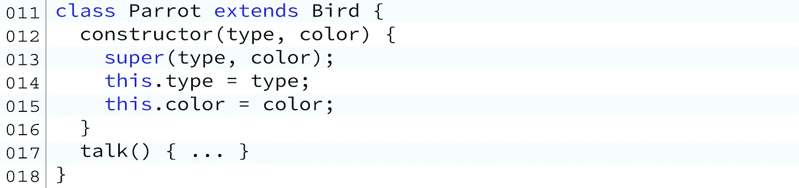

# JavaScript 中基于原型的类继承指南

> 原文：<https://levelup.gitconnected.com/a-guide-to-prototype-based-class-inheritance-in-javascript-e2e30c2c92b4>

以下是我最好的 web 开发教程列表。

[**在 Hashnode 上完成 CSS flex 教程**](https://jst.hashnode.dev/complete-css-flex-tutorial) 。

[**终极 CSS 网格教程**](https://jst.hashnode.dev/css-grid-tutorial) 关于 Hashnode。

[**高阶函数。地图，。过滤器&。减少 Hashnode 上的**](https://jst.hashnode.dev/javascript-higher-order-functions-map-filter-and-reduce) 。

关注我@ [**推特**](https://twitter.com/js_tut) ，[**insta gram**](https://www.instagram.com/javascriptteacher/)&[**FB**](https://www.facebook.com/javascriptteacher/)绝不错过优质文章。

 [## 我的编码书籍

### CSS 可视化字典包含了每一个常用 CSS 属性的可视化图表。JavaScript 语法包含…

jstutorial.medium.com](https://jstutorial.medium.com/my-coding-books-4f4dd2c35dd3) 

计算机语言通常提供一种方法，使一个对象从另一个对象继承而来。继承的对象包含其父对象的所有属性。此外，它还将指定自己的一组唯一属性。

## 创建对象的逻辑层次结构

**猫**和**狗**继承自**宠物**，宠物继承自**动物**。

一只**狗**和一只**猫**有着相似的特征。与其创建两个不同的类，
我们可以简单地创建一个类**宠物**并从中继承**猫**和**狗**。但是**宠物**类本身也可以继承**动物**类。

## 在后台

对象继承背后的思想是为类似对象的层次结构提供结构。你也可以说一个子对象是从它的父对象“派生”而来的。

如何在 JavaScript 中创建原型链。

技术上来说，这是它看起来的样子。尽量不要想太多。只需知道在层次结构的最顶端有**对象**对象

基于原型的对象继承
JavaScript 通过所谓的**原型**来支持对象继承。每个对象都有一个名为 prototype 的对象属性。

使用 class 和 extends 关键字很容易，但是实际上理解基于原型的继承是如何工作的并不容易。希望这篇教程至少能驱散一些迷雾！

**对象构造函数**
函数可以作为**对象构造函数**。构造函数的名字通常以大写字母开头，以区别普通函数。对象构造函数用于创建对象的实例。

一些 JavaScript 内置对象已经按照相同的规则创建了。例如**号**、**数组**和**字符串**都是从**对象**继承而来。正如我们前面所讨论的，这意味着附加到对象的任何属性在它的所有子对象上都自动可用。

**构造函数**
不了解构造函数的解剖，就不可能理解原型。

那么，当我们创建一个自定义的构造函数时，会发生什么呢？两个属性神奇地出现在我们的类定义中:**构造函数**和**原型.构造函数**

它们不指向同一个对象。让我们来分解一下:

假设我们定义了一个新的类 **Crane** (使用函数或者类关键字。)

我们刚刚创建的自定义构造函数现在被附加到我们的自定义 **Crane** 类的 prototype 属性上。这是一个指向它自己的构造函数的链接。它创造了循环逻辑。但这只是谜题的一部分。

现在让我们来看看**起重机:**

**Crane.constructor** 本身指向创建它的对象的类型。
因为所有对象构造函数都是本机函数，所以对象

**Crane.constructor** 指向的是**类型函数**的对象，换句话说就是函数构造器。

**crane . prototype . constructor**和 **Crane.constructor** 之间的这种动态是在分子水平上实现原型继承的原因。在编写 JavaScript 代码时，您甚至很少需要考虑这一点。但这绝对是一个面试问题。

让我们再简单回顾一下。**crane . prototype . constructor**指向自己的构造函数。这几乎就像在说“我就是我。”

当您使用 class 关键字定义一个类时，会发生完全相同的事情:

但是， **Crane.constructor** 属性指向函数构造器。

链接就是这样建立起来的。

现在**鹤**物体本身可以成为另一个物体的“原型”。且该对象可以是另一个对象原型。诸如此类。这个链条可以永远延续下去。

**边注:**在 ES5 风格的函数中，函数本身就是
构造函数。但是 ES6 class 关键字将构造函数放在其作用域内。这个
只是语法上的区别。

**基于原型的继承**
我们应该始终使用 class 和 extends 关键字来创建和继承对象。但它们只是隐藏在幕后的糖果包装。

尽管使用 ES5 风格的语法创建对象继承层次结构早已过时，并且在专业软件开发人员中很少见到，但是通过理解它，您将对它的实际工作方式有更深入的了解。

让我们定义一个新的对象**鸟**并添加 3 个属性:**类型**、**颜色**和**蛋**。我们再加上 3 个方法:**飞**、**走**和**产卵**。所有鸟类都会做的事情:

请注意，我故意将 **lay_egg** 方法灰显。还记得我们之前讨论过的
bird . prototype 指向它自己的构造函数吗？

您也可以将产卵方法直接附加到 **Bird.prototype** 上，如下例所示:

乍一看，在 **Bird** 中使用 **this** 关键字的附加方法和简单地将它直接添加到 **Bird.prototype** 属性中没有区别。因为它还能用对吗？

但这并不完全正确。到目前为止，我不会深入细节，因为我还没有完全理解这里的区别。但是当我收集到更多关于这个主题的见解时，我打算更新这个教程。

不是所有的鸟都是一样的。对象继承的要点是使用一个公共类来定义该类的所有子对象将自动继承的所有属性和方法。这使得代码更短并节省了内存。

(*想象一下，在所有子对象上分别重新定义相同的属性和方法。它需要两倍的内存。*

让我们创建几种不同类型的鸟。尽管它们都仍然可以**飞行**、**行走**和**下蛋**(因为它们是从主**鸟**类继承而来的)，但是每个独特的鸟类型都会添加它自己独特的方法给那个类。比如只有鹦鹉会说话。只有瑞文能解谜。只有鸣鸟会唱歌。

**Parrot**
让我们创建一只 **Parrot** 并从 **Bird** 继承它:

**Parrot** 和 **Bird** 一样是一个常规的构造函数。

不同之处在于，在附加我们自己的方法之前，我们用 **Bird.call** 调用 Bird 的构造函数，并传递 **Parrot** 的上下文。 **Bird.call** 简单的把它所有的属性和方法加到 **Parrot** 上。除此之外，我们也在添加自己的方法: **talk** 。

现在鹦鹉会**飞**，**走**，**下蛋**和**说话**！但是我们从来不需要在**鹦鹉**内部定义**飞走**和**产卵**的方法。

**渡鸦**
同理，让我们创建**渡鸦**并从**鸟**继承它:

渡鸦是独一无二的，因为它们能解谜。

现在，让我们创建 Songbird 并从 bird 继承它:

鸣鸟会唱歌。

我们刚刚创造了一群拥有独特能力的不同的鸟。让我们看看他们有什么能力！到目前为止，我们只定义了类并建立了它们的层次关系。

为了处理对象，我们需要实例化它们:

让我们使用原始的 **Bird** 构造函数实例化一个 **sparrow** :

麻雀会飞，会走，会下蛋，因为它是从鸟类那里继承来的，定义了所有这些方法。

但是麻雀不会说话。因为它不是**鹦鹉**。

让我们从 **Parrot** 类创建一个**鹦鹉**:

因为 **Parrot** 是从 Bird 继承的，所以我们得到了它的所有方法。一只长尾小鹦鹉有独特的能力去说话，但是它不会唱歌！ **sing** 方法只适用于 Songbird 类型的对象。让我们从鸣禽类继承 starling:

最后，让我们创建一只乌鸦，并解决一些难题:

# 使用`class` 和`extends` 关键字

ES5 风格的构造函数可能有点麻烦。

幸运的是，我们现在有了**类**和**扩展**关键字来完成与我们在上一节中所做的完全相同的事情。

**类**取代**功能**

**扩展**和 **super()** 替换前面示例中的 **Bird.call** 。

注意我们必须使用 **super()** 来调用父类的构造函数。

这种语法看起来更容易管理！

现在我们要做的就是实例化对象:

**概述**
类继承有助于建立对象的层次结构。

类是应用程序设计和架构的基本构建块。他们让代码工作更人性化。

当然，**鸟**只是一个例子。在真实的场景中，它可以是基于您试图构建的应用程序类型的任何东西。

**车辆**类可以是**摩托车**、**汽车**或**坦克**的父类。

**鱼**可以用来继承**鲨鱼**、**金鱼**、**狗鱼**等等。

继承有助于我们编写更简洁的代码，并重用父对象，以节省重复对象属性和方法定义的内存。

 [## 学习 JavaScript -最佳 JavaScript 教程(2019) | gitconnected

### 前 65 名 JavaScript 教程-免费学习 JavaScript。课程由开发人员提交并投票，从而实现…

gitconnected.com](https://gitconnected.com/learn/javascript)