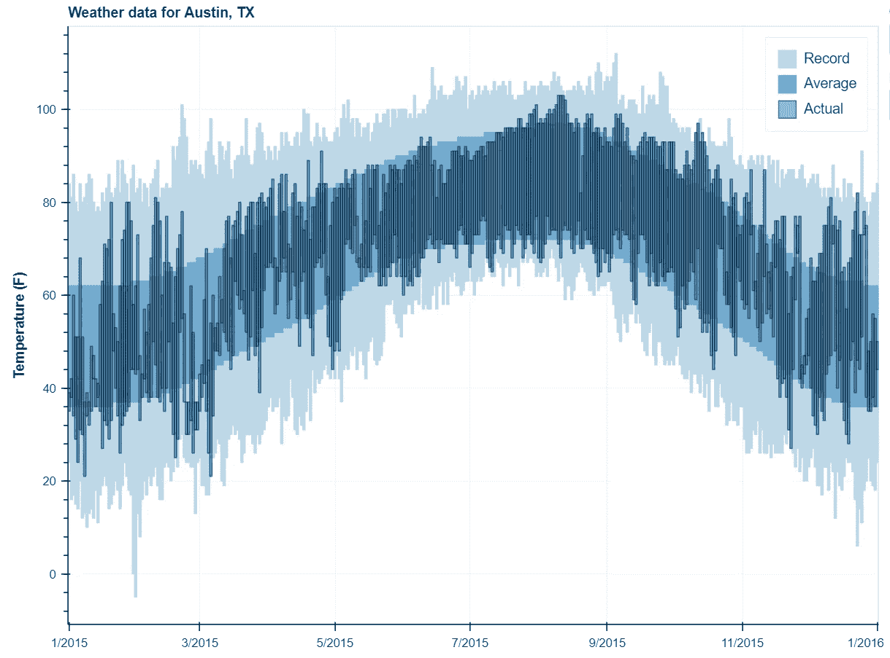
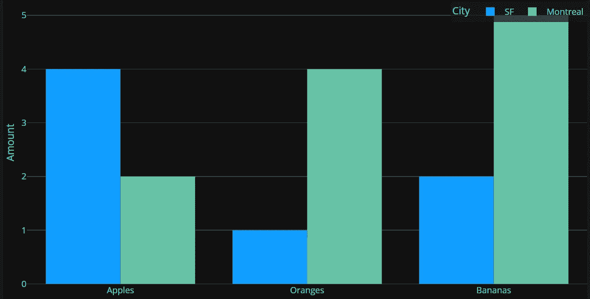
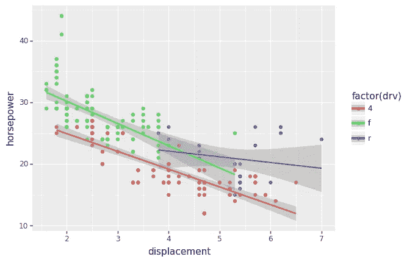
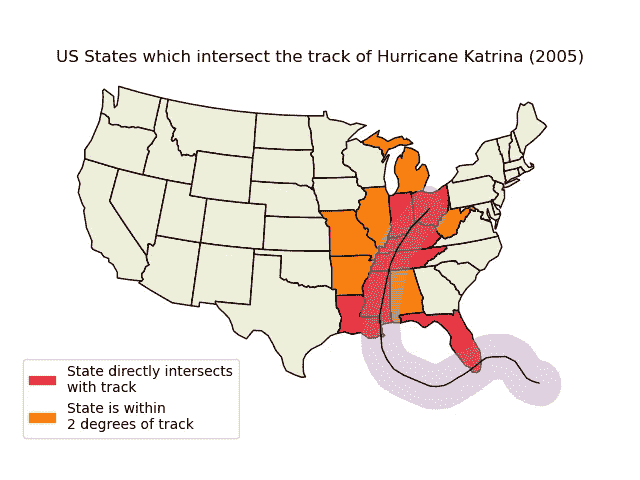
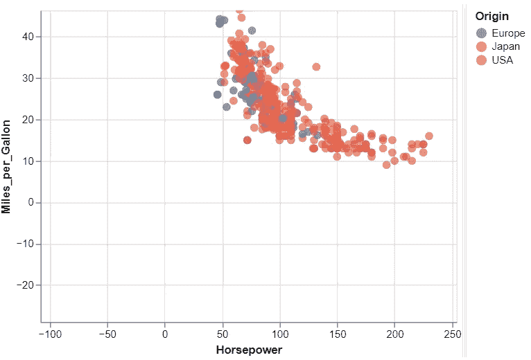
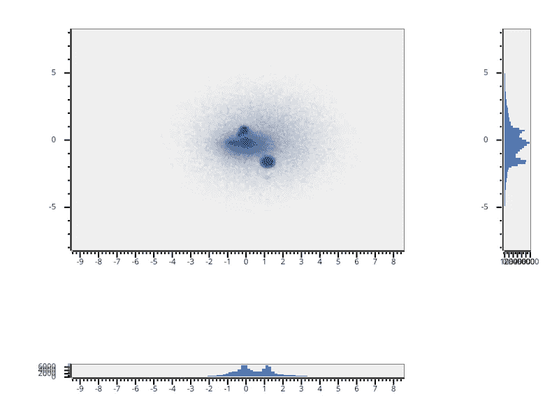
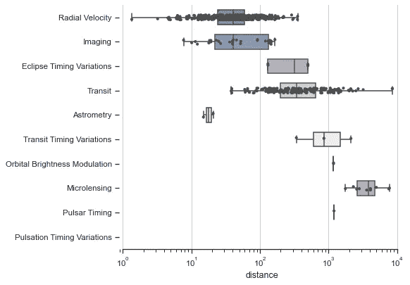

# Python 数据可视化库指南

> 原文：<https://levelup.gitconnected.com/a-guide-to-python-data-visualization-libraries-d48796106f95>

## 数据可视化的 8 个基本库


摩根·豪斯尔在 [Unsplash](https://unsplash.com/s/photos/graph?utm_source=unsplash&utm_medium=referral&utm_content=creditCopyText) 上的照片

数据可视化是任何与数据相关的事物的最重要的方面之一。它可以给我们提供关于数据的有价值的见解。数据可视化让我们很容易传达数据背后的含义。也让其他人很容易理解数据。有许多 Python 库可以帮助我们做到这一点。

无论是数据科学还是数据分析，Python 中的数据可视化在过去几年里都有了很大的发展。Python 库提供了许多可定制的特性，使我们的可视化看起来更流畅，同时也更有启发性和交互性。

在本文中，我们不看 Matplotlib(最常用的数据可视化库之一)，而是看一些替代的包，它们同样适用于我们的数据可视化需求。

# 散景



Bokeh 是一个开源的基于现代网络浏览器的交互式可视化库。它使创建公共图变得简单，还为您和您的观众提供了工具和微件，以便与您的数据进行更好的交互。对于想要制作交互式绘图和仪表板的人来说，这是最好的 python 库之一。

您可以在网页或 Jupyter 笔记本中轻松发布这些图表和仪表板。您还可以添加自定义 JavaScript 来支持高级或特殊情况。

```
**Installation:** 
# Using Conda
$ conda install bokeh# Using pip
$ pip install bokeh
```

这是散景的详细[文档](https://docs.bokeh.org/en/latest/)。

# 破折号



Dash 是一个用于开发 web 应用程序的方便的 Python 框架。Dash 是一个基于 Flask、Plotly.js 和 React.js 构建的纯 Python 数据可视化库。它非常适合创建具有完全定制的用户界面的数据可视化应用程序。它非常适合任何使用 Python 处理数据的人。

Dash 有两个变种:Dash 开源和 Dash 企业。通过 Dash 开源，Dash 应用程序可以在您的本地笔记本电脑或工作站上运行，但您组织中的其他人无法轻松访问。Dash Enterprise 更侧重于企业 IT 部署和扩展。

```
**Installation:** pip install dash
```

Dash 开源[文档](https://dash.plotly.com/)。

# 普洛特宁



plotnine 是基于 ggplot2 的图形语法的 Python 实现。您可以使用该语法通过将数据显式映射到组成绘图的可视对象来创建绘图。

使用语法绘图是强大的，因为它简化了自定义(或复杂)绘图的创建，同时保持简单绘图的简单性。

```
**Installation:** # Using pip$ pip install plotnine# Using Conda
$ conda install -c conda-forge plotnine
```

这是为 plotnine 准备的[文档](https://plotnine.readthedocs.io/en/stable/#documentation)。

# bqplot

bqplot 是一个基于图形结构语法的二维可视化系统。bqplot 中的每个绘图组件都是一个交互式小部件。只需几行 Python 代码，您就可以将可视化与其他 Jupyter 交互式小部件集成在一起，创建集成的 GUI。

## 特征

*   使用 pythonic API 为二维可视化提供统一的框架
*   为添加用户交互(平移、缩放、选择等)提供一个合理的 API

提供了两种 API:

*   `Object Model`，灵感来源于图形语法的构造(图形、标记、轴、比例)。这个 API 很冗长，但是可以完全定制
*   `pyplot`，这是一个基于上下文的 API，类似于 Matplotlib 的 pyplot。`pyplot`为大多数参数提供合理的默认选择

```
**Installation:** # Using pip
$ pip install bqplot# using Conda
$ conda install -c conda-forge bqplot# using JupyterLab
$ jupyter labextension install [@jupyter](http://twitter.com/jupyter)-widgets/jupyterlab-manager bqplot
```

这里是 bqplot 的完整[文档](https://bqplot.readthedocs.io/en/latest/)。

# 卡通图案



Cartopy 是一个用于地理空间数据处理的 Python 包，可以生成地图和其他地理空间数据分析。它利用强大的 PROJ、NumPy 和 Shapely 库，以及基于 Matplotlib 的编程接口来创建出版物质量地图。

## 特征

*   面向对象的投影定义
*   投影之间的点、线、多边形和图像变换
*   集成，通过简单直观的界面展示 Matplotlib 中的高级映射
*   通过将 shapefile 读取与 Shapely 功能集成，实现强大的矢量数据处理

```
**Installation:** $ conda install -c conda-forge cartopy
```

这是 Cartopy 的完整文档。

# 阿尔泰尔



Altair 是一个用于 Python 的声明式统计可视化库，基于 Vega 和 Vega-Lite。它为您提供了关注数据的灵活性。Altair 的 API 简单、友好、一致，构建在强大的 Vega-Lite JSON 规范之上。这有助于您用最少的代码生成美观有效的可视化效果。

```
**Installation:** # Using pip
$ pip install altair vega_datasets# Using Conda
$ conda install -c conda-forge altair vega_datasets
```

这里有 Altair [文档](https://altair-viz.github.io/)供你入门。

# 维斯比



VisPy 是一个用 Python 编写的功能强大的交互式 2D/3D 数据可视化库。它使用 OpenGL 库，通过利用现代图形处理单元(GPU)的计算能力来显示非常大的数据集。

## 特征

*   百万分的高质量互动科学情节。
*   实时数据的直接可视化。
*   3D 模型的快速交互式可视化(网格、体绘制)。
*   OpenGL 可视化演示。
*   带有快速、可扩展的可视化小部件的科学图形用户界面(带有 WebGL 的 Qt 或 IPython 笔记本)。

```
**Installation:** # Using Conda
$ conda install -c conda-forge vispy# Using pip
$ pip install --upgrade vispy
```

VisPy 的完整[文档](https://vispy.org/overview.html#)。

# 海生的



Seaborn 是一个用于创建统计图形的 Python 库。它构建在 matplotlib 之上，并与 pandas 数据结构紧密集成。Seaborn 帮助你探索和理解你的数据。

它的绘图功能对包含整个数据集的数据帧和数组进行操作，在内部执行必要的语义映射和统计聚合，以生成信息丰富的绘图。其面向数据集的声明式 API 允许您关注绘图中各种元素的含义，而不是如何绘制它们。

```
**Installation:** # Using pip
$ pip install seaborn# Using Conda
$ conda install seaborn
```

Seaborn 的完整[文档](https://seaborn.pydata.org/)。