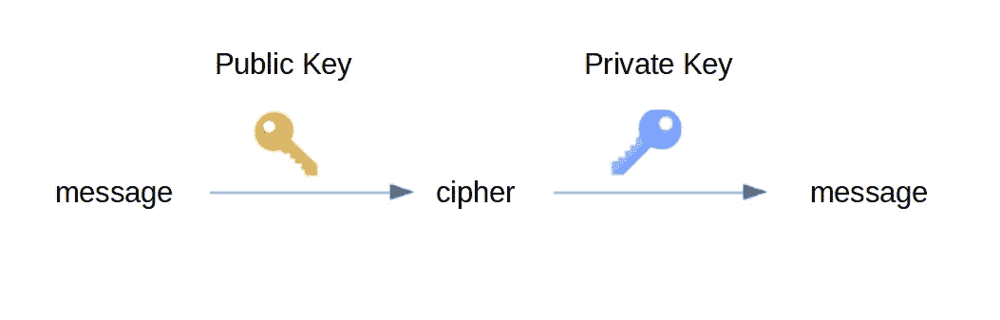
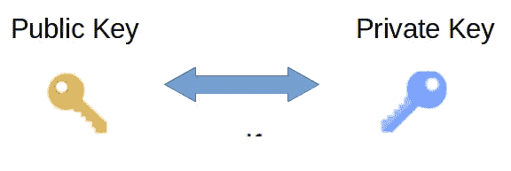
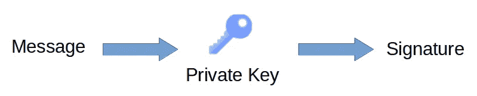
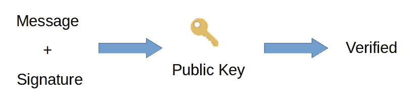

# Go 中的 RSA 加密指南

> 原文：<https://levelup.gitconnected.com/a-guide-to-rsa-encryption-in-go-1a18d827f35d>

## 如何加密或签署数据。

由 [Cytonn 摄影](https://unsplash.com/@cytonn_photography?utm_source=unsplash&utm_medium=referral&utm_content=creditCopyText)在 [Unsplash](https://unsplash.com/s/photos/signature?utm_source=unsplash&utm_medium=referral&utm_content=creditCopyText) 上拍摄。

非对称加密或公钥加密是现代系统安全的基础部分。它保证了加密的认证和不可否认原则(更多关于原则的内容[在这里](https://www.thegeekstuff.com/2012/07/cryptography-basics/))。

在本教程中，我们将看到如何使用 Go 实现它。

> **注**:本文使用的 Go 版本为 1.15.3。

**TL；博士**:你可以在这里找到完整的代码[。](https://gist.github.com/ustropo/3887e7db364bcff720730e7aac9af7a3)

# 介绍

RSA 是一种公钥算法。它以它的创造者命名( *Rivest-Shamir-Adleman)。*它于 1977 年公开，是当今使用最多的算法之一。

公钥加密，也称为非对称加密，使用两种不同的密钥，一种用于加密，另一种用于解密:

*   只要不涉及秘密，例如加密或验证，就在该过程中使用公钥。
*   当涉及到秘密时，如解密或签名，就使用私钥。

图片作者。

这意味着我们可以与任何人共享公钥，因此他们可以加密他们想发送给我们的任何信息。访问这些信息的唯一方法是使用私钥解密。这就是为什么它必须保密。

公钥和私钥是一起生成的(公钥是从私钥派生的)并形成一个密钥对。

密钥对生成过程。

> **注意**:如果你想了解更多关于密钥是如何产生的或者加密的过程是如何工作的，你可以查看这个[视频](https://www.youtube.com/watch?v=wXB-V_Keiu8)。

让我们看看如何使用 Go 来实现它。

# 密钥对生成

我们要做的第一件事是生成公钥和私钥。如果您已经有一对，您可以跳过这个过程，从文件中读取它。

包`[crypto/rsa](https://golang.org/pkg/crypto/rsa/)`生成密钥，包`[crypto/rand](https://golang.org/pkg/crypto/rand/)`生成随机数。

为了在其他程序中使用该密钥，或者在其他时候，您可以将密钥保存到文件中。通常的做法是保存为 [PEM 格式，](https://en.wikipedia.org/wiki/Privacy-Enhanced_Mail)使用包`encoding/pem`。

公钥是私钥结构的一部分，所以不需要同时保存它们。但是记住不要和任何人分享这个文件。

你可以使用包`[crypto/x509](https://golang.org/pkg/crypto/x509/)`和`encoding/pem`从文件中读取密钥。

> **注意**:为了简单起见，省略了错误处理。您应该在实际应用中检查它们。

# 加密

为了加密，我们将使用函数`[EncryptOAEP](https://golang.org/pkg/crypto/rsa/#EncryptOAEP)`。该函数使用方法 [OAEP](https://en.wikipedia.org/wiki/Optimal_asymmetric_encryption_padding) 来确保对同一消息加密两次不会产生相同的密文。

它接收五个参数:

1.  哈希函数。SHA256 算法是合适的。
2.  产生随机位的随机阅读器。
3.  先前生成(或读取)的公钥。请记住，加密是用公钥完成的。
4.  我们要加密的消息。它必须短于公共模数(在我们的例子中是 2048 位)减去散列长度的两倍(32 字节)再减去 2。在我们的例子中，消息最大长度必须是 190 字节。
5.  可选标签(在我们的例子中省略)。

这将产生一个加密的消息，每次我们尝试加密时，它都是不同的。

# [通信]解密

要访问加密字节中包含的信息，我们必须解密它。

这只能通过使用属于用于加密消息的密钥对的私钥来完成。

要解密它，我们只需要使用函数`rsa.DecryptOAEP`。它也接收五个参数，但是现在我们必须传递加密的消息和私钥。

# 签名和验证

RSA 也用于签名和验证。它不同于加密。目标是确保发送者是他们所说的人(真实性)。

这意味着不是混合原始消息内容，而是生成新的数据。这一块叫做**签名**。

签名流程。

验证是用公钥完成的。这是使用签名和原始消息完成的。如果它们不匹配，验证过程就会失败。

验证过程。

在 Go 中，这是通过使用`[rsa](https://golang.org/pkg/crypto/rsa/)`包中的函数`[rsa.SignPSS](https://golang.org/pkg/crypto/rsa/#SignPSS)`和`[rsa.VerifyPSS](https://golang.org/pkg/crypto/rsa/#VerifyPSS)`来完成的。

签名过程是使用消息哈希而不是原始消息来完成的。因为散列是原始消息的指纹，我们可以假设如果消息改变了，散列也会改变它。

> **注意**:每次我们调用函数`SignPSS`时，都会给出一个不同的签名。

# 结论

我们已经了解了如何生成 RSA 密钥对，以及如何使用它们来加密、解密、签名和验证给定消息。

请记住，您要加密的消息必须短于"*公共模数的长度减去散列长度的两倍，再减去 2"* (从[到这里的](https://pkg.go.dev/crypto/rsa#EncryptOAEP))。

如果您想了解更多有关哈希或对称加密的信息，请查看以下文章:

 [## 围棋散列法简明指南

### 如何散列一个字符串或文件

medium.com](https://medium.com/better-programming/a-short-guide-to-hashing-in-go-e8bb0173e97e)  [## 使用 Go 加密的简短指南

### 以及如何保护您的数据。

levelup.gitconnected.com](/a-short-guide-to-encryption-using-go-da97c928259f) 

你可以在这里找到完整的代码。