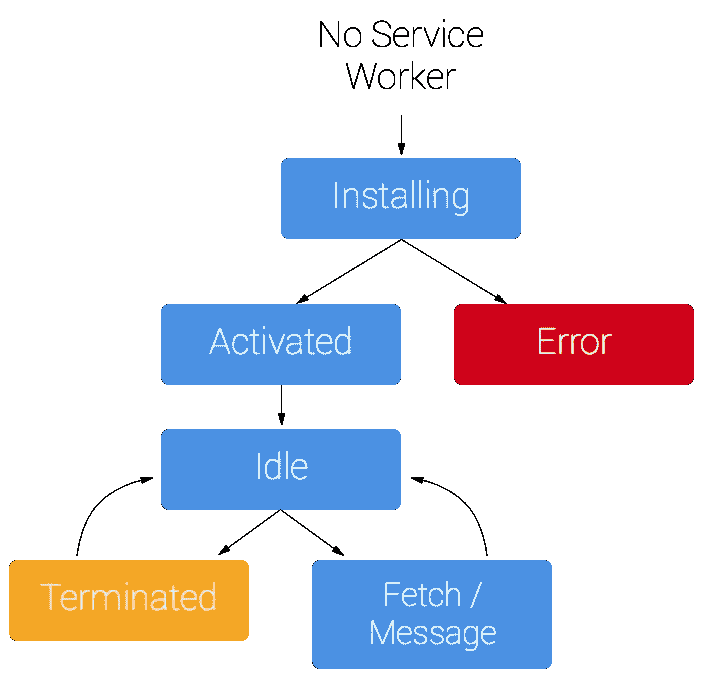

# React.js 中的服务人员指南

> 原文：<https://levelup.gitconnected.com/a-guide-to-service-workers-in-react-js-82aec1d6a22d>

由[菲克里·拉西德](https://unsplash.com/@fikrirasyid?utm_source=medium&utm_medium=referral)在 [Unsplash](https://unsplash.com?utm_source=medium&utm_medium=referral) 拍摄的照片

如果你第一次尝试在 React 中启动你自己的应用程序(`create-react-app`)，你可能会注意到默认情况下会调用一个服务工作者类。如果你和我一样，你可能会想:这个服务人员是做什么的？

我将带您了解什么是服务工作者，为什么创建它，以及如何在您的应用程序中使用它。

# 什么是服务人员？

服务人员是客户端(您的浏览器)在独立于网页的后台运行的脚本。在独立于网页的后台操作使您能够使用实际上不需要网页或用户交互来触发的功能，如[推送通知](https://developers.google.com/web/fundamentals/push-notifications/)或[后台同步](https://developers.google.com/web/updates/2015/12/background-sync)。

为什么这个 API 是如此激动人心的发展？因为它允许您支持离线体验，让工程师和开发人员能够端到端地控制用户与应用程序的交互。服务人员使您能够在页面出现之前运行 JavaScript，使您的网站运行更快，并且允许您在没有互联网连接的情况下显示内容。

哇哦。

# 关键特征和属性

正如你所知，服务人员在创建一个进步的网络应用程序中非常重要(在这里了解更多关于 PWA 的)。在我深入研究如何实现服务工作者之前，这里有一些它所具有的[关键特征和属性](https://github.com/w3c/ServiceWorker/blob/master/explainer.md):

*   在其自己的全局脚本上下文中运行
*   不直接绑定到任何特定页面
*   无法访问 DOM
*   是事件驱动的(不使用时终止，需要时再次运行)
*   只有**是 HTTPS 的**

关于服务人员，有一些非常有趣的事情值得注意。因为它不能直接访问 DOM，所以它需要一个变通方法来与它控制的页面进行通信。它通过响应通过`[postMessage](https://html.spec.whatwg.org/multipage/workers.html#dom-worker-postmessage)`接口(通过一个`MessagePort`)发送的消息来做到这一点，允许它控制的那些页面按照指示操作 DOM。此外，由于是事件驱动的，您不能依赖服务工作者的`onfetch`和`onmessage`处理程序中的状态来持久化任何数据。根据 React 文档，如果有需要在重启时持久化和重用的信息，服务人员可以访问 [IndexedDB API](https://developer.mozilla.org/en-US/docs/Web/API/IndexedDB_API) 。

很明显，服务人员是我们所拥有的复杂而强大的工具。什么更好？React 让我们通过运行`create-react-app`来成功实现它们。在下一节中，我将带您了解如何使用 React 应用程序设置服务人员。

我们来建吧！

请注意，一般来说，在没有 React 的情况下安装和设置服务人员是一个非常漫长的过程。在这篇博客中，我将带你了解如何在 React 中设置服务工人，但是你可以在这里阅读关于如何在任何地方[实现服务工人的完整文档](https://developers.google.com/web/fundamentals/primers/service-workers/)[。](https://developers.google.com/web/fundamentals/primers/service-workers/)

# 我如何使用服务人员？

创建新的 React 应用程序后，您将看到为您创建的以下文件结构:

当您构建新的 React 应用程序时，会自动为您创建文件结构。

默认情况下，React 构建过程会在您的`src`文件夹中生成一个`serviceWorker.js`文件。但是，默认情况下服务人员是未注册的，这意味着它还不能控制您的 web 应用程序。

因此，我们需要首先选择离线优先行为。在您的`src/index.js`中，您会发现以下代码:

构建 React 应用程序时在 src/index.js 中自动生成的代码。

如其所述，将`serviceWorker.unregister()`切换到`serviceWorker.register()`将允许您选择使用服务人员。

如果没有 React 提供的代码，您将不得不对整个服务人员生命周期进行编码。下面是通过谷歌文档对[的简要概述:](https://developers.google.com/web/fundamentals/primers/service-workers/)

首次安装时的服务人员生命周期。

因此，您必须手动编写注册→安装→缓存和返回请求→等等过程的代码。

幸运的是，我们做出了反应！如果您打开您的`src/serviceWorker.js`文件，您会看到一堆预加载的代码和注释:

src/serviceWorker.js 文件中 React 提供的代码。该代码允许我们安装、注册和缓存/返回请求。

酷！设置`serviceWorker.register()`运行上述所有代码，现在您已经准备好与您的服务人员一起投入运行了。

选择使用服务人员的好处非常大，包括创建更快、更可靠的 web 应用程序，以及提供更具吸引力的移动体验。然而，就像大多数功能一样，如果您决定加入服务人员注册，也有一些事情需要考虑。你可以在 React.js 官方文档[这里](https://facebook.github.io/create-react-app/docs/making-a-progressive-web-app#offline-first-considerations)了解这些。

因此，下次当你的朋友喜欢你的 Instagram 时，你会收到推送通知，或者当你踏上商店所在的城镇时，你开始收到当地企业的广告——你应该为此感谢服务助手！

 [## 学习 React -最佳 React 教程(2019) | gitconnected

### React 是一个现代 JavaScript 库，前端 web 开发人员使用它来构建用户界面(UI)。它用于…

gitconnected.com](https://gitconnected.com/learn/react)