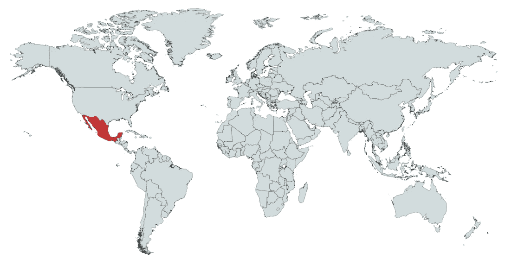
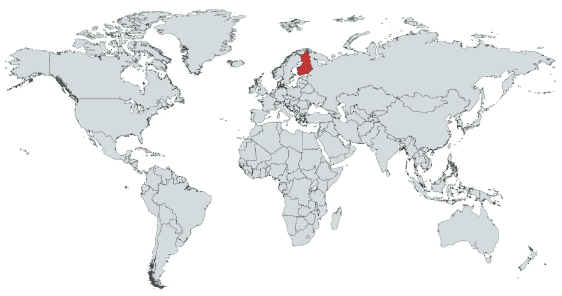
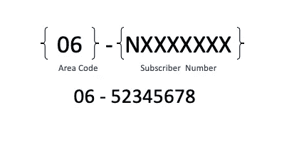
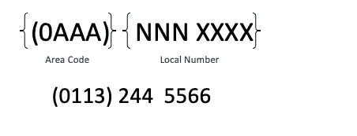

# 清除电话号码的终极指南

> 原文：<https://levelup.gitconnected.com/a-guide-to-standardizing-and-cleaning-international-phone-numbers-fe800a34ff4b>

电话号码是常用的数据类型。所以你会认为他们很容易相处，对吗？对吗？

好吧，如果你有来自多个国家和个人的电话号码，那就太混乱了。

你可能会发现自己有一个电子表格，里面有一堆不同的电话号码，而你却不知道如何清理它们。

如果你想要一个快速的方法来做这件事，看看[干净的电子表格](http://www.cleanspreadsheets.com)！

然而，如果你试图自己编码或者手动清理它们，这里是你需要记住的。

# **清除一个电话号码能做什么？**

清除电话号码将允许您确定该号码是否有效，并将其分成各个组成部分，如国家代码、区号和用户号码。

# 这不是很简单吗？

你可能会这么想，但是不同的国家有不同的习俗，这很快就会失控。

为了避免这篇文章太长，我们将只关注 [G20 国家](https://en.wikipedia.org/wiki/G20)。世界前 19 大经济体加上所有欧盟国家。

# 国家代码

世界上的每个国家(以及一些地区)都有一个 1、2 或 3 位数的国家代码。这以加号(+)为前缀。

官方的 [E.123 指南](https://en.wikipedia.org/wiki/E.123)建议在存储国际电话号码时包含国家代码。但是，在国内拨号时，这不是必需的。

国家代码(如果出现的话)将位于电话号码的开头，很可能与电话号码的其余部分分开

# 电话号码的其余部分

除了国家代码之外，电话号码的约定也因国家而异。

让我们来看看 G20 的每一个国家。

# 美国

开始，美国和其他 24 个国家/地区共享北美编号计划(NANP ),格式如下:

有一个 3 位数的区号 **(AAA)** ，后面是 7 位数的用户号码。 **N** 只能包含从 2 到 9 的数字。

> *NANP 的国家部分包括:*美属萨摩亚、安圭拉、安提瓜和巴布达、巴哈马、巴巴多斯、百慕大、英属维尔京群岛、加拿大、开曼群岛、多米尼克、多米尼加共和国、格林纳达、关岛、牙买加、蒙特塞拉特、北马里亚纳群岛、波多黎各、圣基茨和尼维斯、圣卢西亚、圣文森特和格林纳丁斯、圣马丁岛、特立尼达和多巴哥、特克斯和凯科斯群岛以及美属维尔京群岛

美国的国家代码是+1。

# 墨西哥

在墨西哥，数字是 10 位数，第一个数字是 2-9。区号可以是 2 或 3 位数，后面是 8 或 7 位数的本地号码。

格式是:

*   AA NNNN XXXX 或(AA) NNNN XXXX

*   AAA NNN XXXX 或(AAA) NNN XXXX

国家代码是+52。

# 阿根廷

阿根廷的电话号码有 11 位数字。区号总是以 0 开头，但可以是 3-5 位数字。

电话号码通常被格式化为:

*   (0AA) NNNN-XXXX

*   NNN-XXXX

*   (0AAAA) NN-XXXX

+54 是国家代码，它代替了 0。

# 巴西

**座机**

所有座机均为 10 位数字，格式为:

*   AA NXXX-XXXX *(N 是从 2 到 5 的数字)*

**移动**

同时，所有手机都是 11 位数字，遵循以下格式:

*   AA NXXXX -XXXX *(N 是从 6 到 9 的数字)*

国家代码是在号码前面加上+55。

# 南非

对于本地电话，它以中继前缀 0、2 位区号和 7 位用户号码开始。对于国际电话，有一个+27，而不是 0。

*   0AA XXX XXXX

*   +27 AA XXX XXXX

# 中国

根据地区或电话类型，号码可以是 10 位或 11 位。

**座机**

*   0aa NNNN XXXX

区号可以是 2 或 3 位数，本地号码可以是 7 或 8 位数，具体取决于所在地区。

**移动**

遵循 1WX NNNN XXXX 格式的 11 位数

WX 是服务提供商，W 总是 3-9 之间的数字

NNNN 是确定区域的 HLR 代码，XXXX 是用户号码。

**国际**

删除 0 并添加+86

# 印度

电话号码是 10 位数，不包括任何时候都需要的 0。数字也分为几类:

**座机**

*   AAA-NNNNNNN

AAA 是用户中继拨号代码或长途代码，长度可以是 2-4 位数。NNNNNNN 是电话号码。

**手机**

*   AAAAA。

非本地电话需要以 0 或+91 为前缀，这适用于整个印度和国际。

# 日本

日本类似于我们在北美看到的，但是有一个 0 的长途区号和+81 的国际区号。

有些地区的区号或长或短，但常见的格式是:

*   0AA NNN-XXXX

# 韩国

电话号码可以是 7-11 位数，这取决于您是否拨打不需要区号的本地电话。

**座机**

根据城市的不同，区号可以是 2-3 位数，但格式是:

*   0AA-NNN-XXXX 或
*   (0AA) NNN-XXXX 或
*   0AA NNN XXXX

**移动**

对于移动电话，它是一个 8 位数的用户号码，开头是 01 和区号:

*   01A-NNNN-XXXX

国家代码是+82，在打国际电话时代替 0。

# 印度尼西亚

座机使用区号，而手机不使用。

**座机**

打国内电话时，电话以 0 开头，打国际电话时以+62 开头。数字长度为 7 或 8 位数。

*   AA NNNN-XXXX

**手机**

号码长度为 8-12 位，包括一个中继前缀 0，后跟 8NNN，即移动前缀。

*   0 8NNN XXX XXXX

# 沙特阿拉伯

电话号码是 7 位数，有一个 3 到 5 位数的区号，包括中继前缀 0。国际代码是+966，它代替了 0。

*   0AA NNN XXXX

# 澳大利亚

数字是 10 位数，写为

*   NNNN·XXXX，国际电话+61

对于本地电话，区号是可选的。

# 火鸡

国际电话号码的中继前缀为 0，国家代码为+90。在土耳其境外拨打电话时，0 会被挂断。

土耳其数字的常见格式是

*   0aa NNN XX NN

座机的前缀可以是 02、03 或 04

而手机号码有 05

# 欧洲联盟

## 奥地利

奥地利和其他一些国家是开放编号计划的一部分，因此区号或用户号码没有标准长度，但总共会有 4-13 位。

国际代码是+43。

**座机**

*   1 NNN·XXXX

**手机**

电话号码以数字 6 开头，格式可以是:

*   6AA NNN XXXX

## 保加利亚

号码长度为 8 或 9 位数，带有一个额外的区号，中继前缀为 0 或国家代码为+359。

**座机**

*   NNN·XXXX

**手机**

*   0aa NNN XXXX

## 比利时

电话号码将以 0 和“区号前缀”开头，对于座机，区号前缀可以是 1-2 位数，对于移动电话，区号前缀可以是 3 位数。

**座机**

根据地区不同，前缀号码可以写成

*   0AA NN NN NN or
*   NNN NN NN

**移动**

区域前缀的第一个数字总是 4，格式可以写成:

*   04AA NN NN NN

有时，在区号前缀和用户号码之间会有一个斜线或圆点，例如

*   04AA/NN NN NN or
*   04AA/NN。NN.NN or
*   04AA/NNN。NNN

国际代码前缀是+32，去掉 0。

## 克罗地亚

典型的格式与我们以前见过的一些非常相似。号码通常是 10 位数字，包括中继前缀 0。

*   (0AA) NNN XXXX

如果你在同一个地区，就不必拨区号。

国家代码是+385

## 塞浦路斯

**座机**

数字以 2 开头，格式如下:

*   2A-XXXXXX

**手机**

数字以 9 开头，但格式相同:

*   9A-XXXXXX

国际代码是+357，加在号码前面。

## 捷克

典型的格式是 9 位数字，如 AAA NNN XXX，国际代码是+420。

## 丹麦

号码是 8 位数，没有区号。国际代码是+45，常用格式是:

*   NN NN NN NN

*   NNNN·XXXX

*   NNNNNNNN

## 爱沙尼亚

爱沙尼亚有一个开放的编号计划，号码通常是 7 到 12 位。没有区号，典型的格式是:

**座机**

*   NNN·XXXX

**移动**

*   NNNN·XXXX

国家代码是+372

## 芬兰

这是另一个具有开放编号计划的国家，号码可以是 5 到 12 位，中继前缀为 0，国际代码为+358，将取代 0。

**座机**

所有座机都以 09 开头，格式如下:

*   09A NNNN XXXX

**移动**

根据移动运营商的不同，号码可以以 04 或 05 开头，例如:

*   04A NNN XXXX

## 法国

有 10 个数字，可以写成

*   NN NN NN NN 或

*   得一个例子。嗯嗯嗯嗯

区号是 1-5 之间的数字

对于国际电话，该格式会删除 0 并添加+33

## 德国

德国有一个开放的号码计划，但通常是 10-12 位数，中继前缀为 0。国家代码是+49，代替了 0。

常见的格式是:

*   (0AA) NNNN-XXXX

## 希腊

电话号码通常是 10 位数，但区号是 2 或 3 位数，写为:

*   AAN XXXXXXX 或
*   AAAN XXXXXX

国际代码是+30，放在号码的前面。

## 匈牙利

区号是 2 位数，用户号码是 6 位数。手机号码和布达佩斯的电话号码总共是 7 位数。国家代码是+36。

## 爱尔兰

爱尔兰也有一个开放的编号计划。

区号以中继前缀 0 开始，可以是 2 到 4 位数字，后面是 7 位数字的本地电话号码。

本地号码可以格式化为:

*   5 位数:NNNNN
*   6 位数字:NNN XXX
*   7 位数号码:NNN·XXXX

通常不鼓励使用连字符，手机号码通常采用以下格式:

*   08A NNN XXXX

国家代码是+353

## 意大利

另一个国家有开放的电话号码计划，但号码范围可以从 6-11 位。

国家代码是+39。

**座机**

电话以 0 开头，后面是区号。该格式的一个例子是:

*   NNNXXXX

**移动**

数字以 3 开头，通常为 10 位数，格式如下:

*   3AA NNNXXXX

## 拉脱维亚

国家代码是+361

**手机**

电话都以 2 开头，格式如下:

*   2AA NN XXX

**座机**

座机号码可以以 5、6 或 7 开头，格式如下:

*   5 AA NNXXX

## 立陶宛

根据城镇或城市的大小，区号是 2 到 5 位数字，后面是 8 位数字的国家或地方号码。

每个数字都以 8 开头。

国家代码是+370

一些常见的格式包括:

*   (8A)NNN·XXXX
*   (8AA) NN XXXX

## 卢森堡

移动电话有一个 3 位数的网络代码，后跟 6 位数的用户号码，例如:

*   6X1 NNN XXX

手机号码总是以 6 开头，国家代码是+352

## 马耳他

前缀为 21，国际代码为+356，例如:

*   21XX NNNN

**移动**

根据移动运营商的不同，电话的前缀为 99、79 等

*   99XX NNNN

## 荷兰

号码是 10 位数，中继前缀为“0”。

**座机**

*   0AA-NNNNNNN 或
*   0AAA-NNNNNN

**手机**

电话有一个 1 位数的区号 6 和 8 位数的用户号码:

*   06-NXXXXXXX

n 从来不是 6 或 7

国家代码是+31，代替了 0

## 波兰

电话号码是 9 位数，国家代码是+48，在号码前面。

**手机**

*   AAA-NNN-XXX

**座机**

*   AA-NNN-XX-NN 或
*   (AA)NNN-XX-NN

## 葡萄牙

与波兰类似，数字是 9 位数，写为 AAA AAA AAA

所有手机号码都以 9 开头，国家代码是+351，放在号码前面。

## 罗马尼亚

电话号码长度为 10 位数，不包括中继前缀 0。

手机和座机都遵循相同的格式:

*   0AAA-XXX-XXX

国家代码是+40，放在号码的前面。

## 俄罗斯

正如我们之前所见，一些欧洲国家通常采用开放的编号方案。

在俄罗斯，号码是 10 位数，中继前缀是 8。

区号因地区而异，但都是 3-5 位数，用户号码用破折号分隔。

常见的格式是

*   8 (AAA) NNN-NN-XX

对于国际电话，国家代码是+7

## 西班牙

号码是 9 位数，座机以 9 或 8 开头，手机以 6 或 7 开头。

数字可以写成

*   AA NNN XX NN or
*   AAA NNN XXX 取决于区号的长度。

国家代码是+34，放在号码的前面。

## 斯洛文尼亚

所有号码都是 9 位数，包括中继前缀 0。

国家代码是+386，代替了 0。

区号可以是 1-3 位数字，可能的格式为:

*   NNN XX XX 或
*   (0AA) NNN XXX 或
*   (0AAA) NN XXX

## 瑞典

瑞典有一个开放的编号方案，因此号码格式因长度而异，但中继前缀为 0。国家代码是+46，拨打国际电话时代替 0。

**10 位数**

*   NNN XXX XX 或
*   0AA-NNN XX XX 或
*   0AAA-NN XX XX

**9 位数字**

*   NNN XX XX 或
*   0AA-NNN XX XX 或
*   0AAA-NNN XX

**8 位数字**

*   0A-NN XX XX 或
*   0AA-NNN XX

**移动**

数字是 10 位数，并且总是以 7 开头。比如:

*   07A-NNN XX XX 或
*   07AA-NN XX XX

## 联合王国

由于有一个开放的编号方案，编号的长度范围从 7 到 10 位。

中继前缀是 0，国家代码是+44，当从英国以外的地方打电话时，它代替 0

常见的格式是:

*   NNN·XXXX

**移动**

手机以 7 开头，因手机供应商而异，但通用格式是:

*   07aa NNN XXX

# 结束语

你可以使用这个指南来实现从你的数据库、编程语言或电子表格中清除电话号码。

如果您需要清理电子表格中的号码，您可以使用我们的工具[清理电子表格](http://www.cleanspreadsheets.com/)来自动清理和转换电子表格中的任何电话号码。

如果你想要一个定制的应用程序，数据清理，或使用电子表格建立项目，你可以在这里查看我们的咨询服务:[https://www.lovespreadsheets.com](https://www.lovespreadsheets.com/)！

数据清理快乐！

# 分级编码

感谢您成为我们社区的一员！在你离开之前:

*   👏为故事鼓掌，跟着作者走👉
*   📰更多内容请查看[升级编码刊物](https://levelup.gitconnected.com/?utm_source=pub&utm_medium=post)
*   🔔关注我们:[推特](https://twitter.com/gitconnected) | [LinkedIn](https://www.linkedin.com/company/gitconnected) | [时事通讯](https://newsletter.levelup.dev)

🚀👉 [**将像你这样的开发人员安置在顶级创业公司和科技公司**](https://jobs.levelup.dev/talent/welcome?referral=true)